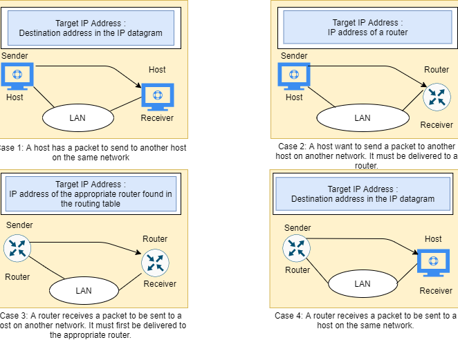
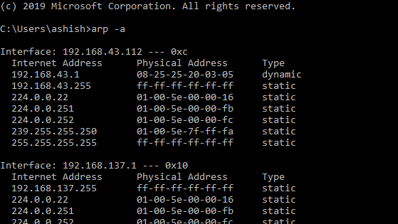

পদ্ধতি মুলক বর্ণনা

ADDRESS এর

রেজোলিউশন প্রোটোকল (এআরপি)

**একটি ইথারনেট ঠিকানা রেজোলিউশন প্রোটোকল**

**- বা -**

**নেটওয়ার্ক প্রোটোকল ঠিকানাগুলি রূপান্তর করা**

[[https://tools.ietf.org/html/rfc826]{.ul}](https://www.google.com/url?q=https%3A%2F%2Ftools.ietf.org%2Fhtml%2Frfc826&sa=D&sntz=1&usg=AFQjCNHSlGxJe18c1VJeIV6ePn4xPAj3rA)

> নিঃসন্দেহে আজকের বিশ্বে ইথারনেট কম্পিউটার নেটওয়ার্কিং প্রযুক্তিতে
> ব্যবহৃত সবচেয়ে জনপ্রিয় প্রযুক্তি। এর লক্ষণীয় বৈশিষ্ট্যগুলির মধ্যে
> একটি এটি উচ্চ কার্যকারিতা স্থায়িত্ব বৈশিষ্ট্য সরবরাহ করে। এটি
> সহ-সম্পর্কিত সু-সংজ্ঞায়িত প্রোটোকলগুলির একটি পরিবার যা দৈহিক মিডিয়া
> যেমন - কোক্সিয়াল কেবল, নেটওয়ার্ক ইন্টারফেস কার্ড (এনআইসি) ইত্যাদি
> ব্যবহার করে 10/100 এমবিপিএস ইত্যাদি হারে ডেটা সংক্রমণ করে
>
> ইথারনেট প্রযুক্তিতে তথ্য প্যাকেটের আকারে একটি প্রকৃত মিডিয়া ব্যবহার
> করে প্রেরণ করা হয়। প্যাকেটের আকারের উপর নির্ভর করে, এতে থাকা ডেটাটি
> ছোট ছোট ফ্রেমে ভাঙ্গা এবং মোড়ানো হতে পারে এবং তারপরে গন্তব্যে প্রেরণ
> করা যেতে পারে যেখানে এটি আবার সংহত করা যায় can এই ফ্রেমগুলি প্রেরকের
> NIC ব্যবহার করে তারে লেখা হয়। এই প্যাকেটগুলি প্রেরকের দ্বারা এমন এক
> প্রাপকের জন্য তৈরি করা হয় যাকে নেটওয়ার্কে সংযুক্ত থাকা দরকার।
> প্যাকেটটি রাউটার বা সুইচগুলির মাধ্যমে তার গন্তব্যে পৌঁছতে পারে। একটি
> প্রোটোকল দুটি নেটওয়ার্ক পরিচয়ের মধ্যে যোগাযোগের জন্য নিয়মগুলির
> সেটকে সংজ্ঞায়িত করে। নোট করুন প্রেরক এবং প্রাপকের মধ্যে থাকা অন্য
> নেটওয়ার্কিং ডিভাইসগুলি প্রক্রিয়াজাতকরণের জন্য এই প্যাকেটগুলি তুলবে
> না বরং এটি বাদ পড়েছে। সুতরাং, আমাদের এমন একটি প্রোটোকল প্রয়োজন
> যেখানে \<প্রোটোকল টাইপ, প্রোটোকল ঠিকানা\> এর উপর ভিত্তি করে কেবল
> প্রেরক থেকে প্রাপকের কাছে কোনও পথ অতিক্রম করতে হবে।

**বিমূর্ত:**

> আসুন আমরা ধরে নিই যে একই নেটওয়ার্কে দুটি এবং দুটি নেটওয়ার্কিং ডিভাইস
> রয়েছে এবং এর নীচে বৈশিষ্ট্য রয়েছে:
>
> ডিভাইস এ:
>
> ম্যাক = এম (এ)
>
> আইপি = আই (এ)
>
> ডিভাইস বি:
>
> ম্যাক = এম (বি)
>
> আইপি = আই (বি)
>
> এখন এ বি সাথে যোগাযোগ করতে চায় এবং কেবল বি এর আইপি সম্পত্তি জানে। আই
> (বি) থেকে এম (বি) ম্যাপ করার জন্য এ এর ​​প্রোটোকল স্ট্যাক এআরপি
> মডিউলটি নিয়ে পরামর্শ করবে। সুতরাং এ এর ​​এআরপি মডিউল নেটওয়ার্কে একটি
> সম্প্রচার প্যাকেট প্রেরণ করবে যেখানে বি ডিভাইসটি তার ম্যাকের বিবরণ
> দিয়ে সাড়া দেবে। এখন এ এর ​​এআরপি মডিউলগুলি তারের মাধ্যমে প্রেরণের
> জন্য ইথারনেট প্যাকেট তৈরি করতে এই বিবরণগুলি ক্যাশে করে।
>
> মন্তব্য:
>
> ঠিকানা রেজোলিউশন প্রোটোকল (এআরপি) শারীরিক ঠিকানার (48-বিট ম্যাক
> ঠিকানা) আইপিভি 4 ঠিকানা (32-বিট লজিকাল ঠিকানা) ম্যাপ করার উদ্দেশ্যে
> টিসিপি / আইপি স্যুটের অন্যতম প্রধান প্রোটোকল। নেটওয়ার্ক ডিভাইসগুলিকে
> একটি লজিকাল নাম এবং নিম্ন স্তরের বা ম্যাক ঠিকানায় যৌক্তিক নামগুলি
> সমাধান করার জন্য প্রোটোকল বরাদ্দ করা হয়। অ্যাপ্লিকেশন স্তরের
> নেটওয়ার্ক অ্যাপ্লিকেশনগুলি অন্য ডিভাইসের সাথে যোগাযোগের জন্য আইপিভি 4
> ঠিকানা ব্যবহার করে। যাইহোক, ডেটা লিঙ্ক স্তরে, ঠিকানাটি মোড হিসাবে
> ব্যবহৃত হয় ম্যাক অ্যাড্রেস (একটি 48-বিট শারীরিক ঠিকানা) যা
> স্থায়ীভাবে নেটওয়ার্ক কার্ডে জ্বালিয়ে দেওয়া হয়। অ্যাড্রেস
> রেজোলিউশন প্রোটোকল (এআরপি) এর উদ্দেশ্যটি হল আপনার স্থানীয় অঞ্চল
> নেটওয়ার্ক (ল্যান) এ সম্পর্কিত আইপিভি 4 ঠিকানার জন্য কোন নেটওয়ার্ক
> অ্যাপ্লিকেশন যোগাযোগের চেষ্টা করছে তার জন্য একটি ডিভাইসের ম্যাক ঠিকানা
> সন্ধান করা।

**সমস্যাটি:**

> যেহেতু কম্পিউটার নেটওয়ার্কিং অস্তিত্ব লাভ করেছে সেখানে বিভিন্ন
> ইন্টারফেস সহ বিভিন্ন ধরণের নেটওয়ার্কিং ডিভাইস রয়েছে যা বিভিন্ন
> বিক্রেতাদের দ্বারা তৈরি এবং সরবরাহ করা হয়। আগে আলোচনা হিসাবে তাদের
> ফ্রেমের মাধ্যমে যোগাযোগ করা দরকার যা এখন টাইপ হিসাবে শ্রেণিবদ্ধ করা
> যায় - একটি প্যাকেটকে অন্যের থেকে আলাদা করে ishing নোট করুন যে
> নেটওয়ার্কে অন্যান্য বিভিন্ন ধরণের প্রোটোকল এবং হার্ডওয়্যার রয়েছে
> এবং তাদের সকলকে নির্দিষ্ট হারে প্যাকেটগুলি স্থানান্তর করার জন্য
> কেবলগুলির প্রয়োজন হয়। প্রোটোকল ঠিকানা 48-বিট ঠিকানা হতে পারে বা নাও
> হতে পারে - এগুলি 8 বিট থেকে 48 বিট ঠিকানায় পরিবর্তিত হতে পারে। 10Mbit
> ইথারনেট নেটওয়ার্ক ইথারনেট প্যাকেট শিরোনামে টাইপ ক্ষেত্রের মাধ্যমে এই
> প্রোটোকলগুলি (এবং আরও অনেকগুলি) একটি একক কেবলতে সহাবস্থান করতে দেয়।
>
> একটি \<প্রোটোকল, ঠিকানা\> জুড়ি এবং একটি 48-বিট ইথারনেটের ঠিকানার
> মধ্যে গতিশীলভাবে চিঠিপত্র বিতরণ করার জন্য একটি প্রোটোকল
> প্রয়োজন। এআরপি স্থানীয় অঞ্চলে ডেটা লিংক স্তর (ওএসআইয়ের স্তর 2) বা
> সংযুক্ত ডিভাইসের পয়েন্ট-টু-পয়েন্ট লিঙ্ক নেটওয়ার্কের জন্য একই জন্য
> ব্যবহৃত হয়। ইথারনেট সমর্থিত নেটওয়ার্ক ডিভাইসে ম্যাক ঠিকানাগুলি স্থির
> 6-বাইট (48-বিট)। আইপি ঠিকানাগুলি কোনও ইন্টারফেসের জন্য কোনও স্থির
> কনফিগারেশন নয়। ডিভাইসগুলি একটি আইপি ঠিকানা দিয়ে ম্যানুয়ালি কনফিগার
> করা যায় বা তারা নেটওয়ার্কের ডায়নামিক হোস্ট কনফিগারেশন প্রোটোকল
> (ডিএইচসিপি) সার্ভার থেকে একটি পেতে পারে। নোট করুন যখনই গন্তব্য আইপি
> প্যাকেটের তথ্য পাওয়া না যায় তখন নেটওয়ার্ক / হোস্ট আইডির ভিত্তিতে এই
> ইথারনেট প্যাকেটগুলি নেটওয়ার্ক গেটওয়েতে ফরোয়ার্ড করা হবে।

**প্রেরণা:**

> এর নির্ভরযোগ্যতা / গতির বৈশিষ্ট্যগুলির কারণে, ইথারনেট ব্যবহৃত জনপ্রিয়
> নেটওয়ার্কিং প্রোটোকল হয়ে উঠেছে। আরও এবং আরও প্রোটোকলগুলি এর
> স্ট্যাকের মধ্যে প্রয়োগ করা হয়েছিল। এখনও অন্যান্য বিক্রেতাদের ঠিকানা
> রেজোলিউশন প্রোটোকলের নিজস্ব সংস্করণ থাকতে পারে। তারা এই বৈশিষ্ট্যটিকে
> একটি স্ট্যান্ডার্ড আকারে সরবরাহ করে যাতে বিক্রেতার নির্দিষ্ট
> ডিভাইসগুলি কোনও পরিবর্তনের প্রয়োজন ছাড়াই এটিকে তৈরি করতে
> পারে। সুতরাং আমরা একটি ভিন্ন ভিন্ন ডিভাইস সেটআপ নেটওয়ার্ক রাখতে পারি
> তবে তবুও ফ্রেমটিকে তাদের মধ্যে পাঠাতে বা গ্রহণ করতে সক্ষম হতে পারি।

**সংজ্ঞা:**

> অ্যাড্রেস রেজোলিউশন প্রোটোকল (এআরপি) টিসিপি / আইপি মামলাগুলির অন্যতম
> প্রধান প্রোটোকল এবং অ্যাড্রেস রেজোলিউশন প্রোটোকল (এআরপি) এর উদ্দেশ্য
> একটি আইপিভি 4 অ্যাড্রেস (32-বিট লজিকাল অ্যাড্রেস) ফিজিকাল ঠিকানায় (48
> বিট এমএসি ঠিকানা) ম্যাপ করা )। অ্যাপ্লিকেশন স্তরের নেটওয়ার্ক
> অ্যাপ্লিকেশনগুলি অন্য ডিভাইসের সাথে যোগাযোগের জন্য আইপিভি 4 ঠিকানা
> ব্যবহার করে। তবে ডেটা লিঙ্ক স্তরে, ঠিকানাটি হ\'ল ম্যাক ঠিকানা (48-বিট
> ফিজিক্যাল ঠিকানা) এবং এই ঠিকানাটি স্থায়ীভাবে নেটওয়ার্ক কার্ডে
> জ্বালিয়ে দেওয়া হয়।
>
> অ্যাড্রেস রেজোলিউশন প্রোটোকল (এআরপি) এর উদ্দেশ্যটি হল আপনার স্থানীয়
> অঞ্চল নেটওয়ার্ক (ল্যান) এ সম্পর্কিত আইপিভি 4 ঠিকানার জন্য কোন
> নেটওয়ার্ক অ্যাপ্লিকেশন যোগাযোগের চেষ্টা করছে তার জন্য একটি ডিভাইসের
> ম্যাক ঠিকানা সন্ধান করা।

**ARP এর ইতিহাস:**

> এআরপিটি প্রথমে প্রস্তাবের জন্য এবং অনুরোধের জন্য মন্তব্যে (আরএফসি) 826
> তে আলোচনা হয়েছিল, যা 1982 সালের নভেম্বরে ডেভিড সি প্লামার প্রকাশ
> করেছিলেন। আইপি প্রোটোকল স্যুটের প্রথম দিনগুলিতে ঠিকানার সমাধানের
> সমস্যাটি তাত্ক্ষণিকভাবে স্পষ্ট হয়ে গিয়েছিল, কারণ ইথারনেট দ্রুত
> পছন্দের ল্যান প্রযুক্তি হয়ে ওঠে এবং ইথারনেট কেবলগুলিকে 48-বিট
> ঠিকানাগুলির প্রয়োজন হয়।
>
> এই প্রোটোকলটি এখনও সাধারণ ব্যবহৃত ইন্টারনেট আরএফসিগুলির প্রথম দিকের
> একটিতে বর্ণিত হয়েছে: আরএফসি 826, একটি ইথারনেট ঠিকানা রেজোলিউশন
> প্রোটোকল, 1982 সালে প্রকাশিত।
>
> নামটি পরিষ্কার করে দেয় যে এআরপি মূলত ইথারনেটের জন্য তৈরি হয়েছিল।
> সুতরাং, এটি সর্বাধিক জনপ্রিয় স্তর দুটি ল্যান প্রোটোকল এবং সর্বাধিক
> জনপ্রিয় স্তর তিনটি ইন্টারনেট নেটওয়ার্কিং প্রোটোকলের মধ্যে একটি
> নেক্সাসকে প্রতিনিধিত্ব করে --- এটি দুই দশক পরেও সত্য। তবে এটি প্রথম
> থেকেই স্পষ্ট ছিল যে ইথারনেট আইপি পরিবহনের খুব সাধারণ উপায় হলেও এটি
> একমাত্র হবে না only অতএব, এআরপি কেবলমাত্র ইথারনেট নয়, অন্যান্য অসংখ্য
> ডেটা লিঙ্ক স্তর প্রযুক্তিগুলিতে আইপি থেকে ঠিকানাগুলি সমাধান করতে সক্ষম
> একটি সাধারণ প্রোটোকল তৈরি করা হয়েছিল।

**সংক্ষিপ্ত বিবরণ:**

> অ্যাড্রেস রেজোলিউশন প্রোটোকল (এআরপি) একটি ইন্টারনেট ওয়ার্কে যোগাযোগকে
> শক্তিশালী করার জন্য তৈরি করা হয়েছিল এবং এটি আরএফসি 826 দ্বারা চিহ্নিত
> করা হয়েছে। স্তর 3 গ্যাজেটের ম্যাক হার্ডওয়্যার অ্যাড্রেসে আইপি
> নেটওয়ার্কের ঠিকানাগুলি ম্যাপ করার জন্য এআরপি প্রয়োজন যাতে আইপি
> বান্ডেলগুলি সিস্টেমের মধ্যে প্রেরণ করা যায়। কোনও ডিভাইস অন্য ডিভাইসে
> কোনও ডেটাগ্রাম পাঠানোর আগে এটির এআরপি ক্যাশে সন্ধান করে লক্ষ্য
> গ্যাজেটের কোনও ম্যাক ঠিকানা এবং সম্পর্কিত আইপি ঠিকানা রয়েছে কিনা তা
> যাচাই করে। অ্যাক্সেস না হওয়ার অফ অফ সুযোগে, উত্স গ্যাজেটটি সিস্টেমের
> প্রতিটি গ্যাজেটে একটি বার্তা পাঠায়। প্রতিটি গ্যাজেট আইপি অ্যাড্রেসটির
> নিজস্ব দেখায়। সমন্বিত আইপি অ্যাড্রেস সহ গ্যাজেটটি গ্যাজেটের জন্য
> ম্যাক ঠিকানা সম্বলিত একটি বান্ডেল সহ প্রেরণ গ্যাজেটের উত্তর দেয়
> (\"মধ্যস্থতাকারী এআরপি\" বাদে)।
>
> গন্তব্য ডিভাইসটি একটি দূরে সিস্টেমে থাকা অবস্থায়, অন্য একটি লেয়ার 3
> ডিভাইস ছাড়িয়ে, প্রক্রিয়াটি ব্যতিক্রমের সাথে সমতুল্য যে প্রেরণকারী
> ডিভাইসটি ডিফল্ট গেটওয়ের MAC ঠিকানার জন্য একটি এআরপি চাহিদা প্রেরণ
> করে। ঠিকানাটি সমাধান হয়ে যাওয়ার পরে এবং ডিফল্ট গেটওয়ে প্যাকেটটি
> পাওয়ার পরে, ডিফল্ট গেটওয়েটি এটি সম্পর্কিত সিস্টেমগুলিতে গন্তব্য আইপি
> ঠিকানাটি সম্প্রচার করে। গন্তব্য ডিভাইস নেটওয়ার্কের লেয়ার 3 ডিভাইসটি
> গন্তব্য ডিভাইসের ম্যাক ঠিকানা পেতে আরপি ব্যবহার করে এবং প্যাকেট সরবরাহ
> করে।

**কিভাবে এটা কাজ করে:**

> যখন কোনও নতুন কম্পিউটার ল্যানে যোগদান করে, সনাক্তকরণ এবং যোগাযোগের
> জন্য এটির জন্য একটি অনন্য আইপি ঠিকানা বরাদ্দ করা হয়। কোনও নির্দিষ্ট
> ল্যানে হোস্ট মেশিনের জন্য নিয়ন্ত্রিত একটি ইনকামিং প্যাকেট যখন একটি
> গেটওয়েতে পৌঁছায়, গেটওয়েটি এআরপি প্রোগ্রামকে আইপি ঠিকানার সাথে মেলে
> এমন একটি ম্যাক ঠিকানা খুঁজতে বলে। এআরপি ক্যাশে নামে পরিচিত একটি টেবিল
> প্রতিটি আইপি ঠিকানা এবং এর সাথে সম্পর্কিত ম্যাক ঠিকানার ( [[আরএফসি
> 5227]{.ul}](https://www.google.com/url?q=https%3A%2F%2Ftools.ietf.org%2Fhtml%2Frfc5227%23section-1.3&sa=D&sntz=1&usg=AFQjCNGGQNaGP6atAzMmhiHh4AUWOs6BDQ)
> ) রেকর্ড বজায় রাখে ।
>
> একটি আইপিভি 4 ইথারনেট নেটওয়ার্কের সমস্ত অপারেটিং সিস্টেম একটি এআরপি
> ক্যাশে রাখে। ল্যানের অন্য হোস্টকে কোনও প্যাকেট প্রেরণের জন্য যখনই কোনও
> হোস্ট কোনও ম্যাক ঠিকানার জন্য অনুরোধ করে, এটির আইপি থেকে ম্যাক
> অ্যাড্রেস অনুবাদটি ইতিমধ্যে বিদ্যমান কিনা তা দেখতে এটির এআরপি ক্যাশে
> পরীক্ষা করে। যদি এটি হয় তবে একটি নতুন এআরপি অনুরোধ অপ্রয়োজনীয়। যদি
> অনুবাদটি ইতিমধ্যে বিদ্যমান না থাকে তবে নেটওয়ার্ক ঠিকানাগুলির জন্য
> অনুরোধটি প্রেরণ করা হয় এবং এআরপি সম্পাদিত হয়।
>
> এআরপি ল্যানের সমস্ত মেশিনে একটি অনুরোধের প্যাকেট সম্প্রচার করে এবং
> মেশিনগুলির মধ্যে কোনওরাই জানেন যে তারা সেই নির্দিষ্ট আইপি ঠিকানাটি
> ব্যবহার করছেন কিনা। যখন কোনও মেশিন আইপি ঠিকানাটিকে নিজের হিসাবে
> স্বীকৃতি দেয় তখন এটি একটি উত্তর পাঠায় যাতে এআরপি ভবিষ্যতের
> রেফারেন্সের জন্য ক্যাশে আপডেট করতে পারে এবং যোগাযোগের সাথে এগিয়ে যেতে
> পারে।
>
> হোস্ট মেশিনগুলি যা তাদের নিজস্ব আইপি ঠিকানা জানে না তারা আবিষ্কারের
> জন্য বিপরীত এআরপি (আরএআরপি) প্রোটোকল ব্যবহার করতে পারে।
>
> একটি এআরপি ক্যাশের আকার সীমাবদ্ধ এবং স্থান খালি করার জন্য পর্যায়ক্রমে
> সমস্ত এন্ট্রি পরিষ্কার করা হয়; প্রকৃতপক্ষে, ঠিকানাগুলি কেবল কয়েক
> মিনিটের জন্য ক্যাশে থাকে। ঘন ঘন আপডেটগুলি যখন কোনও ফিজিকাল হোস্ট তাদের
> অনুরোধ করা আইপি ঠিকানা পরিবর্তন করে তখন নেটওয়ার্কের অন্যান্য
> ডিভাইসগুলিকে এটি দেখতে দেয়। পরিস্কার প্রক্রিয়াতে অব্যবহৃত
> এন্ট্রিগুলি মুছে ফেলা হয় এবং সেই সাথে কম্পিউটার চালিত হয় না এমন
> যোগাযোগের যে কোনও ব্যর্থ প্রচেষ্টা

**পরিভাষা:**

> ম্যাপিংয়ের দুটি প্রকার:
>
> 1\. স্ট্যাটিক ম্যাপিং
>
> ২. ডাইনেমিক ম্যাপিং

**স্ট্যাটিক ম্যাপিং:**

> স্ট্যাটিক ম্যাপিং এর অর্থ একটি টেবিল তৈরি করা যা কোনও শারীরিক ঠিকানার
> সাথে লজিকাল ঠিকানা যুক্ত করে। এই টেবিলটি নেটওয়ার্কের প্রতিটি মেশিনে
> সংরক্ষণ করা হয়
>
> প্রতিটি মেশিন যা জানে, উদাহরণস্বরূপ, অন্য মেশিনের আইপি ঠিকানা তবে এর
> দৈহিক ঠিকানাটি তা টেবিলে দেখতে পাবে না। এর কিছু সীমাবদ্ধতা রয়েছে কারণ
> শারীরিক ঠিকানাগুলি নিম্নলিখিত উপায়ে পরিবর্তিত হতে পারে:
>
> । একটি মেশিন তার এনআইসিকে পরিবর্তন করতে পারে, যার ফলে একটি নতুন
> শারীরিক ঠিকানা তৈরি হয়।
>
> Local কিছু ল্যানে, যেমন লোকালটাক-এ, কম্পিউটার চালু হওয়ার সাথে সাথে
> শারীরিক ঠিকানা পরিবর্তন হয়।
>
> । একটি মোবাইল কম্পিউটার একটি শারীরিক নেটওয়ার্ক থেকে অন্য শারীরিক
> নেটওয়ার্কে চলে যেতে পারে, যার ফলস্বরূপ তার দৈহিক ঠিকানার পরিবর্তন
> ঘটে।
>
> এই পরিবর্তনগুলি বাস্তবায়নের জন্য একটি স্ট্যাটিক ম্যাপিং টেবিলটি
> পর্যায়ক্রমে আপডেট করা উচিত। এই ওভারহেড নেটওয়ার্ক কর্মক্ষমতা প্রভাবিত
> করতে পারে।

**ডায়নামিক ম্যাপিং:**

> ডায়নামিক ম্যাপিংয়ের সময়, যখনই কোনও মেশিন অন্য মেশিনের লজিকাল ঠিকানা
> জানে, এটি দৈহিক ঠিকানা সন্ধানের জন্য একটি প্রোটোকল ব্যবহার করতে পারে।
> গতিশীল ম্যাপিং সম্পাদনের জন্য দুটি প্রোটোকল ডিজাইন করা হয়েছে:
> অ্যাড্রেস রেজোলিউশন প্রোটোকল (এআরপি) এবং বিপরীত ঠিকানা রেজোলিউশন
> প্রোটোকল (আরএআরপি)। এআরপি দৈহিক ঠিকানায় একটি যৌক্তিক ঠিকানার
> মানচিত্র; RARP একটি যৌক্তিক ঠিকানায় একটি দৈহিক ঠিকানা মানচিত্র করে।
> যেহেতু আরএআরপি অন্য প্রোটোকল দ্বারা প্রতিস্থাপন করা হয়েছে এবং তাই
> উপেক্ষা করা হয়েছে, তাই আমরা এই নথিতে কেবলমাত্র এআরপি প্রোটোকল নিয়েই
> আলোচনা করি।

**এআরপি ক্যাচিং:**

> আইপি অ্যাড্রেসগুলি ম্যাপিংয়ের কারণে মিডিয়া অ্যাক্সেস কন্ট্রোল
> (ম্যাক) ঠিকানার মাধ্যমে নেটওয়ার্কের প্রতিটি হ্যাপের (লেয়ার 3 ডিভাইস)
> প্রতিটি ডাটাগ্রামের জন্য একটি ইন্টারনেট ওয়ার্কে প্রেরণ করা হয়,
> নেটওয়ার্কের কার্যকারিতা আপস হতে পারে। ব্রডকাস্টগুলি হ্রাস করতে এবং
> নেটওয়ার্ক সংস্থানগুলির অপব্যবহারের সীমাবদ্ধ করতে, ঠিকানা রেজোলিউশন
> প্রোটোকল (এআরপি) ক্যাচিং কার্যকর করা হয়েছিল।
>
> এআরপি ক্যাশিং হল ঠিকানাগুলি শেখার সাথে সাথে কিছু সময়ের জন্য মেমরিতে
> নেটওয়ার্কের ঠিকানা এবং সম্পর্কিত ডেটা-লিংক ঠিকানাগুলি সংরক্ষণ করার
> পদ্ধতি।
>
> এটি প্রতিবার কোনও ডেটাগ্রাম পাঠানো হলে একই ঠিকানার জন্য সম্প্রচারের
> জন্য মূল্যবান নেটওয়ার্ক সংস্থার ব্যবহারকে হ্রাস করে। ক্যাশে
> এন্ট্রিগুলি অবশ্যই বজায় রাখতে হবে কারণ তথ্যগুলি পুরানো হয়ে যেতে
> পারে, সুতরাং এটি গুরুত্বপূর্ণ যে ক্যাশে এন্ট্রিগুলি পর্যায়ক্রমে
> সমাপ্ত হওয়ার জন্য সেট করা থাকে। কোনও নেটওয়ার্কের প্রতিটি ডিভাইস
> ঠিকানা সম্প্রচারিত হওয়ার সাথে সাথে তার টেবিলগুলি আপডেট করে।
>
> স্ট্যাটিক এআরপি ক্যাশে এন্ট্রি এবং গতিশীল এআরপি ক্যাশে প্রবেশ রয়েছে।
> স্থির এন্ট্রি ম্যানুয়ালি কনফিগার করা হয় এবং স্থায়ী ভিত্তিতে ক্যাশে
> টেবিলের মধ্যে রাখা হয়। নিয়মিতভাবে একই নেটওয়ার্কে অন্যান্য ডিভাইসের
> সাথে যোগাযোগ করতে হয় এমন ডিভাইসের জন্য স্ট্যাটিক এন্ট্রিগুলি সেরা।
> গতিশীল এন্ট্রিগুলি সিস্কো সফ্টওয়্যার দ্বারা যুক্ত করা হয়, কিছু
> সময়ের জন্য রাখা হয় এবং তারপরে সরানো হয়।

**এআরপি ক্যাশে স্থিতিশীল এবং গতিশীল এন্ট্রি**

> স্ট্যাটিক রাউটিংয়ের জন্য অ্যাডমিনিস্ট্রেটরকে ম্যানুয়ালি আইপি
> অ্যাড্রেস, সাবনেট মাস্কস, গেটওয়েগুলি এবং প্রতিটি ডিভাইসের প্রতিটি
> ইন্টারফেসের জন্য সংশ্লিষ্ট মিডিয়া অ্যাক্সেস কন্ট্রোল (ম্যাক)
> ঠিকানাগুলি একটি টেবিলের মধ্যে প্রবেশ করতে হবে। স্ট্যাটিক রাউটিং আরও
> নিয়ন্ত্রণ সক্ষম করে তবে টেবিল বজায় রাখার জন্য আরও বেশি কাজ প্রয়োজন।
> প্রতি বার রুট যুক্ত করা বা পরিবর্তন করা গেলে অবশ্যই টেবিলটি আপডেট করতে
> হবে।
>
> ডায়নামিক রাউটিং এমন প্রোটোকল ব্যবহার করে যা কোনও নেটওয়ার্কের
> ডিভাইসগুলিকে একে অপরের সাথে রাউটিং টেবিলের তথ্য বিনিময় করতে সক্ষম
> করে। টেবিলটি স্বয়ংক্রিয়ভাবে নির্মিত এবং পরিবর্তিত হয়। কোনও সময়সীমা
> যুক্ত না করা হলে কোনও প্রশাসনিক কাজ প্রয়োজন হয় না, সুতরাং স্থিতিশীল
> রাউটিংয়ের চেয়ে গতিশীল রাউটিং আরও দক্ষ। ডিফল্ট সময়সীমা 4 ঘন্টা। যদি
> নেটওয়ার্কটিতে অনেকগুলি প্রচুর রুট থাকে যা ক্যাশে থেকে যুক্ত এবং মুছে
> ফেলা হয়, সময়সীমাটি সামঞ্জস্য করা উচিত।

**প্রক্সি এআরপি**

> আরএফসি 1027-এ সংজ্ঞায়িত হিসাবে প্রক্সি ঠিকানা রেজোলিউশন প্রোটোকলটি
> একই আইপি নেটওয়ার্কে রাউটারের সাথে সংযুক্ত ফিজিকাল নেটওয়ার্ক বিভাগে
> বিভক্ত ডিভাইসগুলিকে সক্ষম করার জন্য বা আইপি-টু-ম্যাক ঠিকানাগুলি সমাধান
> করার জন্য সাবনেটওয়ার্ক কার্যকর করা হয়েছিল। যখন ডিভাইসগুলি একই ডেটা
> লিঙ্ক স্তর নেটওয়ার্কে না থাকে তবে একই আইপি নেটওয়ার্কে থাকে, তারা একে
> অপরের কাছে ডেটা স্থানান্তরিত করার চেষ্টা করে যেন তারা স্থানীয়
> নেটওয়ার্কে থাকে।
>
> তবে, রাউটারগুলি ডিভাইসগুলিকে পৃথক করে এমন কোনও সম্প্রচার বার্তা প্রেরণ
> করবে না কারণ রাউটারগুলি হার্ডওয়্যার-স্তর সম্প্রচারগুলি পাস করে না।
> সুতরাং, ঠিকানাগুলি সমাধান করা যায় না।
>
> প্রক্সি এআরপি ডিফল্টরূপে সক্ষম করা হয় তাই স্থানীয় নেটওয়ার্কগুলির
> মধ্যে থাকা \"প্রক্সি রাউটার\" তার ম্যাকের সাথে প্রতিক্রিয়া জানায় যেন
> এটি সেই রাউটার যেখানে সম্প্রচারকে সম্বোধন করা হয়েছে। প্রেরক ডিভাইস
> যখন প্রক্সি রাউটারের ম্যাক ঠিকানা পায়, তখন এটি প্রক্সি রাউটারে
> ডেটাগ্রাম প্রেরণ করে, যার ফলে ডেটাগ্রামকে মনোনীত ডিভাইসে প্রেরণ করা
> হয়।

**এআরপি প্রোটোকল স্ট্রাকচার:**

{width="5.875in" height="2.45in"}

> ঠিকানা রেজোলিউশন প্রোটোকল (এআরপি) বার্তা বিন্যাসের ক্ষেত্রগুলি হ\'ল:
>
> · হার্ডওয়্যার প্রকার: এআরপি বার্তায় হার্ডওয়্যার প্রকারের ক্ষেত্রটি
> অ্যাড্রেস রেজোলিউশন প্রোটোকল (এআরপি) বার্তা প্রেরণকারী স্থানীয়
> নেটওয়ার্কের জন্য ব্যবহৃত হার্ডওয়ারের ধরণ নির্দিষ্ট করে। ইথারনেট হল
> সাধারণ হার্ডওয়্যার প্রকার এবং ইথারনেটের জন্য তার মান 1। এই ক্ষেত্রটির
> আকার 2 বাইট।
>
> · প্রোটোকল প্রকার: প্রতিটি প্রোটোকল এই ক্ষেত্রে ব্যবহৃত একটি নম্বর
> বরাদ্দ করা হয়। আইপিভি 4 হ\'ল 2048 (হেক্সাডেসিমালে 0x0800)।
>
> · হার্ডওয়্যার ঠিকানা দৈর্ঘ্য: এআরপি বার্তায় হার্ডওয়্যার ঠিকানা
> দৈর্ঘ্য একটি হার্ডওয়্যার (ম্যাক) ঠিকানার বাইটে দৈর্ঘ্য। ইথারনেট
> ম্যাকের ঠিকানাগুলি 6 বাইট দীর্ঘ।
>
> · প্রোটোকল ঠিকানা দৈর্ঘ্য: একটি লজিকাল ঠিকানার (আইপিভি 4 ঠিকানা)
> বাইটের দৈর্ঘ্য। IPv4 ঠিকানাগুলি 4 বাইট দীর্ঘ।
>
> · অপকোড: এআরপি বার্তায় ওপকোড ক্ষেত্রটি এআরপি বার্তার প্রকৃতি
> নির্দিষ্ট করে। এআরপি অনুরোধের জন্য 1 এবং এআরপি উত্তরের জন্য 2।
>
> Er প্রেরক হার্ডওয়্যার ঠিকানা: বার্তা প্রেরণকারী ডিভাইসের ঠিকানা স্তর
> 2 (ম্যাক ঠিকানা)।
>
> Er প্রেরক প্রোটোকল ঠিকানা: বার্তা প্রেরণকারী ডিভাইসের প্রোটোকল ঠিকানা
> (আইপিভি 4 ঠিকানা)
>
> · লক্ষ্য হার্ডওয়্যার ঠিকানা: লেয়ার 2 (MAC ঠিকানা) অভিপ্রেত
> রিসিভারের।

**ওয়্যারশর্ক এআরপি স্ট্রাকচার:**

{width="9.266666666666667in"
height="5.166666666666667in"}

> এনক্যাপস্যুলেশন:
>
> একটি এআরপি প্যাকেট সরাসরি একটি ডেটা লিঙ্ক ফ্রেমে আবদ্ধ হয়।
> উদাহরণস্বরূপ, নিম্নলিখিত চিত্রটিতে, একটি এআরপি প্যাকেট একটি ইথারনেট
> ফ্রেমে এনক্যাপসুলেটেড হয়। নোট করুন যে প্রকার ক্ষেত্র নির্দেশ করে যে
> ফ্রেমের দ্বারা বাহিত ডেটা একটি এআরপি প্যাকেট।

{width="11.0in" height="3.775in"}

**এআরপি অনুরোধ এবং উত্তর দিন:**

> আসুন দেখি কীভাবে একটি সাধারণ ইন্টারনেট এআরপি কাজ করে। প্রথমে আমরা
> জড়িত পদক্ষেপগুলি বর্ণনা করি। তারপরে আমরা চারটি ক্ষেত্রে আলোচনা করব
> যেখানে কোনও হোস্ট বা রাউটারকে এআরপি ব্যবহার করা দরকার:
>
> · প্রেরক লক্ষ্যটির আইপি ঠিকানা জানে।
>
> · আইপি ARP কে একটি ARP অনুরোধ বার্তা তৈরি করতে বলে, প্রেরকের শারীরিক
> ঠিকানা, প্রেরকের আইপি ঠিকানা এবং লক্ষ্য আইপি ঠিকানা পূরণ করে।
> লক্ষ্যযুক্ত শারীরিক ঠিকানা ক্ষেত্রটি 0s দিয়ে পূর্ণ।
>
> বার্তাটি ডেটা লিঙ্ক স্তরে প্রেরণ করা হয় যেখানে এটি প্রেরকের শারীরিক
> ঠিকানাটিকে উত্স ঠিকানা এবং গন্তব্য ঠিকানা হিসাবে ( [[আরএফসি
> 5227]{.ul}](https://www.google.com/url?q=https%3A%2F%2Ftools.ietf.org%2Fhtml%2Frfc5227%23section-2.4&sa=D&sntz=1&usg=AFQjCNGOIIihwwC9SPzKWmd6tGEfJmatvQ)
> ) হিসাবে প্রকৃত সম্প্রচারের ঠিকানা ব্যবহার করে কোনও ফ্রেমে আবদ্ধ করা
> হয় ।

{width="11.225in" height="6.6in"}

> · প্রতিটি হোস্ট বা রাউটার ফ্রেম গ্রহণ করে। ফ্রেমটিতে একটি সম্প্রচারের
> গন্তব্য ঠিকানা রয়েছে বলে সমস্ত স্টেশন বার্তাটি সরিয়ে এআরপিতে দেয়।
> লক্ষ্যযুক্ত একটি ব্যতীত সমস্ত মেশিন প্যাকেটটি ফেলে দেয়। লক্ষ্য
> মেশিনটি আইপি ঠিকানাটি স্বীকৃতি দেয়।
>
> Machine টার্গেট মেশিনটি একটি এআরপি উত্তর বার্তা দিয়ে উত্তর দেয় যা এর
> শারীরিক ঠিকানা রয়েছে। বার্তাটি ইউনিকাস্ট।
>
> · প্রেরক উত্তর বার্তা গ্রহণ করে। এটি এখন লক্ষ্য মেশিনের শারীরিক ঠিকানা
> জানে।
>
> Machine আইপি ডেটাগ্রাম, যা লক্ষ্য মেশিনের ডেটা বহন করে, এখন একটি
> ফ্রেমে আবদ্ধ এবং গন্তব্যটিতে ইউনিকাস্ট।

**এআরপি-তে 4 টি পৃথক মামলা:**

{width="6.9in" height="5.125in"}

> এআরপি অ্যাটাকস এবং ডিফেন্সস

**এআরপি পোজিশন**

> এআরপি বিষক্রিয়া এমন একটি আক্রমণ যা আমরা নেটওয়ার্কে নকল এআরপি উত্তর
> প্যাকেট প্রেরণ করি। দুটি সম্ভাব্য আক্রমণ রয়েছে ( [[আরএফসি
> 5227]{.ul}](https://www.google.com/url?q=https%3A%2F%2Ftools.ietf.org%2Fhtml%2Frfc5227%23section-5&sa=D&sntz=1&usg=AFQjCNF4XW82mDtC5zAxiTnsO0t6_f4fgQ)
> ):
>
> · **MITM (মাঝখানে ম্যান):** আক্রমণকারী নিজস্ব MAC ঠিকানা এবং একটি বৈধ
> হোস্ট, সার্ভার বা রাউটারের আইপি ঠিকানার মাধ্যমে কোনো ARP উত্তর পাঠাতে
> হবে। ভুক্তভোগী যখন এআরপি উত্তর পাবেন তখন এটি তার এআরপি টেবিলটি আপডেট
> করবে। যখন এটি বৈধ ডিভাইসে পৌঁছানোর চেষ্টা করে, আইপি প্যাকেটগুলি
> আক্রমণকারীর কাছে শেষ হয়ে যায়।
>
> · **ডস (সার্ভিস অস্বীকার):** আক্রমণকারী একটি বৈধ সার্ভারের MAC ঠিকানা
> অনেক ARP প্রত্যুত্তর পাঠাতে হবে। নেটওয়ার্কের সমস্ত ডিভাইস তাদের এআরপি
> টেবিলগুলি আপডেট করবে এবং নেটওয়ার্কের সমস্ত আইপি প্যাকেটগুলি
> ট্র্যাফিকের সাথে ওভারলোড করে সার্ভারে প্রেরণ করা হবে।
>
> আক্রমণ নিম্নলিখিত হিসাবে কাজ করে:
>
> 1\. আক্রমণকারীটির অবশ্যই নেটওয়ার্কে অ্যাক্সেস থাকতে হবে। কমপক্ষে দুটি
> ডিভাইসের আইপি ঠিকানা নির্ধারণ করার জন্য তারা নেটওয়ার্কটি স্ক্যান করে
> --- আসুন ধরা যাক এগুলি একটি ওয়ার্কস্টেশন এবং রাউটার।
>
> 2\. আক্রমণকারী জালযুক্ত এআরপি প্রতিক্রিয়াগুলি প্রেরণের জন্য একটি
> স্পোফিং সরঞ্জাম, যেমন আরপ স্পুফ বা ড্রাইফনেট ব্যবহার করে।
>
> ৩. নকল প্রতিক্রিয়াগুলিতে বিজ্ঞাপন দেওয়া হয়েছে যে রাউটার এবং
> ওয়ার্কস্টেশনের অন্তর্ভুক্ত দুটি আইপি ঠিকানার জন্য সঠিক ম্যাক ঠিকানা,
> আক্রমণকারীর ম্যাক ঠিকানা address এটি রাউটার এবং ওয়ার্কস্টেশন উভয়কে
> একে অপরের পরিবর্তে আক্রমণকারীর মেশিনে সংযুক্ত করতে বোকা বানায়।
>
> ৪. দুটি ডিভাইস তাদের এআরপি ক্যাশে এন্ট্রি আপডেট করে এবং সেদিক থেকে
> সরাসরি একে অপরের সাথে না গিয়ে আক্রমণকারীর সাথে যোগাযোগ করে।
>
> আক্রমণকারী এখন গোপনে সমস্ত যোগাযোগের মাঝখানে।

{width="13.058333333333334in"
height="10.191666666666666in"}

> একবার আক্রমণকারী একটি এআরপি স্পোফিং আক্রমণে সফল হয়ে গেলে তারা তা করতে
> পারে:
>
> · **যোগাযোগ রাউটিং হিসাবে হয় চালিয়ে** - আক্রমণকারী, প্যাকেট ডাটা
> শোঁকা এবং চুরি করতে পারে যদি এটা HTTPS দ্বারা মতো এনক্রিপটেড চ্যানেলের
> উপর স্থানান্তর করা হয় ছাড়া।
>
> · **সঞ্চালন অধিবেশন ছিনতাইয়ের** - যদি আক্রমণকারী একটি সেশন আইডি
> সংগ্রহ, তারা হিসাব ব্যবহারকারী বর্তমানে লগ ইন করা হয় অ্যাক্সেস লাভ
> করতে পারেন।
>
> · **ভুঁইয়া যোগাযোগ** - উদাহরণস্বরূপ একটি দূষিত ফাইল বা ওয়ার্কস্টেশন
> ওয়েবসাইট ঠেলাঠেলি
>
> Service **ডিস্ট্রিবিউটেড ডিনিয়াল অফ সার্ভিস (ডিডিওএস) -**
> আক্রমণকারীরা তাদের নিজস্ব মেশিনের পরিবর্তে ডিডিওএস দিয়ে আক্রমণ করতে
> চান এমন একটি সার্ভারের ম্যাক ঠিকানা সরবরাহ করতে পারে। যদি তারা বিপুল
> সংখ্যক আইপি-র জন্য এটি করেন তবে লক্ষ্য সার্ভারটি ট্র্যাফিকের সাহায্যে
> বোমা ফাটাবে।

**ডিটেকশন:**

> কমান্ড লাইনটি ব্যবহার করে নির্দিষ্ট ডিভাইসের এআরপি ক্যাশে বিষাক্ত
> হয়েছে তা সনাক্ত করার সহজ উপায়। প্রশাসক হিসাবে একটি অপারেটিং সিস্টেম
> শেল শুরু করুন। উইন্ডোজ এবং লিনাক্স উভয়ই এআরপি টেবিলটি প্রদর্শন করতে
> নিম্নলিখিত কমান্ডটি ব্যবহার করুন

{width="5.825in" height="3.283333333333333in"}

{width="4.533333333333333in"
height="1.0833333333333333in"}

> যদি টেবিলটিতে দুটি পৃথক আইপি ঠিকানা রয়েছে তবে একই ম্যাক ঠিকানা
> রয়েছে, তবে এটি নির্দেশ করে যে কোনও এআরপি আক্রমণ চলছে।
