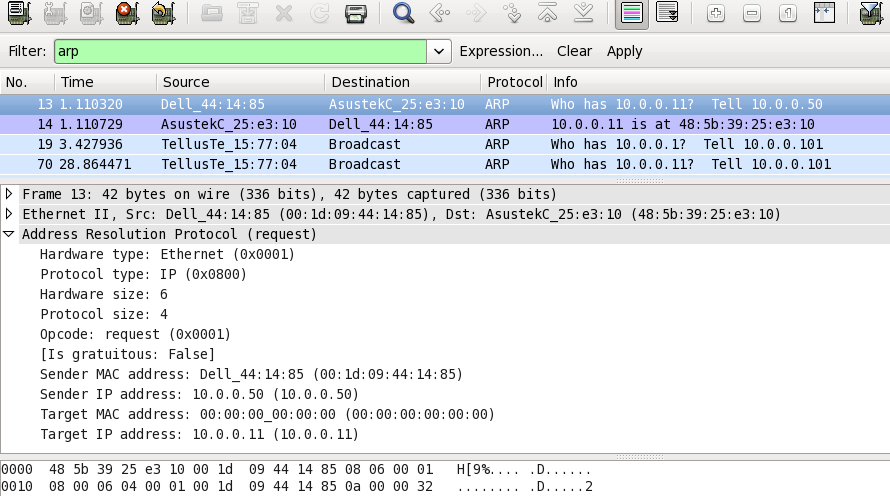
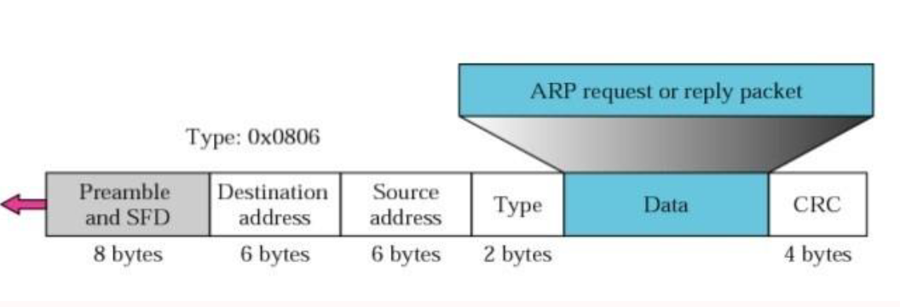
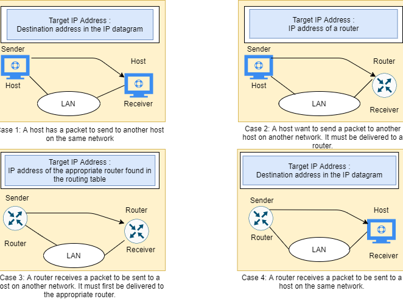
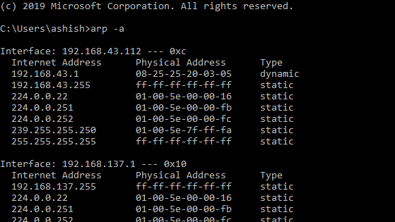
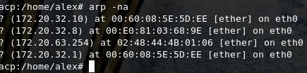

તકનીકી વર્ણન

સરનામું

પરિણામ પ્રોટોકોલ (એઆરપી)

**ઇથરનેટ સરનામું ઠરાવ પ્રોટોક .લ**

**- અથવા -**

**નેટવર્ક પ્રોટોકocolલ સરનામાંઓ રૂપાંતર**

[[https://tools.ietf.org/html/rfc826]{.ul}](https://www.google.com/url?q=https%3A%2F%2Ftools.ietf.org%2Fhtml%2Frfc826&sa=D&sntz=1&usg=AFQjCNHSlGxJe18c1VJeIV6ePn4xPAj3rA)

> નિ today\'sશંકપણે આજના વિશ્વમાં ઇથરનેટ એ કમ્પ્યુટર નેટવર્કિંગ તકનીકમાં
> સૌથી વધુ પ્રખ્યાત તકનીક છે. તેની નોંધપાત્ર લાક્ષણિકતાઓમાંની એક એ છે કે
> તે ઉચ્ચ પ્રભાવ ટકાઉપણું સુવિધા પ્રદાન કરે છે. તે ફિઝીકલ મીડિયા જેવા કે
> કોક્સિયલ કેબલ, નેટવર્ક ઇન્ટરફેસ કાર્ડ (એનઆઈસી) વગેરેનો ઉપયોગ કરીને 10
> થી 100 એમબીપીએસ વગેરે દરે ડેટાને ટ્રાન્સમિટ કરેલા સહ-સંબંધિત સારી રીતે
> વ્યાખ્યાયિત પ્રોટોકોલનો પરિવાર છે.
>
> ઇથરનેટ ટેક્નોલ Informationજીમાંની માહિતી, પેકેટોના સ્વરૂપમાં ભૌતિક
> મીડિયાનો ઉપયોગ કરીને મોકલવામાં આવે છે. પેકેટના કદ પર આધાર રાખીને,
> તેમાંનો ડેટા તૂટેલો હોઈ શકે છે અને નાના ફ્રેમ્સમાં લપેટી શકાય છે અને
> પછી તે સ્થળ પર મોકલો છે જ્યાં તેને ફરીથી એસેમ્બલ કરી શકાય છે. આ
> ફ્રેમ્સ મોકલનારની એનઆઈસીનો ઉપયોગ કરીને વાયર પર લખાઈ છે. આ પેકેટો એક
> પ્રાપ્તકર્તા માટે પ્રેષક દ્વારા જનરેટ કરવામાં આવે છે જેને નેટવર્કમાં
> કનેક્ટ થવાની જરૂર છે. પેકેટ તેના ગંતવ્ય સુધી પહોંચવા માટે રાઉટર્સ અથવા
> સ્વીચો દ્વારા મુસાફરી કરી શકે છે. પ્રોટોકોલ બે નેટવર્ક ઓળખ વચ્ચેના
> સંદેશાવ્યવહાર માટેના નિયમોના સેટને નિર્ધારિત કરે છે. નોંધો કે પ્રેષક
> અને પ્રાપ્તકર્તા વચ્ચેના અન્ય નેટવર્કિંગ ડિવાઇસ, આ પેકેટોને પ્રક્રિયા
> માટે પસંદ કરશે નહીં, પરંતુ તેને છોડવામાં આવશે. તેથી, અમને એક
> પ્રોટોકોલની જરૂર છે જ્યાં \<પ્રોટોકોલ પ્રકાર, પ્રોટોકોલ સરનામું\> ના
> આધારે તેને ફક્ત પ્રેષકથી રીસીવર સુધીના માર્ગને પસાર કરવાની જરૂર છે.

**અમૂર્ત:**

> ચાલો ધારી લઈએ કે ત્યાં એક જ નેટવર્ક પર બે નેટવર્કિંગ ડિવાઇસીસ A અને B
> અસ્તિત્વમાં છે અને નીચેના ગુણધર્મો છે:
>
> ઉપકરણ એ:
>
> મેક = એમ (એ)
>
> આઈપી = હું (એ)
>
> ઉપકરણ બી:
>
> મેક = એમ (બી)
>
> આઈપી = હું (બી)
>
> હવે એ બી સાથે વાતચીત કરવા માંગે છે અને માત્ર બીની આઈપી સંપત્તિને જાણે
> છે. A, I (B) થી M (B) ને નકશા બનાવવા માટે તેના પ્રોટોકોલ સ્ટેક એઆરપી
> મોડ્યુલની સલાહ લેશે. તેથી એનું એઆરપી મોડ્યુલ નેટવર્ક પર બ્રોડકાસ્ટ
> પેકેટ મોકલશે જેમાં બી ડિવાઇસ તેની મેક વિગતો સાથે પ્રતિસાદ આપશે. હવે
> એઆરપી મોડ્યુલો વાયરને મોકલવા માટે ઇથરનેટ પેકેટ બનાવવા માટે આ વિગતોનો
> ઉપયોગ કરે છે.
>
> નોંધો:
>
> સરનામું ઠરાવ પ્રોટોકોલ (એઆરપી) એ ભૌતિક સરનામાં (48-બીટ MAC સરનામું) પર
> IPv4 સરનામું (32-બીટ લોજિકલ સરનામું) મેપ કરવાના હેતુ સાથે TCP / IP
> સ્યુટમાં મુખ્ય પ્રોટોકોલમાંથી એક છે. નેટવર્ક ડિવાઇસીસને તાર્કિક નામો
> અને નીચલા સ્તર અથવા પ્રોટોકોલ સોંપવામાં આવે છે, જેને MAC સરનામાં પર
> લોજિકલ નામોનું નિરાકરણ લાવવામાં આવે છે. એપ્લિકેશન લેયર પર નેટવર્ક
> એપ્લિકેશન્સ બીજા ઉપકરણ સાથે વાતચીત કરવા માટે IPv4 સરનામાંનો ઉપયોગ કરે
> છે. જો કે, ડેટા લિંક્સ લેયર પર, એડ્રેસિંગનો ઉપયોગ થાય છે તે મ MAક
> એડ્રેસ (48-બિટ ફિઝિકલ એડ્રેસ) છે જે નેટવર્ક કાર્ડમાં કાયમી ધોરણે
> સળગાવી દેવામાં આવે છે. એડ્રેસ રીઝોલ્યુશન પ્રોટોક .લ (એઆરપી) નો
> ઉદ્દેશ્ય તમારા લોકલ એરિયા નેટવર્ક (લ )ન) માં કોઈ ઉપકરણનો મેક સરનામું
> શોધવા માટે છે, સંબંધિત આઇપીવી 4 સરનામાં માટે, જે નેટવર્ક એપ્લિકેશન
> સંપર્કવ્યવહાર કરવાનો પ્રયાસ કરી રહી છે.

**મુશ્કેલી:**

> કમ્પ્યુટર નેટવર્કિંગ અસ્તિત્વમાં હોવાથી, ઘણાં પ્રકારનાં નેટવર્કિંગ
> ડિવાઇસીસ છે જે જુદા જુદા ઇન્ટરફેસ સાથે બનાવેલા છે અને વિવિધ વિક્રેતાઓ
> દ્વારા પ્રદાન કરવામાં આવે છે. અગાઉ ચર્ચા કર્યા મુજબ, તેઓને ફ્રેમ્સ
> દ્વારા વાતચીત કરવાની જરૂર છે જે હવે એક પ્રકાર તરીકે વર્ગીકૃત કરી શકાય
> છે - એક પેકેટને બીજાથી અલગ પાડે છે. નોંધ લો કે નેટવર્ક પર અન્ય વિવિધ
> પ્રકારનાં પ્રોટોકોલ અને હાર્ડવેર છે અને તે બધાને ચોક્કસ દરે પેકેટો
> ટ્રાન્સમિટ કરવા માટે કેબલ્સની જરૂર છે. પ્રોટોકોલ સરનામું 48-બીટ
> સરનામું હોઈ શકે છે અથવા ન હોઈ શકે - તે 8 બીટ્સથી 48 બીટ્સ સરનામાંમાં
> બદલાઇ શકે છે. 10 મેબિટ ઇથરનેટ નેટવર્ક આ બધા પ્રોટોકોલ્સ (અને વધુ) ને
> ઇથરનેટ પેકેટ હેડરમાં ટાઇપ ફીલ્ડના માધ્યમ દ્વારા એક જ કેબલ પર એક સાથે
> રહેવાની મંજૂરી આપે છે.
>
> \<પ્રોટોકોલ, સરનામું\> જોડી અને 48-બીટ ઇથરનેટ સરનામાં વચ્ચે
> પત્રવ્યવહાર ગતિશીલ રીતે વહેંચવા માટે પ્રોટોકોલ આવશ્યક છે. એઆરપીનો
> ઉપયોગ સ્થાનિક ક્ષેત્રમાં ડેટા લિંક્સ લેયર (ઓએસઆઈનો લેયર 2) અથવા
> કનેક્ટેડ ડિવાઇસીસના પોઇન્ટ-ટુ-પોઇંટ લિંક નેટવર્કમાં માટે થાય
> છે. ઇથરનેટ સપોર્ટેડ નેટવર્ક ડિવાઇસીસમાં MAC સરનામાંઓ ફિક્સ 6-બાઇટ
> (48-બીટ) ના હોય છે. આઇપી સરનામાંઓ કોઈપણ ઇન્ટરફેસ માટે નિશ્ચિત રૂપરેખા
> નથી. ઉપકરણોને મેન્યુઅલી આઇપી સરનામાંથી ગોઠવી શકાય છે અથવા તેઓ
> નેટવર્કમાં ડાયનેમિક હોસ્ટ કન્ફિગરેશન પ્રોટોક (લ (ડીએચસીપી) સર્વરમાંથી
> એક મેળવી શકે છે. નોંધ જ્યારે પણ ગંતવ્ય આઇપી પેકેટની માહિતી ઉપલબ્ધ ન
> હોય ત્યારે નેટવર્ક / હોસ્ટ આઈડ્સના આધારે આ ઇથરનેટ પેકેટોને નેટવર્ક
> ગેટવે પર મોકલવામાં આવશે.

**ગતિશીલતા:**

> તેની વિશ્વસનીયતા / ગતિ સુવિધાઓને કારણે, ઇથરનેટ વપરાશમાં સૌથી લોકપ્રિય
> નેટવર્કિંગ પ્રોટોકોલ બન્યું. તેના સ્ટેકમાં વધુ અને વધુ પ્રોટોકોલ લાગુ
> કરવામાં આવ્યા હતા. હજી અન્ય વિક્રેતાઓ પાસે સરનામાં રિઝોલ્યુશન
> પ્રોટોકોલનું પોતાનું સંસ્કરણ હોઈ શકે છે. તેઓ આ સુવિધાને માનક સ્વરૂપમાં
> પ્રદાન કરે છે જેમ કે વિક્રેતા વિશિષ્ટ ઉપકરણો હજી પણ કોઈ સુધારણાની
> જરૂરિયાત વિના તેને બનાવી શકે છે. તેથી અમારી પાસે વિજાતીય ડિવાઇસ સેટઅપ
> નેટવર્ક હોઈ શકે છે, પરંતુ હજી પણ ફ્રેમ મોકલે છે અથવા તે વચ્ચે પ્રાપ્ત
> કરવા માટે સક્ષમ છીએ.

**વ્યાખ્યા:**

> સરનામું ઠરાવ પ્રોટોકોલ (એઆરપી) એ ટીસીપી / આઈપી દાવો માંનો એક મુખ્ય
> પ્રોટોકોલ છે અને સરનામાં રિઝોલ્યુશન પ્રોટોકોલ (એઆરપી) નો ઉદ્દેશ આઇપીવી
> 4 એડ્રેસ (32-બીટ લોજિકલ એડ્રેસ) ને શારીરિક સરનામાં (48 બીટ MAC
> સરનામું) પર નકશો બનાવવાનો છે. ). એપ્લિકેશન લેયર પર નેટવર્ક એપ્લિકેશન્સ
> બીજા ઉપકરણ સાથે વાતચીત કરવા માટે IPv4 સરનામાંનો ઉપયોગ કરે છે. પરંતુ
> ડેટા લિંક્સ લેયર પર, એડ્રેસિંગ એ મCક એડ્રેસ (Phys bit-બિટ ફિઝિકલ
> એડ્રેસ) છે, અને આ સરનામું કાયમી ધોરણે નેટવર્ક કાર્ડમાં સળગાવી દેવામાં
> આવે છે.
>
> એડ્રેસ રીઝોલ્યુશન પ્રોટોક .લ (એઆરપી) નો ઉદ્દેશ્ય તમારા લોકલ એરિયા
> નેટવર્ક (લ )ન) માં કોઈ ઉપકરણનો મેક સરનામું શોધવા માટે છે, સંબંધિત
> આઇપીવી 4 સરનામાં માટે, જે નેટવર્ક એપ્લિકેશન સંપર્કવ્યવહાર કરવાનો
> પ્રયાસ કરી રહી છે.

**એઆરપીનો ઇતિહાસ:**

> એઆરપીની વિનંતી માટે ટિપ્પણીઓ (આરએફસી) 826 માં પ્રથમ પ્રસ્તાવિત અને
> ચર્ચા કરવામાં આવી હતી, ડેવિડ સી પ્લમર દ્વારા નવેમ્બર 1982 માં
> પ્રકાશિત. આઇપી પ્રોટોકોલ સ્યૂટના શરૂઆતના દિવસોમાં સરનામાંના
> રિઝોલ્યુશનની સમસ્યા તરત જ સ્પષ્ટ થઈ ગઈ હતી, કારણ કે ઇથરનેટ ઝડપથી
> પ્રાધાન્યવાળી લ technologyન ટેકનોલોજી બની હતી અને ઇથરનેટ કેબલ્સને
> 48-બીટ સરનામાં આવશ્યક છે.
>
> આ પ્રોટોકોલનું વર્ણન ઇન્ટરનેટ આરએફસીના પ્રારંભિકમાંના એકમાં હજી પણ
> સામાન્ય ઉપયોગમાં છે: આરએફસી 826, એક ઇથરનેટ એડ્રેસ રિઝોલ્યુશન
> પ્રોટોકોલ, 1982 માં પ્રકાશિત.
>
> નામ સ્પષ્ટ કરે છે કે એઆરપી મૂળરૂપે ઇથરનેટ માટે વિકસાવવામાં આવી હતી.
> આમ, તે સૌથી લોકપ્રિય લેયર ટુ લ LANન પ્રોટોકોલ અને સૌથી લોકપ્રિય સ્તર
> ત્રણ ઇન્ટરનેટવર્કિંગ પ્રોટોકોલ વચ્ચેનું જોડાણ રજૂ કરે છે - આ વાત બે
> દાયકા પછી પણ સાચી છે. જો કે, તે શરૂઆતથી પણ સ્પષ્ટ હતું કે જો ઇથરનેટ
> આઇપી પરિવહન કરવાની ખૂબ સામાન્ય રીત છે, તો તે એકમાત્ર નહીં હોય. તેથી,
> એઆરપીને એક સામાન્ય પ્રોટોકોલ બનાવવામાં આવ્યો હતો જે આઇપીથી ફક્ત ઇથરનેટ
> જ નહીં, પરંતુ સંખ્યાબંધ અન્ય ડેટા લિંક્સ લેયર તકનીકોના સરનામાંઓને ઠીક
> કરવા સક્ષમ હતો.

**ઝાંખી:**

> એડ્રેસ રિઝોલ્યુશન પ્રોટોક .લ (એઆરપી) ઇન્ટરનેટવર્ક પરના સંદેશાવ્યવહારને
> સશક્ત બનાવવા માટે વિકસિત કરવામાં આવી હતી અને આરએફસી 826 દ્વારા
> વર્ગીકૃત કરવામાં આવી છે. લેયર 3 ગેજેટ્સને મCક હાર્ડવેર સરનામાંઓ પર
> આઇપી નેટવર્ક સરનામાંઓ બનાવવા માટે એઆરપીની જરૂર પડે છે જેથી આઇપી બંડલ્સ
> સિસ્ટમોમાં મોકલી શકાય. કોઈ ઉપકરણ બીજા ડિવાઇસ પર ડેટાગ્રામ મોકલે તે
> પહેલાં, તે ગોલ ગેજેટ માટે કોઈ MAC સરનામું અને સંબંધિત IP સરનામું છે કે
> કેમ તે તપાસવા માટે તેની એઆરપી કેશમાં જુએ છે. કોઈ isક્સેસ ન હોય તે બંધ
> તક પર, સ્રોત ગેજેટ સિસ્ટમ પરના દરેક ગેજેટને સંદેશાવ્યવહાર સંદેશ મોકલે
> છે. દરેક ગેજેટ આઇપી સરનામાંને તેના પોતાના જુએ છે. ફક્ત કોઓર્ડિનેટિંગ
> આઇપી એડ્રેસ સાથેનું ગેજેટ ગેજેટ માટે મેક એડ્રેસ ધરાવતા બંડલ સાથે
> મોકલેલા ગેજેટને જવાબ આપે છે (\"મધ્યસ્થી એઆરપી\" ના આધારે).
>
> જ્યારે બિંદુ પર લક્ષ્યસ્થાન ડિવાઇસ, એક બીજા લેયર 3 ડિવાઇસથી આગળ એક
> સિસ્ટમ પર સ્થિત હોય, ત્યારે પ્રક્રિયા અપવાદ સાથે સમાન છે કે મોકલનાર
> ડિવાઇસ એ ડિફોલ્ટ ગેટવેના મેક સરનામાં માટે એઆરપી માંગ મોકલે છે. સરનામું
> ઉકેલાઈ જાય અને ડિફ theલ્ટ ગેટવેને પેકેટ મળે તે પછી, ડિફ defaultલ્ટ
> ગેટવે તેની સાથે સંકળાયેલ સિસ્ટમો પર લક્ષ્યસ્થાન IP સરનામું પ્રસારિત
> કરે છે. ડેસ્ટિનેશન ડિવાઇસ નેટવર્ક પર લેયર 3 ડિવાઇસ એ આરપીનો ઉપયોગ
> ડેસ્ટિનેશન ડિવાઇસનો મેક એડ્રેસ મેળવવા માટે કરે છે અને પેકેટ પહોંચાડે
> છે.

**તે કેવી રીતે કામ કરે છે:**

> જ્યારે નવું કમ્પ્યુટર લેનમાં જોડાય છે, ત્યારે ઓળખ અને સંદેશાવ્યવહાર
> માટે વાપરવા માટે તેને એક અનોખો આઈપી સરનામું સોંપવામાં આવે છે. જ્યારે
> કોઈ વિશિષ્ટ લ LANન પર હોસ્ટ મશીન માટે નિર્ધારિત આવનારા પેકેટ કોઈ ગેટવે
> પર આવે છે, ત્યારે ગેટવે એઆરપી પ્રોગ્રામને એક આઇપી સરનામું શોધવા માટે
> પૂછે છે જે આઇપી સરનામાં સાથે મેળ ખાય છે. એઆરપી કેશ તરીકે ઓળખાતું
> કોષ્ટક દરેક આઇપી સરનામાં અને તેનાથી સંબંધિત મેક સરનામાં ( [[આરએફસી
> 5227]{.ul}](https://www.google.com/url?q=https%3A%2F%2Ftools.ietf.org%2Fhtml%2Frfc5227%23section-1.3&sa=D&sntz=1&usg=AFQjCNGGQNaGP6atAzMmhiHh4AUWOs6BDQ)
> ) નો રેકોર્ડ જાળવે છે .
>
> આઇપીવી 4 ઇથરનેટ નેટવર્કમાંની તમામ operatingપરેટિંગ સિસ્ટમ્સ એઆરપી કેશ
> રાખે છે. દરેક વખતે જ્યારે હોસ્ટ કોઈ બીજા સરનામાંને બીજા હોસ્ટને
> પેકેટમાં મોકલવા માટે મેક સરનામાંની વિનંતી કરે છે, ત્યારે તે તેની એઆરપી
> કેશ તપાસે છે કે નહીં તે જોવા માટે આઇપીથી મેક સરનામું અનુવાદ પહેલેથી જ
> અસ્તિત્વમાં છે કે નહીં. જો તે થાય, તો નવી એઆરપી વિનંતી બિનજરૂરી છે. જો
> ભાષાંતર પહેલાથી અસ્તિત્વમાં નથી, તો નેટવર્ક સરનામાંઓ માટે વિનંતી
> મોકલવામાં આવે છે અને એઆરપી કરવામાં આવે છે.
>
> એઆરપી, LAN પરના તમામ મશીનો માટે વિનંતી પેકેટનું પ્રસારણ કરે છે અને
> પૂછે છે કે શું મશીનોમાંથી કોઈને ખબર છે કે તેઓ તે ચોક્કસ IP સરનામું
> વાપરી રહ્યા છે. જ્યારે કોઈ મશીન આઇપી સરનામાંને તેના પોતાના તરીકે ઓળખે
> છે, ત્યારે તે જવાબ મોકલે છે જેથી એઆરપી ભવિષ્યના સંદર્ભ માટે કેશને
> અપડેટ કરી શકે અને સંદેશાવ્યવહાર સાથે આગળ વધી શકે.
>
> હોસ્ટ મશીનો કે જેઓ પોતાનો આઇપી સરનામું નથી જાણતા તે શોધ માટે રિવર્સ
> એઆરપી (આરએઆરપી) પ્રોટોકોલનો ઉપયોગ કરી શકે છે.
>
> એઆરપી કેશનું કદ મર્યાદિત છે અને સમય ખાલી કરવા માટે તમામ પ્રવેશોથી
> સમયાંતરે સાફ કરવામાં આવે છે; હકીકતમાં, સરનામાંઓ ફક્ત થોડી મિનિટો માટે
> કેશમાં જ રહે છે. વારંવાર અપડેટ્સ નેટવર્કના અન્ય ઉપકરણોને તે જોવા દે છે
> જ્યારે ભૌતિક હોસ્ટ તેમના વિનંતી કરેલા આઇપી સરનામાંને બદલશે. સફાઇ
> પ્રક્રિયામાં, ન વપરાયેલી એન્ટ્રીઝ કા deletedી નાખવામાં આવે છે તેમ જ
> વર્તમાનમાં સંચાલિત ન હોય તેવા કમ્પ્યુટર્સ સાથે વાતચીત કરવાના કોઈપણ
> નિષ્ફળ પ્રયાસો

**શબ્દનિર્વાહ:**

> મેપિંગના બે પ્રકારો છે:
>
> 1\. સ્થિર મેપિંગ
>
> 2\. ડાયનેમિક મેપિંગ

**સ્ટેટિક મેપિંગ:**

> સ્થિર મેપિંગનો અર્થ એક ટેબલ બનાવવાનું છે જે કોઈ તાર્કિક સરનામાંને
> ભૌતિક સરનામાં સાથે જોડે છે. આ કોષ્ટક નેટવર્ક પરના દરેક મશીનમાં
> સંગ્રહિત છે
>
> દરેક મશીન જે જાણે છે, ઉદાહરણ તરીકે, બીજા મશીનનું આઇપી સરનામું પરંતુ
> તેનો ભૌતિક સરનામું નથી, તે કોષ્ટકમાં જોઈ શકે છે. આમાં કેટલીક મર્યાદાઓ
> છે કારણ કે શારીરિક સરનામાંઓ નીચેની રીતોમાં બદલાઈ શકે છે:
>
> · એક મશીન તેના NIC બદલી શકે, નવી ભૌતિક સરનામું પરિણમે છે.
>
> LAN કેટલાક LAN માં, જેમ કે લોકલટાલક, દરેક વખતે કમ્પ્યુટર ચાલુ થાય છે
> ત્યારે ભૌતિક સરનામાં બદલાય છે.
>
> Mobile મોબાઇલ કમ્પ્યુટર એક શારીરિક નેટવર્કથી બીજામાં જઈ શકે છે,
> પરિણામે તેના ભૌતિક સરનામાંમાં ફેરફાર થાય છે.
>
> આ ફેરફારોને અમલમાં મૂકવા માટે, સ્થિર મેપિંગ કોષ્ટક સમયાંતરે અપડેટ થવું
> આવશ્યક છે. આ ઓવરહેડ નેટવર્ક પ્રભાવને અસર કરી શકે છે.

**ડાયનેમિક મેપિંગ:**

> ગતિશીલ મેપિંગમાં, દરેક વખતે જ્યારે મશીન બીજા મશીનનો લોજિકલ સરનામું
> જાણે છે, ત્યારે તે ભૌતિક સરનામું શોધવા માટે પ્રોટોકોલનો ઉપયોગ કરી શકે
> છે. ગતિશીલ મેપિંગ કરવા માટે બે પ્રોટોકોલની રચના કરવામાં આવી છે: એડ્રેસ
> રીઝોલ્યુશન પ્રોટોક .લ (એઆરપી) અને રિવર્સ એડ્રેસ રિઝોલ્યુશન પ્રોટોકોલ
> (આરએઆરપી). એઆરપી કોઈ તાર્કિક સરનામાંને ભૌતિક સરનામાં પર નકશા કરે છે;
> આરએઆરપી એક તાર્કિક સરનામાંને લોજિકલ સરનામાં પર નકશા કરે છે. ત્યારથી
> આરએઆરપી બીજા પ્રોટોકોલથી બદલાઈ ગયું છે અને તેથી અવગણવામાં આવ્યું છે,
> તેથી અમે આ દસ્તાવેજમાં ફક્ત એઆરપી પ્રોટોકોલની ચર્ચા કરીએ છીએ.

**એઆરપી કેચિંગ:**

> ઇન્ટરનેટ વર્ક પર મોકલવામાં આવેલા દરેક ડેટાગ્રામ માટે નેટવર્ક પરના દરેક
> હોપ (લેયર 3 ડિવાઇસ) પર આઇપી એડ્રેસને મીડિયા accessક્સેસ કંટ્રોલ (મેક)
> ની મેપિંગને લીધે, નેટવર્કની કામગીરી સાથે ચેડા થઈ શકે છે. બ્રોડકાસ્ટને
> ઓછું કરવા અને નેટવર્ક સંસાધનોના નકામા ઉપયોગને મર્યાદિત કરવા માટે,
> સરનામું ઠરાવ પ્રોટોકોલ (એઆરપી) કેશીંગ લાગુ કરવામાં આવી.
>
> એઆરપી કેશીંગ એ નેટવર્ક સરનામાંઓ અને તે સાથે સંકળાયેલ ડેટા-લિંક્સ
> સરનામાંઓને સમયગાળા માટે મેમરીમાં સ્ટોર કરવાની પદ્ધતિ છે, કારણ કે
> સરનામાં શીખ્યા છે.
>
> આ દર વખતે ડેટાગ્રામ મોકલવામાં આવે ત્યારે સમાન સરનામાં માટે પ્રસારણ
> કરવા માટે મૂલ્યવાન નેટવર્ક સંસાધનોનો ઉપયોગ ઘટાડે છે. કacheશ પ્રવેશો
> જાળવવી આવશ્યક છે કારણ કે માહિતી જૂની થઈ શકે છે, તેથી તે મહત્વપૂર્ણ છે
> કે કેશ પ્રવેશો સમયાંતરે સમાપ્ત થવા માટે ગોઠવવામાં આવે છે. સરનામાંઓ
> પ્રસારિત થતાંની સાથે નેટવર્ક પરના દરેક ઉપકરણ તેના કોષ્ટકોને અપડેટ કરે
> છે.
>
> ત્યાં સ્થિર એઆરપી કેશ પ્રવેશો અને ગતિશીલ એઆરપી કેશ પ્રવેશો છે. સ્થિર
> એન્ટ્રીઝ મેન્યુઅલી ગોઠવેલી છે અને કાયમી ધોરણે કેશ ટેબલમાં રાખવામાં આવે
> છે. સ્થિર એન્ટ્રીઝ એ ઉપકરણો માટે શ્રેષ્ઠ છે કે જે સામાન્ય રીતે સમાન
> નેટવર્કમાં અન્ય ઉપકરણો સાથે સંપર્ક કરવો પડે છે. ગતિશીલ પ્રવેશો સિસ્કો
> સ softwareફ્ટવેર દ્વારા ઉમેરવામાં આવે છે, તે સમયગાળા માટે રાખવામાં આવે
> છે, અને પછી તેને દૂર કરવામાં આવે છે.

**એઆરપી કેશમાં સ્થિર અને ગતિશીલ પ્રવેશો**

> સ્થિર રૂટીંગ માટે સંચાલકને જાતે જ આઇપી સરનામાંઓ, સબનેટ માસ્ક, ગેટવે
> અને ટેબલમાં દરેક ડિવાઇસના દરેક ઇન્ટરફેસ માટે સંબંધિત મીડિયા એક્સેસ
> કન્ટ્રોલ (એમએસી) સરનામાં દાખલ કરવાની આવશ્યકતા હોય છે. સ્થિર રૂટીંગ વધુ
> નિયંત્રણ સક્ષમ કરે છે પરંતુ કોષ્ટક જાળવવા માટે વધુ કાર્યની જરૂર છે.
> દરેક વખતે રૂટ્સ ઉમેરવા અથવા બદલવા પર કોષ્ટકને અપડેટ કરવું આવશ્યક છે.
>
> ગતિશીલ રૂટીંગ પ્રોટોકોલ્સનો ઉપયોગ કરે છે જે નેટવર્કમાં ડિવાઇસીસને એક
> બીજા સાથે રૂટીંગ ટેબલ માહિતીની આપલે કરવામાં સક્ષમ કરે છે. કોષ્ટક બિલ્ટ
> અને આપમેળે બદલાઈ ગયું છે. કોઈ સમય મર્યાદા ઉમેરવામાં ન આવે ત્યાં સુધી
> કોઈ વહીવટી કાર્યોની જરૂર નથી, તેથી સ્થિર રૂટીંગ કરતાં ગતિશીલ રૂટીંગ
> વધુ કાર્યક્ષમ છે. ડિફોલ્ટ સમય મર્યાદા 4 કલાક છે. જો નેટવર્ક પાસે ઘણા
> બધા માર્ગો છે જે કેશમાંથી ઉમેરવામાં અને કા deletedી નાખવામાં આવે છે,
> તો સમય મર્યાદા સમાયોજિત થવી જોઈએ.

**પ્રોક્સી એઆરપી**

> પ્રોક્સી એડ્રેસ રિઝોલ્યુશન પ્રોટોક .લ, જે આરએફસી 1027 માં વ્યાખ્યાયિત
> છે, તે સમાન આઇપી નેટવર્કમાં રાઉટર દ્વારા જોડાયેલા ભૌતિક નેટવર્ક
> સેગમેન્ટ્સમાં વિભાજિત થયેલ ઉપકરણો અથવા આઇપી-ટુ-મેક સરનામાંઓને ઉકેલવા
> માટે સબનેટવર્કને સક્ષમ કરવા માટે લાગુ કરવામાં આવ્યું હતું. જ્યારે
> ઉપકરણો સમાન ડેટા લિંક્સ લેયર નેટવર્કમાં ન હોય પરંતુ તે જ આઇપી
> નેટવર્કમાં હોય, ત્યારે તેઓ ડેટા એકબીજાને સ્થાનાંતરિત કરવાનો પ્રયાસ કરે
> છે જાણે કે તે સ્થાનિક નેટવર્ક પર છે.
>
> જો કે, રાઉટર જે ઉપકરણોને અલગ પાડે છે તે પ્રસારણ સંદેશ મોકલશે નહીં કારણ
> કે રાઉટર હાર્ડવેર-સ્તરના પ્રસારણો પસાર કરતા નથી. તેથી, સરનામાંઓ ઉકેલી
> શકાતા નથી.
>
> પ્રોક્સી એઆરપી ડિફ defaultલ્ટ રૂપે સક્ષમ થયેલ છે તેથી સ્થાનિક
> નેટવર્ક્સની વચ્ચે રહેતો \"પ્રોક્સી રાઉટર\" તેના મેક સરનામાં સાથે
> પ્રતિક્રિયા આપે છે જાણે કે તે તે રાઉટર છે કે જ્યાં પ્રસારણ સંબોધવામાં
> આવે છે. જ્યારે મોકલવાનું ડિવાઇસ પ્રોક્સી રાઉટરનું MAC સરનામું મેળવે
> છે, ત્યારે તે ડેટાગ્રામને પ્રોક્સી રાઉટર પર મોકલે છે, જે બદલામાં
> ડેટાગ્રામને નિયુક્ત ઉપકરણ પર મોકલે છે.

**એઆરપી પ્રોટોકોલ સ્ટ્રક્ચર:**

{width="5.875in" height="2.45in"}

> સરનામાં રીઝોલ્યુશન પ્રોટોકocolલ (એઆરપી) સંદેશ ફોર્મેટમાંનાં ક્ષેત્રો
> છે:
>
> · હાર્ડવેરનો પ્રકાર: એઆરપી સંદેશમાં હાર્ડવેર પ્રકારનું ક્ષેત્ર સરનામું
> રીઝોલ્યુશન પ્રોટોક .લ (એઆરપી) સંદેશ પ્રસારિત કરતા સ્થાનિક નેટવર્ક માટે
> વપરાયેલ હાર્ડવેરના પ્રકારને નિર્દિષ્ટ કરે છે. ઇથરનેટ એ સામાન્ય
> હાર્ડવેર પ્રકાર છે અને તે ઇથરનેટ માટેનું મૂલ્ય 1 છે. આ ક્ષેત્રનું કદ 2
> બાઇટ્સ છે.
>
> · પ્રોટોકોલ પ્રકાર: દરેક પ્રોટોકોલ આ ક્ષેત્રમાં વપરાયેલ નંબર સોંપેલ
> છે. આઈપીવી 4 2048 (હેક્સાડેસિમલમાં 0x0800) છે.
>
> · હાર્ડવેર સરનામાં લંબાઈ: એઆરપી સંદેશમાં હાર્ડવેર સરનામાંની લંબાઈ
> હાર્ડવેર (એમએસી) સરનામાંની બાઇટ્સમાં લંબાઈ છે. ઇથરનેટ મેક એડ્રેસ 6
> બાઇટ્સ લાંબા છે.
>
> · પ્રોટોકોલ સરનામું લંબાઈ: લોજિકલ સરનામાં (આઈપીવી 4 સરનામું) ના
> બાઇટ્સમાં લંબાઈ. આઈપીવી 4 એડ્રેસ 4 બાઇટ લાંબી છે.
>
> · Cપ્કોડ: એઆરપી સંદેશમાં cપ્કોડ ક્ષેત્ર એઆરપી સંદેશની પ્રકૃતિને
> નિર્દિષ્ટ કરે છે. એઆરપી વિનંતી માટે 1 અને એઆરપી જવાબ માટે 2.
>
> Er પ્રેષક હાર્ડવેર સરનામું: સંદેશ મોકલતા ઉપકરણનું લેયર 2 (MAC સરનામું)
> સરનામું.
>
> · પ્રેષક પ્રોટોકોલ સરનામું: સંદેશ મોકલતા ડિવાઇસનું પ્રોટોકોલ સરનામું
> (IPv4 સરનામું)
>
> · લક્ષ્યાંક હાર્ડવેર સરનામું: લેયર 2 (MAC સરનામું) બનાવાયેલ રીસીવરનું.

**વાયરશાર્કમાં આર્ટ સ્ટ્રક્ચર:**

{width="9.266666666666667in"
height="5.166666666666667in"}

> નિમણૂક:
>
> એક એઆરપી પેકેટ સીધા ડેટા લિંક ફ્રેમમાં સમાયેલું છે. ઉદાહરણ તરીકે,
> નીચેની આકૃતિમાં, એક એઆરપી પેકેટ ઇથરનેટ ફ્રેમમાં સમાયેલું છે. નોંધો કે
> પ્રકાર ક્ષેત્ર સૂચવે છે કે ફ્રેમ દ્વારા હાથ ધરવામાં આવેલ ડેટા એઆરપી
> પેકેટ છે.

{width="11.0in" height="3.775in"}

**એઆરપી વિનંતી અને જવાબ:**

> ચાલો જોઈએ કે લાક્ષણિક ઇન્ટરનેટ પર એઆરપી કેવી રીતે કાર્ય કરે છે. પ્રથમ
> આપણે તેમાં શામેલ પગલાઓનું વર્ણન કરીએ છીએ. પછી અમે તે ચાર કેસોની ચર્ચા
> કરીએ જેમાં હોસ્ટ અથવા રાઉટરને એઆરપીનો ઉપયોગ કરવાની જરૂર છે:
>
> · પ્રેષક લક્ષ્યનું IP સરનામું જાણે છે.
>
> · આઇપી એઆરપીને એઆરપી વિનંતી સંદેશ બનાવવા માટે કહે છે, પ્રેષકનું ભૌતિક
> સરનામું, પ્રેષકનું IP સરનામું અને લક્ષ્ય IP સરનામાં ભરીને. લક્ષ્ય
> ભૌતિક સરનામું ક્ષેત્ર 0 સેથી ભર્યું છે.
>
> સંદેશ ડેટા કડી સ્તર પર પહોંચવામાં આવે છે જ્યાં તે સ્રોત સરનામાં તરીકે
> પ્રેષકના ભૌતિક સરનામાં અને ગંતવ્ય સરનામાં ( [[આરએફસી
> 5227]{.ul}](https://www.google.com/url?q=https%3A%2F%2Ftools.ietf.org%2Fhtml%2Frfc5227%23section-2.4&sa=D&sntz=1&usg=AFQjCNGOIIihwwC9SPzKWmd6tGEfJmatvQ)
> ) તરીકે ભૌતિક પ્રસારણ
> [[સરનામુંનો]{.ul}](https://www.google.com/url?q=https%3A%2F%2Ftools.ietf.org%2Fhtml%2Frfc5227%23section-2.4&sa=D&sntz=1&usg=AFQjCNGOIIihwwC9SPzKWmd6tGEfJmatvQ)
> ઉપયોગ કરીને કોઈ ફ્રેમમાં [[સમાવવામાં આવે
> છે]{.ul}](https://www.google.com/url?q=https%3A%2F%2Ftools.ietf.org%2Fhtml%2Frfc5227%23section-2.4&sa=D&sntz=1&usg=AFQjCNGOIIihwwC9SPzKWmd6tGEfJmatvQ)
> .

{width="11.225in" height="6.6in"}

> · દરેક યજમાન અથવા રાઉટર ફ્રેમ મેળવે છે. કારણ કે ફ્રેમમાં બ્રોડકાસ્ટ
> ગંતવ્ય સરનામું શામેલ છે, તેથી બધા સ્ટેશનો સંદેશને દૂર કરે છે અને તેને
> એઆરપીમાં પહોંચાડે છે. એક લક્ષિત સિવાયના તમામ મશીનો પેકેટ છોડે છે.
> લક્ષ્ય મશીન આઇપી સરનામાંને ઓળખે છે.
>
> Target લક્ષ્ય મશીન એઆરપી જવાબ સંદેશ સાથે જવાબ આપે છે જેમાં તેનો ભૌતિક
> સરનામું છે. સંદેશ યુનિકાસ્ટ છે.
>
> · પ્રેષક જવાબ સંદેશ મેળવે છે. તે હવે લક્ષ્ય મશીનનો ભૌતિક સરનામું જાણે
> છે.
>
> IP આઇપી ડેટાગ્રામ, જે લક્ષ્ય મશીનનો ડેટા વહન કરે છે, તે હવે એક
> ફ્રેમમાં સમાયોજિત થયેલ છે અને ગંતવ્ય સુધી યુનિકાસ્ટ છે.

**એઆરપીમાં 4 વિવિધ કિસ્સાઓ:**

{width="6.9in" height="5.125in"}

> એઆરપી હુમલો અને સંરક્ષણો

**એઆરપી પોઇઝિનીંગ**

> એઆરપી પોઇઝનિંગ એ હુમલો છે જ્યાં આપણે નેટવર્ક પર નકલી એઆરપી જવાબ પેકેટ
> મોકલીએ છીએ. ત્યાં બે સંભવિત હુમલાઓ છે ( [[આરએફસી
> 5227]{.ul}](https://www.google.com/url?q=https%3A%2F%2Ftools.ietf.org%2Fhtml%2Frfc5227%23section-5&sa=D&sntz=1&usg=AFQjCNF4XW82mDtC5zAxiTnsO0t6_f4fgQ)
> ):
>
> · **MITM (મધ્યમાં મેન):** હુમલાખોર તેના પોતાના MAC સરનામું અને કાયદેસર
> યજમાન, સર્વરને લીધે અથવા રાઉટરના આઇપી એડ્રેસની સાથે એઆરપી જવાબ મોકલશે.
> જ્યારે પીડિતાને એઆરપીનો જવાબ મળે છે ત્યારે તે તેના એઆરપી ટેબલને અપડેટ
> કરશે. જ્યારે તે કાયદેસર ઉપકરણ પર પહોંચવાનો પ્રયાસ કરે છે, ત્યારે આઈપી
> પેકેટો હુમલાખોરના અંતમાં આવશે.
>
> OS **ડોસ (સેવાનો ઇનકાર):** હુમલાખોર કાયદેસર સર્વરના મેક સરનામાં સાથે
> ઘણાં એઆરપી જવાબો મોકલશે. નેટવર્કમાંના બધા ઉપકરણો તેમના એઆરપી કોષ્ટકોને
> અપડેટ કરશે અને નેટવર્કમાંના તમામ આઇપી પેકેટો તેને ટ્રાફિકથી ઓવરલોડ
> કરીને સર્વર પર મોકલવામાં આવશે.
>
> હુમલો નીચે મુજબ કાર્ય કરે છે:
>
> 1\. હુમલાખોરને નેટવર્કની .ક્સેસ હોવી આવશ્યક છે. ઓછામાં ઓછા બે ઉપકરણોના
> આઇપી સરનામાંઓ નક્કી કરવા માટે તેઓ નેટવર્કને સ્કેન કરે છે --- ચાલો કહીએ
> કે આ વર્કસ્ટેશન અને રાઉટર છે.
>
> 2\. બનાવટી એઆરપી જવાબો મોકલવા માટે હુમલાખોર એક સ્પોફિંગ ટૂલનો ઉપયોગ
> કરે છે, જેમ કે આર્પ સ્પોફ અથવા ડ્રિફ્ટનેટ.
>
> 3\. બનાવટી જવાબો જાહેરાત કે બંને IP સરનામાઓ માટે યોગ્ય MAC સરનામું,
> રાઉટર અને વર્કસ્ટેશન સાથે જોડાયેલા, હુમલાખોર MAC સરનામું છે. આ એક
> બીજાને બદલે હુમલાખોરના મશીનથી કનેક્ટ થવા માટે રાઉટર અને વર્કસ્ટેશન
> બંનેને મૂર્ખ બનાવે છે.
>
> 4\. બંને ઉપકરણો તેમની એઆરપી કેશ પ્રવેશોને અપડેટ કરે છે અને તે પછીથી,
> સીધા એકબીજા સાથે રહેવાને બદલે હુમલાખોર સાથે વાતચીત કરે છે.
>
> હુમલો કરનાર હવે ગુપ્ત રીતે તમામ સંદેશાવ્યવહારની વચ્ચે છે.

{width="13.058333333333334in"
height="10.191666666666666in"}

> એકવાર હુમલાખોર એઆરપીના સ્પુફિંગ હુમલામાં સફળ થાય છે, પછી તેઓ આ કરી શકે
> છે:
>
> · **સંચાર રૂટીંગ જેમ છે તેમ ચાલુ** - હુમલાખોર, પેકેટોને માહિતી સુંઘે
> છે અને ચોરી કરી શકે છે જો તે HTTPS જેવા એનક્રિપ્ટ થયેલ ચેનલ પર
> ટ્રાન્સફર થાય છે નથી.
>
> · **કરો સત્ર હાઇજેક** - જો હુમલાખોર એક સત્ર ID ને મેળવે છે, તેઓ
> એકાઉન્ટ્સ વપરાશકર્તા હાલમાં લૉગ ઍક્સેસ મેળવવા કરી શકો છો.
>
> · **બદલાવ સંચાર** - ઉદાહરણ તરીકે દૂષિત ફાઇલ અથવા વર્કસ્ટેશન વેબસાઇટ
> દબાણ
>
> · **સેવા વિતરણ ડિનાયલ (DDoS) -** હુમલાખોરો સર્વર તેઓ તેમના પોતાના મશીન
> બદલે DDoS સાથે હુમલો કરવા માંગો છો MAC સરનામું આપી શકે છે. જો તેઓ મોટી
> સંખ્યામાં આઈપી માટે આ કરે છે, તો લક્ષ્ય સર્વર ટ્રાફિક સાથે બોમ્બમારો
> કરવામાં આવશે.

**શોધ:**

> કમાન્ડ લાઇનનો ઉપયોગ કરીને, વિશિષ્ટ ડિવાઇસની એઆરપી કેશને ઝેર ગયેલ છે તે
> શોધવાની સરળ રીત. સંચાલક તરીકે operatingપરેટિંગ સિસ્ટમ શેલ પ્રારંભ કરો.
> વિંડોઝ અને લિનક્સ બંને પર, એઆરપી કોષ્ટક પ્રદર્શિત કરવા માટે નીચેનો
> આદેશ વાપરો

{width="5.825in" height="3.283333333333333in"}

{width="4.533333333333333in"
height="1.0833333333333333in"}

> જો કોષ્ટકમાં બે જુદા જુદા આઇપી સરનામાંઓ છે કે જે સમાન મેક સરનામાં
> ધરાવે છે, તો આ સૂચવે છે કે એઆરપી હુમલો થઈ રહ્યો છે.
