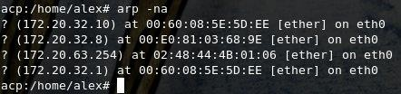

एक ईथरनेट पता रिज़ॉल्यूशन प्रोटोकॉल

\- या -

नेटवर्क प्रोटोकॉल पते परिवर्तित करना

48.bit ईथरनेट पता करने के लिए

पर ट्रांसमिशन के लिए

ईथरनेट हार्डवेयर

https://tools.ietf.org/html/rfc826

तकनीकी विवरण

ADDRESS

परिणाम प्रगति (एआरपी)

निस्संदेह आज की दुनिया में ईथरनेट कंप्यूटर नेटवर्किंग तकनीक में इस्तेमाल
की जाने वाली सबसे लोकप्रिय तकनीक है। इसकी एक उल्लेखनीय विशेषता यह है कि
यह उच्च प्रदर्शन स्थायित्व सुविधा प्रदान करता है। यह सह-संबंधित अच्छी
तरह से परिभाषित प्रोटोकॉल का एक परिवार है जो भौतिक मीडिया जैसे -
समाक्षीय केबल, नेटवर्क इंटरफेस कार्ड (एनआईसी) आदि का उपयोग करके 10/100
एमबीपीएस आदि की दर से डेटा संचारित करता है। इथरनेट प्रौद्योगिकी की
जानकारी पैकेट के रूप में भौतिक मीडिया का उपयोग करके भेजी जाती है। पैकेट
के आकार के आधार पर, इसमें डेटा को तोड़ा जा सकता है और छोटे फ्रेम में
लपेटा जा सकता है और फिर गंतव्य पर भेजा जा सकता है जहां इसे फिर से इकट्ठा
किया जा सकता है। ये फ्रेम प्रेषक के एनआईसी का उपयोग करते हुए तार पर लिखे
गए हैं। ये पैकेट एक रिसीवर के लिए प्रेषक द्वारा उत्पन्न किए जाते हैं
जिन्हें नेटवर्क में कनेक्ट करने की आवश्यकता होती है। पैकेट अपने गंतव्य
तक पहुंचने के लिए राउटर या स्विच के माध्यम से यात्रा कर सकता है। एक
प्रोटोकॉल दो नेटवर्क पहचान के बीच संचार के लिए नियमों के सेट को परिभाषित
करता है। ध्यान दें कि प्रेषक और रिसीवर के बीच में अन्य नेटवर्किंग डिवाइस
इन पैकेटों को प्रसंस्करण के लिए नहीं उठाएगा बल्कि इसे गिरा देगा। इसलिए,
हमें एक प्रोटोकॉल की आवश्यकता होती है, जहां \<प्रोटोकॉल प्रकार,
प्रोटोकॉल पता\> पर आधारित होता है, इसे केवल प्रेषक से रिसीवर तक के मार्ग
को पार करना होगा।

सार:

आइए हम मानते हैं कि दो नेटवर्किंग डिवाइस ए और बी एक ही नेटवर्क पर मौजूद
हैं और नीचे गुण हैं:

डिवाइस ए:

मैक = एम (ए)

IP = I (A)

डिवाइस बी:

मैक = एम (बी)

IP = I (B)

अब A, B से संवाद करना चाहता है और केवल B की IP संपत्ति को जानता है। A
अपने प्रोटोकॉल स्टैक ARP मॉड्यूल को मैप I (B) से M (B) में मैप करेगा।
इसलिए, एआरपी मॉड्यूल नेटवर्क पर एक प्रसारण पैकेट भेजेगा, जिसके लिए बी
डिवाइस अपने मैक विवरण के साथ जवाब देगा। अब A का ARP मॉड्यूल तार पर भेजने
के लिए ईथरनेट पैकेट बनाने के लिए उपयोग किए जाने वाले इन विवरणों को कैश
करता है।

टिप्पणियाँ:

एड्रेस रिज़ॉल्यूशन प्रोटोकॉल (ARP) एक IPv4 एड्रेस (32-बिट लॉजिकल एड्रेस)
को फिजिकल एड्रेस (48-बिट मैक एड्रेस) को मैप करने के उद्देश्य से टीसीपी /
आईपी सूट में प्रमुख प्रोटोकॉल में से एक है। मैक पते के लिए तार्किक नामों
को हल करने के लिए नेटवर्क उपकरणों को एक तार्किक नाम और निचला स्तर या
प्रोटोकॉल सौंपा गया है। एप्लिकेशन लेयर पर नेटवर्क एप्लिकेशन किसी अन्य
डिवाइस के साथ संचार करने के लिए IPv4 एड्रेस का उपयोग करते हैं। हालाँकि,
डेटा लिंक परत में, एड्रेसिंग मोड का उपयोग किया जाता है मैक एड्रेस (एक
48-बिट भौतिक पता) जो स्थायी रूप से नेटवर्क में जला दिया जाता है। एड्रेस
रिज़ॉल्यूशन प्रोटोकॉल (ARP) का उद्देश्य आपके स्थानीय क्षेत्र नेटवर्क
(LAN) में संबंधित IPv4 पते के लिए एक डिवाइस के मैक पते का पता लगाना है,
जिसे नेटवर्क एप्लिकेशन संवाद करने की कोशिश कर रहा है।

समस्या:

चूंकि कंप्यूटर नेटवर्किंग मौजूद थी, इसलिए विभिन्न विक्रेताओं द्वारा
विभिन्न इंटरफ़ेस के साथ कई प्रकार के नेटवर्किंग डिवाइस उपलब्ध हैं। जैसा
कि पहले चर्चा की गई थी कि उन्हें फ़्रेम के माध्यम से संवाद करने की
आवश्यकता है जो अब एक प्रकार के रूप में वर्गीकृत किया जा सकता है - एक
पैकेट को दूसरे से अलग करना। ध्यान दें कि नेटवर्क पर अन्य विभिन्न प्रकार
के प्रोटोकॉल और हार्डवेयर हैं और उन सभी को विशिष्ट दर पर पैकेट को
प्रसारित करने के लिए केबल की आवश्यकता होती है। प्रोटोकॉल पता 48-बिट पता
हो सकता है या नहीं भी हो सकता है - वे 8 बिट्स से 48 बिट्स पते तक भिन्न
हो सकते हैं। 10Mbit ईथरनेट नेटवर्क इन सभी प्रोटोकॉल (और अधिक) को ईथरनेट
पैकेट हेडर में एक प्रकार के क्षेत्र के माध्यम से एक ही केबल पर
सह-अस्तित्व की अनुमति देता है।

\<प्रोटोकॉल, पता\> जोड़ी और 48-बिट ईथरनेट पते के बीच पत्राचार को गतिशील
रूप से वितरित करने के लिए एक प्रोटोकॉल की आवश्यकता होती है। ARP का उपयोग
स्थानीय क्षेत्र या कनेक्टेड डिवाइसों के पॉइंट-टू-पॉइंट लिंक नेटवर्क के
भीतर डेटा लिंक लेयर (OSI के लेयर 2) में भी किया जाता है। ईथरनेट समर्थित
नेटवर्क उपकरणों में मैक पते 6-बाइट (48-बिट) के होते हैं। आईपी ​​पते किसी
भी इंटरफ़ेस के लिए एक निश्चित कॉन्फ़िगरेशन नहीं हैं। डिवाइस को मैन्युअल
रूप से एक आईपी पते के साथ कॉन्फ़िगर किया जा सकता है या वे नेटवर्क में
डायनामिक होस्ट कॉन्फ़िगरेशन प्रोटोकॉल (डीएचसीपी) सर्वर से एक प्राप्त कर
सकते हैं। ध्यान दें जब भी गंतव्य आईपी पैकेट की जानकारी उपलब्ध नहीं है,
तो नेटवर्क / होस्ट आईडी के आधार पर इन ईथरनेट पैकेट को नेटवर्क गेटवे के
लिए भेजा जाएगा।

प्रेरणा:

इसकी विश्वसनीयता / गति सुविधाओं के कारण, ईथरनेट उपयोग में सबसे लोकप्रिय
नेटवर्किंग प्रोटोकॉल बन गया। अधिक से अधिक प्रोटोकॉल इसके स्टैक में लागू
किए गए थे। अभी भी अन्य विक्रेताओं के पास पता रिज़ॉल्यूशन प्रोटोकॉल का
अपना संस्करण हो सकता है। वे इस सुविधा को एक मानक रूप में प्रदान करते हैं
जैसे कि विक्रेता विशिष्ट उपकरण अभी भी बिना किसी संशोधन के इसे बना सकते
हैं। इसलिए हमारे पास एक विषम डिवाइस सेटअप नेटवर्क हो सकता है लेकिन फिर
भी उन दोनों के बीच फ्रेम भेजने या प्राप्त करने में सक्षम हो सकता है।

परिभाषा:

पता रिज़ॉल्यूशन प्रोटोकॉल (एआरपी) टीसीपी / आईपी सूट में प्रमुख प्रोटोकॉल
में से एक है और एड्रेस रिज़ॉल्यूशन प्रोटोकॉल (एआरपी) का उद्देश्य आईपीवी
4 पते (32-बिट लॉजिकल एड्रेस) को भौतिक पते (48 बिट मैक एड्रेस) पर मैप
करना है )। एप्लिकेशन लेयर पर नेटवर्क एप्लिकेशन किसी अन्य डिवाइस के साथ
संचार करने के लिए IPv4 एड्रेस का उपयोग करते हैं। लेकिन डेटा लिंक परत पर,
एड्रेसिंग मैक एड्रेस (48-बिट फिजिकल एड्रेस) है, और यह पता स्थायी रूप से
नेटवर्क कार्ड में जला दिया जाता है।

एड्रेस रिज़ॉल्यूशन प्रोटोकॉल (ARP) का उद्देश्य आपके स्थानीय क्षेत्र
नेटवर्क (LAN) में संबंधित IPv4 पते के लिए एक डिवाइस के मैक पते का पता
लगाना है, जिसे नेटवर्क एप्लिकेशन संवाद करने की कोशिश कर रहा है।

एआरपी का इतिहास:

ARP पहली बार प्रस्तावित किया गया था और डेविड सी। प्लमर द्वारा 1982 के
नवंबर में प्रकाशित टिप्पणियां (RFC) 826 के लिए अनुरोध किया गया था। IP
प्रोटोकॉल सूट के शुरुआती दिनों में एड्रेस रिज़ॉल्यूशन की समस्या तुरंत
स्पष्ट हो गई थी, क्योंकि ईथरनेट जल्दी से पसंदीदा LAN तकनीक बन गया था और
ईथरनेट केबल्स को 48-बिट एड्रेस की आवश्यकता होती थी। 1982 में प्रकाशित
RFC 826, एक ईथरनेट एड्रेस रिज़ॉल्यूशन प्रोटोकॉल: यह प्रोटोकॉल इंटरनेट
RFC के सबसे शुरुआती उपयोग में वर्णित है। नाम स्पष्ट करता है कि एआरपी मूल
रूप से ईथरनेट के लिए विकसित किया गया था। इस प्रकार, यह सबसे लोकप्रिय परत
दो LAN प्रोटोकॉल और सबसे लोकप्रिय परत तीन इंटरनेटवर्क प्रोटोकॉल के बीच
एक सांठगांठ का प्रतिनिधित्व करता है - यह दो दशक बाद भी सच है। हालाँकि,
यह शुरू से ही स्पष्ट था कि भले ही ईथरनेट आईपी के परिवहन का एक बहुत ही
सामान्य तरीका था, लेकिन यह केवल एक ही नहीं होगा। इसलिए, एआरपी को एक
सामान्य प्रोटोकॉल बनाया गया, जो आईपी से न केवल ईथरनेट बल्कि कई अन्य डेटा
लिंक परत प्रौद्योगिकियों के पते को हल करने में सक्षम था।

अवलोकन:

एड्रेस रिज़ॉल्यूशन प्रोटोकॉल (ARP) एक इंटरनेटवर्क पर संचार को सशक्त
बनाने के लिए विकसित किया गया था और RFC 826 द्वारा विशेषता है। लेयर 3
गैजेट्स को MAC हार्डवेयर पतों के लिए IP नेटवर्क पतों को मैप करने के लिए
ARP की आवश्यकता होती है ताकि IP बंडलों को पूरे सिस्टम में भेजा जा सके।
इससे पहले कि कोई डिवाइस किसी अन्य डिवाइस को डेटाग्राम भेजता है, यह अपने
एआरपी कैश में यह देखने के लिए जांचता है कि गोल गैजेट के लिए मैक एड्रेस
और संबंधित आईपी एड्रेस है या नहीं। बंद मौके पर कि कोई एक्सेस नहीं है,
स्रोत गैजेट सिस्टम पर प्रत्येक गैजेट को एक संचार संदेश भेजता है। हर
गैजेट आईपी एड्रेस को अपने हिसाब से देखता है। बस समन्वय आईपी पते के साथ
गैजेट गैजेट के लिए मैक पते वाले बंडल के साथ भेजने वाले गैजेट को जवाब
देता है (\"मध्यस्थ एआरपी\" के खाते से अलग)। स्रोत डिवाइस में भविष्य के
संदर्भ के लिए अपने ARP तालिका के लिए गंतव्य डिवाइस मैक पता शामिल है, एक
जानकारी को हेडर और ट्रेलर कनेक्ट करता है जो पैकेट को एन्क्रिप्ट करता है,
और जानकारी को स्थानांतरित करना जारी रखता है। बिंदु पर जब गंतव्य डिवाइस
एक दूर लेयर सिस्टम पर होता है, तो एक और लेयर 3 डिवाइस से परे, यह
प्रक्रिया इस अपवाद के बराबर होती है कि भेजने वाला डिवाइस डिफ़ॉल्ट गेटवे
के मैक पते के लिए एआरपी की मांग भेजता है। पता हल होने के बाद और डिफ़ॉल्ट
गेटवे को पैकेट मिलता है, डिफ़ॉल्ट गेटवे गंतव्य आईपी पते को इससे जुड़े
सिस्टम पर प्रसारित करता है। गंतव्य डिवाइस नेटवर्क पर लेयर 3 डिवाइस
गंतव्य डिवाइस के मैक पते को प्राप्त करने के लिए ARP का उपयोग करता है और
पैकेट वितरित करता है।

यह काम किस प्रकार करता है:

जब कोई नया कंप्यूटर LAN से जुड़ता है, तो उसे पहचान और संचार के लिए उपयोग
करने के लिए एक विशिष्ट IP पता दिया जाता है। जब एक विशेष लैन पर एक मेजबान
मशीन के लिए आने वाला पैकेट गेटवे पर आता है, तो गेटवे एआरपी प्रोग्राम को
मैक पते को खोजने के लिए कहता है जो आईपी पते से मेल खाता है। ARP कैश नामक
तालिका प्रत्येक IP पते और उसके संबंधित मैक पते
([RFC5227](https://tools.ietf.org/html/rfc5227#section-1.3)) का रिकॉर्ड
रखती है। IPv4 ईथरनेट नेटवर्क में सभी ऑपरेटिंग सिस्टम एक ARP कैश रखते
हैं। हर बार जब कोई होस्ट LAN में किसी अन्य होस्ट को एक पैकेट भेजने के
लिए मैक पते का अनुरोध करता है, तो वह यह देखने के लिए अपने ARP कैश की
जाँच करता है कि IP से मैक एड्रेस ट्रांसलेशन पहले से मौजूद है या नहीं।
यदि ऐसा होता है, तो एक नया एआरपी अनुरोध अनावश्यक है। यदि अनुवाद पहले से
मौजूद नहीं है, तो नेटवर्क पते के लिए अनुरोध भेजा जाता है और एआरपी किया
जाता है। एआरपी लैन पर सभी मशीनों के लिए एक अनुरोध पैकेट प्रसारित करता है
और पूछता है कि क्या किसी भी मशीन को पता है कि वे उस विशेष आईपी पते का
उपयोग कर रहे हैं। जब एक मशीन आईपी पते को अपने स्वयं के रूप में पहचानती
है, तो यह एक उत्तर भेजता है ताकि एआरपी भविष्य के संदर्भ के लिए कैश को
अपडेट कर सके और संचार के साथ आगे बढ़ सके। होस्ट मशीनें जो अपने स्वयं के
आईपी पते को नहीं जानती हैं वे खोज के लिए रिवर्स एआरपी (आरएआरपी)
प्रोटोकॉल का उपयोग कर सकती हैं। एआरपी कैश आकार सीमित है और समय-समय पर
रिक्त स्थान को खाली करने के लिए सभी प्रविष्टियों की सफाई की जाती है;
वास्तव में, पते केवल कुछ मिनटों के लिए कैश में रहने के लिए होते हैं।
लगातार अपडेट नेटवर्क में अन्य उपकरणों को देखने की अनुमति देता है जब एक
भौतिक होस्ट अपने अनुरोधित आईपी पते को बदलता है। सफाई प्रक्रिया में,
अप्रयुक्त प्रविष्टियों को हटा दिया जाता है और साथ ही उन कंप्यूटरों के
साथ संवाद करने का कोई असफल प्रयास किया जाता है जो वर्तमान में संचालित
नहीं हैं.

शब्दावली:

वहाँ मैपिंग के दो प्रकार हैं:

1\. स्टेटिक मैपिंग

2\. डायनामिक मैपिंग

स्टेटिक मैपिंग: स्टेटिक मैपिंग का अर्थ है एक तालिका बनाना जो एक भौतिक
पते के साथ एक तार्किक पते को जोड़ती है। यह तालिका नेटवर्क पर प्रत्येक
मशीन में संग्रहीत है प्रत्येक मशीन जो जानता है, उदाहरण के लिए, किसी अन्य
मशीन का आईपी पता लेकिन उसका भौतिक पता नहीं है, इसे तालिका में देख सकते
हैं। इसकी कुछ सीमाएँ हैं क्योंकि भौतिक पते निम्नलिखित तरीकों से बदल सकते
हैं:

• एक मशीन अपना एनआईसी बदल सकती है, जिसके परिणामस्वरूप एक नया भौतिक पता
होगा।

• स्थानीय LAN जैसे कुछ LAN में, हर बार कंप्यूटर चालू होने पर भौतिक पता
बदल जाता है।

• एक मोबाइल कंप्यूटर एक भौतिक नेटवर्क से दूसरे में जा सकता है, जिसके
परिणामस्वरूप उसका भौतिक पता बदल जाएगा।

इन परिवर्तनों को लागू करने के लिए, एक स्थिर मानचित्रण तालिका को समय-समय
पर अद्यतन किया जाना चाहिए। यह ओवरहेड नेटवर्क प्रदर्शन को प्रभावित कर
सकता है।

डायनामिक मैपिंग:

डायनामिक मैपिंग में, हर बार एक मशीन किसी अन्य मशीन के तार्किक पते को
जानती है, यह भौतिक पते को खोजने के लिए एक प्रोटोकॉल का उपयोग कर सकती है।
डायनामिक मैपिंग करने के लिए दो प्रोटोकॉल डिज़ाइन किए गए हैं: एड्रेस
रिज़ॉल्यूशन प्रोटोकॉल (एआरपी) और रिवर्स एड्रेस रिज़ॉल्यूशन प्रोटोकॉल
(आरएआरपी)। एआरपी एक भौतिक पते के लिए एक तार्किक पते को मैप करता है; RARP
एक भौतिक पते को एक तार्किक पते पर मैप करता है। चूंकि आरएआरपी को एक और
प्रोटोकॉल के साथ बदल दिया जाता है और इसलिए इसे अनदेखा किया जाता है,
इसलिए हम इस दस्तावेज़ में केवल एआरपी प्रोटोकॉल पर चर्चा करते हैं।

एआरपी कैशिंग:

IP पते की मैपिंग के कारण मीडिया एक्सेस कंट्रोल (मैक) पते एक इंटरनेटवर्क
पर भेजे गए प्रत्येक डेटाग्राम के लिए नेटवर्क पर प्रत्येक हॉप (लेयर 3
डिवाइस) पर होते हैं, नेटवर्क के प्रदर्शन से समझौता किया जा सकता है।
नेटवर्क संसाधनों के प्रसारण को कम करने और बेकार उपयोग को सीमित करने के
लिए, एड्रेस रिज़ॉल्यूशन प्रोटोकॉल (एआरपी) कैशिंग लागू किया गया था।

एआरपी कैशिंग नेटवर्क पते को संग्रहीत करने की विधि है और संबंधित
डेटा-लिंक पतों को समय-समय पर मेमोरी में सीखा जाता है।

प्रत्येक बार जब एक डेटाग्राम भेजा जाता है, तो उसी पते के प्रसारण के लिए
मूल्यवान नेटवर्क संसाधनों के उपयोग को कम करता है। कैश प्रविष्टियों को
बनाए रखा जाना चाहिए क्योंकि जानकारी पुरानी हो सकती है, इसलिए यह
महत्वपूर्ण है कि कैश प्रविष्टियों को समय-समय पर समाप्त करने के लिए सेट
किया गया है। एक नेटवर्क पर हर उपकरण अपने टेबल को अपडेट करता है क्योंकि
पते प्रसारित होते हैं।

स्थिर ARP कैश प्रविष्टियाँ और गतिशील ARP कैश प्रविष्टियाँ हैं। स्थैतिक
प्रविष्टियों को मैन्युअल रूप से कॉन्फ़िगर किया गया है और स्थायी आधार पर
कैश तालिका में रखा गया है। स्थैतिक प्रविष्टियाँ उन उपकरणों के लिए
सर्वोत्तम हैं जिन्हें अन्य उपकरणों के साथ आमतौर पर एक ही नेटवर्क पर
नियमित रूप से संवाद करना पड़ता है। डायनेमिक प्रविष्टियों को सिस्को
सॉफ़्टवेयर द्वारा जोड़ा जाता है, जिसे कुछ समय के लिए रखा जाता है, और फिर
हटा दिया जाता है।

एआरपी कैश में स्टेटिक और डायनेमिक प्रविष्टियाँ

स्टेटिक रूटिंग के लिए एक व्यवस्थापक को मैन्युअल रूप से आईपी पते, सबनेट
मास्क, गेटवे और एक टेबल में प्रत्येक डिवाइस के प्रत्येक इंटरफ़ेस के लिए
संबंधित मीडिया एक्सेस कंट्रोल (मैक) पते दर्ज करने की आवश्यकता होती है।
स्टेटिक रूटिंग अधिक नियंत्रण सक्षम करता है, लेकिन तालिका को बनाए रखने के
लिए अधिक कार्य की आवश्यकता होती है। प्रत्येक बार रूट जोड़े या बदले जाने
पर तालिका को अपडेट किया जाना चाहिए।

डायनेमिक रूटिंग उन प्रोटोकॉल का उपयोग करता है जो एक नेटवर्क में डिवाइस
को एक दूसरे के साथ राउटिंग टेबल की जानकारी का आदान-प्रदान करने में सक्षम
बनाते हैं। तालिका अपने आप निर्मित और परिवर्तित हो जाती है। जब तक कोई समय
सीमा नहीं जोड़ी जाती है, तब तक किसी प्रशासनिक कार्य की आवश्यकता नहीं
होती है, इसलिए डायनेमिक रूटिंग स्टेटिक रूटिंग की तुलना में अधिक कुशल
होती है। डिफ़ॉल्ट समय सीमा 4 घंटे है। यदि नेटवर्क में बहुत सारे मार्ग
हैं जो कैश से जोड़े और हटाए जाते हैं, तो समय सीमा को समायोजित किया जाना
चाहिए।

प्रॉक्सी ARP

प्रॉक्सी एड्रेस रिज़ॉल्यूशन प्रोटोकॉल, जैसा कि RFC 1027 में परिभाषित
किया गया था, उन उपकरणों को सक्षम करने के लिए लागू किया गया था, जो समान
IP नेटवर्क या सब-नेटवर्क्स में IP- मैक पते को हल करने के लिए राउटर से
जुड़े भौतिक नेटवर्क सेगमेंट में अलग हो जाते हैं। जब डिवाइस समान डेटा
लिंक लेयर नेटवर्क में नहीं होते हैं, लेकिन समान आईपी नेटवर्क में होते
हैं, तो वे एक दूसरे को डेटा प्रसारित करने की कोशिश करते हैं जैसे कि वे
स्थानीय नेटवर्क पर थे।

हालाँकि, राउटर जो उपकरणों को अलग करता है, एक प्रसारण संदेश नहीं भेजेगा
क्योंकि राउटर हार्डवेयर-लेयर प्रसारण को पास नहीं करते हैं। इसलिए, पते हल
नहीं किए जा सकते।

प्रॉक्सी ARP को डिफ़ॉल्ट रूप से सक्षम किया जाता है इसलिए \"प्रॉक्सी
राउटर\" जो स्थानीय नेटवर्क के बीच रहता है, अपने मैक पते के साथ
प्रतिक्रिया करता है जैसे कि वह राउटर था जिसमें प्रसारण को संबोधित किया
जाता है। जब भेजने वाले डिवाइस को प्रॉक्सी राउटर का मैक पता प्राप्त होता
है, तो वह डेटाग्राम को प्रॉक्सी राउटर पर भेजता है, जो बदले में निर्दिष्ट
डिवाइस को डेटाग्राम भेजता है।

एआरपी प्रोटोकोल संरचना:

{width="5.989583333333333in"
height="2.4479166666666665in"}

पता रिज़ॉल्यूशन प्रोटोकॉल (ARP) संदेश प्रारूप में फ़ील्ड हैं:

हार्डवेयर प्रकार: ARP संदेश में हार्डवेयर प्रकार फ़ील्ड पता रिज़ॉल्यूशन
प्रोटोकॉल (ARP) संदेश को प्रसारित करने वाले स्थानीय नेटवर्क के लिए उपयोग
किए जाने वाले हार्डवेयर के प्रकार को निर्दिष्ट करता है। ईथरनेट सामान्य
हार्डवेयर प्रकार है और वह ईथरनेट के लिए मूल्य है। इस क्षेत्र का आकार 2
बाइट्स है।

• प्रोटोकॉल प्रकार: प्रत्येक प्रोटोकॉल को इस क्षेत्र में उपयोग की जाने
वाली संख्या सौंपी जाती है। IPv4 2048 (हेक्साडेसिमल में 0x0800) है।

• हार्डवेयर पता लंबाई: ARP संदेश में हार्डवेयर पता लंबाई एक हार्डवेयर
(मैक) पते के बाइट्स में लंबाई है। ईथरनेट मैक पते 6 बाइट लंबे होते हैं।

• प्रोटोकॉल पता लंबाई: एक तार्किक पते (IPv4 पता) के बाइट्स में लंबाई।
IPv4 पते 4 बाइट लंबे हैं।

• ओपकोड: एआरपी संदेश में ओपकोड क्षेत्र एआरपी संदेश की प्रकृति को
निर्दिष्ट करता है। एआरपी अनुरोध के लिए 1 और एआरपी उत्तर के लिए 2।

• प्रेषक हार्डवेयर पता: संदेश भेजने वाले डिवाइस का लेयर 2 (मैक एड्रेस)
पता।

• प्रेषक प्रोटोकॉल पता: संदेश भेजने वाले उपकरण का प्रोटोकॉल पता (IPv4
पता)

• लक्ष्य हार्डवेयर पता: इच्छित रिसीवर का लेयर 2 (मैक एड्रेस)।

WIRESHARK में ARP संरचना:

{width="6.491666666666666in"
height="4.383333333333334in"}

संलग्नक:

एक ARP पैकेट को सीधे डेटा लिंक फ्रेम में एनकैप्सुलेट किया जाता है।
उदाहरण के लिए, निम्न आकृति में, एक ARP पैकेट ईथरनेट फ्रेम में
एनकैप्सुलेटेड है। ध्यान दें कि टाइप फ़ील्ड इंगित करता है कि फ़्रेम
द्वारा किया गया डेटा एक ARP पैकेट है।

{width="8.883333333333333in"
height="3.0166666666666666in"}

एआरपी अनुरोध और रिपोर्ट:

आइए देखें कि एआरपी एक विशिष्ट इंटरनेट पर कैसे कार्य करता है। पहले हम
इसमें शामिल चरणों का वर्णन करते हैं। फिर हम उन चार मामलों पर चर्चा करते
हैं जिनमें एक होस्ट या राउटर को ARP का उपयोग करने की आवश्यकता होती है: •
प्रेषक लक्ष्य का आईपी पता जानता है। • आईपी एआरपी को एआरपी अनुरोध संदेश
बनाने के लिए कहता है, प्रेषक भौतिक पते, प्रेषक आईपी पते और लक्ष्य आईपी
पते को भरता है। लक्ष्य भौतिक पता फ़ील्ड 0s से भरा है। संदेश को डेटा लिंक
परत पर भेज दिया जाता है, जहां इसे प्रेषक के भौतिक पते और गंतव्य के पते
के रूप में भौतिक प्रसारण पते
([RFC5227](https://tools.ietf.org/html/rfc5227#section-2.4)) के रूप में
उपयोग करके एक फ्रेम में इनकैप्सुलेट किया जाता है।

{width="9.108333333333333in"
height="5.283333333333333in"}

• प्रत्येक मेजबान या राउटर फ्रेम प्राप्त करता है। क्योंकि फ़्रेम में एक
प्रसारण गंतव्य पता है, सभी स्टेशन संदेश को हटाते हैं और इसे एआरपी को पास
करते हैं। एक लक्षित को छोड़कर सभी मशीनें पैकेट को छोड़ देती हैं। लक्ष्य
मशीन आईपी पते को पहचानती है।

• लक्ष्य मशीन एआरपी उत्तर संदेश के साथ उत्तर देती है जिसमें उसका भौतिक
पता होता है। संदेश यूनिकस्ट है।

• प्रेषक उत्तर संदेश प्राप्त करता है। यह अब लक्ष्य मशीन का भौतिक पता
जानता है।

• आईपी डेटाग्राम, जो लक्ष्य मशीन के लिए डेटा वहन करता है, अब एक फ्रेम
में समझाया गया है और गंतव्य के लिए एकतरफा है।

एआरपी में 4 अलग मामले:

{width="6.458333333333333in"
height="4.666666666666667in"}

एआरपी ATTACKS और DEFENSES

एआरपी पोस्टिंग

एआरपी विषाक्तता एक हमला है जहां हम नेटवर्क पर नकली एआरपी उत्तर पैकेट
भेजते हैं। दो संभावित हमले (RFC5227) हैं:

• MITM (बीच में आदमी): हमलावर अपने स्वयं के मैक पते और एक वैध होस्ट,
सर्वर या राउटर के आईपी पते के साथ एआरपी उत्तर भेजेगा। जब पीड़ित को ARP
उत्तर मिलता है तो वह अपनी ARP तालिका को अपडेट कर देगा। जब यह वैध डिवाइस
तक पहुंचने की कोशिश करता है, तो आईपी पैकेट हमलावर पर समाप्त हो जाएगा।

• डॉस (सेवा से इनकार): हमलावर एक वैध सर्वर के मैक पते के साथ कई एआरपी
जवाब भेजेगा। नेटवर्क के सभी उपकरण अपने ARP टेबल को अपडेट करेंगे और
नेटवर्क के सभी IP पैकेट को ट्रैफ़िक के साथ ओवरलोड करते हुए सर्वर को भेजा
जाएगा।

हमला इस प्रकार काम करता है:

1\. हमलावर के पास नेटवर्क तक पहुंच होनी चाहिए। वे कम से कम दो उपकरणों के
आईपी पते को निर्धारित करने के लिए नेटवर्क को स्कैन करते हैं - मान लें कि
ये एक कार्य केंद्र और एक राउटर हैं।

2\. हमलावर एक खराब उपकरण का उपयोग करता है, जैसे कि अर्प स्पूफ या
ड्रिफ्टनेट, जाली एआरपी प्रतिक्रियाओं को बाहर भेजने के लिए।

3\. जाली प्रतिक्रियाएं बताती हैं कि राउटर और वर्कस्टेशन से संबंधित दोनों
IP पतों के लिए सही मैक एड्रेस हमलावर का मैक एड्रेस है। यह एक दूसरे के
बजाय हमलावर की मशीन से जुड़ने के लिए राउटर और वर्कस्टेशन दोनों को बेवकूफ
बनाता है।

4\. दो डिवाइस अपनी एआरपी कैश प्रविष्टियों को अपडेट करते हैं और उस बिंदु
से, हमलावर के साथ सीधे एक दूसरे के साथ संवाद करते हैं।

हमलावर अब गुप्त रूप से सभी संचारों के बीच में है।

{width="6.533333333333333in"
height="4.991666666666666in"}

एक बार जब एआरपी स्पूफिंग हमले में हमलावर सफल हो जाता है, तो वे कर सकते
हैं:

• संचार को रूट करना जारी रखें-जैसे- हमलावर पैकेट को सूँघ सकता है और डेटा
चोरी कर सकता है, सिवाय इसके कि वह HTTPS जैसे एन्क्रिप्टेड चैनल पर
स्थानांतरित न हो।

• सत्र अपहरण का कार्य करें- यदि हमलावर एक सत्र आईडी प्राप्त करता है, तो
वे उन खातों तक पहुंच प्राप्त कर सकते हैं जो उपयोगकर्ता वर्तमान में लॉग
इन हैं।

• अलर्ट संचार- उदाहरण के लिए किसी दुर्भावनापूर्ण फ़ाइल या वेबसाइट को
कार्य केंद्र पर धकेलना

• डिस्ट्रीब्यूटेड डेनियल ऑफ सर्विस (DDoS) - हमलावर अपनी खुद की मशीन के
बजाय DDoS के साथ हमला करने की इच्छा रखने वाले सर्वर का मैक पता प्रदान कर
सकते हैं। यदि वे बड़ी संख्या में आईपी के लिए ऐसा करते हैं, तो लक्ष्य
सर्वर को ट्रैफ़िक के साथ बमबारी किया जाएगा।

पहचान:

यह पता लगाने का सरल तरीका है कि कमांड लाइन का उपयोग करके एक विशिष्ट
डिवाइस के एआरपी कैश को जहर दिया गया है। एक व्यवस्थापक के रूप में एक
ऑपरेटिंग सिस्टम शेल शुरू करें। विंडोज और लिनक्स दोनों पर, एआरपी तालिका
प्रदर्शित करने के लिए निम्न कमांड का उपयोग करें

{width="5.822916666666667in" height="4.25in"}

{width="4.416666666666667in"
height="1.0416666666666667in"}

यदि तालिका में दो अलग-अलग आईपी पते होते हैं जिनमें समान मैक पता होता है,
तो यह इंगित करता है कि एआरपी हमला हो रहा है।
