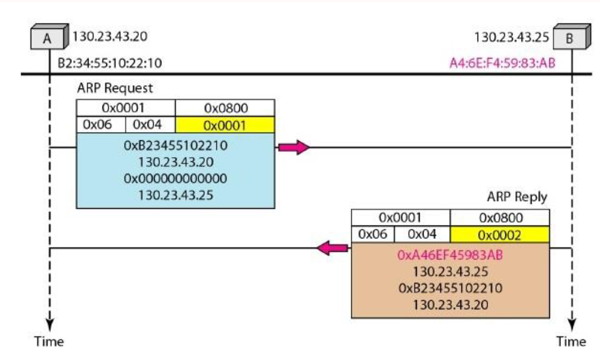

ತಾಂತ್ರಿಕ ವಿವರಣೆ

ವಿಳಾಸ

ಸಂಪನ್ಮೂಲ ಪ್ರೋಟೋಕಾಲ್ (ARP)

**ಎತರ್ನೆಟ್ ವಿಳಾಸ ರೆಸಲ್ಯೂಶನ್ ಪ್ರೊಟೊಕಾಲ್**

**- ಅಥವಾ -**

**ನೆಟ್‌ವರ್ಕ್ ಪ್ರೊಟೊಕಾಲ್ ವಿಳಾಸಗಳನ್ನು ಪರಿವರ್ತಿಸಲಾಗುತ್ತಿದೆ**

[[https://tools.ietf.org/html/rfc826]{.ul}](https://www.google.com/url?q=https%3A%2F%2Ftools.ietf.org%2Fhtml%2Frfc826&sa=D&sntz=1&usg=AFQjCNHSlGxJe18c1VJeIV6ePn4xPAj3rA)

> ಇಂದಿನ ಜಗತ್ತಿನಲ್ಲಿ ನಿಸ್ಸಂದೇಹವಾಗಿ ಕಂಪ್ಯೂಟರ್ ನೆಟ್ವರ್ಕಿಂಗ್ ತಂತ್ರಜ್ಞಾನದಲ್ಲಿ
> ಬಳಸಲಾಗುವ ಅತ್ಯಂತ ಜನಪ್ರಿಯ ತಂತ್ರಜ್ಞಾನ ಈಥರ್ನೆಟ್. ಇದರ ಗಮನಾರ್ಹ
> ವೈಶಿಷ್ಟ್ಯವೆಂದರೆ ಅದು ಹೆಚ್ಚಿನ ಕಾರ್ಯಕ್ಷಮತೆಯ ಬಾಳಿಕೆ ವೈಶಿಷ್ಟ್ಯವನ್ನು
> ಒದಗಿಸುತ್ತದೆ. ಇದು ಏಕಾಕ್ಷ ಕೇಬಲ್‌ಗಳು, ನೆಟ್‌ವರ್ಕ್ ಇಂಟರ್ಫೇಸ್ ಕಾರ್ಡ್
> (ಎನ್‌ಐಸಿ) ಮುಂತಾದ ಭೌತಿಕ ಮಾಧ್ಯಮವನ್ನು ಬಳಸಿಕೊಂಡು 10/100 ಎಮ್‌ಬಿಪಿಎಸ್
> ಇತ್ಯಾದಿ ದರದಲ್ಲಿ ಡೇಟಾವನ್ನು ರವಾನಿಸುವ ಸಹ-ಸಂಬಂಧಿತ ಉತ್ತಮವಾಗಿ ವ್ಯಾಖ್ಯಾನಿಸಲಾದ
> ಪ್ರೋಟೋಕಾಲ್‌ಗಳ ಕುಟುಂಬವಾಗಿದೆ.
>
> ಎತರ್ನೆಟ್ ತಂತ್ರಜ್ಞಾನದಲ್ಲಿನ ಮಾಹಿತಿಯನ್ನು ಭೌತಿಕ ಮಾಧ್ಯಮವನ್ನು ಪ್ಯಾಕೆಟ್‌ಗಳ
> ರೂಪದಲ್ಲಿ ಕಳುಹಿಸಲಾಗುತ್ತದೆ. ಪ್ಯಾಕೆಟ್ ಗಾತ್ರವನ್ನು ಅವಲಂಬಿಸಿ, ಅದರಲ್ಲಿರುವ
> ಡೇಟಾವನ್ನು ಮುರಿದು ಸಣ್ಣ ಚೌಕಟ್ಟುಗಳಲ್ಲಿ ಸುತ್ತಿ ನಂತರ ಗಮ್ಯಸ್ಥಾನಕ್ಕೆ
> ಕಳುಹಿಸಬಹುದು ಮತ್ತು ಅದನ್ನು ಮತ್ತೆ ಜೋಡಿಸಬಹುದು. ಕಳುಹಿಸುವವರ ಎನ್‌ಐಸಿ ಬಳಸಿ
> ತಂತಿಯ ಮೇಲೆ ಈ ಚೌಕಟ್ಟುಗಳನ್ನು ಬರೆಯಲಾಗುತ್ತದೆ. ಈ ಪ್ಯಾಕೆಟ್‌ಗಳನ್ನು
> ನೆಟ್‌ವರ್ಕ್‌ನಲ್ಲಿ ಸಂಪರ್ಕಿಸಬೇಕಾದ ಸ್ವೀಕರಿಸುವವರಿಗಾಗಿ ಕಳುಹಿಸುವವರು
> ರಚಿಸುತ್ತಾರೆ. ಪ್ಯಾಕೆಟ್ ತನ್ನ ಗಮ್ಯಸ್ಥಾನವನ್ನು ತಲುಪಲು ರೂಟರ್‌ಗಳು ಅಥವಾ
> ಸ್ವಿಚ್‌ಗಳ ಮೂಲಕ ಪ್ರಯಾಣಿಸಬಹುದು. ಪ್ರೋಟೋಕಾಲ್ ಎರಡು ನೆಟ್‌ವರ್ಕ್ ಗುರುತುಗಳ
> ನಡುವಿನ ಸಂವಹನಕ್ಕಾಗಿ ನಿಯಮಗಳ ಗುಂಪನ್ನು ವ್ಯಾಖ್ಯಾನಿಸುತ್ತದೆ. ಕಳುಹಿಸುವವರು
> ಮತ್ತು ಸ್ವೀಕರಿಸುವವರ ನಡುವೆ ಇರುವ ಇತರ ನೆಟ್‌ವರ್ಕಿಂಗ್ ಸಾಧನವು ಪ್ರಕ್ರಿಯೆಗಾಗಿ ಈ
> ಪ್ಯಾಕೆಟ್‌ಗಳನ್ನು ತೆಗೆದುಕೊಳ್ಳುವುದಿಲ್ಲ ಎಂಬುದನ್ನು ಗಮನಿಸಿ. ಆದ್ದರಿಂದ, ನಮಗೆ
> ಪ್ರೋಟೋಕಾಲ್ ಅಗತ್ಯವಿರುತ್ತದೆ, ಅಲ್ಲಿ \<ಪ್ರೋಟೋಕಾಲ್ ಪ್ರಕಾರ, ಪ್ರೋಟೋಕಾಲ್
> ವಿಳಾಸ\> ಅದರ ಆಧಾರದ ಮೇಲೆ ಅದು ಕಳುಹಿಸುವವರಿಂದ ರಿಸೀವರ್‌ಗೆ ಮಾತ್ರ ಸಾಗಬೇಕು.

**ಅಮೂರ್ತ:**

> ಒಂದೇ ನೆಟ್‌ವರ್ಕ್‌ನಲ್ಲಿ ಎ ಮತ್ತು ಬಿ ಎರಡು ನೆಟ್‌ವರ್ಕಿಂಗ್ ಸಾಧನಗಳಿವೆ ಮತ್ತು
> ಕೆಳಗಿನ ಗುಣಲಕ್ಷಣಗಳನ್ನು ಹೊಂದಿವೆ ಎಂದು ನಾವು Let ಹಿಸೋಣ:
>
> ಸಾಧನ ಎ:
>
> MAC = M (A)
>
> ಐಪಿ = ಐ (ಎ)
>
> ಸಾಧನ ಬಿ:
>
> MAC = M (B)
>
> ಐಪಿ = ಐ (ಬಿ)
>
> ಈಗ ಎ ಬಿ ಗೆ ಸಂವಹನ ಮಾಡಲು ಬಯಸಿದೆ ಮತ್ತು ಬಿ ಯ ಐಪಿ ಆಸ್ತಿಯನ್ನು ಮಾತ್ರ
> ತಿಳಿದಿದೆ. I (B) ಅನ್ನು M (B) ಗೆ ನಕ್ಷೆ ಮಾಡಲು A ತನ್ನ ಪ್ರೋಟೋಕಾಲ್ ಸ್ಟಾಕ್
> ARP ಮಾಡ್ಯೂಲ್ ಅನ್ನು ಸಂಪರ್ಕಿಸುತ್ತದೆ. ಆದ್ದರಿಂದ A ನ ARP ಮಾಡ್ಯೂಲ್
> ನೆಟ್‌ವರ್ಕ್‌ನಲ್ಲಿ ಪ್ರಸಾರ ಪ್ಯಾಕೆಟ್‌ ಅನ್ನು ಕಳುಹಿಸುತ್ತದೆ, ಅದರ B ಸಾಧನವು ಅದರ
> MAC ವಿವರಗಳೊಂದಿಗೆ ಪ್ರತಿಕ್ರಿಯಿಸುತ್ತದೆ. ಈಗ A ನ ARP ಮಾಡ್ಯೂಲ್‌ಗಳು ಈ
> ವಿವರಗಳನ್ನು ತಂತಿಯ ಮೇಲೆ ಕಳುಹಿಸಲು ಈಥರ್ನೆಟ್ ಪ್ಯಾಕೆಟ್ ರಚಿಸಲು ಬಳಸುತ್ತವೆ.
>
> ಟಿಪ್ಪಣಿಗಳು:
>
> ವಿಳಾಸ ರೆಸಲ್ಯೂಶನ್ ಪ್ರೊಟೊಕಾಲ್ (ಎಆರ್ಪಿ) ಟಿಸಿಪಿ / ಐಪಿ ಸೂಟ್‌ನಲ್ಲಿನ ಪ್ರಮುಖ
> ಪ್ರೋಟೋಕಾಲ್‌ಗಳಲ್ಲಿ ಒಂದಾಗಿದೆ, ಐಪಿವಿ 4 ವಿಳಾಸವನ್ನು (32-ಬಿಟ್ ಲಾಜಿಕಲ್ ವಿಳಾಸ)
> ಭೌತಿಕ ವಿಳಾಸಕ್ಕೆ (48-ಬಿಟ್ ಮ್ಯಾಕ್ ವಿಳಾಸ) ನಕ್ಷೆ ಮಾಡುವ ಉದ್ದೇಶವನ್ನು
> ಹೊಂದಿದೆ. MAC ವಿಳಾಸಕ್ಕೆ ತಾರ್ಕಿಕ ಹೆಸರುಗಳನ್ನು ಪರಿಹರಿಸಲು ನೆಟ್‌ವರ್ಕ್
> ಸಾಧನಗಳಿಗೆ ತಾರ್ಕಿಕ ಹೆಸರು ಮತ್ತು ಕೆಳ ಹಂತ ಅಥವಾ ಪ್ರೋಟೋಕಾಲ್‌ಗಳನ್ನು
> ನಿಗದಿಪಡಿಸಲಾಗಿದೆ. ಅಪ್ಲಿಕೇಶನ್ ಲೇಯರ್‌ನಲ್ಲಿನ ನೆಟ್‌ವರ್ಕ್ ಅಪ್ಲಿಕೇಶನ್‌ಗಳು
> ಮತ್ತೊಂದು ಸಾಧನದೊಂದಿಗೆ ಸಂವಹನ ನಡೆಸಲು ಐಪಿವಿ 4 ವಿಳಾಸವನ್ನು ಬಳಸುತ್ತವೆ.
> ಆದಾಗ್ಯೂ, ಡೇಟಾ ಲಿಂಕ್ ಲೇಯರ್‌ನಲ್ಲಿ, ವಿಳಾಸವನ್ನು ಬಳಸುವ ಮೋಡ್ MAC ವಿಳಾಸ
> (48-ಬಿಟ್ ಭೌತಿಕ ವಿಳಾಸ) ಆಗಿದೆ, ಇದನ್ನು ನೆಟ್‌ವರ್ಕ್ ಕಾರ್ಡ್‌ನಲ್ಲಿ ಶಾಶ್ವತವಾಗಿ
> ಸುಡಲಾಗುತ್ತದೆ. ವಿಳಾಸ ರೆಸಲ್ಯೂಶನ್ ಪ್ರೊಟೊಕಾಲ್ (ಎಆರ್ಪಿ) ಯ ಉದ್ದೇಶವು ನಿಮ್ಮ
> ಲೋಕಲ್ ಏರಿಯಾ ನೆಟ್‌ವರ್ಕ್ (ಲ್ಯಾನ್) ನಲ್ಲಿರುವ ಸಾಧನದ ಎಂಎಸಿ ವಿಳಾಸವನ್ನು
> ಅನುಗುಣವಾದ ಐಪಿವಿ 4 ವಿಳಾಸಕ್ಕಾಗಿ ಕಂಡುಹಿಡಿಯುವುದು, ಯಾವ ನೆಟ್‌ವರ್ಕ್
> ಅಪ್ಲಿಕೇಶನ್ ಸಂವಹನ ಮಾಡಲು ಪ್ರಯತ್ನಿಸುತ್ತಿದೆ.

**ಸಮಸ್ಯೆ:**

> ಕಂಪ್ಯೂಟರ್ ನೆಟ್‌ವರ್ಕಿಂಗ್ ಅಸ್ತಿತ್ವಕ್ಕೆ ಬಂದಾಗಿನಿಂದ ವಿಭಿನ್ನ ಮಾರಾಟಗಾರರಿಂದ
> ಒದಗಿಸಲ್ಪಟ್ಟ ಮತ್ತು ಒದಗಿಸಿದಂತೆ ವಿಭಿನ್ನ ಇಂಟರ್ಫೇಸ್ ಹೊಂದಿರುವ ಹಲವು ರೀತಿಯ
> ನೆಟ್‌ವರ್ಕಿಂಗ್ ಸಾಧನಗಳಿವೆ. ಮೊದಲೇ ಚರ್ಚಿಸಿದಂತೆ ಅವರು ಚೌಕಟ್ಟುಗಳ ಮೂಲಕ ಸಂವಹನ
> ಮಾಡಬೇಕಾಗುತ್ತದೆ, ಅದನ್ನು ಈಗ ಒಂದು ಪ್ರಕಾರವಾಗಿ ವರ್ಗೀಕರಿಸಬಹುದು - ಒಂದು
> ಪ್ಯಾಕೆಟ್ ಅನ್ನು ಇನ್ನೊಂದರಿಂದ ಪ್ರತ್ಯೇಕಿಸುತ್ತದೆ. ನೆಟ್ವರ್ಕ್ನಲ್ಲಿ ಇತರ
> ವಿಭಿನ್ನ ರೀತಿಯ ಪ್ರೋಟೋಕಾಲ್ಗಳು ಮತ್ತು ಯಂತ್ರಾಂಶಗಳಿವೆ ಮತ್ತು ಅವುಗಳೆಲ್ಲಕ್ಕೂ
> ನಿರ್ದಿಷ್ಟ ದರದಲ್ಲಿ ಪ್ಯಾಕೆಟ್ಗಳನ್ನು ರವಾನಿಸಲು ಕೇಬಲ್ಗಳು ಬೇಕಾಗುತ್ತವೆ
> ಎಂಬುದನ್ನು ಗಮನಿಸಿ. ಪ್ರೋಟೋಕಾಲ್ ವಿಳಾಸವು 48-ಬಿಟ್ ವಿಳಾಸವಾಗಿರಬಹುದು ಅಥವಾ
> ಇರಬಹುದು - ಅವು 8 ಬಿಟ್‌ಗಳಿಂದ 48 ಬಿಟ್‌ಗಳ ವಿಳಾಸಗಳಿಗೆ ಬದಲಾಗಬಹುದು. 10Mbit
> ಈಥರ್ನೆಟ್ ನೆಟ್‌ವರ್ಕ್ ಈ ಎಲ್ಲಾ ಪ್ರೋಟೋಕಾಲ್‌ಗಳನ್ನು (ಮತ್ತು ಹೆಚ್ಚಿನವುಗಳನ್ನು)
> ಈಥರ್ನೆಟ್ ಪ್ಯಾಕೆಟ್ ಹೆಡರ್‌ನಲ್ಲಿನ ಒಂದು ಟೈಪ್ ಫೀಲ್ಡ್ ಮೂಲಕ ಒಂದೇ ಕೇಬಲ್‌ನಲ್ಲಿ
> ಸಹಬಾಳ್ವೆ ನಡೆಸಲು ಅನುಮತಿಸುತ್ತದೆ.
>
> \<ಪ್ರೋಟೋಕಾಲ್, ವಿಳಾಸ\> ಜೋಡಿ ಮತ್ತು 48-ಬಿಟ್ ಈಥರ್ನೆಟ್ ವಿಳಾಸದ ನಡುವಿನ
> ಪತ್ರವ್ಯವಹಾರಗಳನ್ನು ಕ್ರಿಯಾತ್ಮಕವಾಗಿ ವಿತರಿಸಲು ಪ್ರೋಟೋಕಾಲ್ ಅಗತ್ಯವಿದೆ. ಸ್ಥಳೀಯ
> ಪ್ರದೇಶದೊಳಗಿನ ಡೇಟಾ ಲಿಂಕ್ ಲೇಯರ್ (ಒಎಸ್ಐನ ಲೇಯರ್ 2) ಅಥವಾ ಸಂಪರ್ಕಿತ ಸಾಧನಗಳ
> ಪಾಯಿಂಟ್-ಟು-ಪಾಯಿಂಟ್ ಲಿಂಕ್ ನೆಟ್‌ವರ್ಕ್‌ನಲ್ಲಿ ARP ಅನ್ನು
> ಬಳಸಲಾಗುತ್ತದೆ. ಈಥರ್ನೆಟ್ ಬೆಂಬಲಿತ ನೆಟ್‌ವರ್ಕ್ ಸಾಧನಗಳಲ್ಲಿನ MAC ವಿಳಾಸಗಳು
> ಸ್ಥಿರ 6-ಬೈಟ್ (48-ಬಿಟ್). ಐಪಿ ವಿಳಾಸಗಳು ಯಾವುದೇ ಇಂಟರ್ಫೇಸ್‌ಗೆ ಸ್ಥಿರ
> ಸಂರಚನೆಯಾಗಿಲ್ಲ. ಸಾಧನಗಳನ್ನು ಐಪಿ ವಿಳಾಸದೊಂದಿಗೆ ಹಸ್ತಚಾಲಿತವಾಗಿ ಕಾನ್ಫಿಗರ್
> ಮಾಡಬಹುದು ಅಥವಾ ಅವು ನೆಟ್‌ವರ್ಕ್‌ನಲ್ಲಿರುವ ಡೈನಾಮಿಕ್ ಹೋಸ್ಟ್ ಕಾನ್ಫಿಗರೇಶನ್
> ಪ್ರೊಟೊಕಾಲ್ (ಡಿಎಚ್‌ಸಿಪಿ) ಸರ್ವರ್‌ನಿಂದ ಒಂದನ್ನು ಪಡೆಯಬಹುದು. ಗಮ್ಯಸ್ಥಾನ ಐಪಿ
> ಪ್ಯಾಕೆಟ್ ಮಾಹಿತಿ ಲಭ್ಯವಿಲ್ಲದಿದ್ದಾಗ ಗಮನಿಸಿ ನೆಟ್‌ವರ್ಕ್ / ಹೋಸ್ಟ್ ಐಡಿಗಳ
> ಆಧಾರದ ಮೇಲೆ ಈ ಎತರ್ನೆಟ್ ಪ್ಯಾಕೆಟ್‌ಗಳನ್ನು ನೆಟ್‌ವರ್ಕ್ ಗೇಟ್‌ವೇಗೆ
> ರವಾನಿಸಲಾಗುತ್ತದೆ.

**ಚಲನೆ:**

> ಅದರ ವಿಶ್ವಾಸಾರ್ಹತೆ / ವೇಗದ ವೈಶಿಷ್ಟ್ಯಗಳಿಂದಾಗಿ, ಈಥರ್ನೆಟ್ ಬಳಕೆಯಲ್ಲಿರುವ
> ಅತ್ಯಂತ ಜನಪ್ರಿಯ ನೆಟ್‌ವರ್ಕಿಂಗ್ ಪ್ರೋಟೋಕಾಲ್ ಆಗಿ ಮಾರ್ಪಟ್ಟಿದೆ. ಹೆಚ್ಚು ಹೆಚ್ಚು
> ಪ್ರೋಟೋಕಾಲ್‌ಗಳನ್ನು ಅದರ ಸ್ಟ್ಯಾಕ್‌ಗೆ ಅಳವಡಿಸಲಾಯಿತು. ಇನ್ನೂ ಇತರ ಮಾರಾಟಗಾರರು
> ತಮ್ಮದೇ ಆದ ವಿಳಾಸ ರೆಸಲ್ಯೂಶನ್ ಪ್ರೋಟೋಕಾಲ್ ಅನ್ನು ಹೊಂದಬಹುದು. ಅವರು ಈ
> ವೈಶಿಷ್ಟ್ಯವನ್ನು ಪ್ರಮಾಣಿತ ರೂಪದಲ್ಲಿ ಒದಗಿಸುತ್ತಾರೆ, ಅಂದರೆ ಮಾರಾಟಗಾರರ
> ನಿರ್ದಿಷ್ಟ ಸಾಧನಗಳು ಯಾವುದೇ ಮಾರ್ಪಾಡುಗಳ ಅಗತ್ಯವಿಲ್ಲದೇ ಅದನ್ನು
> ಮಾಡಬಹುದು. ಆದ್ದರಿಂದ ನಾವು ಭಿನ್ನಜಾತಿಯ ಸಾಧನ ಸೆಟಪ್ ನೆಟ್‌ವರ್ಕ್ ಹೊಂದಬಹುದು
> ಆದರೆ ಅವುಗಳ ನಡುವೆ ಫ್ರೇಮ್ ಕಳುಹಿಸಲು ಅಥವಾ ಸ್ವೀಕರಿಸಲು ಅವಕಾಶ ಮಾಡಿಕೊಡಬಹುದು.

**ವ್ಯಾಖ್ಯಾನ:**

> ವಿಳಾಸ ರೆಸಲ್ಯೂಶನ್ ಪ್ರೊಟೊಕಾಲ್ (ಎಆರ್ಪಿ) ಟಿಸಿಪಿ / ಐಪಿ ಸೂಟ್‌ನಲ್ಲಿನ ಪ್ರಮುಖ
> ಪ್ರೋಟೋಕಾಲ್ ಆಗಿದೆ ಮತ್ತು ವಿಳಾಸ ರೆಸಲ್ಯೂಶನ್ ಪ್ರೊಟೊಕಾಲ್ (ಎಆರ್‌ಪಿ) ಯ
> ಉದ್ದೇಶವೆಂದರೆ ಐಪಿವಿ 4 ವಿಳಾಸವನ್ನು (32-ಬಿಟ್ ಲಾಜಿಕಲ್ ವಿಳಾಸ) ಭೌತಿಕ
> ವಿಳಾಸಕ್ಕೆ (48 ಬಿಟ್ ಮ್ಯಾಕ್ ವಿಳಾಸ) ನಕ್ಷೆ ಮಾಡುವುದು. ). ಅಪ್ಲಿಕೇಶನ್
> ಲೇಯರ್‌ನಲ್ಲಿನ ನೆಟ್‌ವರ್ಕ್ ಅಪ್ಲಿಕೇಶನ್‌ಗಳು ಮತ್ತೊಂದು ಸಾಧನದೊಂದಿಗೆ ಸಂವಹನ
> ನಡೆಸಲು ಐಪಿವಿ 4 ವಿಳಾಸವನ್ನು ಬಳಸುತ್ತವೆ. ಆದರೆ ಡೇಟಾ ಲಿಂಕ್ ಲೇಯರ್‌ನಲ್ಲಿ,
> ವಿಳಾಸವು MAC ವಿಳಾಸ (48-ಬಿಟ್ ಭೌತಿಕ ವಿಳಾಸ), ಮತ್ತು ಈ ವಿಳಾಸವನ್ನು ನೆಟ್‌ವರ್ಕ್
> ಕಾರ್ಡ್‌ನಲ್ಲಿ ಶಾಶ್ವತವಾಗಿ ಸುಡಲಾಗುತ್ತದೆ.
>
> ವಿಳಾಸ ರೆಸಲ್ಯೂಶನ್ ಪ್ರೊಟೊಕಾಲ್ (ಎಆರ್ಪಿ) ಯ ಉದ್ದೇಶವು ನಿಮ್ಮ ಲೋಕಲ್ ಏರಿಯಾ
> ನೆಟ್‌ವರ್ಕ್ (ಲ್ಯಾನ್) ನಲ್ಲಿರುವ ಸಾಧನದ ಎಂಎಸಿ ವಿಳಾಸವನ್ನು, ಅನುಗುಣವಾದ ಐಪಿವಿ 4
> ವಿಳಾಸಕ್ಕಾಗಿ ಕಂಡುಹಿಡಿಯುವುದು, ಯಾವ ನೆಟ್‌ವರ್ಕ್ ಅಪ್ಲಿಕೇಶನ್ ಸಂವಹನ ಮಾಡಲು
> ಪ್ರಯತ್ನಿಸುತ್ತಿದೆ.

**ARP ಯ ಇತಿಹಾಸ:**

> ಎಆರ್ಪಿಯನ್ನು ಮೊದಲು 1982 ರ ನವೆಂಬರ್‌ನಲ್ಲಿ ಡೇವಿಡ್ ಸಿ. ಪ್ಲಮ್ಮರ್ ಪ್ರಕಟಿಸಿದ
> ರಿಕ್ವೆಸ್ಟ್ ಫಾರ್ ಕಾಮೆಂಟ್ಸ್ (ಆರ್‌ಎಫ್‌ಸಿ) 826 ರಲ್ಲಿ ಪ್ರಸ್ತಾಪಿಸಲಾಯಿತು
> ಮತ್ತು ಚರ್ಚಿಸಲಾಯಿತು. ಐಪಿ ಪ್ರೋಟೋಕಾಲ್ ಸೂಟ್‌ನ ಆರಂಭಿಕ ದಿನಗಳಲ್ಲಿ ವಿಳಾಸ
> ರೆಸಲ್ಯೂಶನ್‌ನ ಸಮಸ್ಯೆ ತಕ್ಷಣವೇ ಸ್ಪಷ್ಟವಾಯಿತು, ಏಕೆಂದರೆ ಈಥರ್ನೆಟ್ ತ್ವರಿತವಾಗಿ
> ಆದ್ಯತೆಯ ಲ್ಯಾನ್ ತಂತ್ರಜ್ಞಾನವಾಯಿತು ಮತ್ತು ಈಥರ್ನೆಟ್ ಕೇಬಲ್‌ಗಳಿಗೆ 48-ಬಿಟ್
> ವಿಳಾಸಗಳು ಬೇಕಾಗುತ್ತವೆ.
>
> ಈ ಪ್ರೋಟೋಕಾಲ್ ಅನ್ನು ಇನ್ನೂ ಸಾಮಾನ್ಯ ಬಳಕೆಯಲ್ಲಿರುವ ಇಂಟರ್ನೆಟ್
> ಆರ್‌ಎಫ್‌ಸಿಗಳಲ್ಲಿ ವಿವರಿಸಲಾಗಿದೆ: ಆರ್‌ಎಫ್‌ಸಿ 826, ಆನ್ ಎತರ್ನೆಟ್ ವಿಳಾಸ
> ರೆಸಲ್ಯೂಶನ್ ಪ್ರೊಟೊಕಾಲ್, 1982 ರಲ್ಲಿ ಪ್ರಕಟವಾಯಿತು.
>
> ARP ಅನ್ನು ಮೂಲತಃ ಈಥರ್ನೆಟ್ಗಾಗಿ ಅಭಿವೃದ್ಧಿಪಡಿಸಲಾಗಿದೆ ಎಂದು ಹೆಸರು
> ಸ್ಪಷ್ಟಪಡಿಸುತ್ತದೆ. ಆದ್ದರಿಂದ, ಇದು ಅತ್ಯಂತ ಜನಪ್ರಿಯ ಲೇಯರ್ ಎರಡು ಲ್ಯಾನ್
> ಪ್ರೋಟೋಕಾಲ್ ಮತ್ತು ಅತ್ಯಂತ ಜನಪ್ರಿಯ ಲೇಯರ್ ಮೂರು ಇಂಟರ್ನೆಟ್ ವರ್ಕಿಂಗ್
> ಪ್ರೋಟೋಕಾಲ್ ನಡುವಿನ ಸಂಬಂಧವನ್ನು ಪ್ರತಿನಿಧಿಸುತ್ತದೆ-ಇದು ಎರಡು ದಶಕಗಳ ನಂತರವೂ
> ನಿಜ. ಆದಾಗ್ಯೂ, ಈಥರ್ನೆಟ್ ಐಪಿಯನ್ನು ಸಾಗಿಸುವ ಸಾಮಾನ್ಯ ಮಾರ್ಗವಾಗಿದ್ದರೂ ಸಹ, ಅದು
> ಒಂದೇ ಆಗಿರುವುದಿಲ್ಲ ಎಂಬುದು ಮೊದಲಿನಿಂದಲೂ ಸ್ಪಷ್ಟವಾಗಿತ್ತು. ಆದ್ದರಿಂದ,
> ಎಆರ್ಪಿಯನ್ನು ಐಪಿ ಯಿಂದ ಕೇವಲ ಎತರ್ನೆಟ್ ಮಾತ್ರವಲ್ಲದೆ ಹಲವಾರು ಇತರ ಡೇಟಾ ಲಿಂಕ್
> ಲೇಯರ್ ತಂತ್ರಜ್ಞಾನಗಳಿಗೆ ಪರಿಹರಿಸುವ ಸಾಮರ್ಥ್ಯವನ್ನು ಹೊಂದಿರುವ ಸಾಮಾನ್ಯ
> ಪ್ರೋಟೋಕಾಲ್ ಮಾಡಲಾಗಿದೆ.

**ಅವಲೋಕನ:**

> ಇಂಟರ್ನೆಟ್‌ವರ್ಕ್‌ನಲ್ಲಿ ಸಂವಹನಗಳನ್ನು ಸಶಕ್ತಗೊಳಿಸಲು ವಿಳಾಸ ರೆಸಲ್ಯೂಶನ್
> ಪ್ರೊಟೊಕಾಲ್ (ಎಆರ್‌ಪಿ) ಅನ್ನು ಅಭಿವೃದ್ಧಿಪಡಿಸಲಾಗಿದೆ ಮತ್ತು ಇದನ್ನು ಆರ್‌ಎಫ್‌ಸಿ
> 826 ನಿಂದ ನಿರೂಪಿಸಲಾಗಿದೆ. ಐಪಿ ನೆಟ್‌ವರ್ಕ್ ವಿಳಾಸಗಳನ್ನು ಮ್ಯಾಕ್ ಹಾರ್ಡ್‌ವೇರ್
> ವಿಳಾಸಗಳಿಗೆ ನಕ್ಷೆ ಮಾಡಲು ಲೇಯರ್ 3 ಗ್ಯಾಜೆಟ್‌ಗಳಿಗೆ ಎಆರ್‌ಪಿ ಅಗತ್ಯವಿರುತ್ತದೆ
> ಆದ್ದರಿಂದ ಐಪಿ ಕಟ್ಟುಗಳನ್ನು ವ್ಯವಸ್ಥೆಗಳಲ್ಲಿ ಕಳುಹಿಸಬಹುದು. ಸಾಧನವು ಮತ್ತೊಂದು
> ಸಾಧನಕ್ಕೆ ಡೇಟಾಗ್ರಾಮ್ ಕಳುಹಿಸುವ ಮೊದಲು, ಗೋಲ್ ಗ್ಯಾಜೆಟ್‌ಗಾಗಿ MAC ವಿಳಾಸ ಮತ್ತು
> ಸಂಬಂಧಿತ ಐಪಿ ವಿಳಾಸವಿದೆಯೇ ಎಂದು ಪರಿಶೀಲಿಸಲು ಅದರ ARP ಸಂಗ್ರಹದಲ್ಲಿ ಕಾಣುತ್ತದೆ.
> ಪ್ರವೇಶವಿಲ್ಲದಿರುವ ಅವಕಾಶದಲ್ಲಿ, ಮೂಲ ಗ್ಯಾಜೆಟ್ ಸಿಸ್ಟಮ್‌ನಲ್ಲಿನ ಪ್ರತಿ
> ಗ್ಯಾಜೆಟ್‌ಗೆ ಸಂವಹನ ಸಂದೇಶವನ್ನು ಕಳುಹಿಸುತ್ತದೆ. ಪ್ರತಿ ಗ್ಯಾಜೆಟ್ ಐಪಿ
> ವಿಳಾಸವನ್ನು ತನ್ನದೇ ಆದಂತೆ ನೋಡುತ್ತದೆ. ಸಮನ್ವಯಗೊಳಿಸುವ ಐಪಿ ವಿಳಾಸದೊಂದಿಗೆ
> ಗ್ಯಾಜೆಟ್ ಕಳುಹಿಸುವ ಗ್ಯಾಜೆಟ್‌ಗೆ ಗ್ಯಾಜೆಟ್‌ಗಾಗಿ MAC ವಿಳಾಸವನ್ನು ಹೊಂದಿರುವ
> ಬಂಡಲ್‌ನೊಂದಿಗೆ ಉತ್ತರಿಸುತ್ತದೆ (\"ಮಧ್ಯವರ್ತಿ ARP\" ಯ ಕಾರಣದಿಂದಾಗಿ).
>
> ಗಮ್ಯಸ್ಥಾನ ಸಾಧನವು ದೂರದ ವ್ಯವಸ್ಥೆಯಲ್ಲಿರುವಾಗ, ಇನ್ನೊಂದು ಲೇಯರ್ 3 ಸಾಧನವನ್ನು
> ಮೀರಿ, ಕಳುಹಿಸುವ ಸಾಧನವು ಡೀಫಾಲ್ಟ್ ಗೇಟ್‌ವೇಯ MAC ವಿಳಾಸಕ್ಕಾಗಿ ARP
> ಬೇಡಿಕೆಯನ್ನು ಕಳುಹಿಸುತ್ತದೆ ಎಂಬುದನ್ನು ಹೊರತುಪಡಿಸಿ ಕಾರ್ಯವಿಧಾನವು
> ಸಮಾನವಾಗಿರುತ್ತದೆ. ವಿಳಾಸವನ್ನು ಪರಿಹರಿಸಿದ ನಂತರ ಮತ್ತು ಡೀಫಾಲ್ಟ್ ಗೇಟ್‌ವೇ
> ಪ್ಯಾಕೆಟ್ ಪಡೆದ ನಂತರ, ಡೀಫಾಲ್ಟ್ ಗೇಟ್‌ವೇ ಗಮ್ಯಸ್ಥಾನದ ಐಪಿ ವಿಳಾಸವನ್ನು
> ಅದರೊಂದಿಗೆ ಸಂಯೋಜಿಸಲಾದ ವ್ಯವಸ್ಥೆಗಳ ಮೂಲಕ ಪ್ರಸಾರ ಮಾಡುತ್ತದೆ. ಗಮ್ಯಸ್ಥಾನ ಸಾಧನ
> ನೆಟ್‌ವರ್ಕ್‌ನಲ್ಲಿನ ಲೇಯರ್ 3 ಸಾಧನವು ಗಮ್ಯಸ್ಥಾನ ಸಾಧನದ MAC ವಿಳಾಸವನ್ನು ಪಡೆಯಲು
> ARP ಅನ್ನು ಬಳಸುತ್ತದೆ ಮತ್ತು ಪ್ಯಾಕೆಟ್ ಅನ್ನು ನೀಡುತ್ತದೆ.

**ಇದು ಹೇಗೆ ಕೆಲಸ ಮಾಡುತ್ತದೆ:**

> ಹೊಸ ಕಂಪ್ಯೂಟರ್ LAN ಗೆ ಸೇರಿದಾಗ, ಗುರುತಿಸುವಿಕೆ ಮತ್ತು ಸಂವಹನಕ್ಕಾಗಿ ಬಳಸಲು
> ಅನನ್ಯ IP ವಿಳಾಸವನ್ನು ನಿಗದಿಪಡಿಸಲಾಗಿದೆ. ನಿರ್ದಿಷ್ಟ LAN ನಲ್ಲಿ ಹೋಸ್ಟ್
> ಯಂತ್ರಕ್ಕಾಗಿ ಉದ್ದೇಶಿಸಲಾದ ಒಳಬರುವ ಪ್ಯಾಕೆಟ್ ಗೇಟ್‌ವೇಗೆ ಬಂದಾಗ, ಐಪಿ ವಿಳಾಸಕ್ಕೆ
> ಹೊಂದಿಕೆಯಾಗುವ MAC ವಿಳಾಸವನ್ನು ಕಂಡುಹಿಡಿಯಲು ಗೇಟ್‌ವೇ ARP ಪ್ರೋಗ್ರಾಂ ಅನ್ನು
> ಕೇಳುತ್ತದೆ. ARP ಸಂಗ್ರಹ ಎಂದು ಕರೆಯಲ್ಪಡುವ ಟೇಬಲ್ ಪ್ರತಿ ಐಪಿ ವಿಳಾಸ ಮತ್ತು ಅದರ
> ಅನುಗುಣವಾದ MAC ವಿಳಾಸದ (
> [[RFC5227]{.ul}](https://www.google.com/url?q=https%3A%2F%2Ftools.ietf.org%2Fhtml%2Frfc5227%23section-1.3&sa=D&sntz=1&usg=AFQjCNGGQNaGP6atAzMmhiHh4AUWOs6BDQ)
> ) ದಾಖಲೆಯನ್ನು ನಿರ್ವಹಿಸುತ್ತದೆ .
>
> IPv4 ಈಥರ್ನೆಟ್ ನೆಟ್‌ವರ್ಕ್‌ನಲ್ಲಿನ ಎಲ್ಲಾ ಆಪರೇಟಿಂಗ್ ಸಿಸ್ಟಮ್‌ಗಳು ARP
> ಸಂಗ್ರಹವನ್ನು ಇಡುತ್ತವೆ. LAN ನಲ್ಲಿರುವ ಮತ್ತೊಂದು ಹೋಸ್ಟ್‌ಗೆ ಪ್ಯಾಕೆಟ್
> ಕಳುಹಿಸಲು ಹೋಸ್ಟ್ ಪ್ರತಿ ಬಾರಿ MAC ವಿಳಾಸವನ್ನು ವಿನಂತಿಸಿದಾಗ, IP ನಿಂದ MAC
> ವಿಳಾಸ ಅನುವಾದವು ಈಗಾಗಲೇ ಅಸ್ತಿತ್ವದಲ್ಲಿದೆಯೇ ಎಂದು ನೋಡಲು ಅದರ ARP ಸಂಗ್ರಹವನ್ನು
> ಪರಿಶೀಲಿಸುತ್ತದೆ. ಅದು ಮಾಡಿದರೆ, ಹೊಸ ARP ವಿನಂತಿಯು ಅನಗತ್ಯವಾಗಿರುತ್ತದೆ.
> ಅನುವಾದವು ಈಗಾಗಲೇ ಅಸ್ತಿತ್ವದಲ್ಲಿಲ್ಲದಿದ್ದರೆ, ನಂತರ ನೆಟ್‌ವರ್ಕ್ ವಿಳಾಸಗಳಿಗಾಗಿ
> ವಿನಂತಿಯನ್ನು ಕಳುಹಿಸಲಾಗುತ್ತದೆ ಮತ್ತು ARP ಅನ್ನು ನಡೆಸಲಾಗುತ್ತದೆ.
>
> ARP LAN ನಲ್ಲಿನ ಎಲ್ಲಾ ಯಂತ್ರಗಳಿಗೆ ವಿನಂತಿಯ ಪ್ಯಾಕೆಟ್ ಅನ್ನು ಪ್ರಸಾರ
> ಮಾಡುತ್ತದೆ ಮತ್ತು ಯಾವುದೇ ಯಂತ್ರಗಳು ಆ ನಿರ್ದಿಷ್ಟ IP ವಿಳಾಸವನ್ನು ಬಳಸುತ್ತಿವೆ
> ಎಂದು ತಿಳಿದಿದೆಯೇ ಎಂದು ಕೇಳುತ್ತದೆ. ಯಂತ್ರವು ಐಪಿ ವಿಳಾಸವನ್ನು ತನ್ನದೇ ಎಂದು
> ಗುರುತಿಸಿದಾಗ, ಅದು ಉತ್ತರವನ್ನು ಕಳುಹಿಸುತ್ತದೆ ಆದ್ದರಿಂದ ARP ಭವಿಷ್ಯದ
> ಉಲ್ಲೇಖಕ್ಕಾಗಿ ಸಂಗ್ರಹವನ್ನು ನವೀಕರಿಸಬಹುದು ಮತ್ತು ಸಂವಹನದೊಂದಿಗೆ
> ಮುಂದುವರಿಯಬಹುದು.
>
> ತಮ್ಮದೇ ಆದ ಐಪಿ ವಿಳಾಸವನ್ನು ತಿಳಿದಿಲ್ಲದ ಹೋಸ್ಟ್ ಯಂತ್ರಗಳು ಆವಿಷ್ಕಾರಕ್ಕಾಗಿ
> ರಿವರ್ಸ್ ಎಆರ್ಪಿ (ಆರ್ಎಆರ್ಪಿ) ಪ್ರೋಟೋಕಾಲ್ ಅನ್ನು ಬಳಸಬಹುದು.
>
> ARP ಸಂಗ್ರಹ ಗಾತ್ರವು ಸೀಮಿತವಾಗಿದೆ ಮತ್ತು ಜಾಗವನ್ನು ಮುಕ್ತಗೊಳಿಸಲು
> ನಿಯತಕಾಲಿಕವಾಗಿ ಎಲ್ಲಾ ನಮೂದುಗಳನ್ನು ಶುದ್ಧೀಕರಿಸುತ್ತದೆ; ವಾಸ್ತವವಾಗಿ, ವಿಳಾಸಗಳು
> ಸಂಗ್ರಹದಲ್ಲಿ ಕೆಲವೇ ನಿಮಿಷಗಳು ಇರುತ್ತವೆ. ಭೌತಿಕ ಹೋಸ್ಟ್ ತಮ್ಮ ವಿನಂತಿಸಿದ ಐಪಿ
> ವಿಳಾಸವನ್ನು ಬದಲಾಯಿಸಿದಾಗ ಆಗಾಗ್ಗೆ ನವೀಕರಣಗಳು ನೆಟ್‌ವರ್ಕ್‌ನಲ್ಲಿರುವ ಇತರ
> ಸಾಧನಗಳನ್ನು ನೋಡಲು ಅನುಮತಿಸುತ್ತದೆ. ಶುಚಿಗೊಳಿಸುವ ಪ್ರಕ್ರಿಯೆಯಲ್ಲಿ, ಬಳಕೆಯಾಗದ
> ನಮೂದುಗಳನ್ನು ಅಳಿಸಲಾಗುತ್ತದೆ ಮತ್ತು ಪ್ರಸ್ತುತ ಚಾಲನೆಯಲ್ಲಿಲ್ಲದ
> ಕಂಪ್ಯೂಟರ್‌ಗಳೊಂದಿಗೆ ಸಂವಹನ ನಡೆಸಲು ಯಾವುದೇ ವಿಫಲ ಪ್ರಯತ್ನಗಳು

**ಪರಿಭಾಷೆ:**

> ಮ್ಯಾಪಿಂಗ್‌ನ ಎರಡು ವಿಧಗಳಿವೆ:
>
> 1\. ಸ್ಥಾಯೀ ನಕ್ಷೆ
>
> 2\. ಡೈನಾಮಿಕ್ ಮ್ಯಾಪಿಂಗ್

**ಸ್ಥಾಯೀ ನಕ್ಷೆ:**

> ಸ್ಥಾಯೀ ಮ್ಯಾಪಿಂಗ್ ಎಂದರೆ ತಾರ್ಕಿಕ ವಿಳಾಸವನ್ನು ಭೌತಿಕ ವಿಳಾಸದೊಂದಿಗೆ ಸಂಯೋಜಿಸುವ
> ಟೇಬಲ್ ಅನ್ನು ರಚಿಸುವುದು. ಈ ಟೇಬಲ್ ಅನ್ನು ನೆಟ್‌ವರ್ಕ್‌ನಲ್ಲಿರುವ ಪ್ರತಿಯೊಂದು
> ಯಂತ್ರದಲ್ಲಿ ಸಂಗ್ರಹಿಸಲಾಗಿದೆ
>
> ತಿಳಿದಿರುವ ಪ್ರತಿಯೊಂದು ಯಂತ್ರ, ಉದಾಹರಣೆಗೆ, ಮತ್ತೊಂದು ಯಂತ್ರದ ಐಪಿ ವಿಳಾಸ ಆದರೆ
> ಅದರ ಭೌತಿಕ ವಿಳಾಸವಲ್ಲ ಅದನ್ನು ಕೋಷ್ಟಕದಲ್ಲಿ ನೋಡಬಹುದು. ಇದು ಕೆಲವು ಮಿತಿಗಳನ್ನು
> ಹೊಂದಿದೆ ಏಕೆಂದರೆ ಭೌತಿಕ ವಿಳಾಸಗಳು ಈ ಕೆಳಗಿನ ವಿಧಾನಗಳಲ್ಲಿ ಬದಲಾಗಬಹುದು:
>
> Machine ಯಂತ್ರವು ತನ್ನ ಎನ್ಐಸಿಯನ್ನು ಬದಲಾಯಿಸಬಹುದು, ಇದರ ಪರಿಣಾಮವಾಗಿ ಹೊಸ
> ಭೌತಿಕ ವಿಳಾಸ ಬರುತ್ತದೆ.
>
> T ಲೋಕಲ್ ಟಾಕ್ ನಂತಹ ಕೆಲವು ಲ್ಯಾನ್ಗಳಲ್ಲಿ, ಕಂಪ್ಯೂಟರ್ ಆನ್ ಮಾಡಿದಾಗಲೆಲ್ಲಾ
> ಭೌತಿಕ ವಿಳಾಸವು ಬದಲಾಗುತ್ತದೆ.
>
> Computer ಮೊಬೈಲ್ ಕಂಪ್ಯೂಟರ್ ಒಂದು ಭೌತಿಕ ನೆಟ್‌ವರ್ಕ್‌ನಿಂದ ಇನ್ನೊಂದಕ್ಕೆ
> ಚಲಿಸಬಹುದು, ಇದರ ಪರಿಣಾಮವಾಗಿ ಅದರ ಭೌತಿಕ ವಿಳಾಸದಲ್ಲಿ ಬದಲಾವಣೆಯಾಗುತ್ತದೆ.
>
> ಈ ಬದಲಾವಣೆಗಳನ್ನು ಕಾರ್ಯಗತಗೊಳಿಸಲು, ಸ್ಥಿರ ಮ್ಯಾಪಿಂಗ್ ಟೇಬಲ್ ಅನ್ನು
> ನಿಯತಕಾಲಿಕವಾಗಿ ನವೀಕರಿಸಬೇಕು. ಈ ಓವರ್ಹೆಡ್ ನೆಟ್‌ವರ್ಕ್ ಕಾರ್ಯಕ್ಷಮತೆಯ ಮೇಲೆ
> ಪರಿಣಾಮ ಬೀರಬಹುದು.

**ಡೈನಾಮಿಕ್ ಮ್ಯಾಪಿಂಗ್:**

> ಡೈನಾಮಿಕ್ ಮ್ಯಾಪಿಂಗ್‌ನಲ್ಲಿ, ಪ್ರತಿ ಬಾರಿ ಯಂತ್ರವು ಮತ್ತೊಂದು ಯಂತ್ರದ ತಾರ್ಕಿಕ
> ವಿಳಾಸವನ್ನು ತಿಳಿದಿರುವಾಗ, ಅದು ಭೌತಿಕ ವಿಳಾಸವನ್ನು ಕಂಡುಹಿಡಿಯಲು ಪ್ರೋಟೋಕಾಲ್
> ಅನ್ನು ಬಳಸಬಹುದು. ಡೈನಾಮಿಕ್ ಮ್ಯಾಪಿಂಗ್ ಮಾಡಲು ಎರಡು ಪ್ರೋಟೋಕಾಲ್ಗಳನ್ನು
> ವಿನ್ಯಾಸಗೊಳಿಸಲಾಗಿದೆ: ವಿಳಾಸ ರೆಸಲ್ಯೂಶನ್ ಪ್ರೊಟೊಕಾಲ್ (ಎಆರ್ಪಿ) ಮತ್ತು ರಿವರ್ಸ್
> ಅಡ್ರೆಸ್ ರೆಸಲ್ಯೂಶನ್ ಪ್ರೊಟೊಕಾಲ್ (ಆರ್ಎಆರ್ಪಿ). ARP ತಾರ್ಕಿಕ ವಿಳಾಸವನ್ನು
> ಭೌತಿಕ ವಿಳಾಸಕ್ಕೆ ನಕ್ಷೆ ಮಾಡುತ್ತದೆ; RARP ಭೌತಿಕ ವಿಳಾಸವನ್ನು ತಾರ್ಕಿಕ
> ವಿಳಾಸಕ್ಕೆ ನಕ್ಷೆ ಮಾಡುತ್ತದೆ. RARP ಅನ್ನು ಮತ್ತೊಂದು ಪ್ರೋಟೋಕಾಲ್ನೊಂದಿಗೆ
> ಬದಲಾಯಿಸಲಾಗಿರುವುದರಿಂದ ಮತ್ತು ಆದ್ದರಿಂದ ನಿರ್ಲಕ್ಷಿಸಲಾಗುತ್ತದೆ, ಆದ್ದರಿಂದ ನಾವು
> ಈ ಡಾಕ್ಯುಮೆಂಟ್‌ನಲ್ಲಿ ARP ಪ್ರೊಟೊಕಾಲ್ ಅನ್ನು ಮಾತ್ರ ಚರ್ಚಿಸುತ್ತೇವೆ.

**ಆರ್ಪ್ ಕ್ಯಾಚಿಂಗ್:**

> ಇಂಟರ್ನೆಟ್ ವರ್ಕ್ ಮೂಲಕ ಕಳುಹಿಸಲಾದ ಪ್ರತಿ ಡೇಟಾಗ್ರಾಮ್ಗಾಗಿ ನೆಟ್ವರ್ಕ್ನಲ್ಲಿನ
> ಪ್ರತಿ ಹಾಪ್ (ಲೇಯರ್ 3 ಸಾಧನ) ದಲ್ಲಿ ಐಪಿ ವಿಳಾಸಗಳನ್ನು ಮಾಧ್ಯಮ ಪ್ರವೇಶ ನಿಯಂತ್ರಣ
> (ಎಂಎಸಿ) ವಿಳಾಸಗಳಿಗೆ ಮ್ಯಾಪಿಂಗ್ ಮಾಡುವುದರಿಂದ, ನೆಟ್‌ವರ್ಕ್‌ನ ಕಾರ್ಯಕ್ಷಮತೆಗೆ
> ಧಕ್ಕೆಯುಂಟಾಗಬಹುದು. ಪ್ರಸಾರವನ್ನು ಕಡಿಮೆ ಮಾಡಲು ಮತ್ತು ನೆಟ್‌ವರ್ಕ್ ಸಂಪನ್ಮೂಲಗಳ
> ವ್ಯರ್ಥ ಬಳಕೆಯನ್ನು ಮಿತಿಗೊಳಿಸಲು, ವಿಳಾಸ ರೆಸಲ್ಯೂಶನ್ ಪ್ರೊಟೊಕಾಲ್ (ಎಆರ್‌ಪಿ)
> ಹಿಡಿದಿಟ್ಟುಕೊಳ್ಳುವಿಕೆಯನ್ನು ಜಾರಿಗೆ ತರಲಾಯಿತು.
>
> ARP ಹಿಡಿದಿಟ್ಟುಕೊಳ್ಳುವಿಕೆಯು ನೆಟ್‌ವರ್ಕ್ ವಿಳಾಸಗಳನ್ನು ಮತ್ತು ಸಂಬಂಧಿತ
> ಡೇಟಾ-ಲಿಂಕ್ ವಿಳಾಸಗಳನ್ನು ಸ್ವಲ್ಪ ಸಮಯದವರೆಗೆ ಮೆಮೊರಿಯಲ್ಲಿ ಸಂಗ್ರಹಿಸುವ
> ವಿಧಾನವಾಗಿದೆ.
>
> ಪ್ರತಿ ಬಾರಿ ಡೇಟಾಗ್ರಾಮ್ ಕಳುಹಿಸಿದಾಗ ಅದೇ ವಿಳಾಸಕ್ಕಾಗಿ ಪ್ರಸಾರ ಮಾಡಲು
> ಅಮೂಲ್ಯವಾದ ನೆಟ್‌ವರ್ಕ್ ಸಂಪನ್ಮೂಲಗಳ ಬಳಕೆಯನ್ನು ಇದು ಕಡಿಮೆ ಮಾಡುತ್ತದೆ. ಸಂಗ್ರಹ
> ನಮೂದುಗಳನ್ನು ನಿರ್ವಹಿಸಬೇಕು ಏಕೆಂದರೆ ಮಾಹಿತಿಯು ಹಳತಾಗಬಹುದು, ಆದ್ದರಿಂದ ಸಂಗ್ರಹ
> ನಮೂದುಗಳು ನಿಯತಕಾಲಿಕವಾಗಿ ಮುಕ್ತಾಯಗೊಳ್ಳಲು ಹೊಂದಿಸಿರುವುದು ನಿರ್ಣಾಯಕ.
> ವಿಳಾಸಗಳನ್ನು ಪ್ರಸಾರ ಮಾಡಿದಂತೆ ನೆಟ್‌ವರ್ಕ್‌ನಲ್ಲಿನ ಪ್ರತಿಯೊಂದು ಸಾಧನವು ಅದರ
> ಕೋಷ್ಟಕಗಳನ್ನು ನವೀಕರಿಸುತ್ತದೆ.
>
> ಸ್ಥಿರ ARP ಸಂಗ್ರಹ ನಮೂದುಗಳು ಮತ್ತು ಕ್ರಿಯಾತ್ಮಕ ARP ಸಂಗ್ರಹ ನಮೂದುಗಳಿವೆ.
> ಸ್ಥಾಯೀ ನಮೂದುಗಳನ್ನು ಹಸ್ತಚಾಲಿತವಾಗಿ ಕಾನ್ಫಿಗರ್ ಮಾಡಲಾಗುತ್ತದೆ ಮತ್ತು ಸಂಗ್ರಹ
> ಕೋಷ್ಟಕದಲ್ಲಿ ಶಾಶ್ವತ ಆಧಾರದ ಮೇಲೆ ಇರಿಸಲಾಗುತ್ತದೆ. ಸಾಮಾನ್ಯವಾಗಿ ಒಂದೇ
> ನೆಟ್‌ವರ್ಕ್‌ನಲ್ಲಿ ನಿಯಮಿತವಾಗಿ ಇತರ ಸಾಧನಗಳೊಂದಿಗೆ ಸಂವಹನ ನಡೆಸಬೇಕಾದ ಸಾಧನಗಳಿಗೆ
> ಸ್ಥಾಯೀ ನಮೂದುಗಳು ಉತ್ತಮ. ಡೈನಾಮಿಕ್ ನಮೂದುಗಳನ್ನು ಸಿಸ್ಕೋ ಸಾಫ್ಟ್‌ವೇರ್‌ನಿಂದ
> ಸೇರಿಸಲಾಗುತ್ತದೆ, ಸ್ವಲ್ಪ ಸಮಯದವರೆಗೆ ಇರಿಸಲಾಗುತ್ತದೆ ಮತ್ತು ನಂತರ
> ತೆಗೆದುಹಾಕಲಾಗುತ್ತದೆ.

**ARP ಸಂಗ್ರಹದಲ್ಲಿ ಸ್ಥಾಯೀ ಮತ್ತು ಡೈನಾಮಿಕ್ ನಮೂದುಗಳು**

> ಸ್ಥಾಯೀ ರೂಟಿಂಗ್‌ಗೆ ನಿರ್ವಾಹಕರು ಪ್ರತಿ ಸಾಧನದ ಪ್ರತಿ ಇಂಟರ್ಫೇಸ್‌ಗೆ ಐಪಿ
> ವಿಳಾಸಗಳು, ಸಬ್‌ನೆಟ್ ಮುಖವಾಡಗಳು, ಗೇಟ್‌ವೇಗಳು ಮತ್ತು ಅನುಗುಣವಾದ ಮಾಧ್ಯಮ ಪ್ರವೇಶ
> ನಿಯಂತ್ರಣ (ಎಂಎಸಿ) ವಿಳಾಸಗಳನ್ನು ಹಸ್ತಚಾಲಿತವಾಗಿ ನಮೂದಿಸುವ ಅಗತ್ಯವಿದೆ. ಸ್ಥಾಯೀ
> ರೂಟಿಂಗ್ ಹೆಚ್ಚಿನ ನಿಯಂತ್ರಣವನ್ನು ಶಕ್ತಗೊಳಿಸುತ್ತದೆ ಆದರೆ ಟೇಬಲ್ ಅನ್ನು
> ನಿರ್ವಹಿಸಲು ಹೆಚ್ಚಿನ ಕೆಲಸ ಬೇಕಾಗುತ್ತದೆ. ಪ್ರತಿ ಬಾರಿ ಮಾರ್ಗಗಳನ್ನು ಸೇರಿಸಿದಾಗ
> ಅಥವಾ ಬದಲಾಯಿಸಿದಾಗ ಟೇಬಲ್ ಅನ್ನು ನವೀಕರಿಸಬೇಕು.
>
> ಡೈನಾಮಿಕ್ ರೂಟಿಂಗ್ ಪ್ರೋಟೋಕಾಲ್ಗಳನ್ನು ಬಳಸುತ್ತದೆ, ಅದು ನೆಟ್ವರ್ಕ್ನಲ್ಲಿನ
> ಸಾಧನಗಳನ್ನು ಪರಸ್ಪರ ರೂಟಿಂಗ್ ಟೇಬಲ್ ಮಾಹಿತಿಯನ್ನು ವಿನಿಮಯ ಮಾಡಿಕೊಳ್ಳಲು ಅನುವು
> ಮಾಡಿಕೊಡುತ್ತದೆ. ಟೇಬಲ್ ಅನ್ನು ನಿರ್ಮಿಸಲಾಗಿದೆ ಮತ್ತು ಸ್ವಯಂಚಾಲಿತವಾಗಿ
> ಬದಲಾಯಿಸಲಾಗುತ್ತದೆ. ಸಮಯದ ಮಿತಿಯನ್ನು ಸೇರಿಸದ ಹೊರತು ಯಾವುದೇ ಆಡಳಿತಾತ್ಮಕ
> ಕಾರ್ಯಗಳು ಅಗತ್ಯವಿಲ್ಲ, ಆದ್ದರಿಂದ ಸ್ಥಿರ ರೂಟಿಂಗ್‌ಗಿಂತ ಡೈನಾಮಿಕ್ ರೂಟಿಂಗ್
> ಹೆಚ್ಚು ಪರಿಣಾಮಕಾರಿಯಾಗಿದೆ. ಡೀಫಾಲ್ಟ್ ಸಮಯ ಮಿತಿ 4 ಗಂಟೆಗಳು. ಸಂಗ್ರಹದಿಂದ
> ಸಂಗ್ರಹಿಸಲಾದ ಮತ್ತು ಅಳಿಸಲಾದ ಹಲವಾರು ಮಾರ್ಗಗಳನ್ನು ನೆಟ್‌ವರ್ಕ್ ಹೊಂದಿದ್ದರೆ,
> ಸಮಯದ ಮಿತಿಯನ್ನು ಸರಿಹೊಂದಿಸಬೇಕು.

**ಪ್ರಾಕ್ಸಿ ARP**

> ಐಪಿ-ಟು-ಮ್ಯಾಕ್ ವಿಳಾಸಗಳನ್ನು ಪರಿಹರಿಸಲು ಅದೇ ಐಪಿ ನೆಟ್‌ವರ್ಕ್ ಅಥವಾ
> ಸಬ್‌ನೆಟ್‌ವರ್ಕ್‌ನಲ್ಲಿ ರೂಟರ್ ಸಂಪರ್ಕಿಸಿರುವ ಭೌತಿಕ ನೆಟ್‌ವರ್ಕ್ ವಿಭಾಗಗಳಾಗಿ
> ಬೇರ್ಪಡಿಸಲಾಗಿರುವ ಸಾಧನಗಳನ್ನು ಸಕ್ರಿಯಗೊಳಿಸಲು ಆರ್‌ಎಫ್‌ಸಿ 1027 ರಲ್ಲಿ
> ವ್ಯಾಖ್ಯಾನಿಸಿರುವಂತೆ ಪ್ರಾಕ್ಸಿ ವಿಳಾಸ ರೆಸಲ್ಯೂಶನ್ ಪ್ರೋಟೋಕಾಲ್ ಅನ್ನು
> ಕಾರ್ಯಗತಗೊಳಿಸಲಾಯಿತು. ಸಾಧನಗಳು ಒಂದೇ ಡೇಟಾ ಲಿಂಕ್ ಲೇಯರ್
> ನೆಟ್‌ವರ್ಕ್‌ನಲ್ಲಿಲ್ಲದಿದ್ದರೂ ಒಂದೇ ಐಪಿ ನೆಟ್‌ವರ್ಕ್‌ನಲ್ಲಿರುವಾಗ, ಅವು ಸ್ಥಳೀಯ
> ನೆಟ್‌ವರ್ಕ್‌ನಲ್ಲಿರುವಂತೆ ಪರಸ್ಪರ ಡೇಟಾವನ್ನು ರವಾನಿಸಲು ಪ್ರಯತ್ನಿಸುತ್ತವೆ.
>
> ಆದಾಗ್ಯೂ, ಸಾಧನಗಳನ್ನು ಬೇರ್ಪಡಿಸುವ ರೂಟರ್ ಪ್ರಸಾರ ಸಂದೇಶವನ್ನು ಕಳುಹಿಸುವುದಿಲ್ಲ
> ಏಕೆಂದರೆ ಮಾರ್ಗನಿರ್ದೇಶಕಗಳು ಯಂತ್ರಾಂಶ-ಪದರದ ಪ್ರಸಾರವನ್ನು ರವಾನಿಸುವುದಿಲ್ಲ.
> ಆದ್ದರಿಂದ, ವಿಳಾಸಗಳನ್ನು ಪರಿಹರಿಸಲಾಗುವುದಿಲ್ಲ.
>
> ಪ್ರಾಕ್ಸಿ ARP ಅನ್ನು ಪೂರ್ವನಿಯೋಜಿತವಾಗಿ ಸಕ್ರಿಯಗೊಳಿಸಲಾಗುತ್ತದೆ ಆದ್ದರಿಂದ
> ಸ್ಥಳೀಯ ನೆಟ್‌ವರ್ಕ್‌ಗಳ ನಡುವೆ ವಾಸಿಸುವ \"ಪ್ರಾಕ್ಸಿ ರೂಟರ್\" ಅದರ MAC
> ವಿಳಾಸದೊಂದಿಗೆ ಪ್ರತಿಕ್ರಿಯಿಸುತ್ತದೆ ಅದು ಪ್ರಸಾರವನ್ನು ತಿಳಿಸುವ ರೂಟರ್‌ನಂತೆ.
> ಕಳುಹಿಸುವ ಸಾಧನವು ಪ್ರಾಕ್ಸಿ ರೂಟರ್‌ನ MAC ವಿಳಾಸವನ್ನು ಸ್ವೀಕರಿಸಿದಾಗ, ಅದು
> ಡೇಟಾಗ್ರಾಮ್ ಅನ್ನು ಪ್ರಾಕ್ಸಿ ರೂಟರ್‌ಗೆ ಕಳುಹಿಸುತ್ತದೆ, ಅದು ಡೇಟಾಗ್ರಾಮ್ ಅನ್ನು
> ಗೊತ್ತುಪಡಿಸಿದ ಸಾಧನಕ್ಕೆ ಕಳುಹಿಸುತ್ತದೆ.

**ARP ಪ್ರೊಟೊಕಾಲ್ ರಚನೆ:**

{width="5.875in" height="2.45in"}

> ವಿಳಾಸ ರೆಸಲ್ಯೂಶನ್ ಪ್ರೊಟೊಕಾಲ್ (ಎಆರ್ಪಿ) ಸಂದೇಶ ಸ್ವರೂಪದಲ್ಲಿನ ಕ್ಷೇತ್ರಗಳು
> ಹೀಗಿವೆ:
>
> · ಹಾರ್ಡ್‌ವೇರ್ ಪ್ರಕಾರ: ಎಆರ್‌ಪಿ ಸಂದೇಶದಲ್ಲಿನ ಹಾರ್ಡ್‌ವೇರ್ ಟೈಪ್ ಕ್ಷೇತ್ರವು
> ಸ್ಥಳೀಯ ನೆಟ್‌ವರ್ಕ್ಗಾಗಿ ವಿಳಾಸ ರೆಸಲ್ಯೂಶನ್ ಪ್ರೊಟೊಕಾಲ್ (ಎಆರ್ಪಿ) ಸಂದೇಶವನ್ನು
> ರವಾನಿಸುವ ಯಂತ್ರಾಂಶದ ಪ್ರಕಾರವನ್ನು ನಿರ್ದಿಷ್ಟಪಡಿಸುತ್ತದೆ. ಎತರ್ನೆಟ್ ಸಾಮಾನ್ಯ
> ಹಾರ್ಡ್‌ವೇರ್ ಪ್ರಕಾರವಾಗಿದೆ ಮತ್ತು ಈಥರ್ನೆಟ್ಗೆ ಅವನು ಮೌಲ್ಯ 1 ಆಗಿದೆ. ಈ
> ಕ್ಷೇತ್ರದ ಗಾತ್ರವು 2 ಬೈಟ್‌ಗಳು.
>
> Ot ಶಿಷ್ಟಾಚಾರದ ಪ್ರಕಾರ: ಪ್ರತಿಯೊಂದು ಪ್ರೋಟೋಕಾಲ್‌ಗೆ ಈ ಕ್ಷೇತ್ರದಲ್ಲಿ ಬಳಸುವ
> ಸಂಖ್ಯೆಯನ್ನು ನಿಗದಿಪಡಿಸಲಾಗಿದೆ. ಐಪಿವಿ 4 2048 (ಹೆಕ್ಸಾಡೆಸಿಮಲ್‌ನಲ್ಲಿ
> 0x0800).
>
> · ಹಾರ್ಡ್‌ವೇರ್ ವಿಳಾಸದ ಉದ್ದ: ಹಾರ್ಡ್‌ವೇರ್ ವಿಳಾಸ ARP ಸಂದೇಶದಲ್ಲಿನ ಉದ್ದವು
> ಹಾರ್ಡ್‌ವೇರ್ (MAC) ವಿಳಾಸದ ಬೈಟ್‌ಗಳಲ್ಲಿ ಉದ್ದವಾಗಿದೆ. ಎತರ್ನೆಟ್ MAC ವಿಳಾಸಗಳು
> 6 ಬೈಟ್‌ಗಳಷ್ಟು ಉದ್ದವಾಗಿದೆ.
>
> · ಪ್ರೋಟೋಕಾಲ್ ವಿಳಾಸ ಉದ್ದ: ತಾರ್ಕಿಕ ವಿಳಾಸದ ಬೈಟ್‌ಗಳಲ್ಲಿ ಉದ್ದ (ಐಪಿವಿ 4
> ವಿಳಾಸ). ಐಪಿವಿ 4 ವಿಳಾಸಗಳು 4 ಬೈಟ್‌ಗಳಷ್ಟು ಉದ್ದವಾಗಿವೆ.
>
> · ಆಪ್ಕೋಡ್: ARP ಸಂದೇಶದಲ್ಲಿನ ಆಪ್ಕೋಡ್ ಕ್ಷೇತ್ರವು ARP ಸಂದೇಶದ ಸ್ವರೂಪವನ್ನು
> ಸೂಚಿಸುತ್ತದೆ. ARP ವಿನಂತಿಗಾಗಿ 1 ಮತ್ತು ARP ಪ್ರತ್ಯುತ್ತರಕ್ಕೆ 2.
>
> · ಕಳುಹಿಸುವವರ ಯಂತ್ರಾಂಶ ವಿಳಾಸ: ಸಂದೇಶವನ್ನು ಕಳುಹಿಸುವ ಸಾಧನದ ಲೇಯರ್ 2 (MAC
> ವಿಳಾಸ) ವಿಳಾಸ.
>
> · ಕಳುಹಿಸುವವರ ಪ್ರೋಟೋಕಾಲ್ ವಿಳಾಸ: ಸಂದೇಶವನ್ನು ಕಳುಹಿಸುವ ಸಾಧನದ ಪ್ರೋಟೋಕಾಲ್
> ವಿಳಾಸ (ಐಪಿವಿ 4 ವಿಳಾಸ)
>
> · ಟಾರ್ಗೆಟ್ ಹಾರ್ಡ್ವೇರ್ ವಿಳಾಸ: ಲೇಯರ್ 2 (MAC ವಿಳಾಸ) ಯು ಉದ್ದೇಶಿತ
> ರಿಸೀವರ್.

**ವೈರ್‌ಶಾರ್ಕ್‌ನಲ್ಲಿ ARP ರಚನೆ:**

{width="9.266666666666667in"
height="5.166666666666667in"}

> ಎನ್ಕ್ಯಾಪ್ಸುಲೇಷನ್:
>
> ಎಆರ್ಪಿ ಪ್ಯಾಕೆಟ್ ಅನ್ನು ನೇರವಾಗಿ ಡೇಟಾ ಲಿಂಕ್ ಫ್ರೇಮ್‌ಗೆ ಜೋಡಿಸಲಾಗುತ್ತದೆ.
> ಉದಾಹರಣೆಗೆ, ಕೆಳಗಿನ ಚಿತ್ರದಲ್ಲಿ, ಎಆರ್ಪಿ ಪ್ಯಾಕೆಟ್ ಅನ್ನು ಎತರ್ನೆಟ್
> ಫ್ರೇಮ್ನಲ್ಲಿ ಸುತ್ತುವರಿಯಲಾಗುತ್ತದೆ. ಫ್ರೇಮ್ ಹೊತ್ತೊಯ್ಯುವ ಡೇಟಾವು ARP
> ಪ್ಯಾಕೆಟ್ ಎಂದು ಟೈಪ್ ಫೀಲ್ಡ್ ಸೂಚಿಸುತ್ತದೆ ಎಂಬುದನ್ನು ಗಮನಿಸಿ.

{width="11.0in" height="3.775in"}

**ARP ವಿನಂತಿ ಮತ್ತು ಉತ್ತರಿಸಿ:**

> ವಿಶಿಷ್ಟ ಅಂತರ್ಜಾಲದಲ್ಲಿ ARP ಹೇಗೆ ಕಾರ್ಯನಿರ್ವಹಿಸುತ್ತದೆ ಎಂಬುದನ್ನು ನೋಡೋಣ.
> ಮೊದಲು ನಾವು ಒಳಗೊಂಡಿರುವ ಹಂತಗಳನ್ನು ವಿವರಿಸುತ್ತೇವೆ. ಆತಿಥೇಯ ಅಥವಾ ರೂಟರ್ ARP
> ಅನ್ನು ಬಳಸಬೇಕಾದ ನಾಲ್ಕು ಪ್ರಕರಣಗಳನ್ನು ನಾವು ಚರ್ಚಿಸುತ್ತೇವೆ:
>
> Send ಕಳುಹಿಸುವವರಿಗೆ ಗುರಿಯ ಐಪಿ ವಿಳಾಸ ತಿಳಿದಿದೆ.
>
> · ಐಆರ್ ಎಆರ್ಪಿ ವಿನಂತಿಯ ಸಂದೇಶವನ್ನು ರಚಿಸಲು ಎಆರ್ಪಿಯನ್ನು ಕೇಳುತ್ತದೆ,
> ಕಳುಹಿಸುವವರ ಭೌತಿಕ ವಿಳಾಸ, ಕಳುಹಿಸುವವರ ಐಪಿ ವಿಳಾಸ ಮತ್ತು ಗುರಿ ಐಪಿ ವಿಳಾಸವನ್ನು
> ಭರ್ತಿ ಮಾಡುತ್ತದೆ. ಗುರಿ ಭೌತಿಕ ವಿಳಾಸ ಕ್ಷೇತ್ರವು 0 ಸೆಗಳಿಂದ ತುಂಬಿರುತ್ತದೆ.
>
> ಸಂದೇಶವನ್ನು ಡೇಟಾ ಲಿಂಕ್ ಲೇಯರ್‌ಗೆ ರವಾನಿಸಲಾಗುತ್ತದೆ, ಅಲ್ಲಿ ಅದನ್ನು
> ಕಳುಹಿಸುವವರ ಭೌತಿಕ ವಿಳಾಸವನ್ನು ಮೂಲ ವಿಳಾಸವಾಗಿ ಮತ್ತು ಭೌತಿಕ ಪ್ರಸಾರ
> ವಿಳಾಸವನ್ನು ಗಮ್ಯಸ್ಥಾನ ವಿಳಾಸವಾಗಿ (
> [[RFC5227]{.ul}](https://www.google.com/url?q=https%3A%2F%2Ftools.ietf.org%2Fhtml%2Frfc5227%23section-2.4&sa=D&sntz=1&usg=AFQjCNGOIIihwwC9SPzKWmd6tGEfJmatvQ)
> ) ಬಳಸಿಕೊಂಡು ಚೌಕಟ್ಟಿನಲ್ಲಿ ಸುತ್ತುವರಿಯಲಾಗುತ್ತದೆ .

{width="11.225in" height="6.6in"}

> Host ಪ್ರತಿ ಹೋಸ್ಟ್ ಅಥವಾ ರೂಟರ್ ಫ್ರೇಮ್ ಅನ್ನು ಸ್ವೀಕರಿಸುತ್ತದೆ. ಫ್ರೇಮ್
> ಪ್ರಸಾರ ಗಮ್ಯಸ್ಥಾನ ವಿಳಾಸವನ್ನು ಹೊಂದಿರುವುದರಿಂದ, ಎಲ್ಲಾ ಕೇಂದ್ರಗಳು ಸಂದೇಶವನ್ನು
> ತೆಗೆದುಹಾಕಿ ಮತ್ತು ಅದನ್ನು ARP ಗೆ ರವಾನಿಸುತ್ತವೆ. ಒಂದು ಉದ್ದೇಶಿತ ಹೊರತುಪಡಿಸಿ
> ಎಲ್ಲಾ ಯಂತ್ರಗಳು ಪ್ಯಾಕೆಟ್ ಅನ್ನು ಬಿಡುತ್ತವೆ. ಗುರಿ ಯಂತ್ರವು IP ವಿಳಾಸವನ್ನು
> ಗುರುತಿಸುತ್ತದೆ.
>
> Machine ಗುರಿ ಯಂತ್ರವು ಅದರ ಭೌತಿಕ ವಿಳಾಸವನ್ನು ಹೊಂದಿರುವ ARP ಪ್ರತ್ಯುತ್ತರ
> ಸಂದೇಶದೊಂದಿಗೆ ಪ್ರತ್ಯುತ್ತರಿಸುತ್ತದೆ. ಸಂದೇಶವು ಯುನಿಕಾಸ್ಟ್ ಆಗಿದೆ.
>
> Send ಕಳುಹಿಸುವವರು ಪ್ರತ್ಯುತ್ತರ ಸಂದೇಶವನ್ನು ಸ್ವೀಕರಿಸುತ್ತಾರೆ. ಇದು ಈಗ ಗುರಿ
> ಯಂತ್ರದ ಭೌತಿಕ ವಿಳಾಸವನ್ನು ತಿಳಿದಿದೆ.
>
> Machine ಗುರಿ ಯಂತ್ರಕ್ಕಾಗಿ ಡೇಟಾವನ್ನು ಸಾಗಿಸುವ ಐಪಿ ಡೇಟಾಗ್ರಾಮ್ ಈಗ ಒಂದು
> ಚೌಕಟ್ಟಿನಲ್ಲಿ ಸುತ್ತುವರಿಯಲ್ಪಟ್ಟಿದೆ ಮತ್ತು ಗಮ್ಯಸ್ಥಾನಕ್ಕೆ ಯುನಿಕಾಸ್ಟ್ ಆಗಿದೆ.

**ARP ಯಲ್ಲಿ 4 ವಿಭಿನ್ನ ಪ್ರಕರಣಗಳು:**

{width="6.9in" height="5.125in"}

> ARP ಅಟ್ಯಾಕ್ಗಳು ​​ಮತ್ತು ರಕ್ಷಣೆಗಳು

**ARP POISIONING**

> ARP ವಿಷವು ನಾವು ನೆಟ್‌ವರ್ಕ್‌ನಲ್ಲಿ ನಕಲಿ ARP ಪ್ರತ್ಯುತ್ತರ ಪ್ಯಾಕೆಟ್‌ಗಳನ್ನು
> ಕಳುಹಿಸುವ ಆಕ್ರಮಣವಾಗಿದೆ. ಎರಡು ಸಂಭವನೀಯ
> [[ದಾಳಿಗಳಿವೆ]{.ul}](https://www.google.com/url?q=https%3A%2F%2Ftools.ietf.org%2Fhtml%2Frfc5227%23section-5&sa=D&sntz=1&usg=AFQjCNF4XW82mDtC5zAxiTnsO0t6_f4fgQ)
> (
> [[RFC5227]{.ul}](https://www.google.com/url?q=https%3A%2F%2Ftools.ietf.org%2Fhtml%2Frfc5227%23section-5&sa=D&sntz=1&usg=AFQjCNF4XW82mDtC5zAxiTnsO0t6_f4fgQ)
> ):
>
> IT **MITM (ಮಧ್ಯದಲ್ಲಿ ಮನುಷ್ಯ):** ಆಕ್ರಮಣಕಾರನು ತನ್ನದೇ ಆದ MAC ವಿಳಾಸ ಮತ್ತು
> ಕಾನೂನುಬದ್ಧ ಹೋಸ್ಟ್, ಸರ್ವರ್ ಅಥವಾ ರೂಟರ್‌ನ IP ವಿಳಾಸದೊಂದಿಗೆ ARP
> ಪ್ರತ್ಯುತ್ತರವನ್ನು ಕಳುಹಿಸುತ್ತಾನೆ. ಬಲಿಪಶು ARP ಉತ್ತರವನ್ನು ಸ್ವೀಕರಿಸಿದಾಗ ಅದು
> ಅದರ ARP ಟೇಬಲ್ ಅನ್ನು ನವೀಕರಿಸುತ್ತದೆ. ಇದು ಕಾನೂನುಬದ್ಧ ಸಾಧನವನ್ನು ತಲುಪಲು
> ಪ್ರಯತ್ನಿಸಿದಾಗ, ಐಪಿ ಪ್ಯಾಕೆಟ್‌ಗಳು ಆಕ್ರಮಣಕಾರರ ಬಳಿ ಕೊನೆಗೊಳ್ಳುತ್ತವೆ.
>
> OS **ಡಾಸ್ (ಸೇವೆಯ ನಿರಾಕರಣೆ):** ಆಕ್ರಮಣಕಾರನು ಕಾನೂನುಬದ್ಧ ಸರ್ವರ್‌ನ MAC
> ವಿಳಾಸದೊಂದಿಗೆ ಅನೇಕ ARP ಪ್ರತ್ಯುತ್ತರಗಳನ್ನು ಕಳುಹಿಸುತ್ತಾನೆ.
> ನೆಟ್‌ವರ್ಕ್‌ನಲ್ಲಿರುವ ಎಲ್ಲಾ ಸಾಧನಗಳು ತಮ್ಮ ARP ಕೋಷ್ಟಕಗಳನ್ನು ನವೀಕರಿಸುತ್ತವೆ
> ಮತ್ತು ನೆಟ್‌ವರ್ಕ್‌ನಲ್ಲಿರುವ ಎಲ್ಲಾ ಐಪಿ ಪ್ಯಾಕೆಟ್‌ಗಳನ್ನು ಸರ್ವರ್‌ಗೆ
> ಕಳುಹಿಸಲಾಗುತ್ತದೆ, ಅದನ್ನು ಟ್ರಾಫಿಕ್‌ನೊಂದಿಗೆ ಓವರ್‌ಲೋಡ್ ಮಾಡುತ್ತದೆ.
>
> ದಾಳಿ ಈ ಕೆಳಗಿನಂತೆ ಕಾರ್ಯನಿರ್ವಹಿಸುತ್ತದೆ:
>
> 1\. ಆಕ್ರಮಣಕಾರರು ನೆಟ್‌ವರ್ಕ್‌ಗೆ ಪ್ರವೇಶವನ್ನು ಹೊಂದಿರಬೇಕು. ಕನಿಷ್ಠ ಎರಡು
> ಸಾಧನಗಳ ಐಪಿ ವಿಳಾಸಗಳನ್ನು ನಿರ್ಧರಿಸಲು ಅವರು ನೆಟ್‌ವರ್ಕ್ ಅನ್ನು ಸ್ಕ್ಯಾನ್
> ಮಾಡುತ್ತಾರೆ these ಇವುಗಳು ಕಾರ್ಯಸ್ಥಳ ಮತ್ತು ರೂಟರ್ ಎಂದು ಹೇಳೋಣ.
>
> 2\. ನಕಲಿ ಎಆರ್ಪಿ ಪ್ರತಿಕ್ರಿಯೆಗಳನ್ನು ಕಳುಹಿಸಲು ಆಕ್ರಮಣಕಾರನು ಆರ್ಪ್ ಸ್ಪೂಫ್
> ಅಥವಾ ಡ್ರಿಫ್ಟ್ನೆಟ್ನಂತಹ ವಂಚನೆ ಸಾಧನವನ್ನು ಬಳಸುತ್ತಾನೆ.
>
> 3\. ನಕಲಿ ಪ್ರತಿಕ್ರಿಯೆಗಳು ರೂಟರ್ ಮತ್ತು ವರ್ಕ್‌ಸ್ಟೇಷನ್‌ಗೆ ಸೇರಿದ ಎರಡೂ ಐಪಿ
> ವಿಳಾಸಗಳಿಗೆ ಸರಿಯಾದ MAC ವಿಳಾಸವು ಆಕ್ರಮಣಕಾರರ MAC ವಿಳಾಸ ಎಂದು ಜಾಹೀರಾತು
> ನೀಡುತ್ತದೆ. ಪರಸ್ಪರರ ಬದಲು ಆಕ್ರಮಣಕಾರರ ಯಂತ್ರಕ್ಕೆ ಸಂಪರ್ಕ ಸಾಧಿಸಲು ಇದು ರೂಟರ್
> ಮತ್ತು ವರ್ಕ್‌ಸ್ಟೇಷನ್ ಎರಡನ್ನೂ ಮೂರ್ಖಗೊಳಿಸುತ್ತದೆ.
>
> 4\. ಎರಡು ಸಾಧನಗಳು ತಮ್ಮ ARP ಸಂಗ್ರಹ ನಮೂದುಗಳನ್ನು ನವೀಕರಿಸುತ್ತವೆ ಮತ್ತು ಆ
> ಸಮಯದಿಂದ, ನೇರವಾಗಿ ಪರಸ್ಪರರ ಬದಲು ಆಕ್ರಮಣಕಾರರೊಂದಿಗೆ ಸಂವಹನ ನಡೆಸಿ.
>
> ಆಕ್ರಮಣಕಾರನು ಈಗ ಎಲ್ಲಾ ಸಂವಹನಗಳ ಮಧ್ಯದಲ್ಲಿ ರಹಸ್ಯವಾಗಿರುತ್ತಾನೆ.

{width="13.058333333333334in"
height="10.191666666666666in"}

> ಆಕ್ರಮಣಕಾರನು ARP ವಂಚನೆ ದಾಳಿಯಲ್ಲಿ ಯಶಸ್ವಿಯಾದ ನಂತರ, ಅವರು ಹೀಗೆ ಮಾಡಬಹುದು:
>
> · **ಸಂಪರ್ಕ ರೂಟಿಂಗ್ ಎಂಬುದಾಗಿಯೂ ಮುಂದುವರಿಸಿ** - ಆಕ್ರಮಣಕಾರರೊಂದಿಗೆ
> ಪ್ಯಾಕೆಟ್ಗಳನ್ನು ಡೇಟಾ ಪತ್ತೆ ಹಚ್ಚುವ ಮತ್ತು ಕದಿಯಲು ಸಾಧ್ಯವಿಲ್ಲ ಅನ್ನು HTTPS
> ನಂತಹ ಎನ್ಕ್ರಿಪ್ಟ್ ಚಾನಲ್ ವರ್ಗಾಯಿಸಲಾಯಿತು ಸಂದರ್ಭಗಳನ್ನು ಹೊರತುಪಡಿಸಿ.
>
> · **ಮಾಡಿ ಸಮಾವೇಶ ಅಪಹರಣಕ್ಕೆ** - ಆಕ್ರಮಣಕಾರರೊಂದಿಗೆ ಒಂದು ಸೆಶನ್ ID ಪಡೆದರೆ,
> ಅವರು ಖಾತೆಗಳನ್ನು ಬಳಕೆದಾರ ಪ್ರಸ್ತುತ ಒಳಗೆ ಪ್ರವೇಶಿಸಿದ್ದಾರೆ ಪಡೆಯಬಹುದೆಂದು.
>
> · **ಆಲ್ಟರ್ ಸಂವಹನದ** - ಉದಾಹರಣೆಗೆ ಕಾರ್ಯಸ್ಥಳ ಒಂದು ದುರುದ್ದೇಶಪೂರಿತ ಫೈಲ್
> ಅಥವಾ ವೆಬ್ಸೈಟ್ ತಳ್ಳುವುದು
>
> · **ಡಿಸ್ಟ್ರಿಬ್ಯೂಟೆಡ್ ಡಿನಿಯಲ್ ಆಫ್ ಸರ್ವಿಸ್ (ಡಿಡಿಒಎಸ್) -** ದಾಳಿಕೋರರು ತಮ್ಮ
> ಯಂತ್ರದ ಬದಲು ಡಿಡೊಎಸ್‌ನೊಂದಿಗೆ ಆಕ್ರಮಣ ಮಾಡಲು ಬಯಸುವ ಸರ್ವರ್‌ನ ಎಂಎಸಿ
> ವಿಳಾಸವನ್ನು ಒದಗಿಸಬಹುದು. ಹೆಚ್ಚಿನ ಸಂಖ್ಯೆಯ ಐಪಿಗಳಿಗಾಗಿ ಅವರು ಇದನ್ನು ಮಾಡಿದರೆ,
> ಟಾರ್ಗೆಟ್ ಸರ್ವರ್ ಅನ್ನು ದಟ್ಟಣೆಯಿಂದ ಸ್ಫೋಟಿಸಲಾಗುತ್ತದೆ.

**ಪತ್ತೆ:**

> ಆಜ್ಞಾ ರೇಖೆಯನ್ನು ಬಳಸಿಕೊಂಡು ನಿರ್ದಿಷ್ಟ ಸಾಧನದ ARP ಸಂಗ್ರಹವನ್ನು
> ವಿಷಪೂರಿತಗೊಳಿಸಲಾಗಿದೆ ಎಂದು ಕಂಡುಹಿಡಿಯುವ ಸರಳ ಮಾರ್ಗ. ಆಪರೇಟಿಂಗ್ ಸಿಸ್ಟಮ್ ಶೆಲ್
> ಅನ್ನು ನಿರ್ವಾಹಕರಾಗಿ ಪ್ರಾರಂಭಿಸಿ. ವಿಂಡೋಸ್ ಮತ್ತು ಲಿನಕ್ಸ್ ಎರಡರಲ್ಲೂ ARP
> ಟೇಬಲ್ ಪ್ರದರ್ಶಿಸಲು ಈ ಕೆಳಗಿನ ಆಜ್ಞೆಯನ್ನು ಬಳಸಿ

{width="5.825in" height="3.283333333333333in"}

{width="4.533333333333333in"
height="1.0833333333333333in"}

> ಒಂದೇ MAC ವಿಳಾಸವನ್ನು ಹೊಂದಿರುವ ಎರಡು ವಿಭಿನ್ನ ಐಪಿ ವಿಳಾಸಗಳನ್ನು ಟೇಬಲ್
> ಹೊಂದಿದ್ದರೆ, ಇದು ARP ದಾಳಿ ನಡೆಯುತ್ತಿದೆ ಎಂದು ಸೂಚಿಸುತ್ತದೆ.
