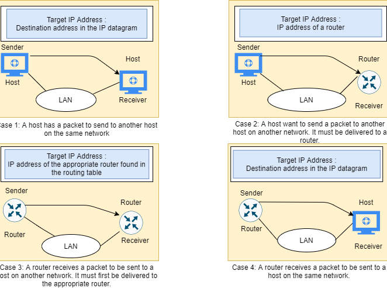

സാങ്കേതിക വിവരണം

വിലാസം

റിസോൾഷൻ പ്രോട്ടോക്കോൾ (ARP)

**ഒരു ഇഥർനെറ്റ് വിലാസ മിഴിവ് പ്രോട്ടോക്കോൾ**

**\-- അഥവാ \--**

**നെറ്റ്‌വർക്ക് പ്രോട്ടോക്കോൾ വിലാസങ്ങൾ പരിവർത്തനം ചെയ്യുന്നു**

[[https://tools.ietf.org/html/rfc826]{.ul}](https://www.google.com/url?q=https%3A%2F%2Ftools.ietf.org%2Fhtml%2Frfc826&sa=D&sntz=1&usg=AFQjCNHSlGxJe18c1VJeIV6ePn4xPAj3rA)

> ഇന്നത്തെ ലോകത്ത് കമ്പ്യൂട്ടർ നെറ്റ്‌വർക്കിംഗ് സാങ്കേതികവിദ്യയിൽ
> ഏറ്റവും പ്രചാരമുള്ള സാങ്കേതികവിദ്യയാണ് ഇഥർനെറ്റ് എന്ന് നിസ്സംശയം
> പറയാം. ഉയർന്ന പ്രകടന മോടിയുള്ള സവിശേഷത ഇത് നൽകുന്നു എന്നതാണ് ഇതിന്റെ
> ശ്രദ്ധേയമായ സവിശേഷതകളിൽ ഒന്ന്. കോക്സി കേബിളുകൾ, നെറ്റ്‌വർക്ക്
> ഇന്റർഫേസ് കാർഡ് (എൻഐസി) മുതലായ ഫിസിക്കൽ മീഡിയ ഉപയോഗിച്ച് 10/100
> എംബിപിഎസ് മുതലായ നിരക്കിൽ ഡാറ്റ കൈമാറുന്ന കോ-അനുബന്ധ നന്നായി
> നിർവചിക്കപ്പെട്ട പ്രോട്ടോക്കോളുകളുടെ ഒരു കുടുംബമാണിത്.
>
> പാക്കറ്റുകളുടെ രൂപത്തിൽ ഒരു ഫിസിക്കൽ മീഡിയ ഉപയോഗിച്ച് ഇഥർനെറ്റ്
> സാങ്കേതികവിദ്യയിലെ വിവരങ്ങൾ അയയ്‌ക്കുന്നു. പാക്കറ്റ് വലുപ്പത്തെ
> ആശ്രയിച്ച്, അതിലെ ഡാറ്റ തകർക്കുകയും ചെറിയ ഫ്രെയിമുകളിലേക്ക് പൊതിഞ്ഞ്
> ലക്ഷ്യസ്ഥാനത്തേക്ക് അയയ്ക്കുകയും അവിടെ വീണ്ടും ഒത്തുചേരാനും കഴിയും.
> അയച്ചയാളുടെ എൻ‌ഐ‌സി ഉപയോഗിച്ച് വയറിൽ‌ ഈ ഫ്രെയിമുകൾ‌ എഴുതിയിരിക്കുന്നു.
> നെറ്റ്‌വർക്കിൽ കണക്റ്റുചെയ്യേണ്ട സ്വീകർത്താവിനായി അയച്ചയാൾ ഈ
> പാക്കറ്റുകൾ ജനറേറ്റുചെയ്യുന്നു. ലക്ഷ്യസ്ഥാനത്തെത്താൻ പാക്കറ്റ്
> റൂട്ടറുകളിലൂടെയോ സ്വിച്ചുകളിലൂടെയോ സഞ്ചരിക്കാം. രണ്ട് നെറ്റ്‌വർക്ക്
> ഐഡന്റിറ്റികൾ തമ്മിലുള്ള ആശയവിനിമയത്തിനുള്ള ഒരു കൂട്ടം നിയമങ്ങൾ ഒരു
> പ്രോട്ടോക്കോൾ നിർവചിക്കുന്നു. അയച്ചയാൾക്കും സ്വീകർത്താവിനുമിടയിലുള്ള
> മറ്റ് നെറ്റ്‌വർക്കിംഗ് ഉപകരണം പ്രോസസ്സിംഗിനായി ഈ പാക്കറ്റുകൾ
> എടുക്കില്ല, പകരം അത് ഉപേക്ഷിച്ചു. അതിനാൽ, \<പ്രോട്ടോക്കോൾ തരം,
> പ്രോട്ടോക്കോൾ വിലാസം\> അടിസ്ഥാനമാക്കി ഒരു പ്രോട്ടോക്കോൾ ഞങ്ങൾക്ക്
> ആവശ്യമാണ്, അത് അയച്ചയാളിൽ നിന്ന് റിസീവറിലേക്ക് മാത്രം ഒരു പാതയിലൂടെ
> സഞ്ചരിക്കേണ്ടതുണ്ട്.

**സംഗ്രഹം:**

> ഒരേ നെറ്റ്‌വർക്കിൽ എ, ബി എന്നീ രണ്ട് നെറ്റ്‌വർക്കിംഗ്
> ഉപകരണങ്ങളുണ്ടെന്നും അവയ്‌ക്ക് താഴെയുള്ള ഗുണങ്ങളുണ്ടെന്നും നമുക്ക്
> അനുമാനിക്കാം:
>
> ഉപകരണം എ:
>
> MAC = M (A)
>
> IP = I (A)
>
> ഉപകരണം ബി:
>
> MAC = M (B)
>
> IP = I (B)
>
> ഇപ്പോൾ എ യുമായി ആശയവിനിമയം നടത്താൻ ആഗ്രഹിക്കുന്നു, കൂടാതെ ബി യുടെ ഐപി
> സ്വത്ത് മാത്രമേ അറിയൂ. I (B) മുതൽ M (B) വരെ മാപ്പ് ചെയ്യുന്നതിന് A
> അതിന്റെ പ്രോട്ടോക്കോൾ സ്റ്റാക്ക് ARP മൊഡ്യൂളിനെ സമീപിക്കും. അതിനാൽ A-
> യുടെ ARP മൊഡ്യൂൾ നെറ്റ്‌വർക്കിൽ ഒരു പ്രക്ഷേപണ പാക്കറ്റ് അയയ്‌ക്കും,
> അതിലേക്ക് B ഉപകരണം അതിന്റെ MAC വിശദാംശങ്ങളുമായി പ്രതികരിക്കും. വയർ വഴി
> അയയ്‌ക്കുന്ന ഒരു ഇഥർനെറ്റ് പാക്കറ്റ് സൃഷ്‌ടിക്കുന്നതിന് എയുടെ എആർ‌പി
> മൊഡ്യൂളുകൾ ഈ വിശദാംശങ്ങൾ കാഷെ ചെയ്യുന്നു.
>
> കുറിപ്പുകൾ:
>
> ഫിസിക്കൽ വിലാസത്തിലേക്ക് (48-ബിറ്റ് മാക് വിലാസം) ഒരു ഐ‌പി‌വി 4 വിലാസം
> (32-ബിറ്റ് ലോജിക്കൽ വിലാസം) മാപ്പ് ചെയ്യുന്നതിന് ടി‌സി‌പി / ഐ‌പി
> സ്യൂട്ടിലെ പ്രധാന പ്രോട്ടോക്കോളുകളിൽ ഒന്നാണ് വിലാസ റെസല്യൂഷൻ
> പ്രോട്ടോക്കോൾ (എആർ‌പി). MAC വിലാസത്തിലേക്ക് ലോജിക്കൽ പേരുകൾ
> പരിഹരിക്കുന്നതിന് നെറ്റ്‌വർക്ക് ഉപകരണങ്ങൾക്ക് ഒരു ലോജിക്കൽ പേരും ലോവർ
> ലെവൽ അല്ലെങ്കിൽ പ്രോട്ടോക്കോളുകളും നൽകിയിട്ടുണ്ട്. മറ്റൊരു ഉപകരണവുമായി
> ആശയവിനിമയം നടത്താൻ അപ്ലിക്കേഷൻ ലെയറിലെ നെറ്റ്‌വർക്ക് അപ്ലിക്കേഷനുകൾ
> IPv4 വിലാസം ഉപയോഗിക്കുന്നു. എന്നിരുന്നാലും, ഡാറ്റ ലിങ്ക് ലെയറിൽ,
> ഉപയോഗിക്കുന്ന വിലാസം MAC വിലാസമാണ് (48-ബിറ്റ് ഫിസിക്കൽ വിലാസം) ഇത്
> നെറ്റ്‌വർക്ക് കാർഡിലേക്ക് ശാശ്വതമായി കത്തിക്കുന്നു. നിങ്ങളുടെ ലോക്കൽ
> ഏരിയ നെറ്റ്‌വർക്കിലെ (ലാൻ) ഒരു ഉപകരണത്തിന്റെ MAC വിലാസം, അനുബന്ധ
> നെറ്റ്‌വർക്ക് ആപ്ലിക്കേഷൻ ആശയവിനിമയം നടത്താൻ ശ്രമിക്കുന്ന അനുബന്ധ IPv4
> വിലാസത്തിനായി കണ്ടെത്തുക എന്നതാണ് വിലാസ റെസല്യൂഷൻ പ്രോട്ടോക്കോളിന്റെ
> (ARP) ലക്ഷ്യം.

**പ്രശ്നം:**

> കമ്പ്യൂട്ടർ നെറ്റ്‌വർക്കിംഗ് നിലവിൽ വന്നതിനാൽ, വ്യത്യസ്ത വെണ്ടർമാർ
> നിർമ്മിച്ചതും നൽകിയതുമായ വ്യത്യസ്ത ഇന്റർഫേസുള്ള നിരവധി തരം
> നെറ്റ്‌വർക്കിംഗ് ഉപകരണങ്ങൾ ഉണ്ട്. നേരത്തെ ചർച്ച ചെയ്തതുപോലെ,
> ഫ്രെയിമുകളിലൂടെ അവർ ആശയവിനിമയം നടത്തേണ്ടതുണ്ട്, അത് ഇപ്പോൾ ഒരു തരമായി
> തരംതിരിക്കാം - ഒരു പാക്കറ്റിനെ മറ്റൊന്നിൽ നിന്ന്
> വേർതിരിക്കുന്നു. നെറ്റ്വർക്കിൽ മറ്റ് വ്യത്യസ്ത തരം പ്രോട്ടോക്കോളുകളും
> ഹാർഡ്‌വെയറുകളും ഉണ്ടെന്നും അവയ്‌ക്കെല്ലാം നിർദ്ദിഷ്ട നിരക്കിൽ
> പാക്കറ്റുകൾ കൈമാറാൻ കേബിളുകൾ ആവശ്യമാണെന്നും
> ശ്രദ്ധിക്കുക. പ്രോട്ടോക്കോൾ വിലാസം 48-ബിറ്റ് വിലാസമായിരിക്കാം
> അല്ലെങ്കിൽ ഉണ്ടാകില്ല - അവ 8 ബിറ്റുകൾ മുതൽ 48 ബിറ്റ് വിലാസങ്ങൾ വരെ
> വ്യത്യാസപ്പെടാം. ഈഥർനെറ്റ് പാക്കറ്റ് തലക്കെട്ടിലെ ഒരു ടൈപ്പ് ഫീൽഡ് വഴി
> ഒരൊറ്റ കേബിളിൽ ഒന്നിച്ച് നിലനിൽക്കാൻ ഈ പ്രോട്ടോക്കോളുകളെ (കൂടുതലും)
> 10Mbit ഇഥർനെറ്റ് നെറ്റ്‌വർക്ക് അനുവദിക്കുന്നു.
>
> ഒരു \<പ്രോട്ടോക്കോൾ, വിലാസം\> ജോഡിയും 48-ബിറ്റ് ഇഥർനെറ്റ് വിലാസവും
> തമ്മിലുള്ള കത്തിടപാടുകൾ ചലനാത്മകമായി വിതരണം ചെയ്യുന്നതിന് ഒരു
> പ്രോട്ടോക്കോൾ ആവശ്യമാണ്. ലോക്കൽ ഏരിയയിലെ ഡാറ്റാ ലിങ്ക് ലെയറിൽ
> (ഒ‌എസ്‌ഐയുടെ ലേയർ 2) അല്ലെങ്കിൽ കണക്റ്റുചെയ്‌ത ഉപകരണങ്ങളുടെ
> പോയിന്റ്-ടു-പോയിന്റ് ലിങ്ക് നെറ്റ്‌വർക്കിൽ ARP ഇതിനായി
> ഉപയോഗിക്കുന്നു. ഇഥർനെറ്റ് പിന്തുണയ്‌ക്കുന്ന നെറ്റ്‌വർക്ക് ഉപകരണങ്ങളിലെ
> MAC വിലാസങ്ങൾ നിശ്ചിത 6-ബൈറ്റ് (48-ബിറ്റ്) ആണ്. ഐപി വിലാസങ്ങൾ
> ഏതെങ്കിലും ഇന്റർഫേസിനായി ഒരു സ്ഥിര കോൺഫിഗറേഷനല്ല. ഉപകരണങ്ങൾ ഒരു ഐപി
> വിലാസം ഉപയോഗിച്ച് സ്വമേധയാ ക്രമീകരിക്കാൻ കഴിയും അല്ലെങ്കിൽ
> നെറ്റ്‌വർക്കിലെ ഡൈനാമിക് ഹോസ്റ്റ് കോൺഫിഗറേഷൻ പ്രോട്ടോക്കോൾ
> (ഡിഎച്ച്സിപി) സെർവറിൽ നിന്ന് അവ നേടാൻ കഴിയും. ലക്ഷ്യസ്ഥാന ഐപി
> പാക്കറ്റ് വിവരങ്ങൾ ലഭ്യമല്ലാത്തപ്പോഴെല്ലാം നെറ്റ്‌വർക്ക് / ഹോസ്റ്റ്
> ഐഡികളെ അടിസ്ഥാനമാക്കി ഈ ഇഥർനെറ്റ് പാക്കറ്റുകൾ നെറ്റ്‌വർക്ക്
> ഗേറ്റ്‌വേയിലേക്ക് കൈമാറും.

**ചലനം:**

> വിശ്വാസ്യത / വേഗത സവിശേഷതകൾ കാരണം, ഉപയോഗത്തിലുള്ള ഏറ്റവും ജനപ്രിയ
> നെറ്റ്‌വർക്കിംഗ് പ്രോട്ടോക്കോൾ ആയി ഇഥർനെറ്റ് മാറി. കൂടുതൽ കൂടുതൽ
> പ്രോട്ടോക്കോളുകൾ അതിന്റെ സ്റ്റാക്കിലേക്ക് നടപ്പാക്കി. എന്നിട്ടും മറ്റ്
> വെണ്ടർമാർക്ക് വിലാസ മിഴിവ് പ്രോട്ടോക്കോളിന്റെ സ്വന്തം പതിപ്പ്
> ഉണ്ടായിരിക്കാം. വെണ്ടർ നിർദ്ദിഷ്ട ഉപകരണങ്ങൾക്ക് പരിഷ്‌ക്കരണത്തിന്റെ
> ആവശ്യമില്ലാതെ തന്നെ അവ നിർമ്മിക്കാൻ കഴിയുന്ന തരത്തിൽ അവർ ഈ സവിശേഷത ഒരു
> സാധാരണ രൂപത്തിൽ നൽകുന്നു. അതിനാൽ നമുക്ക് ഒരു വൈവിധ്യമാർന്ന ഉപകരണ
> സജ്ജീകരണ നെറ്റ്‌വർക്ക് ഉണ്ടായിരിക്കാം, പക്ഷേ അവയ്ക്കിടയിൽ ഫ്രെയിം
> അയയ്‌ക്കാനോ സ്വീകരിക്കാനോ അനുവദിക്കാനാകും.

**നിർവചനം:**

> ടി‌സി‌പി / ഐ‌പി സ്യൂട്ടിലെ പ്രധാന പ്രോട്ടോക്കോളുകളിൽ ഒന്നാണ് അഡ്രസ്
> റെസല്യൂഷൻ പ്രോട്ടോക്കോൾ (എആർ‌പി), ഐ‌പി‌വി 4 വിലാസം (32-ബിറ്റ് ലോജിക്കൽ
> വിലാസം) ഫിസിക്കൽ വിലാസത്തിലേക്ക് (48 ബിറ്റ് മാക് വിലാസം) മാപ്പ്
> ചെയ്യുക എന്നതാണ് വിലാസ റെസല്യൂഷൻ പ്രോട്ടോക്കോൾ (എആർ‌പി) ). മറ്റൊരു
> ഉപകരണവുമായി ആശയവിനിമയം നടത്താൻ അപ്ലിക്കേഷൻ ലെയറിലെ നെറ്റ്‌വർക്ക്
> അപ്ലിക്കേഷനുകൾ IPv4 വിലാസം ഉപയോഗിക്കുന്നു. എന്നാൽ ഡാറ്റ ലിങ്ക് ലെയറിൽ,
> വിലാസം MAC വിലാസമാണ് (48-ബിറ്റ് ഫിസിക്കൽ വിലാസം), ഈ വിലാസം ശാശ്വതമായി
> നെറ്റ്‌വർക്ക് കാർഡിലേക്ക് കത്തിക്കുന്നു.
>
> നിങ്ങളുടെ ലോക്കൽ ഏരിയ നെറ്റ്‌വർക്കിലെ (ലാൻ) ഒരു ഉപകരണത്തിന്റെ MAC
> വിലാസം, അനുബന്ധ നെറ്റ്‌വർക്ക് ആപ്ലിക്കേഷൻ ആശയവിനിമയം നടത്താൻ
> ശ്രമിക്കുന്ന അനുബന്ധ IPv4 വിലാസത്തിനായി കണ്ടെത്തുക എന്നതാണ് വിലാസ
> റെസല്യൂഷൻ പ്രോട്ടോക്കോളിന്റെ (ARP) ലക്ഷ്യം.

**ആർ‌പിയുടെ ചരിത്രം:**

> 1982 നവംബറിൽ ഡേവിഡ് സി. പ്ലമ്മർ പ്രസിദ്ധീകരിച്ച റിക്വസ്റ്റ് ഫോർ
> കമന്റ്സ് (ആർ‌എഫ്‌സി) 826 ൽ ARP ആദ്യമായി നിർദ്ദേശിക്കുകയും ചർച്ച
> ചെയ്യുകയും ചെയ്തു. ഐപി പ്രോട്ടോക്കോൾ സ്യൂട്ടിന്റെ ആദ്യ ദിവസങ്ങളിൽ
> വിലാസ റെസല്യൂഷന്റെ പ്രശ്നം ഉടനടി വ്യക്തമായി, കാരണം ഇഥർനെറ്റ് വേഗത്തിൽ
> ഇഷ്ടപ്പെട്ട ലാൻ സാങ്കേതികവിദ്യയായിത്തീർന്നു, കൂടാതെ ഇഥർനെറ്റ്
> കേബിളുകൾക്ക് 48-ബിറ്റ് വിലാസങ്ങൾ ആവശ്യമാണ്.
>
> ഇപ്പോഴും ഉപയോഗത്തിലുള്ള ഇന്റർനെറ്റ് ആർ‌എഫ്‌സികളിൽ ആദ്യത്തേതിൽ ഈ
> പ്രോട്ടോക്കോൾ വിവരിച്ചിരിക്കുന്നു: ആർ‌എഫ്‌സി 826, 1982 ൽ
> പ്രസിദ്ധീകരിച്ച ഒരു ഇഥർനെറ്റ് വിലാസ മിഴിവ് പ്രോട്ടോക്കോൾ.
>
> ARP യഥാർത്ഥത്തിൽ ഈഥർനെറ്റിനായി വികസിപ്പിച്ചതാണെന്ന് പേര്
> വ്യക്തമാക്കുന്നു. അതിനാൽ, ഇത് ഏറ്റവും ജനപ്രിയമായ ലെയർ രണ്ട് ലാൻ
> പ്രോട്ടോക്കോളും ഏറ്റവും ജനപ്രിയമായ ലെയർ ത്രീ ഇന്റർനെറ്റ് വർക്കിംഗ്
> പ്രോട്ടോക്കോളും തമ്മിലുള്ള അവിശുദ്ധ ബന്ധത്തെ പ്രതിനിധീകരിക്കുന്നു two
> ഇത് രണ്ട് പതിറ്റാണ്ടിനുശേഷം പോലും ശരിയാണ്. എന്നിരുന്നാലും, ഐ‌പി
> ഗതാഗതത്തിനുള്ള ഏറ്റവും സാധാരണമായ മാർ‌ഗ്ഗം എതർ‌നെറ്റ് ആണെങ്കിൽ‌ പോലും,
> ഇത് മാത്രമല്ല ഉണ്ടാകുകയെന്നും തുടക്കം മുതൽ‌ വ്യക്തമായിരുന്നു. അതിനാൽ,
> ഐ‌പിയിൽ നിന്ന് ഈഥർനെറ്റിലേക്ക് മാത്രമല്ല മറ്റ് നിരവധി ഡാറ്റാ ലിങ്ക്
> ലെയർ സാങ്കേതികവിദ്യകളിലേക്കും വിലാസങ്ങൾ പരിഹരിക്കാൻ പ്രാപ്തിയുള്ള ഒരു
> പൊതു പ്രോട്ടോക്കോൾ ARP ആക്കി.

**അവലോകനം:**

> ഇൻറർ‌നെറ്റ് വർ‌ക്ക് ആശയവിനിമയത്തെ ശാക്തീകരിക്കുന്നതിനായി അഡ്രസ്
> റെസല്യൂഷൻ പ്രോട്ടോക്കോൾ (എആർ‌പി) വികസിപ്പിച്ചെടുത്തു, ഇത് ആർ‌എഫ്‌സി
> 826 സ്വഭാവ സവിശേഷതയാണ്. ഐ‌പി നെറ്റ്‌വർക്ക് വിലാസങ്ങൾ മാക് ഹാർഡ്‌വെയർ
> വിലാസങ്ങളിലേക്ക് മാപ്പ് ചെയ്യുന്നതിന് ലേയർ 3 ഗാഡ്‌ജെറ്റുകൾക്ക് എആർ‌പി
> ആവശ്യമാണ്, അതിനാൽ സിസ്റ്റങ്ങളിലുടനീളം ഐപി ബണ്ടിലുകൾ അയയ്ക്കാൻ കഴിയും.
> ഒരു ഉപകരണം മറ്റൊരു ഉപകരണത്തിലേക്ക് ഒരു ഡാറ്റാഗ്രാം അയയ്‌ക്കുന്നതിന്
> മുമ്പ്, ഗോൾഡ് ഗാഡ്‌ജെറ്റിനായി ഒരു MAC വിലാസവും അനുബന്ധ ഐപി വിലാസവും
> ഉണ്ടോയെന്ന് പരിശോധിക്കാൻ അത് അതിന്റെ ARP കാഷെയിൽ കാണുന്നു. ആക്‌സസ്
> ഇല്ലാത്ത അവസരങ്ങളിൽ, ഉറവിട ഗാഡ്‌ജെറ്റ് സിസ്റ്റത്തിലെ ഓരോ
> ഗാഡ്‌ജെറ്റിലേക്കും ഒരു ആശയവിനിമയ സന്ദേശം അയയ്‌ക്കുന്നു. ഓരോ
> ഗാഡ്‌ജെറ്റും ഐ‌പി വിലാസം സ്വന്തമായി നോക്കുന്നു. ഏകോപിപ്പിക്കുന്ന ഐപി
> വിലാസമുള്ള ഗാഡ്‌ജെറ്റ് ഗാഡ്‌ജെറ്റിനായി MAC വിലാസം അടങ്ങിയ ഒരു ബണ്ടിൽ
> ഉപയോഗിച്ച് അയയ്‌ക്കുന്ന ഗാഡ്‌ജെറ്റിന് ഉത്തരം നൽകുന്നു (\"ഇടനില ARP\"
> കണക്കിലെടുക്കാതെ).
>
> ലക്ഷ്യസ്ഥാന ഉപകരണം വിദൂര സിസ്റ്റത്തിൽ സ്ഥിതിചെയ്യുന്ന ഘട്ടത്തിൽ,
> മറ്റൊന്ന് ലേയർ 3 ഉപകരണത്തിന് അപ്പുറത്ത്, നടപടിക്രമം തുല്യമാണ്,
> അയയ്ക്കുന്ന ഉപകരണം സ്ഥിരസ്ഥിതി ഗേറ്റ്‌വേയുടെ MAC വിലാസത്തിനായി ഒരു ARP
> ഡിമാൻഡ് അയയ്ക്കുന്നു. വിലാസം പരിഹരിച്ച് സ്ഥിരസ്ഥിതി ഗേറ്റ്‌വേയ്ക്ക്
> പാക്കറ്റ് ലഭിച്ച ശേഷം, സ്ഥിരസ്ഥിതി ഗേറ്റ്‌വേ ലക്ഷ്യസ്ഥാന ഐപി
> വിലാസവുമായി ബന്ധപ്പെട്ട സിസ്റ്റങ്ങളിലൂടെ പ്രക്ഷേപണം ചെയ്യുന്നു.
> ഉദ്ദിഷ്ടസ്ഥാന ഉപകരണ നെറ്റ്‌വർക്കിലെ ലേയർ 3 ഉപകരണം ലക്ഷ്യസ്ഥാന
> ഉപകരണത്തിന്റെ MAC വിലാസം നേടുന്നതിന് ARP ഉപയോഗിക്കുകയും പാക്കറ്റ്
> നൽകുകയും ചെയ്യുന്നു.

**ഇത് എങ്ങനെ പ്രവർത്തിക്കുന്നു:**

> ഒരു പുതിയ കമ്പ്യൂട്ടർ‌ ഒരു ലാനിൽ‌ ചേരുമ്പോൾ‌, തിരിച്ചറിയലിനും
> ആശയവിനിമയത്തിനും ഉപയോഗിക്കുന്നതിന് ഒരു അദ്വിതീയ ഐ‌പി വിലാസം
> നൽകിയിരിക്കുന്നു. ഒരു പ്രത്യേക ലാനിലെ ഒരു ഹോസ്റ്റ് മെഷീനായി
> നിശ്ചയിച്ചിട്ടുള്ള ഇൻകമിംഗ് പാക്കറ്റ് ഒരു ഗേറ്റ്‌വേയിൽ എത്തുമ്പോൾ,
> ഗേറ്റ്‌വേ ARP പ്രോഗ്രാമിനോട് IP വിലാസവുമായി പൊരുത്തപ്പെടുന്ന ഒരു MAC
> വിലാസം കണ്ടെത്താൻ ആവശ്യപ്പെടുന്നു. ARP കാഷെ എന്ന് വിളിക്കുന്ന ഒരു
> പട്ടിക ഓരോ ഐപി വിലാസത്തിന്റെയും അതിന്റെ അനുബന്ധ MAC വിലാസത്തിന്റെയും (
> [[RFC5227]{.ul}](https://www.google.com/url?q=https%3A%2F%2Ftools.ietf.org%2Fhtml%2Frfc5227%23section-1.3&sa=D&sntz=1&usg=AFQjCNGGQNaGP6atAzMmhiHh4AUWOs6BDQ)
> ) [[രേഖകൾ
> സൂക്ഷിക്കുന്നു]{.ul}](https://www.google.com/url?q=https%3A%2F%2Ftools.ietf.org%2Fhtml%2Frfc5227%23section-1.3&sa=D&sntz=1&usg=AFQjCNGGQNaGP6atAzMmhiHh4AUWOs6BDQ)
> .
>
> ഒരു IPv4 ഇഥർനെറ്റ് നെറ്റ്‌വർക്കിലെ എല്ലാ ഓപ്പറേറ്റിംഗ് സിസ്റ്റങ്ങളും
> ഒരു ARP കാഷെ സൂക്ഷിക്കുന്നു. ലാനിലെ മറ്റൊരു ഹോസ്റ്റിലേക്ക് ഒരു
> പാക്കറ്റ് അയയ്‌ക്കുന്നതിന് ഒരു ഹോസ്റ്റ് ഒരു മാക് വിലാസം
> അഭ്യർത്ഥിക്കുമ്പോഴെല്ലാം, ഐപി ടു മാക് വിലാസ വിവർത്തനം ഇതിനകം
> നിലവിലുണ്ടോ എന്ന് അറിയാൻ അത് അതിന്റെ എആർപി കാഷെ പരിശോധിക്കുന്നു.
> അങ്ങനെയാണെങ്കിൽ, ഒരു പുതിയ ARP അഭ്യർത്ഥന അനാവശ്യമാണ്. വിവർത്തനം ഇതിനകം
> നിലവിലില്ലെങ്കിൽ, നെറ്റ്‌വർക്ക് വിലാസങ്ങൾക്കായുള്ള അഭ്യർത്ഥന
> അയയ്ക്കുകയും ARP നടപ്പിലാക്കുകയും ചെയ്യുന്നു.
>
> ARP ലാനിലെ എല്ലാ മെഷീനുകളിലേക്കും ഒരു അഭ്യർത്ഥന പാക്കറ്റ് പ്രക്ഷേപണം
> ചെയ്യുകയും ഏതെങ്കിലും പ്രത്യേക മെഷീനുകൾ ആ പ്രത്യേക ഐപി വിലാസം
> ഉപയോഗിക്കുന്നതായി അറിയാമോ എന്ന് ചോദിക്കുകയും ചെയ്യുന്നു. ഒരു മെഷീൻ ഐപി
> വിലാസം സ്വന്തമാണെന്ന് തിരിച്ചറിയുമ്പോൾ, അത് ഒരു മറുപടി
> അയയ്‌ക്കുന്നതിനാൽ ARP ന് ഭാവി റഫറൻസിനായി കാഷെ അപ്‌ഡേറ്റുചെയ്യാനും
> ആശയവിനിമയവുമായി മുന്നോട്ട് പോകാനും കഴിയും.
>
> സ്വന്തം ഐപി വിലാസം അറിയാത്ത ഹോസ്റ്റ് മെഷീനുകൾക്ക് കണ്ടെത്തലിനായി
> റിവേഴ്സ് എആർ‌പി (ആർ‌ആർ‌പി) പ്രോട്ടോക്കോൾ ഉപയോഗിക്കാം.
>
> ഒരു ARP കാഷെ വലുപ്പം പരിമിതമാണ് കൂടാതെ ഇടം ശൂന്യമാക്കുന്നതിന് എല്ലാ
> എൻ‌ട്രികളും കാലാകാലങ്ങളിൽ വൃത്തിയാക്കുന്നു; വാസ്തവത്തിൽ, വിലാസങ്ങൾ
> കാഷെയിൽ കുറച്ച് മിനിറ്റ് മാത്രമേ നിലനിൽക്കൂ. ഒരു ഫിസിക്കൽ ഹോസ്റ്റ്
> അവരുടെ അഭ്യർത്ഥിച്ച ഐപി വിലാസം മാറ്റുമ്പോൾ കാണുന്നതിന് പതിവ്
> അപ്‌ഡേറ്റുകൾ നെറ്റ്‌വർക്കിലെ മറ്റ് ഉപകരണങ്ങളെ അനുവദിക്കുന്നു.
> ക്ലീനിംഗ് പ്രക്രിയയിൽ, ഉപയോഗിക്കാത്ത എൻ‌ട്രികൾ‌ ഇല്ലാതാക്കുകയും
> അതുപോലെ തന്നെ നിലവിൽ‌ പ്രവർ‌ത്തിക്കാത്ത കമ്പ്യൂട്ടറുകളുമായി ആശയവിനിമയം
> നടത്താനുള്ള പരാജയ ശ്രമങ്ങൾ‌

**ടെർമിനോളജി:**

> മാപ്പിംഗിന്റെ രണ്ട് തരങ്ങളുണ്ട്:
>
> 1\. സ്റ്റാറ്റിക് മാപ്പിംഗ്
>
> 2\. ഡൈനാമിക് മാപ്പിംഗ്

**സ്റ്റാറ്റിക് മാപ്പിംഗ്:**

> സ്റ്റാറ്റിക് മാപ്പിംഗ് എന്നാൽ ഒരു ലോജിക്കൽ വിലാസത്തെ ഫിസിക്കൽ
> വിലാസവുമായി ബന്ധിപ്പിക്കുന്ന ഒരു പട്ടിക സൃഷ്ടിക്കുക എന്നാണ്. ഈ പട്ടിക
> നെറ്റ്‌വർക്കിലെ ഓരോ മെഷീനിലും സംഭരിച്ചിരിക്കുന്നു
>
> അറിയാവുന്ന ഓരോ മെഷീനും, ഉദാഹരണത്തിന്, മറ്റൊരു മെഷീന്റെ ഐപി വിലാസം,
> പക്ഷേ അതിന്റെ ഭ physical തിക വിലാസം അല്ല. ഇതിന് ചില പരിമിതികളുണ്ട്,
> കാരണം ഇനിപ്പറയുന്ന രീതിയിൽ ഭ physical തിക വിലാസങ്ങൾ മാറിയേക്കാം:
>
> · ഒരു യന്ത്രം ഒരു പുതിയ ഫിസിക്കൽ വിലാസം ഫലമായി അതിന്റെ എൻഐസി മാറ്റാൻ
> കഴിഞ്ഞില്ല.
>
> Local ലോക്കൽ ടോക്ക് പോലുള്ള ചില ലാനുകളിൽ, കമ്പ്യൂട്ടർ
> ഓണാക്കുമ്പോഴെല്ലാം ഫിസിക്കൽ വിലാസം മാറുന്നു.
>
> Mobile ഒരു മൊബൈൽ കമ്പ്യൂട്ടറിന് ഒരു ഫിസിക്കൽ നെറ്റ്‌വർക്കിൽ നിന്ന്
> മറ്റൊന്നിലേക്ക് മാറാൻ കഴിയും, അതിന്റെ ഫലമായി അതിന്റെ ഫിസിക്കൽ വിലാസം
> മാറുന്നു.
>
> ഈ മാറ്റങ്ങൾ നടപ്പിലാക്കാൻ, ഒരു സ്റ്റാറ്റിക് മാപ്പിംഗ് പട്ടിക
> കാലാകാലങ്ങളിൽ അപ്‌ഡേറ്റ് ചെയ്യണം. ഈ ഓവർഹെഡ് നെറ്റ്‌വർക്ക് പ്രകടനത്തെ
> ബാധിച്ചേക്കാം.

**ഡൈനാമിക് മാപ്പിംഗ്:**

> ഡൈനാമിക് മാപ്പിംഗിൽ, ഓരോ മെഷീനും മറ്റൊരു മെഷീന്റെ ലോജിക്കൽ വിലാസം
> അറിയുമ്പോഴെല്ലാം, ഫിസിക്കൽ വിലാസം കണ്ടെത്താൻ ഒരു പ്രോട്ടോക്കോൾ
> ഉപയോഗിക്കാം. ഡൈനാമിക് മാപ്പിംഗ് നടത്താൻ രണ്ട് പ്രോട്ടോക്കോളുകൾ
> രൂപകൽപ്പന ചെയ്തിട്ടുണ്ട്: വിലാസ മിഴിവ് പ്രോട്ടോക്കോൾ (ARP), റിവേഴ്സ്
> അഡ്രസ് റെസല്യൂഷൻ പ്രോട്ടോക്കോൾ (RARP). ARP ഒരു ലോജിക്കൽ വിലാസം ഒരു ഭ
> physical തിക വിലാസത്തിലേക്ക് മാപ്പ് ചെയ്യുന്നു; RARP ഒരു ഭ physical
> തിക വിലാസം ഒരു ലോജിക്കൽ വിലാസത്തിലേക്ക് മാപ്പ് ചെയ്യുന്നു. RARP
> മറ്റൊരു പ്രോട്ടോക്കോൾ ഉപയോഗിച്ച് മാറ്റിസ്ഥാപിക്കുന്നതിനാൽ
> അവഗണിക്കപ്പെടുന്നതിനാൽ, ഈ പ്രമാണത്തിൽ ARP പ്രോട്ടോക്കോൾ മാത്രമേ ഞങ്ങൾ
> ചർച്ചചെയ്യൂ.

**ആർപ്പ് കാച്ചിംഗ്:**

> ഇന്റർനെറ്റ് വർക്ക് വഴി അയച്ച ഓരോ ഡാറ്റാഗ്രാമിനുമായി നെറ്റ്‌വർക്കിലെ
> ഓരോ ഹോപ്പിലും (ലേയർ 3 ഉപകരണം) ഐപി വിലാസങ്ങളുടെ മാപ്പിംഗ് കാരണം,
> നെറ്റ്‌വർക്കിന്റെ പ്രകടനം അപഹരിക്കപ്പെടാം. പ്രക്ഷേപണങ്ങൾ
> കുറയ്ക്കുന്നതിനും നെറ്റ്‌വർക്ക് ഉറവിടങ്ങളുടെ പാഴായ ഉപയോഗം
> പരിമിതപ്പെടുത്തുന്നതിനും, വിലാസ റെസല്യൂഷൻ പ്രോട്ടോക്കോൾ (ARP) കാഷിംഗ്
> നടപ്പിലാക്കി.
>
> വിലാസങ്ങൾ‌ പഠിക്കുന്നതിനനുസരിച്ച് ഒരു നിശ്ചിത സമയത്തേക്ക്
> നെറ്റ്‌വർക്ക് വിലാസങ്ങളും അനുബന്ധ ഡാറ്റ-ലിങ്ക് വിലാസങ്ങളും മെമ്മറിയിൽ
> സംഭരിക്കുന്ന രീതിയാണ് ARP കാഷിംഗ്.
>
> ഓരോ തവണയും ഒരു ഡാറ്റാഗ്രാം അയയ്‌ക്കുമ്പോൾ ഒരേ വിലാസത്തിനായി പ്രക്ഷേപണം
> ചെയ്യുന്നതിന് വിലയേറിയ നെറ്റ്‌വർക്ക് ഉറവിടങ്ങളുടെ ഉപയോഗം ഇത്
> കുറയ്‌ക്കുന്നു. കാഷെ എൻ‌ട്രികൾ‌ പരിപാലിക്കേണ്ടതുണ്ട്, കാരണം വിവരങ്ങൾ‌
> കാലഹരണപ്പെട്ടേക്കാം, അതിനാൽ‌ കാഷെ എൻ‌ട്രികൾ‌ കാലാകാലങ്ങളിൽ‌
> കാലഹരണപ്പെടാൻ‌ സജ്ജമാക്കിയിരിക്കുന്നു. വിലാസങ്ങൾ പ്രക്ഷേപണം
> ചെയ്യുന്നതിനാൽ ഒരു നെറ്റ്‌വർക്കിലെ ഓരോ ഉപകരണവും അതിന്റെ പട്ടികകൾ
> അപ്‌ഡേറ്റുചെയ്യുന്നു.
>
> സ്റ്റാറ്റിക് ARP കാഷെ എൻ‌ട്രികളും ഡൈനാമിക് ARP കാഷെ എൻ‌ട്രികളും ഉണ്ട്.
> സ്റ്റാറ്റിക് എൻ‌ട്രികൾ‌ സ്വമേധയാ ക്രമീകരിച്ച് കാഷെ പട്ടികയിൽ‌
> ശാശ്വതമായി സൂക്ഷിക്കുന്നു. ഒരേ നെറ്റ്‌വർക്കിൽ പതിവായി മറ്റ്
> ഉപകരണങ്ങളുമായി ആശയവിനിമയം നടത്തേണ്ട ഉപകരണങ്ങൾക്ക് സ്റ്റാറ്റിക്
> എൻട്രികൾ മികച്ചതാണ്. ഡൈനാമിക് എൻ‌ട്രികൾ‌ സിസ്‌കോ സോഫ്റ്റ്വെയർ‌
> ചേർ‌ക്കുകയും ഒരു നിശ്ചിത സമയത്തേക്ക് സൂക്ഷിക്കുകയും തുടർന്ന്
> നീക്കംചെയ്യുകയും ചെയ്യുന്നു.

**ARP കാഷെയിലെ സ്റ്റാറ്റിക്, ഡൈനാമിക് എൻ‌ട്രികൾ**

> സ്റ്റാറ്റിക് റൂട്ടിംഗിന് ഒരു അഡ്മിനിസ്ട്രേറ്റർ ഐപി വിലാസങ്ങൾ,
> സബ്നെറ്റ് മാസ്കുകൾ, ഗേറ്റ്‌വേകൾ, ഓരോ ഉപകരണത്തിന്റെയും ഓരോ
> ഇന്റർഫേസിനായി അനുബന്ധ മീഡിയ ആക്സസ് കൺട്രോൾ (എം‌എസി) വിലാസങ്ങൾ ഒരു
> പട്ടികയിലേക്ക് സ്വമേധയാ നൽകേണ്ടതുണ്ട്. സ്റ്റാറ്റിക് റൂട്ടിംഗ് കൂടുതൽ
> നിയന്ത്രണം പ്രാപ്തമാക്കുന്നു, പക്ഷേ പട്ടിക നിലനിർത്താൻ കൂടുതൽ ജോലി
> ആവശ്യമാണ്. റൂട്ടുകൾ ചേർക്കുമ്പോഴോ മാറ്റുമ്പോഴോ പട്ടിക
> അപ്‌ഡേറ്റുചെയ്യണം.
>
> റൂട്ടിംഗ് പട്ടിക വിവരങ്ങൾ പരസ്പരം കൈമാറാൻ ഒരു നെറ്റ്‌വർക്കിലെ
> ഉപകരണങ്ങളെ പ്രാപ്തമാക്കുന്ന പ്രോട്ടോക്കോളുകൾ ഡൈനാമിക് റൂട്ടിംഗ്
> ഉപയോഗിക്കുന്നു. പട്ടിക നിർമ്മിക്കുകയും സ്വപ്രേരിതമായി മാറ്റുകയും
> ചെയ്യുന്നു. സമയ പരിധി ചേർത്തിട്ടില്ലെങ്കിൽ അഡ്മിനിസ്ട്രേറ്റീവ് ജോലികൾ
> ആവശ്യമില്ല, അതിനാൽ സ്റ്റാറ്റിക് റൂട്ടിംഗിനേക്കാൾ ഡൈനാമിക് റൂട്ടിംഗ്
> കൂടുതൽ കാര്യക്ഷമമാണ്. സ്ഥിരസ്ഥിതി സമയ പരിധി 4 മണിക്കൂറാണ്. കാഷെയിൽ
> നിന്ന് ചേർക്കുകയും ഇല്ലാതാക്കുകയും ചെയ്യുന്ന ധാരാളം റൂട്ടുകൾ
> നെറ്റ്‌വർക്കിന് ഉണ്ടെങ്കിൽ, സമയ പരിധി ക്രമീകരിക്കണം.

**പ്രോക്സി ARP**

> ഐ‌പി-ടു-മാക് വിലാസങ്ങൾ പരിഹരിക്കുന്നതിന് ഒരേ ഐ‌പി നെറ്റ്‌വർക്കിലോ
> സബ്‌നെറ്റ്വർക്കിലോ ഒരു റൂട്ടർ കണക്റ്റുചെയ്‌തിരിക്കുന്ന ഫിസിക്കൽ
> നെറ്റ്‌വർക്ക് സെഗ്‌മെന്റുകളായി വേർതിരിച്ച ഉപകരണങ്ങളെ
> പ്രാപ്‌തമാക്കുന്നതിനാണ് പ്രോക്‌സി വിലാസ റെസല്യൂഷൻ പ്രോട്ടോക്കോൾ
> നടപ്പിലാക്കിയത്. ഉപകരണങ്ങൾ ഒരേ ഡാറ്റ ലിങ്ക് ലെയർ
> നെറ്റ്‌വർക്കിലില്ലെങ്കിലും ഒരേ ഐപി നെറ്റ്‌വർക്കിലായിരിക്കുമ്പോൾ, അവർ
> പ്രാദേശിക നെറ്റ്‌വർക്കിലെന്നപോലെ പരസ്പരം ഡാറ്റ കൈമാറാൻ ശ്രമിക്കുന്നു.
>
> എന്നിരുന്നാലും, ഹാർഡ്‌വെയർ-ലെയർ പ്രക്ഷേപണങ്ങൾ റൂട്ടറുകൾ
> കടന്നുപോകാത്തതിനാൽ ഉപകരണങ്ങളെ വേർതിരിക്കുന്ന റൂട്ടർ ഒരു പ്രക്ഷേപണ
> സന്ദേശം അയയ്‌ക്കില്ല. അതിനാൽ, വിലാസങ്ങൾ പരിഹരിക്കാൻ കഴിയില്ല.
>
> പ്രോക്‌സി ARP സ്ഥിരസ്ഥിതിയായി പ്രാപ്‌തമാക്കിയിരിക്കുന്നതിനാൽ പ്രാദേശിക
> നെറ്റ്‌വർക്കുകൾക്കിടയിൽ വസിക്കുന്ന \"പ്രോക്‌സി റൂട്ടർ\" അതിന്റെ MAC
> വിലാസവുമായി പ്രതികരിക്കുന്നു, ഇത് പ്രക്ഷേപണം അഭിസംബോധന ചെയ്യുന്ന
> റൂട്ടർ പോലെ. അയയ്‌ക്കുന്ന ഉപകരണത്തിന് പ്രോക്‌സി റൂട്ടറിന്റെ MAC വിലാസം
> ലഭിക്കുമ്പോൾ, അത് പ്രോക്‌സി റൂട്ടറിലേക്ക് ഡാറ്റാഗ്രാം അയയ്‌ക്കുന്നു,
> ഇത് നിയുക്ത ഉപകരണത്തിലേക്ക് ഡാറ്റാഗ്രാം അയയ്‌ക്കുന്നു.

**ARP പ്രോട്ടോക്കോൾ ഘടന:**

{width="5.875in" height="2.45in"}

> വിലാസ മിഴിവ് പ്രോട്ടോക്കോൾ (ARP) സന്ദേശ ഫോർമാറ്റിലെ ഫീൽഡുകൾ ഇവയാണ്:
>
> · ഹാർഡ്‌വെയർ തരം: ARP സന്ദേശത്തിലെ ഹാർഡ്‌വെയർ തരം ഫീൽഡ് വിലാസ മിഴിവ്
> പ്രോട്ടോക്കോൾ (ARP) സന്ദേശം കൈമാറുന്ന പ്രാദേശിക നെറ്റ്‌വർക്കിനായി
> ഉപയോഗിക്കുന്ന ഹാർഡ്‌വെയർ തരം വ്യക്തമാക്കുന്നു. സാധാരണ ഹാർഡ്‌വെയർ
> തരമാണ് ഇഥർനെറ്റ്, ഇഥർനെറ്റിന്റെ മൂല്യം 1 ആണ്. ഈ ഫീൽഡിന്റെ വലുപ്പം 2
> ബൈറ്റുകളാണ്.
>
> Ot പ്രോട്ടോക്കോൾ തരം: ഓരോ പ്രോട്ടോക്കോളിനും ഈ ഫീൽഡിൽ ഉപയോഗിക്കുന്ന ഒരു
> നമ്പർ നൽകിയിട്ടുണ്ട്. IPv4 2048 ആണ് (ഹെക്സാഡെസിമലിൽ 0x0800).
>
> · ഹാർഡ്‌വെയർ വിലാസ ദൈർഘ്യം: ഹാർഡ്‌വെയർ വിലാസം ARP സന്ദേശത്തിലെ ദൈർഘ്യം
> ഒരു ഹാർഡ്‌വെയർ (MAC) വിലാസത്തിന്റെ ബൈറ്റുകളാണ്. ഇഥർനെറ്റ് MAC
> വിലാസങ്ങൾക്ക് 6 ബൈറ്റുകൾ നീളമുണ്ട്.
>
> · പ്രോട്ടോക്കോൾ വിലാസം ദൈർഘ്യം: ഒരു ലോജിക്കൽ വിലാസത്തിന്റെ ബൈറ്റുകളുടെ
> ദൈർഘ്യം (IPv4 വിലാസം). IPv4 വിലാസങ്ങൾക്ക് 4 ബൈറ്റുകൾ നീളമുണ്ട്.
>
> · ഓപ്‌കോഡ്: ARP സന്ദേശത്തിലെ ഓപ്‌കോഡ് ഫീൽഡ് ARP സന്ദേശത്തിന്റെ സ്വഭാവം
> വ്യക്തമാക്കുന്നു. ARP അഭ്യർത്ഥനയ്‌ക്ക് 1 ഉം ARP മറുപടിക്ക് 2 ഉം.
>
> Er അയച്ചയാളുടെ ഹാർഡ്‌വെയർ വിലാസം: സന്ദേശം അയയ്‌ക്കുന്ന ഉപകരണത്തിന്റെ
> ലേയർ 2 (MAC വിലാസം) വിലാസം.
>
> Er അയച്ചയാളുടെ പ്രോട്ടോക്കോൾ വിലാസം: സന്ദേശം അയയ്‌ക്കുന്ന
> ഉപകരണത്തിന്റെ പ്രോട്ടോക്കോൾ വിലാസം (IPv4 വിലാസം)
>
> · ടാർഗെറ്റ് ഹാർഡ്വെയർ വിലാസം: ലെയർ 2 (MAC വിലാസം) ഉദ്ദേശിച്ച റിസീവർ
> എന്ന.

**വയർ‌ഷാർക്കിലെ ആർ‌പി ഘടന:**

{width="9.266666666666667in"
height="5.166666666666667in"}

> എൻ‌ക്യാപ്സുലേഷൻ:
>
> ഒരു ARP പാക്കറ്റ് ഒരു ഡാറ്റ ലിങ്ക് ഫ്രെയിമിലേക്ക് നേരിട്ട്
> ഉൾക്കൊള്ളുന്നു. ഉദാഹരണത്തിന്, ഇനിപ്പറയുന്ന ചിത്രത്തിൽ, ഒരു എആർ‌പി
> പാക്കറ്റ് ഒരു ഇഥർനെറ്റ് ഫ്രെയിമിൽ ഉൾക്കൊള്ളുന്നു. ഫ്രെയിം വഹിക്കുന്ന
> ഡാറ്റ ഒരു ARP പാക്കറ്റാണെന്ന് ടൈപ്പ് ഫീൽഡ് സൂചിപ്പിക്കുന്നു.

{width="11.0in" height="3.775in"}

**ARP അഭ്യർത്ഥിച്ച് മറുപടി നൽകുക:**

> ഒരു സാധാരണ ഇൻറർനെറ്റിൽ ARP എങ്ങനെ പ്രവർത്തിക്കുന്നുവെന്ന് നമുക്ക്
> നോക്കാം. ആദ്യം ഞങ്ങൾ ഉൾപ്പെടുന്ന ഘട്ടങ്ങൾ വിവരിക്കുന്നു. ഒരു
> ഹോസ്റ്റിനോ റൂട്ടറിനോ ARP ഉപയോഗിക്കേണ്ട നാല് കേസുകൾ ഞങ്ങൾ
> ചർച്ചചെയ്യുന്നു:
>
> · സെൻഡർ യുടെ വിലാസം അറിയുന്നു.
>
> · ഒരു ARP അഭ്യർത്ഥന സന്ദേശം സൃഷ്ടിക്കാൻ അയച്ചയാളോട് IP
> ആവശ്യപ്പെടുന്നു, അയച്ചയാളുടെ ഭ physical തിക വിലാസം, അയച്ചയാളുടെ IP
> വിലാസം, ടാർഗെറ്റ് ചെയ്ത IP വിലാസം എന്നിവ പൂരിപ്പിക്കുക. ടാർ‌ഗെറ്റ്
> ഫിസിക്കൽ‌ വിലാസ ഫീൽ‌ഡ് 0 സെ.
>
> അയച്ചയാളുടെ [[ഭ physical
> തിക]{.ul}](https://www.google.com/url?q=https%3A%2F%2Ftools.ietf.org%2Fhtml%2Frfc5227%23section-2.4&sa=D&sntz=1&usg=AFQjCNGOIIihwwC9SPzKWmd6tGEfJmatvQ)
> വിലാസം ഉറവിട വിലാസമായും [[ഭ physical
> തിക]{.ul}](https://www.google.com/url?q=https%3A%2F%2Ftools.ietf.org%2Fhtml%2Frfc5227%23section-2.4&sa=D&sntz=1&usg=AFQjCNGOIIihwwC9SPzKWmd6tGEfJmatvQ)
> പ്രക്ഷേപണ വിലാസം ലക്ഷ്യസ്ഥാന വിലാസമായും (
> [[RFC5227]{.ul}](https://www.google.com/url?q=https%3A%2F%2Ftools.ietf.org%2Fhtml%2Frfc5227%23section-2.4&sa=D&sntz=1&usg=AFQjCNGOIIihwwC9SPzKWmd6tGEfJmatvQ)
> ) ഉപയോഗിച്ച് ഒരു ഫ്രെയിമിൽ സന്ദേശം ഉൾക്കൊള്ളുന്ന ഡാറ്റാ ലിങ്ക്
> ലെയറിലേക്ക് സന്ദേശം കൈമാറുന്നു .

{width="11.225in" height="6.6in"}

> Host ഓരോ ഹോസ്റ്റിനും റൂട്ടറിനും ഫ്രെയിം ലഭിക്കുന്നു. ഫ്രെയിമിൽ ഒരു
> പ്രക്ഷേപണ ലക്ഷ്യസ്ഥാന വിലാസം അടങ്ങിയിരിക്കുന്നതിനാൽ, എല്ലാ
> സ്റ്റേഷനുകളും സന്ദേശം നീക്കംചെയ്ത് ARP ലേക്ക് കൈമാറുന്നു.
> ടാർഗെറ്റുചെയ്‌തത് ഒഴികെയുള്ള എല്ലാ മെഷീനുകളും പാക്കറ്റ്
> ഉപേക്ഷിക്കുന്നു. ടാർഗെറ്റ് മെഷീൻ IP വിലാസം തിരിച്ചറിയുന്നു.
>
> Machine ടാർ‌ഗെറ്റ് മെഷീൻ‌ അതിന്റെ ഭ physical തിക വിലാസം
> അടങ്ങിയിരിക്കുന്ന ഒരു ARP മറുപടി സന്ദേശത്തിലൂടെ മറുപടി നൽകുന്നു.
> സന്ദേശം ഏകീകൃതമാണ്.
>
> Send അയച്ചയാൾക്ക് മറുപടി സന്ദേശം ലഭിക്കും. ടാർഗെറ്റ് മെഷീന്റെ ഭ
> physical തിക വിലാസം ഇതിന് ഇപ്പോൾ അറിയാം.
>
> Machine ടാർഗെറ്റ് മെഷീനായി ഡാറ്റ വഹിക്കുന്ന ഐപി ഡാറ്റാഗ്രാം ഇപ്പോൾ ഒരു
> ഫ്രെയിമിൽ ഉൾക്കൊള്ളുന്നു, മാത്രമല്ല ലക്ഷ്യസ്ഥാനത്തേക്ക് ആകർഷകവുമാണ്.

**ആർ‌പിയിലെ 4 വ്യത്യസ്ത കേസുകൾ:**

{width="6.9in" height="5.125in"}

> ARP ആക്രമണങ്ങളും പ്രതിരോധങ്ങളും

**ARP POISIONING**

> ഞങ്ങൾ‌ നെറ്റ്‌വർ‌ക്കിലേക്ക് വ്യാജ എ‌ആർ‌പി മറുപടി പാക്കറ്റുകൾ‌
> അയയ്‌ക്കുന്ന ഒരു ആക്രമണമാണ് എ‌ആർ‌പി വിഷബാധ. സാധ്യമായ രണ്ട്
> ആക്രമണങ്ങളുണ്ട് (
> [[RFC5227]{.ul}](https://www.google.com/url?q=https%3A%2F%2Ftools.ietf.org%2Fhtml%2Frfc5227%23section-5&sa=D&sntz=1&usg=AFQjCNF4XW82mDtC5zAxiTnsO0t6_f4fgQ)
> ):
>
> · **മിത്മ് (മനുഷ്യൻ മധ്യത്തിൽ):** ആക്രമണകാരി സ്വന്തം MAC വിലാസവും
> നിയമാനുസൃതമായ ഹോസ്റ്റ്, സെർവർ അല്ലെങ്കിൽ റൂട്ടർ ഐപി വിലാസം ഒരു ARP
> മറുപടി അയയ്ക്കും. ഇരയ്ക്ക് ARP മറുപടി ലഭിക്കുമ്പോൾ അത് അതിന്റെ ARP
> പട്ടിക അപ്‌ഡേറ്റ് ചെയ്യും. നിയമാനുസൃതമായ ഉപകരണത്തിൽ എത്താൻ
> ശ്രമിക്കുമ്പോൾ, ഐപി പാക്കറ്റുകൾ ആക്രമണകാരിയിൽ അവസാനിക്കും.
>
> · **ഡോസ് (സേവന നിരസിക്കാനുള്ള):** ആക്രമണകാരി നിയമാനുസൃതമായ സെർവർ മാക്
> വിലാസം പല ARP മറുപടികൾ അയയ്ക്കും. നെറ്റ്‌വർക്കിലെ എല്ലാ ഉപകരണങ്ങളും
> അവയുടെ ARP പട്ടികകൾ അപ്‌ഡേറ്റ് ചെയ്യുകയും നെറ്റ്‌വർക്കിലെ എല്ലാ ഐപി
> പാക്കറ്റുകളും സെർവറിലേക്ക് അയയ്ക്കുകയും ട്രാഫിക്കിൽ ഓവർലോഡ് ചെയ്യുകയും
> ചെയ്യും.
>
> ആക്രമണം ഇനിപ്പറയുന്ന രീതിയിൽ പ്രവർത്തിക്കുന്നു:
>
> 1\. ആക്രമണകാരിക്ക് നെറ്റ്‌വർക്കിലേക്ക് ആക്‌സസ് ഉണ്ടായിരിക്കണം.
> കുറഞ്ഞത് രണ്ട് ഉപകരണങ്ങളുടെ ഐപി വിലാസങ്ങൾ നിർണ്ണയിക്കാൻ അവർ
> നെറ്റ്‌വർക്ക് സ്കാൻ ചെയ്യുന്നു these ഇവ വർക്ക്സ്റ്റേഷനും റൂട്ടറും
> ആണെന്ന് നമുക്ക് പറയാം.
>
> 2\. വ്യാജ ARP പ്രതികരണങ്ങൾ‌ അയയ്‌ക്കുന്നതിന് ആക്രമണകാരി ആർ‌പ് സ്പൂഫ്
> അല്ലെങ്കിൽ ഡ്രിഫ്റ്റ്നെറ്റ് പോലുള്ള ഒരു സ്പൂഫിംഗ് ഉപകരണം
> ഉപയോഗിക്കുന്നു.
>
> 3\. വ്യാജ പ്രതികരണങ്ങൾ റൂട്ടറിന്റേയും വർക്ക്സ്റ്റേഷന്റേയും ഐപി
> വിലാസങ്ങളുടെ ശരിയായ MAC വിലാസം ആക്രമണകാരിയുടെ MAC വിലാസമാണെന്ന് പരസ്യം
> ചെയ്യുന്നു. പരസ്പരം പകരം ആക്രമണകാരിയുടെ മെഷീനിലേക്ക്
> കണക്റ്റുചെയ്യുന്നതിന് ഇത് റൂട്ടറിനെയും വർക്ക്സ്റ്റേഷനെയും വിഡ് s
> ികളാക്കുന്നു.
>
> 4\. രണ്ട് ഉപകരണങ്ങളും അവരുടെ ARP കാഷെ എൻ‌ട്രികൾ അപ്‌ഡേറ്റുചെയ്യുന്നു,
> ആ സമയം മുതൽ, പരസ്പരം നേരിട്ട് സംസാരിക്കുന്നതിന് പകരം ആക്രമണകാരിയുമായി
> ആശയവിനിമയം നടത്തുക.
>
> ആക്രമണകാരി ഇപ്പോൾ രഹസ്യമായി എല്ലാ ആശയവിനിമയങ്ങളുടെയും മധ്യത്തിലാണ്.

{width="13.058333333333334in"
height="10.191666666666666in"}

> ആക്രമണകാരി ഒരു ARP കബളിപ്പിക്കൽ ആക്രമണത്തിൽ വിജയിച്ചുകഴിഞ്ഞാൽ, അവർക്ക്
> ഇവ ചെയ്യാനാകും:
>
> · **പോലെ-ആശയവിനിമയങ്ങൾ റൂട്ടിംഗ് തുടരുക** - അക്രമിയെ പായ്ക്കറ്റുകൾ
> മണം അത് എച്ച്ടിടിപിഎസ് പോലുള്ള ഒരു എൻക്രിപ്റ്റ് ചാനൽ ട്രാൻസ്ഫർ
> ചെയ്യുകയോ ഒഴികെ, വിവരങ്ങൾ മോഷ്ടിക്കാനും കഴിയും.
>
> · **സെഷൻ റാഞ്ചൽ നടത്തുക** - ആക്രമണകാരി ഒരു സെഷൻ ഐഡി നേടുന്നതിന് എങ്കിൽ
> അവർ പ്രവേശനം നേടുന്നതിന് കഴിയും അക്കൗണ്ടുകൾ ഉപയോക്താവ് നിലവിൽ ലോഗിൻ.
>
> · **സൌകര്യം Alter ആശയവിനിമയം** - ഉദാഹരണത്തിന് വർക്ക്സ്റ്റേഷനിലേക്കു്
> ഒരു ക്ഷുദ്ര ഫയൽ അല്ലെങ്കിൽ വെബ്സൈറ്റ് പ്രേരിപ്പിക്കുന്നതിന്
>
> · **ഡിസ്ട്രിബ്യൂട്ടഡ് ഡിനൈൽ ഓഫ് സർവീസ് (DDoS) -** ആക്രമണകാരികൾക്ക്
> അവരുടെ സ്വന്തം മെഷീന് പകരം DDoS ഉപയോഗിച്ച് ആക്രമിക്കാൻ ആഗ്രഹിക്കുന്ന
> ഒരു സെർവറിന്റെ MAC വിലാസം നൽകാൻ കഴിയും. ധാരാളം ഐ‌പികൾ‌ക്കായി അവർ‌ ഇത്
> ചെയ്യുകയാണെങ്കിൽ‌, ടാർ‌ഗെറ്റ് സെർ‌വറിനെ ട്രാഫിക് ഉപയോഗിച്ച്
> ആക്രമിക്കും.

**കണ്ടെത്തൽ:**

> കമാൻഡ് ലൈൻ ഉപയോഗിച്ച് ഒരു നിർദ്ദിഷ്ട ഉപകരണത്തിന്റെ ARP കാഷെ
> വിഷലിപ്തമാണെന്ന് കണ്ടെത്താനുള്ള ലളിതമായ മാർഗം. ഒരു
> അഡ്‌മിനിസ്‌ട്രേറ്ററായി ഒരു ഓപ്പറേറ്റിംഗ് സിസ്റ്റം ഷെൽ ആരംഭിക്കുക.
> വിൻഡോസ്, ലിനക്സ് എന്നിവയിൽ ARP പട്ടിക പ്രദർശിപ്പിക്കുന്നതിന്
> ഇനിപ്പറയുന്ന കമാൻഡ് ഉപയോഗിക്കുക

{width="5.825in" height="3.283333333333333in"}

{width="4.533333333333333in"
height="1.0833333333333333in"}

> ഒരേ MAC വിലാസമുള്ള രണ്ട് വ്യത്യസ്ത ഐപി വിലാസങ്ങൾ പട്ടികയിൽ ഉണ്ടെങ്കിൽ,
> ഇത് ഒരു ARP ആക്രമണം നടക്കുന്നുവെന്ന് സൂചിപ്പിക്കുന്നു.
