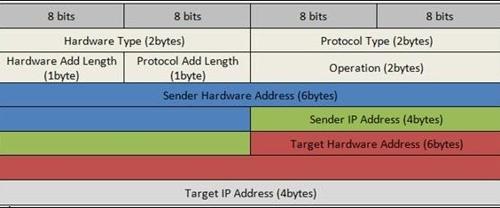
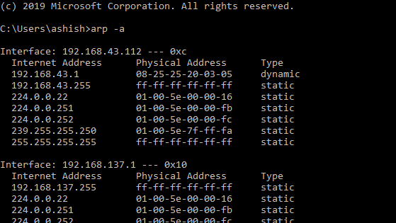

तांत्रिक वर्णन

पत्ता

परिणाम प्रोटोकॉल (एआरपी)

**इथरनेट Resड्रेस रिझोल्यूशन प्रोटोकॉल**

**\-- किंवा \--**

**नेटवर्क प्रोटोकॉल पत्ते रूपांतरित करीत आहे**

[[https://tools.ietf.org/html/rfc826]{.ul}](https://www.google.com/url?q=https%3A%2F%2Ftools.ietf.org%2Fhtml%2Frfc826&sa=D&sntz=1&usg=AFQjCNHSlGxJe18c1VJeIV6ePn4xPAj3rA)

> निःसंशयपणे आजच्या जगात संगणक नेटवर्किंग तंत्रज्ञानामध्ये इथरनेट वापरले
> जाणारे सर्वात लोकप्रिय तंत्रज्ञान आहे. त्यातील लक्षात घेण्याजोगे
> वैशिष्ट्य म्हणजे ती उच्च कार्यक्षमता टिकाऊपणा वैशिष्ट्य प्रदान
> करते. हे कोक्सीअल केबल्स, नेटवर्क इंटरफेस कार्ड (एनआयसी) इत्यादी भौतिक
> माध्यमांचा वापर करून 10-100 एमबीपीएस इत्यादी दरासह संप्रेषित
> सहकारी-परिभाषित प्रोटोकॉलचे एक कुटुंब आहे.
>
> इथरनेट तंत्रज्ञानामधील माहिती पॅकेटच्या स्वरूपात भौतिक माध्यमांचा वापर
> करून पाठविली जाते. पॅकेटच्या आकारावर अवलंबून, त्यातील डेटा कदाचित
> तुटलेला असेल आणि लहान फ्रेम्समध्ये गुंडाळला जाऊ शकेल आणि नंतर त्या
> ठिकाणी पुन्हा पाठवावे अशा ठिकाणी पाठवा. प्रेषकांच्या एनआयसीचा वापर
> करून वायरवर या फ्रेम लिहिलेल्या आहेत. ही पॅकेट प्रेषकाद्वारे
> प्राप्तकर्त्याद्वारे तयार केली जातात ज्यांना नेटवर्कमध्ये कनेक्ट
> केलेले असणे आवश्यक आहे. हे पॅकेट त्याच्या गंतव्यस्थानावर पोहोचण्यासाठी
> राउटरद्वारे किंवा स्विचद्वारे प्रवास करू शकते. एक प्रोटोकॉल दोन
> नेटवर्क ओळखीमधील संवादासाठी नियमांचे संच परिभाषित करते. लक्षात ठेवा
> प्रेषक आणि प्राप्तकर्ता यांच्यातील अन्य नेटवर्किंग डिव्हाइस हे पॅकेट
> प्रक्रियेसाठी उचलणार नाहीत परंतु ते सोडले जातील. तर, आम्हाला एक
> प्रोटोकॉल आवश्यक आहे जिथे \<प्रोटोकॉल प्रकार, प्रोटोकॉल पत्ता\> च्या
> आधारावर केवळ प्रेषकाकडून प्राप्तकर्त्याकडे जाण्यासाठी मार्ग आवश्यक
> आहे.

**गोषवारा:**

> असे समजू या की एकाच नेटवर्कवर अ आणि बी ही दोन नेटवर्किंग साधने
> अस्तित्त्वात आहेत आणि त्यांचे खाली गुणधर्म आहेत:
>
> डिव्हाइस अ:
>
> मॅक = एम (ए)
>
> आयपी = मी (ए)
>
> डिव्हाइस बी:
>
> मॅक = एम (बी)
>
> आयपी = मी (बी)
>
> आता एला बीशी संवाद साधायचा आहे आणि फक्त बीची आयपी मालमत्ता माहित आहे.
> आय (बी) ते एम (बी) नकाशा करण्यासाठी ए त्याच्या प्रोटोकॉल स्टॅक एआरपी
> मॉड्यूलचा सल्ला घेईल. म्हणून ए चे एआरपी मॉड्यूल नेटवर्कवर एक प्रसारण
> पॅकेट पाठवेल ज्यात बी डिव्हाइस त्याच्या मॅक तपशीलांसह प्रतिसाद देईल.
> आता ए च्या एआरपी मॉड्यूल वायरवर पाठवण्यासाठी इथरनेट पॅकेट तयार
> करण्यासाठी वापरण्यासाठी या तपशीलांना कॅशे करते.
>
> नोट्स:
>
> अ‍ॅड्रेस रेझोल्यूशन प्रोटोकॉल (एआरपी) टीपीपी / आयपी सूटमधील प्रमुख
> प्रोटोकॉलपैकी एक आहे ज्यायोगे आयपीव्ही 4 पत्ता (32-बिट लॉजिकल
> अ‍ॅड्रेस) फिजिकल अ‍ॅड्रेस (48-बिट मॅक अ‍ॅड्रेस) वर मॅप करावा. नेटवर्क
> साधनांना तार्किक नावे मॅक पत्त्यावर सोडविण्यासाठी तार्किक नाव आणि
> निम्न स्तर किंवा प्रोटोकॉल असाइन केले जातात. अनुप्रयोग लेयरवरील
> नेटवर्क अनुप्रयोग दुसर्‍या डिव्हाइससह संप्रेषण करण्यासाठी IPv4 पत्ता
> वापरतात. तथापि, डेटा दुवा स्तरावर, अ‍ॅड्रेसिंगचा वापर मोड आहे मॅक
> अ‍ॅड्रेस (एक 48-बिट फिजिकल अ‍ॅड्रेस) आहे जो नेटवर्क कार्डमध्ये कायमचा
> बर्न केला जातो. अ‍ॅड्रेस रिझोल्यूशन प्रोटोकॉल (एआरपी) चा उद्देश आपल्या
> स्थानिक एरिया नेटवर्क (लॅन) मधील एखाद्या डिव्हाइसचा मॅक पत्ता शोधणे,
> संबंधित आयपीव्ही 4 पत्त्यासाठी, कोणता नेटवर्क अनुप्रयोग संप्रेषण
> करण्याचा प्रयत्न करीत आहे.

**समस्या:**

> संगणक नेटवर्किंग अस्तित्वात आल्यापासून, विविध विक्रेत्यांद्वारे
> बनविलेले आणि प्रदान केल्यानुसार बर्‍याच प्रकारचे नेटवर्किंग डिव्हाइस
> भिन्न इंटरफेससह आहेत. पूर्वी चर्चा केल्याप्रमाणे त्यांना फ्रेमद्वारे
> संप्रेषण करणे आवश्यक आहे जे आता एक प्रकार म्हणून वर्गीकृत केले जाऊ
> शकतात - एक पॅकेट दुसर्‍यापासून वेगळे करणे. लक्षात ठेवा की नेटवर्कवर
> इतर विविध प्रकारचे प्रोटोकॉल आणि हार्डवेअर आहेत आणि त्या सर्वांना
> विशिष्ट दराने पॅकेट प्रसारित करण्यासाठी केबल्सची आवश्यकता
> आहे. प्रोटोकॉल पत्ता 48-बिट पत्ता किंवा असू शकत नाही - ते 8 बिट्स ते
> 48 बिट्स पत्त्यामध्ये बदलू शकतात. 10Mbit इथरनेट नेटवर्क इथरनेट पॅकेट
> शीर्षलेखातील प्रकार फील्डद्वारे या सर्व प्रोटोकॉल (आणि अधिक) एकाच
> केबलवर एकत्र राहण्याची परवानगी देतो.
>
> \<प्रोटोकॉल, पत्ता\> जोडी आणि 48-बिट इथरनेट अ‍ॅड्रेस दरम्यान
> पत्रव्यवहार गतिकरित्या वितरीत करण्यासाठी एक प्रोटोकॉल आवश्यक
> आहे. एआरपी स्थानिक क्षेत्रातील डेटा दुवा स्तर (ओएसआयचा स्तर 2) किंवा
> कनेक्ट केलेल्या डिव्हाइसच्या पॉईंट-टू-पॉइंट लिंक नेटवर्कमध्ये समान
> वापरला जातो. इथरनेट समर्थित नेटवर्क डिव्हाइसमधील मॅक पत्ते निश्चित
> 6-बाइट (48-बिट) चे आहेत. आयपी पत्ते कोणत्याही इंटरफेससाठी निश्चित
> कॉन्फिगरेशन नसतात. डिव्‍हाइसेस स्वहस्ते आयपी पत्त्यासह कॉन्फिगर केली
> जाऊ शकतात किंवा ते नेटवर्कमधील डायनॅमिक होस्ट कॉन्फिगरेशन प्रोटोकॉल
> (डीएचसीपी) सर्व्हरकडून प्राप्त करू शकतात. लक्षात ठेवा जेव्हा जेव्हा
> गंतव्य आयपी पॅकेट माहिती उपलब्ध नसते तेव्हा नेटवर्क / होस्ट आयडीच्या
> आधारे ही इथरनेट पॅकेट नेटवर्क गेटवेवर अग्रेषित केली जातील.

**प्रेरणा:**

> त्याच्या विश्वासार्हते / गती वैशिष्ट्यांमुळे, इथरनेट वापरात सर्वात
> लोकप्रिय नेटवर्किंग प्रोटोकॉल बनला. त्याच्या स्टॅकमध्ये अधिकाधिक
> प्रोटोकॉल लागू करण्यात आले. तरीही इतर विक्रेत्यांकडे अ‍ॅड्रेस
> रिझोल्यूशन प्रोटोकॉलची स्वतःची आवृत्ती असू शकते. ते हे वैशिष्ट्य मानक
> स्वरुपात प्रदान करतात जसे की विक्रेता विशिष्ट डिव्हाइस अद्याप
> कोणत्याही सुधारणाची आवश्यकता न करता ते तयार करु शकतात. तर आमच्याकडे एक
> विषम डिव्हाइस सेटअप नेटवर्क असू शकते परंतु तरीही फ्रेम त्यांच्या
> दरम्यान पाठवू किंवा प्राप्त करू देतो.

**व्याख्या:**

> अ‍ॅड्रेस रिझोल्यूशन प्रोटोकॉल (एआरपी) टीसीपी / आयपी खटल्यातील एक
> प्रमुख प्रोटोकॉल आहे आणि अ‍ॅड्रेस रिझोल्यूशन प्रोटोकॉल (एआरपी) चा
> उद्देश आयपीव्ही address अ‍ॅड्रेस (-२-बिट लॉजिकल अ‍ॅड्रेस) फिजिकल
> पत्त्यावर (bit 48 बिट एमएसी पत्ता) मॅप करणे आहे. ). अनुप्रयोग लेयरवरील
> नेटवर्क अनुप्रयोग दुसर्‍या डिव्हाइससह संप्रेषण करण्यासाठी IPv4 पत्ता
> वापरतात. परंतु डेटा दुवा स्तरावर, अ‍ॅड्रेसिंग मॅक पत्ता (48-बिट भौतिक
> पत्ता) आहे आणि हा पत्ता कायमस्वरूपी नेटवर्क कार्डमध्ये बर्न केला जातो.
>
> अ‍ॅड्रेस रिझोल्यूशन प्रोटोकॉल (एआरपी) चा उद्देश आपल्या स्थानिक एरिया
> नेटवर्क (लॅन) मधील एखाद्या डिव्हाइसचा मॅक पत्ता शोधणे, संबंधित
> आयपीव्ही 4 पत्त्यासाठी, कोणता नेटवर्क अनुप्रयोग संप्रेषण करण्याचा
> प्रयत्न करीत आहे.

**एआरपीचा इतिहास:**

> एआरपी प्रथम विनंत्यासाठी विनंत्या (आरएफसी) 826 मध्ये डेव्हिड सी.
> प्लुमर यांनी नोव्हेंबर 1982 मध्ये प्रकाशित केली आणि त्यावर चर्चा केली.
> आयपी प्रोटोकॉल सुटच्या सुरुवातीच्या काळात अ‍ॅड्रेस रिझोल्यूशनची समस्या
> त्वरित स्पष्ट झाली, कारण इथरनेट द्रुतपणे प्राधान्यकृत लॅन तंत्रज्ञान
> बनले आणि इथरनेट केबल्सना 48-बिट पत्ते आवश्यक आहेत.
>
> या प्रोटोकॉलचे वर्णन आतापर्यंत सामान्यपणे वापरल्या जाणार्‍या इंटरनेट
> आरएफसीच्या पूर्वार्धातल्या एकामध्ये केले आहे: 1982 मध्ये प्रकाशित
> आरएफसी 826, एक इथरनेट Resड्रेस रिझोल्यूशन प्रोटोकॉल.
>
> हे नाव स्पष्ट करते की एआरपी मूळतः इथरनेटसाठी विकसित केले गेले होते.
> अशा प्रकारे, तो सर्वात लोकप्रिय स्तर दोन लॅन प्रोटोकॉल आणि सर्वात
> लोकप्रिय स्तर तीन इंटरनेट नेटवर्किंग प्रोटोकॉल दरम्यानचा एक संबंध
> दर्शवितो - दोन दशकांनंतरही हे सत्य आहे. तथापि, हे अगदी सुरुवातीपासूनच
> स्पष्ट होते की जरी इथरनेट आयपीची वाहतूक करण्याचा एक सामान्य मार्ग असला
> तरी तो एकमेव नसतो. म्हणून, एआरपी एक सामान्य प्रोटोकॉल बनविला गेला होता
> जो आयपीपासून केवळ इथरनेटच नव्हे तर असंख्य इतर डेटा लिंक लेयर
> तंत्रज्ञानाचे पत्ते निराकरण करण्यास सक्षम होता.

**आढावा:**

> अ‍ॅड्रेस रिझोल्यूशन प्रोटोकॉल (एआरपी) इंटरनेट वर्गावरील संप्रेषणास
> सक्षम बनविण्यासाठी विकसित केले गेले आहे आणि आरएफसी 82२ 82 द्वारे
> वैशिष्ट्यीकृत आहे. लेअर g गॅझेट्सला मॅक हार्डवेअर पत्त्यावर आयपी
> नेटवर्क पत्ते मॅप करण्यासाठी एआरपी आवश्यक आहे जेणेकरून आयपी बंडल
> सिस्टीममध्ये पाठविता येतील. एखादे डिव्हाइस दुसर्‍या डिव्हाइसवर
> डेटाग्राम पाठविण्यापूर्वी, त्याच्या एआरपी कॅशेमध्ये तेथे लक्ष्यीकरण
> गॅझेटसाठी मॅक पत्ता आणि संबंधित आयपी पत्ता आहे की नाही याची तपासणी
> केली जाते. प्रवेश नसल्याच्या बंद संधीवर, स्त्रोत गॅझेट सिस्टमवरील
> प्रत्येक गॅझेटला संप्रेषण संदेश पाठवते. प्रत्येक गॅझेट स्वत: चे आयपी
> पत्ता पाहतो. समन्वयक आयपी पत्त्यासह गॅझेटला गॅझेटसाठी एमएसी पत्ता
> असलेल्या बंडलसह (\"मध्यस्थ एआरपी\" च्या बाजूला वगळता) पाठविणार्‍या
> गॅझेटला उत्तर दिले जाते.
>
> जेव्हा गंतव्य डिव्हाइस दूरच्या सिस्टमवर असते, दुसर्‍या लेअर 3
> डिव्हाइसच्या पलीकडे असते तेव्हा अपवाद वगळता ही प्रक्रिया समान आहे की
> पाठविणारे डिव्हाइस डीफॉल्ट गेटवेच्या मॅक पत्त्यासाठी एआरपी मागणी
> पाठवते. पत्ता निराकरण झाल्यानंतर आणि डीफॉल्ट गेटवेला पॅकेट
> मिळाल्यानंतर, डीफॉल्ट गेटवे त्याच्याशी संबंधित सिस्टमवर गंतव्यस्थान IP
> पत्ता प्रसारित करते. गंतव्य डिव्हाइस नेटवर्कवरील लेअर 3 डिव्हाइस
> गंतव्य डिव्हाइसचा मॅक पत्ता प्राप्त करण्यासाठी एआरपीचा वापर करते आणि
> पॅकेट वितरीत करते.

**हे कसे कार्य करते:**

> जेव्हा एखादा नवीन संगणक लॅनमध्ये सामील होतो, तेव्हा तो ओळख आणि
> संप्रेषणासाठी वापरण्यासाठी एक अद्वितीय आयपी पत्ता नियुक्त केला जातो.
> जेव्हा एखाद्या विशिष्ट लॅनवर होस्ट मशीनसाठी निश्चित केलेले इनकमिंग
> पॅकेट गेटवेवर येते तेव्हा गेटवे एआरपी प्रोग्रामला आयपी पत्त्याशी
> जुळणारा एक मॅक पत्ता शोधण्यास सांगतो. एआरपी कॅशे नावाची सारणी प्रत्येक
> आयपी पत्त्याची आणि त्याच्याशी संबंधित मॅक पत्त्याची नोंद ठेवते (
> [[आरएफसी
> 5227]{.ul}](https://www.google.com/url?q=https%3A%2F%2Ftools.ietf.org%2Fhtml%2Frfc5227%23section-1.3&sa=D&sntz=1&usg=AFQjCNGGQNaGP6atAzMmhiHh4AUWOs6BDQ)
> ).
>
> आयपीव्ही 4 इथरनेट नेटवर्कमधील सर्व ऑपरेटिंग सिस्टम एआरपी कॅशे ठेवतात.
> लॅनमधील दुसर्‍या होस्टला पॅकेट पाठविण्यासाठी होस्ट जेव्हा प्रत्येक
> वेळी मॅक पत्त्याची विनंती करतो तेव्हा तो आयआर टू मॅक अ‍ॅड्रेस भाषांतर
> आधीपासून अस्तित्त्वात आहे का ते तपासण्यासाठी एआरपी कॅशे तपासते. जर तसे
> झाले तर नवीन एआरपी विनंती अनावश्यक आहे. जर भाषांतर आधीपासूनच विद्यमान
> नसेल तर नेटवर्क पत्त्यांसाठी विनंती पाठविली जाईल आणि एआरपी केली जाईल.
>
> एआरपी लॅनवरील सर्व मशीनवर विनंती पॅकेट प्रसारित करते आणि कोणत्याही
> मशीनला ते त्या विशिष्ट आयपी पत्त्याचा वापर करीत असल्याचे माहित आहे का
> ते विचारते. जेव्हा एखादा मशीन आयपी पत्ता स्वतःचा म्हणून ओळखतो तेव्हा
> ते उत्तर पाठवते जेणेकरून एआरपी भविष्यातील संदर्भासाठी कॅशे अद्यतनित
> करू शकेल आणि संप्रेषणासह पुढे जाऊ शकेल.
>
> होस्ट मशीन्स ज्यांना स्वतःचा आयपी पत्ता माहित नाही तो शोध घेण्यासाठी
> रिव्हर्स एआरपी (आरएआरपी) प्रोटोकॉल वापरू शकतो.
>
> एआरपी कॅशेचा आकार मर्यादित आहे आणि वेळोवेळी जागा मोकळ्या करण्यासाठी
> सर्व नोंदी साफ केल्या जातात; खरं तर, पत्ते फक्त काही मिनिटे कॅशेमध्येच
> राहतात. वारंवार होणारी अद्यतने नेटवर्कमधील इतर डिव्हाइसेसना हे
> पाहण्याची परवानगी देतात की जेव्हा भौतिक होस्ट त्यांचा विनंती केलेला IP
> पत्ता बदलतो तेव्हा. साफसफाईच्या प्रक्रियेत, न वापरलेल्या प्रविष्ट्या
> तसेच सध्या चालू नसलेल्या संगणकांशी संवाद साधण्याचे कोणतेही अयशस्वी
> प्रयत्न तसेच हटविल्या जातात

**टर्मिनोलॉजी:**

> मॅपिंगचे दोन प्रकार आहेत:
>
> 1\. स्टॅटिक मॅपिंग
>
> 2\. डायनेमिक मॅपिंग

**स्थिर मॅपिंग:**

> स्टॅटिक मॅपिंग म्हणजे तार्किक पत्ता भौतिक पत्त्यासह जोडणारा एक टेबल
> तयार करणे. हे टेबल नेटवर्कवरील प्रत्येक मशीनमध्ये संग्रहित आहे
>
> प्रत्येक मशीन ज्यास माहित आहे, उदाहरणार्थ, दुसर्‍या मशीनचा आयपी पत्ता
> परंतु त्याचा प्रत्यक्ष पत्ता नाही तो टेबलमध्ये पाहू शकतो. यास काही
> मर्यादा आहेत कारण शारीरिक पत्ते पुढील मार्गांनी बदलू शकतात:
>
> · एक मशीन त्याच्या NIC बदलू शकते एक नवीन भौतिक पत्ता परिणामी,.
>
> Local लोकल टॉक सारख्या काही लॅनमध्ये प्रत्येक वेळी संगणक चालू केल्यावर
> भौतिक पत्ता बदलतो.
>
> Mobile मोबाईल संगणक एका भौतिक नेटवर्कवरून दुसर्‍या फिजिकल नेटवर्कमध्ये
> जाऊ शकतो, परिणामी त्याचा भौतिक पत्ता बदलतो.
>
> हे बदल अंमलात आणण्यासाठी, स्थिर मॅपिंग सारणी नियमितपणे अद्यतनित केली
> जाणे आवश्यक आहे. हे ओव्हरहेड नेटवर्क कार्यक्षमतेवर परिणाम करू शकते.

**डायनामिक मॅपिंग:**

> डायनॅमिक मॅपिंगमध्ये, प्रत्येक वेळी मशीनला दुसर्‍या मशीनचा लॉजिकल
> पत्ता माहित असतो, तो प्रत्यक्ष पत्ता शोधण्यासाठी प्रोटोकॉल वापरू शकतो.
> डायनॅमिक मॅपिंग करण्यासाठी दोन प्रोटोकॉल तयार केले गेले आहेत: अ‍ॅड्रेस
> रिझोल्यूशन प्रोटोकॉल (एआरपी) आणि रिव्हर्स Addressड्रेस रिझोल्यूशन
> प्रोटोकॉल (आरएआरपी). एआरपी प्रत्यक्ष पत्त्यावर तार्किक पत्त्यावर नकाशे
> बनवते; RARP तार्किक पत्त्यावर प्रत्यक्ष पत्त्याचा नकाशा बनवते. आरएआरपी
> दुसर्‍या प्रोटोकॉलने बदलले गेले आहे आणि म्हणून त्याकडे दुर्लक्ष केले
> गेले आहे, म्हणून आम्ही या दस्तऐवजात केवळ एआरपी प्रोटोकॉलवर चर्चा करतो.

**एआरपी कॅचिंग:**

> इंटरनेटद्वारे पाठविलेल्या प्रत्येक डेटाग्रामसाठी नेटवर्कवरील प्रत्येक
> हॉप (लेअर 3 डिव्हाइस) वर आयपी पत्त्यांचे मीडिया controlक्सेस कंट्रोल
> (मॅक) च्या मॅपिंगमुळे नेटवर्कच्या कामगिरीमध्ये तडजोड केली जाऊ शकते.
> ब्रॉडकास्ट कमीतकमी करण्यासाठी आणि नेटवर्क संसाधनांचा फालतू वापर
> मर्यादित करण्यासाठी अ‍ॅड्रेस रिझोल्यूशन प्रोटोकॉल (एआरपी) कॅशिंग लागू
> केले गेले.
>
> एआरपी कॅशिंग हे पत्ते शिकल्यामुळे काही काळासाठी मेमरीमध्ये नेटवर्क
> पत्ते आणि संबंधित डेटा-लिंक पत्ते संचयित करण्याची पद्धत आहे.
>
> प्रत्येक वेळी डेटाग्राम पाठविला जातो तेव्हा त्याच पत्त्यासाठी प्रसारित
> करण्यासाठी मौल्यवान नेटवर्क स्त्रोतांचा वापर कमी करतो. कॅशे नोंदी
> देखरेख करणे आवश्यक आहे कारण माहिती कालबाह्य होऊ शकते, म्हणूनच गंभीर
> आहे की कॅशे नोंदी कालांतराने कालबाह्य झाल्या आहेत. पत्ते प्रसारित
> केल्याप्रमाणे नेटवर्कवरील प्रत्येक डिव्हाइस त्यांचे सारणी अद्यतनित
> करते.
>
> स्थिर एआरपी कॅशे प्रविष्ट्या आणि डायनॅमिक एआरपी कॅशे प्रविष्ट्या आहेत.
> स्थिर नोंदी स्वहस्ते कॉन्फिगर केल्या जातात आणि कायमस्वरुपी कॅशे
> टेबलमध्ये ठेवल्या जातात. नियमितपणे सामान्यपणे समान नेटवर्कमध्ये इतर
> डिव्हाइसशी संवाद साधण्याची आवश्यकता असलेल्या डिव्हाइससाठी स्थिर नोंदी
> सर्वोत्तम असतात. सिस्को सॉफ्टवेयरद्वारे डायनॅमिक प्रविष्ट्या जोडल्या
> जातात, काही कालावधीसाठी ठेवल्या जातात आणि नंतर काढल्या जातात.

**एआरपी कॅशेमधील स्थिर आणि डायनॅमिक प्रविष्टी**

> स्टॅटिक रूटिंगसाठी प्रशासकास आयपी पत्ते, सबनेट मास्क, गेटवे आणि
> त्यातील प्रत्येक डिव्हाइसच्या प्रत्येक इंटरफेससाठी संबंधित मीडिया
> controlक्सेस कंट्रोल (मॅक) पत्ते व्यक्तिचलितपणे प्रविष्ट करणे आवश्यक
> आहे. स्थिर रूटिंग अधिक नियंत्रण सक्षम करते परंतु सारणी राखण्यासाठी
> अधिक काम आवश्यक आहे. प्रत्येक वेळी मार्ग जोडले किंवा बदलले तेव्हा टेबल
> अद्यतनित करणे आवश्यक आहे.
>
> डायनॅमिक रूटिंग एक असे प्रोटोकॉल वापरते जे नेटवर्कमधील डिव्हाइसेसना
> एकमेकांशी राउटिंग टेबल माहितीची देवाणघेवाण करण्यास सक्षम करतात. सारणी
> अंगभूत आणि आपोआप बदलली आहे. मुदत जोपर्यंत जोपर्यंत कोणतीही प्रशासकीय
> कामे आवश्यक नाहीत, म्हणून स्थिर मार्गपेक्षा डायनॅमिक रूटिंग अधिक
> कार्यक्षम असते. डीफॉल्ट वेळ मर्यादा 4 तास आहे. नेटवर्कमध्ये जोडलेले
> आणि कॅशेमधून हटविलेले बरेच मार्ग असल्यास, वेळ मर्यादा समायोजित केली
> जावी.

**प्रॉक्सी एआरपी**

> आरएफसी 1027 मध्ये परिभाषित केल्याप्रमाणे प्रॉक्सी अ‍ॅड्रेस रिझोल्यूशन
> प्रोटोकॉलची अंमलबजावणी आयपी-टू-मॅक पत्त्यांचे निराकरण करण्यासाठी समान
> आयपी नेटवर्कमध्ये किंवा राऊटरद्वारे सबनेटवर्कद्वारे कनेक्ट केलेल्या
> फिजिकल नेटवर्क विभागांमध्ये विभक्त केलेली साधने सक्षम करण्यासाठी केली
> गेली. जेव्हा डिव्हाइस समान डेटा दुवा स्तर नेटवर्कमध्ये नसतात परंतु
> समान आयपी नेटवर्कमध्ये असतात तेव्हा ते स्थानिक नेटवर्कवर असल्यासारखे
> एकमेकांना डेटा प्रसारित करण्याचा प्रयत्न करतात.
>
> तथापि, डिव्हाइसद्वारे वेगळे केलेले राउटर प्रसारण संदेश पाठविणार नाही
> कारण राउटर हार्डवेअर-स्तर प्रसारणे पास करत नाहीत. म्हणून, पत्ते
> निराकरण करणे शक्य नाही.
>
> प्रॉक्सी एआरपी डीफॉल्टनुसार सक्षम केली जाते जेणेकरून स्थानिक
> नेटवर्कमध्ये राहणारा \"प्रॉक्सी राउटर\" त्याच्या मॅक पत्त्यासह
> प्रतिसाद देतो जणू ते प्रसारण संबोधित केलेल्या राउटरसारखे आहे. जेव्हा
> पाठविणार्‍या डिव्हाइसला प्रॉक्सी राउटरचा मॅक पत्ता प्राप्त होतो,
> तेव्हा ते प्रॉक्सी राउटरवर डेटाग्राम पाठवतात, ज्याच्या बदल्यात नियुक्त
> केलेल्या डिव्हाइसवर डेटाग्राम पाठविला जातो.

**एआरपी प्रोटोकोल स्ट्रक्चर:**

{width="5.875in" height="2.45in"}

> अ‍ॅड्रेस रिझोल्यूशन प्रोटोकॉल (एआरपी) मेसेज फॉरमॅटमधील फील्ड अशी आहेत:
>
> हार्डवेअर प्रकार: एआरपी संदेशामधील हार्डवेअर प्रकार फील्ड अ‍ॅड्रेस
> रिझोल्यूशन प्रोटोकॉल (एआरपी) संदेश पाठविणार्‍या स्थानिक नेटवर्कसाठी
> वापरलेल्या हार्डवेअरचा प्रकार निर्दिष्ट करतो. इथरनेट हा सामान्य
> हार्डवेअर प्रकार आहे आणि इथरनेटला त्याची किंमत 1 आहे. या क्षेत्राचे
> आकार 2 बाइट आहेत.
>
> · प्रोटोकॉल प्रकार: प्रत्येक प्रोटोकॉल या क्षेत्रात वापरली जाणारी एक
> संख्या नियुक्त केली आहे. आयपीव्ही 4 2048 (हेक्साडेसिमलमध्ये 0x0800)
> आहे.
>
> हार्डवेअर अ‍ॅड्रेस लांबी: एआरपी मेसेजमधील हार्डवेअर अ‍ॅड्रेस लांबी
> हार्डवेअर (मॅक) च्या बाइट्स मध्ये लांबी असते. इथरनेट मॅक पत्ते 6 बाइट
> लांबीचे आहेत.
>
> · प्रोटोकॉल अ‍ॅड्रेस लांबी: लॉजिकल अ‍ॅड्रेस (आयपीव्ही Addressड्रेस)
> च्या बाइट्स मध्ये लांबी. IPv4 पत्ते 4 बाइट लांबीचे आहेत.
>
> · ऑपकोड: एआरपी संदेशातील ऑपकोड फील्ड एआरपी संदेशाचे स्वरूप निर्दिष्ट
> करते. एआरपी विनंतीसाठी 1 आणि एआरपी उत्तरासाठी 2.
>
> Er प्रेषक हार्डवेअर पत्ता: संदेश पाठविणार्‍या डिव्हाइसचा स्तर 2 (मॅक
> पत्ता).
>
> · प्रेषक प्रोटोकॉल पत्ता: संदेश पाठविणार्‍या डिव्हाइसचा प्रोटोकॉल
> पत्ता (IPv4 पत्ता)
>
> · लक्ष्य हार्डवेअरचा पत्ता: लेअर 2 (MAC पत्ता) हेतू स्वीकारणारा.

**वायरशार्कमध्ये एआरपी स्ट्रक्चर:**

{width="9.266666666666667in"
height="5.166666666666667in"}

> सल्ला:
>
> एक एआरपी पॅकेट थेट डेटा दुवा फ्रेममध्ये अंतर्भूत केले जाते.
> उदाहरणार्थ, खालील आकृतीमध्ये, एआरपी पॅकेट इथरनेट फ्रेममध्ये
> एन्कप्युलेटेड आहे. लक्षात ठेवा की प्रकार फील्ड सूचित करतो की
> फ्रेमद्वारे केलेला डेटा एक एआरपी पॅकेट आहे.

{width="11.0in" height="3.775in"}

**एआरपी विनंती आणि उत्तर:**

> टिपिकल इंटरनेटवर एआरपी कसे कार्य करते ते पाहू. प्रथम आम्ही त्यात सामील
> असलेल्या चरणांचे वर्णन करतो. मग आम्ही त्या चार प्रकरणांची चर्चा करतो
> ज्यात होस्ट किंवा राउटरला एआरपी वापरण्याची आवश्यकता असते:
>
> · प्रेषकास लक्ष्याचा IP पत्ता माहित असतो.
>
> · आयपी एआरपीला एक एआरपी विनंती संदेश तयार करण्यास सांगतो, प्रेषकाचा
> भौतिक पत्ता, प्रेषक आयपी पत्ता आणि लक्ष्य आयपी पत्ता भरतो. लक्ष्य
> भौतिक पत्ता फील्ड 0 से भरलेले आहे.
>
> संदेश डेटा लिंक लेयरला पाठविला जातो जेथे प्रेषकाचा स्रोत पत्ता आणि
> भौतिक प्रसारण पत्ता गंतव्य पत्त्याच्या रूपात ( [[आरएफसी
> 5227]{.ul}](https://www.google.com/url?q=https%3A%2F%2Ftools.ietf.org%2Fhtml%2Frfc5227%23section-2.4&sa=D&sntz=1&usg=AFQjCNGOIIihwwC9SPzKWmd6tGEfJmatvQ)
> ) वापरुन एका फ्रेममध्ये ते [[एन्प्लेट केले
> जाते]{.ul}](https://www.google.com/url?q=https%3A%2F%2Ftools.ietf.org%2Fhtml%2Frfc5227%23section-2.4&sa=D&sntz=1&usg=AFQjCNGOIIihwwC9SPzKWmd6tGEfJmatvQ)
> .

{width="11.225in" height="6.6in"}

> Host प्रत्येक होस्ट किंवा राउटरला फ्रेम प्राप्त होतो. फ्रेममध्ये
> ब्रॉडकास्ट गंतव्य पत्ता असल्यामुळे सर्व स्थानक संदेश काढून तो एआरपीकडे
> पाठवतात. एक लक्ष्यित वगळता सर्व मशीन्स पॅकेट ड्रॉप करतात. लक्ष्य मशीन
> आयपी पत्ता ओळखतो.
>
> लक्ष्य मशीन एआरपी प्रत्युत्तर संदेशासह प्रत्युत्तर देते ज्यात त्याचा
> प्रत्यक्ष पत्ता आहे. संदेश युनिकास्ट आहे.
>
> · प्रेषकाला उत्तर संदेश प्राप्त होतो. हे आता लक्ष्य मशीनचा प्रत्यक्ष
> पत्ता माहित आहे.
>
> Machine लक्ष्य मशीनसाठी डेटा वाहून ठेवणारा आयपी डेटाग्राम आता एका
> फ्रेममध्ये एन्केप्युलेटेड आहे आणि गंतव्यस्थानावर युनिकास्ट आहे.

**एआरपीमध्ये 4 भिन्न प्रकरणे:**

{width="6.9in" height="5.125in"}

> एआरपी अटॅक आणि बचाव

**एआरपी पोझिशनिंग**

> एआरपी विषबाधा हा एक हल्ला आहे जिथे आम्ही नेटवर्कवर बनावट एआरपी उत्तर
> पॅकेट पाठवितो. दोन संभाव्य हल्ले आहेत ( [[आरएफसी
> 5227]{.ul}](https://www.google.com/url?q=https%3A%2F%2Ftools.ietf.org%2Fhtml%2Frfc5227%23section-5&sa=D&sntz=1&usg=AFQjCNF4XW82mDtC5zAxiTnsO0t6_f4fgQ)
> ):
>
> · **एमआयटीएम (मध्यभागी असलेला माणूस):** हल्लेखोर एआरपी प्रत्युत्तर
> त्याच्या स्वत: च्या मॅक पत्त्यासह आणि कायदेशीर होस्ट, सर्व्हर किंवा
> राउटरच्या आयपी पत्त्यासह पाठवेल. जेव्हा पीडिताला एआरपी प्रत्युत्तर
> प्राप्त होते तेव्हा ते त्याचे एआरपी टेबल अद्यतनित करते. जेव्हा ते
> कायदेशीर डिव्हाइसवर पोहोचण्याचा प्रयत्न करते, आयपी पॅकेट
> आक्रमणकर्त्यावर संपतात.
>
> OS **डॉस (सेवा नाकारणे):** हल्लेखोर कायदेशीर सर्व्हरच्या मॅक पत्त्यासह
> बर्‍याच एआरपी प्रत्युत्तरे पाठवेल. नेटवर्कमधील सर्व डिव्हाइस त्यांची
> एआरपी टेबल्स अद्यतनित करतील आणि नेटवर्कमधील सर्व आयपी पॅकेट सर्व्हरवर
> पाठविली जातील, त्यास रहदारीसह ओव्हरलोडिंग.
>
> हल्ला खालीलप्रमाणे कार्य करते:
>
> 1\. आक्रमणकर्त्यास नेटवर्कमध्ये प्रवेश असणे आवश्यक आहे. कमीतकमी दोन
> उपकरणांचे आयपी पत्ते निश्चित करण्यासाठी ते नेटवर्क स्कॅन करतात --- हे
> वर्कस्टेशन आणि राउटर असल्याचे समजू.
>
> २. बनावट एआरपी प्रतिसाद पाठविण्यासाठी हल्लेखोर स्पूफिंग टूलचा उपयोग
> करतो, जसे की आर्प स्पूफ किंवा ड्राफ्टनेट.
>
> 3\. बनावट प्रतिसाद जाहिरात दोन्ही IP पत्ते योग्य MAC पत्ता, राऊटर आणि
> वर्कस्टेशन राहण्याचे हल्लेखोर MAC पत्ता आहे. हे आक्रमणकर्त्याच्या
> मशीनशी जोडण्याकरिता राउटर आणि वर्कस्टेशन दोघांनाही मूर्ख बनविते.
>
> 4\. दोन साधने त्यांच्या ARP कॅशे नोंदणी अद्ययावतीत केले आणि त्या
> क्षणापासून, सह हल्लेखोर एकमेकांशी थेट ऐवजी संवाद.
>
> हल्लेखोर आता गुप्तपणे सर्व संवादाच्या मध्यभागी आहे.

{width="13.058333333333334in"
height="10.191666666666666in"}

> एकदा आक्रमणकर्ता एआरपी स्पूफिंग आक्रमणात यशस्वी झाल्यास ते हे करू
> शकतात:
>
> · **संचार मार्गाची जसे-आहे सुरू ठेवा** - हल्लेखोर पॅकेट डेटा श्वास आणि
> चोरी करू शकता HTTPS सारखे एका एनक्रिप्टेड चॅनेल स्थानांतरीत आहे तर
> वगळता.
>
> · **सत्र अपहृत पार** - हल्लेखोर एक सत्र ID प्राप्त तर ते खाती
> वापरकर्ता सध्या मध्ये लॉग इन केले आहे प्रवेश प्राप्त करू शकता.
>
> · **आफ्टर संवाद** - उदाहरणार्थ वर्कस्टेशन दुर्भावनायुक्त फाइल किंवा
> वेबसाइट खटपटी
>
> · **सेवा वितरित नकार (DDoS) -** हल्लेखोर सर्व्हर ऐवजी त्यांच्या स्वत:
> च्या मशीन, आहरण सह हल्ला इच्छित MAC पत्ता प्रदान करू शकता. त्यांनी
> मोठ्या संख्येने आयपीसाठी असे केल्यास, लक्ष्य सर्व्हर रहदारीसह बोंब
> मारले जाईल.

**शोध:**

> कमांड लाइनचा वापर करून विशिष्ट डिव्हाइसच्या एआरपी कॅशेला विषबाधा
> झाल्याचे शोधण्याचा सोपा मार्ग. प्रशासक म्हणून ऑपरेटिंग सिस्टम शेल सुरू
> करा. विंडोज आणि लिनक्स दोन्हीवर एआरपी टेबल प्रदर्शित करण्यासाठी खालील
> कमांडचा वापर करा

{width="5.825in" height="3.283333333333333in"}

{width="4.533333333333333in"
height="1.0833333333333333in"}

> जर सारणीमध्ये समान MAC पत्ते असलेले दोन भिन्न IP पत्ते असतील तर हे
> दर्शविते की एआरपी हल्ला होत आहे.
