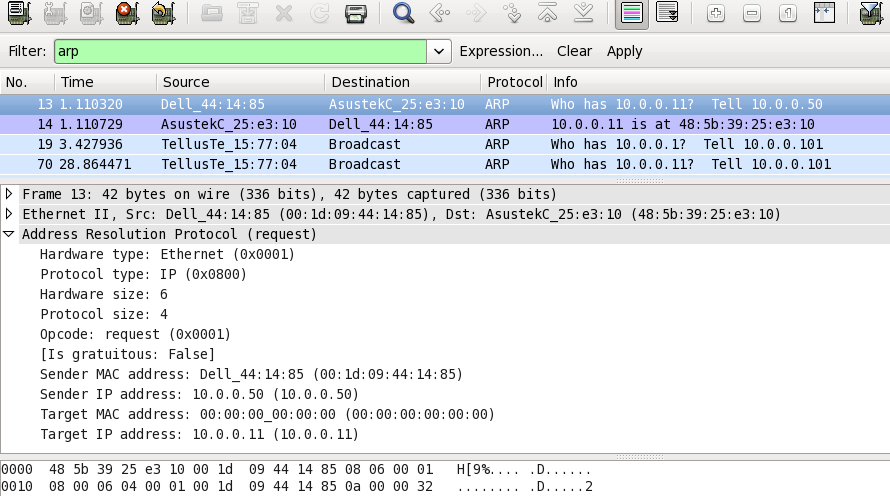

ଯାନ୍ତ୍ରିକ ବର୍ଣ୍ଣନା

ADDRESS

ଫଳାଫଳ ପ୍ରୋଟୋକଲ୍ (ଆର୍ପି)

**ଏକ ଇଥରନେଟ୍ ଠିକଣା ରିଜୋଲ୍ୟୁସନ୍ ପ୍ରୋଟୋକଲ୍ \|**

**- କିମ୍ବା -**

**ନେଟୱର୍କ ପ୍ରୋଟୋକଲ୍ ଠିକଣାଗୁଡ଼ିକୁ ରୂପାନ୍ତର କରିବା \|**

[[https://tools.ietf.org/html/rfc826]{.ul}](https://www.google.com/url?q=https%3A%2F%2Ftools.ietf.org%2Fhtml%2Frfc826&sa=D&sntz=1&usg=AFQjCNHSlGxJe18c1VJeIV6ePn4xPAj3rA)

> ଆଜିର ଦୁନିଆରେ ନି computer ସନ୍ଦେହ, କମ୍ପ୍ୟୁଟର ନେଟୱାର୍କିଂ ଟେକ୍ନୋଲୋଜିରେ
> ବ୍ୟବହୃତ ସବୁଠାରୁ ଲୋକପ୍ରିୟ ଟେକ୍ନୋଲୋଜି ଇଥରନେଟ୍ \| ଏହାର ଏକ ଉଲ୍ଲେଖନୀୟ ବ
> features ଶିଷ୍ଟ୍ୟ ହେଉଛି ଏହା ଉଚ୍ଚ କାର୍ଯ୍ୟଦକ୍ଷତା ସ୍ଥିରତା ବ feature
> ଶିଷ୍ଟ୍ୟ ପ୍ରଦାନ କରେ \| ଏହା ଏକ ସହ-ସମ୍ବନ୍ଧୀୟ ସୁ-ପରିଭାଷିତ ପ୍ରୋଟୋକଲଗୁଡିକର
> ଏକ ପରିବାର ଯାହାକି 10/100 ଏମବିପିଏସ୍ ଇତ୍ୟାଦି ହାରରେ ତଥ୍ୟ ପଠାଇଥାଏ ଯେପରି ଭ
> physical ତିକ ମିଡିଆ ବ୍ୟବହାର କରି - କୋକ୍ସସିଆଲ୍ କେବୁଲ୍, ନେଟୱାର୍କ ଇଣ୍ଟରଫେସ୍
> କାର୍ଡ (NIC) ଇତ୍ୟାଦି \|
>
> ଇଥରନେଟ ଟେକ୍ନୋଲୋଜିରେ ସୂଚନା ପ୍ୟାକେଟ ଆକାରରେ ଏକ ଭ physical ତିକ ମିଡିଆ
> ବ୍ୟବହାର କରି ପଠାଯାଏ \| ପ୍ୟାକେଟ ଆକାର ଉପରେ ନିର୍ଭର କରି, ଏଥିରେ ଥିବା ତଥ୍ୟକୁ
> ଭାଙ୍ଗି ଛୋଟ ଫ୍ରେମରେ ଗୁଡ଼ାଇ ଦିଆଯାଇପାରେ ଏବଂ ତା'ପରେ ଗନ୍ତବ୍ୟ ସ୍ଥଳକୁ ପଠାଯାଏ
> ଯେଉଁଠାରେ ଏହା ପୁନର୍ବାର ଏକତ୍ର ହୋଇପାରିବ \| ପ୍ରେରକଙ୍କ NIC ବ୍ୟବହାର କରି ଏହି
> ଫ୍ରେମ୍ ଗୁଡିକ ତାରରେ ଲେଖାଯାଇଛି \| ଏହି ପ୍ୟାକେଟଗୁଡିକ ଏକ ରିସିଭର୍ ପାଇଁ
> ପ୍ରେରକଙ୍କ ଦ୍ gener ାରା ସୃଷ୍ଟି ହୋଇଥାଏ ଯାହାକି ନେଟୱାର୍କରେ ସଂଯୁକ୍ତ ହେବା
> ଆବଶ୍ୟକ \| ପ୍ୟାକେଟ୍ ହୁଏତ ରାଉଟର କିମ୍ବା ସୁଇଚ୍ ମାଧ୍ୟମରେ ଏହାର ଗନ୍ତବ୍ୟ
> ସ୍ଥଳରେ ପହଞ୍ଚିବା ପାଇଁ ଯାତ୍ରା କରିପାରେ \| ଦୁଇଟି ନେଟୱର୍କ ପରିଚୟ ମଧ୍ୟରେ
> ଯୋଗାଯୋଗ ପାଇଁ ଏକ ପ୍ରୋଟୋକଲ୍ ନିୟମର ସେଟ୍ ବ୍ୟାଖ୍ୟା କରେ \| ଧ୍ୟାନ ଦିଅନ୍ତୁ ଯେ
> ପ୍ରେରକ ଏବଂ ରିସିଭର୍ ମଧ୍ୟରେ ଥିବା ଅନ୍ୟ ନେଟୱାର୍କିଙ୍ଗ୍ ଡିଭାଇସ୍ ପ୍ରକ୍ରିୟାକରଣ
> ପାଇଁ ଏହି ପ୍ୟାକେଟଗୁଡ଼ିକୁ ଉଠାଇବ ନାହିଁ ବରଂ ଏହାକୁ ଛାଡିଦେବ \| ତେଣୁ, ଆମକୁ ଏକ
> ପ୍ରୋଟୋକଲ୍ ଦରକାର ଯେଉଁଠାରେ \<ପ୍ରୋଟୋକଲ୍ ପ୍ରକାର, ପ୍ରୋଟୋକଲ୍ ଠିକଣା\> ଉପରେ
> ଆଧାର କରି ଏହା କେବଳ ପ୍ରେରକଙ୍କ ଠାରୁ ରିସିଭର୍ ପର୍ଯ୍ୟନ୍ତ ଏକ ପଥ ଅତିକ୍ରମ କରିବା
> ଆବଶ୍ୟକ କରେ \|

**ABSTRACT:**

> ଆସନ୍ତୁ ଧରିବା ଯେ ଦୁଇଟି ନେଟୱାର୍କିଙ୍ଗ୍ ଡିଭାଇସ୍ A ଏବଂ B ସମାନ ନେଟୱାର୍କରେ
> ବିଦ୍ୟମାନ ଅଛି ଏବଂ ଏହାର ନିମ୍ନ ଗୁଣ ଅଛି:
>
> ଉପକରଣ A:
>
> MAC = M (A)
>
> IP = I (A)
>
> ଉପକରଣ B:
>
> MAC = M (B)
>
> IP = I (B)
>
> ବର୍ତ୍ତମାନ A B ସହିତ ଯୋଗାଯୋଗ କରିବାକୁ ଚାହୁଁଛି ଏବଂ କେବଳ B ର IP ସମ୍ପତ୍ତି
> ଜାଣେ \| I (B) ରୁ M (B) କୁ ମାନଚିତ୍ର କରିବା ପାଇଁ A ଏହାର ପ୍ରୋଟୋକଲ୍ ଷ୍ଟାକ
> ARP ମଡ୍ୟୁଲ୍ ସହିତ ପରାମର୍ଶ କରିବ \| ତେଣୁ A ର ARP ମଡ୍ୟୁଲ୍ ନେଟୱାର୍କରେ ଏକ
> ପ୍ରସାରଣ ପ୍ୟାକେଟ୍ ପଠାଇବ ଯେଉଁଥିରେ B ଉପକରଣ ଏହାର MAC ବିବରଣୀ ସହିତ
> ପ୍ରତିକ୍ରିୟା କରିବ \| ବର୍ତ୍ତମାନ A ର ARP ମଡ୍ୟୁଲ୍ ଗୁଡିକ ଏହି ସବିଶେଷ ତଥ୍ୟକୁ
> କ୍ୟାଚ୍ କରେ ଯାହା ତାର ଉପରେ ପଠାଯିବା ପାଇଁ ଏକ ଇଥରନେଟ୍ ପ୍ୟାକେଟ୍ ତିଆରି
> କରିବାକୁ ବ୍ୟବହୃତ ହୁଏ \|
>
> ଟିପ୍ପଣୀ:
>
> ଠିକଣା ରିଜୋଲ୍ୟୁସନ୍ ପ୍ରୋଟୋକଲ୍ (ARP) ହେଉଛି TCP / IP ସୁଟ୍ ର ଏକ ପ୍ରମୁଖ
> ପ୍ରୋଟୋକଲ୍ ମଧ୍ୟରୁ ଗୋଟିଏ ହେଉଛି IPv4 ଠିକଣା (32-ବିଟ୍ ଲଜିକାଲ୍ ଠିକଣା) କୁ ଭ
> physical ତିକ ଠିକଣା (48-ବିଟ୍ MAC ଠିକଣା) କୁ ମାନଚିତ୍ର କରିବା \| ନେଟୱର୍କ
> ଉପକରଣଗୁଡ଼ିକୁ ଏକ ତାର୍କିକ ନାମ ଏବଂ ନିମ୍ନ ସ୍ତର କିମ୍ବା ପ୍ରୋଟୋକଲଗୁଡ଼ିକୁ MAC
> ଠିକଣାରେ ସମାଧାନ କରିବାକୁ ନ୍ୟସ୍ତ କରାଯାଇଛି \| ଅନ୍ୟ ଏକ ଉପକରଣ ସହିତ ଯୋଗାଯୋଗ
> କରିବାକୁ ଆପ୍ଲିକେସନ୍ ସ୍ତରରେ ନେଟୱର୍କ ପ୍ରୟୋଗଗୁଡ଼ିକ IPv4 ଠିକଣା ବ୍ୟବହାର
> କରନ୍ତି \| ତଥାପି, ଡାଟା ଲିଙ୍କ୍ ସ୍ତରରେ, ଠିକଣା ହେଉଛି ବ୍ୟବହୃତ ମୋଡ୍ ହେଉଛି
> MAC ଠିକଣା (ଏକ 48-ବିଟ୍ ଫିଜିକାଲ୍ ଠିକଣା) ଯାହା ନେଟୱର୍କ କାର୍ଡରେ ସ୍ଥାୟୀ
> ଭାବରେ ଜଳିଯାଏ \| ଠିକଣା ରିଜୋଲ୍ୟୁସନ୍ ପ୍ରୋଟୋକଲ୍ (ARP) ର ଉଦ୍ଦେଶ୍ୟ ହେଉଛି,
> ଆପଣଙ୍କର ସ୍ଥାନୀୟ କ୍ଷେତ୍ର ନେଟୱାର୍କ (LAN) ରେ ଥିବା ଏକ ଉପକରଣର MAC ଠିକଣା
> ଖୋଜିବା, ସେହି IPv4 ଠିକଣା ପାଇଁ, କେଉଁ ନେଟୱାର୍କ ପ୍ରୟୋଗ ଯୋଗାଯୋଗ କରିବାକୁ
> ଚେଷ୍ଟା କରୁଛି \|

**ସମସ୍ୟା:**

> ଯେହେତୁ କମ୍ପ୍ୟୁଟର ନେଟୱାର୍କିଂ ବିଦ୍ୟମାନ ଅଛି ସେଠାରେ ବିଭିନ୍ନ ବିକ୍ରେତାଙ୍କ
> ଦ୍ୱାରା ପ୍ରସ୍ତୁତ ଏବଂ ପ୍ରଦାନ କରାଯାଇଥିବା ପରି ବିଭିନ୍ନ ଇଣ୍ଟରଫେସ୍ ସହିତ ଅନେକ
> ପ୍ରକାରର ନେଟୱାର୍କିଂ ଉପକରଣ ଅଛି \| ପୂର୍ବରୁ ଆଲୋଚନା ହୋଇଥିବା ପରି ସେମାନେ
> ଫ୍ରେମ୍ ମାଧ୍ୟମରେ ଯୋଗାଯୋଗ କରିବା ଆବଶ୍ୟକ କରନ୍ତି ଯାହା ବର୍ତ୍ତମାନ ଏକ ପ୍ରକାର
> ଭାବରେ ଶ୍ରେଣୀଭୁକ୍ତ ହୋଇପାରିବ - ଗୋଟିଏ ପ୍ୟାକେଟ୍ ଅନ୍ୟଠାରୁ ପୃଥକ କରେ \| ଧ୍ୟାନ
> ଦିଅନ୍ତୁ ଯେ ନେଟୱାର୍କରେ ଅନ୍ୟାନ୍ୟ ପ୍ରକାରର ପ୍ରୋଟୋକଲ୍ ଏବଂ ହାର୍ଡୱେର୍ ଅଛି ଏବଂ
> ନିର୍ଦ୍ଦିଷ୍ଟ ହାରରେ ପ୍ୟାକେଟ୍ ପଠାଇବା ପାଇଁ ସମସ୍ତେ କେବୁଲ୍ ଆବଶ୍ୟକ କରନ୍ତି
> \| ପ୍ରୋଟୋକଲ୍ ଠିକଣା ଏକ 48-ବିଟ୍ ଠିକଣା ହୋଇପାରେ କିମ୍ବା ହୋଇନପାରେ - ସେଗୁଡ଼ିକ
> 8 ବିଟ୍ ରୁ 48 ବିଟ୍ ଠିକଣା ମଧ୍ୟରେ ଭିନ୍ନ ହୋଇପାରେ \| 10Mbit ଇଥରନେଟ ନେଟୱାର୍କ
> ଏହି ସମସ୍ତ ପ୍ରୋଟୋକଲଗୁଡ଼ିକୁ (ଏବଂ ଅଧିକ) ଇଥରନେଟ ପ୍ୟାକେଟ ହେଡରରେ ଏକ ପ୍ରକାର
> ଫିଲ୍ଡ ମାଧ୍ୟମରେ ଗୋଟିଏ କେବୁଲରେ ରହିବାକୁ ଅନୁମତି ଦେଇଥାଏ \|
>
> ଏକ \<ପ୍ରୋଟୋକଲ୍, ଠିକଣା\> ଯୁଗଳ ଏବଂ 48-ବିଟ୍ ଇଥରନେଟ୍ ଠିକଣା ମଧ୍ୟରେ
> ସମ୍ବାଦପତ୍ରକୁ ଗତିଶୀଳ ଭାବରେ ବଣ୍ଟନ କରିବା ପାଇଁ ଏକ ପ୍ରୋଟୋକଲ୍ ଆବଶ୍ୟକ
> \| ସ୍ଥାନୀୟ କ୍ଷେତ୍ର କିମ୍ବା ସଂଯୁକ୍ତ ଉପକରଣଗୁଡ଼ିକର ପଏଣ୍ଟ-ଟୁ-ପଏଣ୍ଟ ଲିଙ୍କ୍
> ନେଟୱାର୍କ ମଧ୍ୟରେ ଡାଟା ଲିଙ୍କ୍ ଲେୟାର (OSI ର ସ୍ତର 2) ରେ ARP ସମାନ ଭାବରେ
> ବ୍ୟବହୃତ ହୁଏ \| ଇଥରନେଟ ସମର୍ଥିତ ନେଟୱର୍କ ଉପକରଣଗୁଡ଼ିକରେ MAC ଠିକଣାଗୁଡ଼ିକ
> ସ୍ଥିର 6-ବାଇଟ୍ (48-ବିଟ୍) ଅଟେ \| IP ଠିକଣାଗୁଡ଼ିକ କ any ଣସି ଇଣ୍ଟରଫେସ୍ ପାଇଁ
> ଏକ ସ୍ଥିର ବିନ୍ୟାସ ନୁହେଁ \| ଡିଭାଇସ୍ ମାନୁଆଲୀ ଭାବରେ ଏକ IP ଠିକଣା ସହିତ
> ବିନ୍ୟାସ ହୋଇପାରିବ କିମ୍ବା ସେମାନେ ନେଟୱର୍କରେ ଡାଇନାମିକ୍ ହୋଷ୍ଟ ବିନ୍ୟାସ
> ପ୍ରୋଟୋକଲ୍ (DHCP) ସର୍ଭରରୁ ଗୋଟିଏ ପାଇପାରିବେ \| ଧ୍ୟାନ ଦିଅନ୍ତୁ ଯେତେବେଳେ ବି
> ଗନ୍ତବ୍ୟସ୍ଥଳ ଆଇପି ପ୍ୟାକେଟ୍ ସୂଚନା ଉପଲବ୍ଧ ନଥାଏ ତେବେ ନେଟୱର୍କ / ହୋଷ୍ଟ id
> ଉପରେ ଆଧାର କରି ଏହି ଇଥରନେଟ ପ୍ୟାକେଟଗୁଡ଼ିକୁ ନେଟୱର୍କ ଗେଟୱେକୁ ପଠାଯିବ \|

**ପ୍ରେରଣା:**

> ଏହାର ବିଶ୍ୱସନୀୟତା / ଗତି ବ features ଶିଷ୍ଟ୍ୟ ହେତୁ, ଇଥରନେଟ୍ ବ୍ୟବହାରରେ
> ସବୁଠାରୁ ଲୋକପ୍ରିୟ ନେଟୱାର୍କିଂ ପ୍ରୋଟୋକଲ୍ ହୋଇଗଲା \| ଏହାର ଷ୍ଟାକରେ ଅଧିକରୁ
> ଅଧିକ ପ୍ରୋଟୋକଲ୍ ଲାଗୁ କରାଯାଇଥିଲା \| ତଥାପି ଅନ୍ୟ ବିକ୍ରେତାମାନଙ୍କର ଠିକଣା
> ରେଜୋଲୁସନ ପ୍ରୋଟୋକଲର ନିଜସ୍ୱ ସଂସ୍କରଣ ରହିପାରେ \| ସେମାନେ ଏହି ବ feature
> ଶିଷ୍ଟ୍ୟକୁ ଏକ ମାନକ ଫର୍ମରେ ପ୍ରଦାନ କରନ୍ତି ଯେପରି ବିକ୍ରେତା ନିର୍ଦ୍ଦିଷ୍ଟ
> ଉପକରଣଗୁଡ଼ିକ କ mod ଣସି ପରିବର୍ତ୍ତନର ଆବଶ୍ୟକତା ବିନା ଏହାକୁ ପ୍ରସ୍ତୁତ
> କରିପାରିବେ \| ତେଣୁ ଆମର ଏକ ହେଟେରୋଜେନସ୍ ଡିଭାଇସ୍ ସେଟଅପ୍ ନେଟୱାର୍କ ରହିପାରେ
> କିନ୍ତୁ ତଥାପି ସେମାନଙ୍କ ମଧ୍ୟରେ ଫ୍ରେମ୍ ପଠାଇବାକୁ କିମ୍ବା ଗ୍ରହଣ କରିବାକୁ
> ସକ୍ଷମ ହେବା \|

**ସଂଜ୍ଞା:**

> ଠିକଣା ରିଜୋଲ୍ୟୁସନ୍ ପ୍ରୋଟୋକଲ୍ (ARP) ହେଉଛି TCP / IP ସୁଟ୍ ର ଏକ ପ୍ରମୁଖ
> ପ୍ରୋଟୋକଲ୍ ଏବଂ ଠିକଣା ରିଜୋଲ୍ୟୁସନ୍ ପ୍ରୋଟୋକଲ୍ (ARP) ର ଉଦ୍ଦେଶ୍ୟ ହେଉଛି IPv4
> ଠିକଣା (32-ବିଟ୍ ଲଜିକାଲ୍ ଠିକଣା) କୁ ଭ physical ତିକ ଠିକଣା (48 ବିଟ୍ MAC
> ଠିକଣା) ରେ ମାନଚିତ୍ର କରିବା \| ) ଅନ୍ୟ ଏକ ଉପକରଣ ସହିତ ଯୋଗାଯୋଗ କରିବାକୁ
> ଆପ୍ଲିକେସନ୍ ସ୍ତରରେ ନେଟୱର୍କ ପ୍ରୟୋଗଗୁଡ଼ିକ IPv4 ଠିକଣା ବ୍ୟବହାର କରନ୍ତି \|
> କିନ୍ତୁ ଡାଟା ଲିଙ୍କ୍ ସ୍ତରରେ, ଠିକଣା ହେଉଛି MAC ଠିକଣା (48-ବିଟ୍ ଫିଜିକାଲ୍
> ଠିକଣା), ଏବଂ ଏହି ଠିକଣାଟି ସ୍ଥାୟୀ ଭାବରେ ନେଟୱର୍କ କାର୍ଡରେ ଜଳିଯାଏ \|
>
> ଠିକଣା ରିଜୋଲ୍ୟୁସନ୍ ପ୍ରୋଟୋକଲ୍ (ARP) ର ଉଦ୍ଦେଶ୍ୟ ହେଉଛି, ଆପଣଙ୍କର ସ୍ଥାନୀୟ
> କ୍ଷେତ୍ର ନେଟୱାର୍କ (LAN) ରେ ଥିବା ଏକ ଉପକରଣର MAC ଠିକଣା ଖୋଜିବା, ସେହି IPv4
> ଠିକଣା ପାଇଁ, କେଉଁ ନେଟୱାର୍କ ପ୍ରୟୋଗ ଯୋଗାଯୋଗ କରିବାକୁ ଚେଷ୍ଟା କରୁଛି \|

**ଆର୍ପି ଇତିହାସ:**

> ନଭେମ୍ବର 1982 ରେ ଡେଭିଡ ସି ପ୍ଲୁମରଙ୍କ ଦ୍ published ାରା ପ୍ରକାଶିତ ଅନୁରୋଧ
> ପାଇଁ ମନ୍ତବ୍ୟ (RFC) 826 ରେ ARP ପ୍ରଥମେ ପ୍ରସ୍ତାବିତ ହୋଇଥିଲା ଏବଂ ଆଲୋଚନା
> କରାଯାଇଥିଲା \| ଆଇପି ପ୍ରୋଟୋକଲ୍ ସୁଟ୍ ର ପ୍ରାରମ୍ଭ ଦିନରେ ଠିକଣା ସମାଧାନର
> ସମସ୍ୟା ତୁରନ୍ତ ସ୍ପଷ୍ଟ ହୋଇଗଲା, କାରଣ ଇଥରନେଟ୍ ଶୀଘ୍ର ପସନ୍ଦିତ LAN ଟେକ୍ନୋଲୋଜି
> ହୋଇଗଲା ଏବଂ ଇଥରନେଟ୍ କେବୁଲଗୁଡିକ 48-ବିଟ୍ ଠିକଣା ଆବଶ୍ୟକ କରେ \|
>
> ଏହି ପ୍ରୋଟୋକଲ୍ ଇଣ୍ଟରନେଟ୍ RFC ଗୁଡ଼ିକର ସର୍ବପ୍ରଥମେ ସାଧାରଣ ବ୍ୟବହାରରେ
> ବର୍ଣ୍ଣନା କରାଯାଇଛି: RFC 826, ଏକ ଇଥରନେଟ୍ ଠିକଣା ରିଜୋଲ୍ୟୁସନ୍ ପ୍ରୋଟୋକଲ୍,
> 1982 ରେ ପ୍ରକାଶିତ \|
>
> ନାମ ସ୍ପଷ୍ଟ କରେ ଯେ ଆର୍ପି ମୂଳତ E ଇଥରନେଟ୍ ପାଇଁ ବିକଶିତ ହୋଇଥିଲା \| ଏହିପରି,
> ଏହା ସବୁଠାରୁ ଲୋକପ୍ରିୟ ସ୍ତର ଦୁଇଟି LAN ପ୍ରୋଟୋକଲ୍ ଏବଂ ସବୁଠାରୁ ଲୋକପ୍ରିୟ
> ସ୍ତର ତିନୋଟି ଇଣ୍ଟରନେଟ୍ ୱାର୍କିଂ ପ୍ରୋଟୋକଲ୍ ମଧ୍ୟରେ ଏକ ନକ୍ସସ୍ ପ୍ରତିନିଧିତ୍ୱ
> କରେ - ଏହା ଦୁଇ ଦଶନ୍ଧି ପରେ ମଧ୍ୟ ସତ ଅଟେ \| ଅବଶ୍ୟ, ଏହା ଆରମ୍ଭରୁ ମଧ୍ୟ ସ୍ପଷ୍ଟ
> ହୋଇଥିଲା ଯେ ଯଦିଓ ଇଥରନେଟ୍ ଆଇପି ପରିବହନ କରିବାର ଏକ ସାଧାରଣ ଉପାୟ ହୋଇଥିଲେ ମଧ୍ୟ
> ଏହା ଏକମାତ୍ର ହେବ ନାହିଁ। ତେଣୁ, ARP କୁ ଏକ ସାଧାରଣ ପ୍ରୋଟୋକଲ୍ କରାଯାଇଥିଲା
> ଯାହାକି IP ରୁ କେବଳ ଇଥରନେଟ୍ ନୁହେଁ ବରଂ ଅନ୍ୟାନ୍ୟ ଡାଟା ଲିଙ୍କ୍ ସ୍ତର
> ପ୍ରଯୁକ୍ତିବିଦ୍ୟା ପର୍ଯ୍ୟନ୍ତ ଠିକଣା ସମାଧାନ କରିବାରେ ସକ୍ଷମ \|

**ପୂର୍ବାବଲୋକନ:**

> ଏକ ଇଣ୍ଟରନେଟ୍ କାର୍ଯ୍ୟରେ ଯୋଗାଯୋଗକୁ ସଶକ୍ତ କରିବା ପାଇଁ ଠିକଣା ରିଜୋଲ୍ୟୁସନ୍
> ପ୍ରୋଟୋକଲ୍ (ARP) ବିକଶିତ ହୋଇଥିଲା ଏବଂ RFC 826 ଦ୍ୱାରା ବର୍ଣ୍ଣିତ \| ସ୍ତର 3
> ଗ୍ୟାଜେଟଗୁଡିକ MAC ହାର୍ଡୱେର ଠିକଣାଗୁଡ଼ିକୁ IP ନେଟୱର୍କ ଠିକଣା ମାନଚିତ୍ର କରିବା
> ପାଇଁ ARP ଆବଶ୍ୟକ କରେ ଯାହା ଦ୍ IP ାରା IP ବଣ୍ଡଲଗୁଡିକ ସିଷ୍ଟମ ମଧ୍ୟରେ
> ପଠାଯାଇପାରିବ \| ଏକ ଡିଭାଇସ୍ ଅନ୍ୟ ଏକ ଉପକରଣକୁ ଏକ ଡାଟାଗ୍ରାମ୍ ପଠାଇବା
> ପୂର୍ବରୁ, ଏହାର ARP କ୍ୟାଶେରେ MAC ଠିକଣା ଅଛି କି ନାହିଁ ଏବଂ ଲକ୍ଷ୍ୟ ଗ୍ୟାଜେଟ୍
> ପାଇଁ IP ଠିକଣା ସମ୍ବନ୍ଧୀୟ ଯାଞ୍ଚ କରିବାକୁ ଏହା ଦେଖାଯାଏ \| ଅଫ୍ ସୁଯୋଗରେ କ
> access ଣସି ପ୍ରବେଶ ନାହିଁ, ଉତ୍ସ ଗ୍ୟାଜେଟ୍ ସିଷ୍ଟମରେ ପ୍ରତ୍ୟେକ ଗ୍ୟାଜେଟକୁ ଏକ
> ଯୋଗାଯୋଗ ବାର୍ତ୍ତା ପଠାଏ \| ପ୍ରତ୍ୟେକ ଗ୍ୟାଜେଟ୍ ନିଜେ IP ଠିକଣାକୁ ଦେଖେ \|
> ଗ୍ୟାଜେଟ୍ ପାଇଁ MAC ଠିକଣା ଧାରଣ କରିଥିବା ଏକ ବଣ୍ଡଲ୍ ସହିତ ପଠାଉଥିବା
> ଗ୍ୟାଜେଟ୍କୁ ସଂଯୋଜକ IP ଠିକଣା ସହିତ କେବଳ ଗ୍ୟାଜେଟ୍ ଉତ୍ତର ଦେଇଥାଏ ("ମଧ୍ୟସ୍ଥି
> ARP" ହିସାବକୁ ଛାଡି) \|
>
> ଯେତେବେଳେ ଲକ୍ଷ୍ୟସ୍ଥଳ ଉପକରଣ ଏକ ଦୂର ସିଷ୍ଟମ ଉପରେ ରହିଥାଏ, ଗୋଟିଏ ଅନ୍ୟ ସ୍ତର 3
> ଡିଭାଇସ୍ ବାହାରେ, ପଦ୍ଧତି ସମାନ ଅଟେ, ଏହା ବ୍ୟତୀତ ପଠାଇବା ଉପକରଣ ଡିଫଲ୍ଟ ଗେଟୱେ
> ର MAC ଠିକଣା ପାଇଁ ଏକ ARP ଚାହିଦା ପଠାଏ \| ଠିକଣା ସମାଧାନ ହେବା ପରେ ଏବଂ
> ଡିଫଲ୍ଟ ଗେଟୱେ ପ୍ୟାକେଟ୍ ପାଇବା ପରେ, ଡିଫଲ୍ଟ ଗେଟୱେ ଏହା ସହିତ ଜଡିତ ସିଷ୍ଟମ
> ଉପରେ ଗନ୍ତବ୍ୟ ସ୍ଥଳ IP ଠିକଣା ପ୍ରସାରଣ କରେ \| ଡେଷ୍ଟିନେସନ୍ ଡିଭାଇସ୍
> ନେଟୱାର୍କରେ ଥିବା ଲେୟାର୍ device ଡିଭାଇସ୍ ଗନ୍ତବ୍ୟ ସ୍ଥଳର MAC ଠିକଣା ପାଇବା
> ପାଇଁ ARP କୁ ବ୍ୟବହାର କରିଥାଏ ଏବଂ ପ୍ୟାକେଟ୍ ବିତରଣ କରିଥାଏ \|

**ଏହା କିପରି କାମ କରେ:**

> ଯେତେବେଳେ ଏକ ନୂତନ କମ୍ପ୍ୟୁଟର ଏକ LAN ରେ ଯୋଗ ଦିଏ, ଚିହ୍ନଟ ଏବଂ ଯୋଗାଯୋଗ ପାଇଁ
> ବ୍ୟବହାର କରିବାକୁ ଏହାକୁ ଏକ ସ୍ୱତନ୍ତ୍ର IP ଠିକଣା ଦିଆଯାଏ \| ଯେତେବେଳେ ଏକ
> ନିର୍ଦ୍ଦିଷ୍ଟ LAN ରେ ଏକ ହୋଷ୍ଟ ମେସିନ୍ ପାଇଁ ଏକ ଆସୁଥିବା ପ୍ୟାକେଟ୍ ଏକ ଗେଟୱେରେ
> ପହଞ୍ଚେ, ଗେଟୱେ ARP ପ୍ରୋଗ୍ରାମକୁ IP ଠିକଣା ସହିତ ମେଳୁଥିବା MAC ଠିକଣା
> ଖୋଜିବାକୁ କହିଥାଏ \| ARP କ୍ୟାଚ୍ ନାମକ ଏକ ସାରଣୀ ପ୍ରତ୍ୟେକ IP ଠିକଣା ଏବଂ ଏହାର
> ଅନୁରୂପ MAC ଠିକଣା (
> [[RFC5227]{.ul}](https://www.google.com/url?q=https%3A%2F%2Ftools.ietf.org%2Fhtml%2Frfc5227%23section-1.3&sa=D&sntz=1&usg=AFQjCNGGQNaGP6atAzMmhiHh4AUWOs6BDQ)
> ) ର ରେକର୍ଡ ବଜାୟ ରଖେ \|
>
> ଏକ IPv4 ଇଥରନେଟ ନେଟୱାର୍କରେ ଥିବା ସମସ୍ତ ଅପରେଟିଂ ସିଷ୍ଟମଗୁଡ଼ିକ ଏକ ARP
> କ୍ୟାଶେ ରଖନ୍ତି \| ପ୍ରତ୍ୟେକ ଥର ଏକ ହୋଷ୍ଟ LAN ର ଅନ୍ୟ ହୋଷ୍ଟକୁ ଏକ ପ୍ୟାକେଟ୍
> ପଠାଇବା ପାଇଁ MAC ଠିକଣା ଅନୁରୋଧ କଲାବେଳେ, ଏହାର ARP କ୍ୟାଶେ ଯାଞ୍ଚ କରେ ଯେ IP
> ରୁ MAC ଠିକଣା ଅନୁବାଦ ପୂର୍ବରୁ ଅଛି କି ନାହିଁ \| ଯଦି ଏହା ହୁଏ, ତେବେ ଏକ ନୂତନ
> ARP ଅନୁରୋଧ ଅନାବଶ୍ୟକ \| ଯଦି ଅନୁବାଦ ପୂର୍ବରୁ ବିଦ୍ୟମାନ ନାହିଁ, ତେବେ ନେଟୱର୍କ
> ଠିକଣାଗୁଡ଼ିକ ପାଇଁ ଅନୁରୋଧ ପଠାଯାଏ ଏବଂ ARP ସଂପାଦିତ ହୁଏ \|
>
> ARP LAN ରେ ଥିବା ସମସ୍ତ ମେସିନ୍ ପାଇଁ ଏକ ଅନୁରୋଧ ପ୍ୟାକେଟ୍ ପ୍ରସାରଣ କରେ ଏବଂ
> ପଚାରିଥାଏ ଯେ କ the ଣସି ମେସିନ୍ ଜାଣନ୍ତି ଯେ ସେମାନେ ସେହି ନିର୍ଦ୍ଦିଷ୍ଟ IP
> ଠିକଣା ବ୍ୟବହାର କରୁଛନ୍ତି \| ଯେତେବେଳେ ଏକ ମେସିନ୍ IP ଠିକଣାକୁ ନିଜର ବୋଲି
> ଚିହ୍ନିଥାଏ, ଏହା ଏକ ଉତ୍ତର ପଠାଏ ଯାହା ଦ୍ AR ାରା ARP ଭବିଷ୍ୟତର ସନ୍ଦର୍ଭ ପାଇଁ
> କ୍ୟାଚ୍ ଅପଡେଟ୍ କରିପାରିବ ଏବଂ ଯୋଗାଯୋଗ ସହିତ ଅଗ୍ରଗତି କରିପାରିବ \|
>
> ହୋଷ୍ଟ ମେସିନ୍ ଯାହା ସେମାନଙ୍କର ନିଜର IP ଠିକଣା ଜାଣନ୍ତି ନାହିଁ ଆବିଷ୍କାର ପାଇଁ
> ରିଭର୍ସ ଆର୍ପି (RARP) ପ୍ରୋଟୋକଲ୍ ବ୍ୟବହାର କରିପାରନ୍ତି \|
>
> ଏକ ARP କ୍ୟାଚ୍ ଆକାର ସୀମିତ ଏବଂ ସ୍ଥାନ ମୁକ୍ତ କରିବାକୁ ପର୍ଯ୍ୟାୟକ୍ରମେ ସମସ୍ତ
> ଏଣ୍ଟ୍ରିରୁ ସଫା କରାଯାଏ \| ବାସ୍ତବରେ, ଠିକଣାଗୁଡ଼ିକ କେବଳ କିଛି ମିନିଟ୍ ପାଇଁ
> କ୍ୟାଶରେ ରହିବାକୁ ପ୍ରବୃତ୍ତି କରନ୍ତି \| ବାରମ୍ବାର ଅପଡେଟ୍ ନେଟୱର୍କର ଅନ୍ୟ
> ଉପକରଣଗୁଡ଼ିକୁ ଦେଖିବା ପାଇଁ ଅନୁମତି ଦିଏ ଯେତେବେଳେ ଏକ ଭ physical ତିକ ହୋଷ୍ଟ
> ସେମାନଙ୍କର ଅନୁରୋଧିତ IP ଠିକଣା ପରିବର୍ତ୍ତନ କରେ \| ସଫେଇ ପ୍ରକ୍ରିୟାରେ,
> ଅବ୍ୟବହୃତ ଏଣ୍ଟ୍ରିଗୁଡିକ ବିଲୋପ ହେବା ସହିତ କମ୍ପ୍ୟୁଟର ସହିତ ଯୋଗାଯୋଗ କରିବାକୁ କ
> any ଣସି ଅସଫଳ ପ୍ରୟାସ ଯାହା ବର୍ତ୍ତମାନ ଚାଳିତ ନୁହେଁ \|

**ଟର୍ମିନୋଲୋଜି:**

> ମ୍ୟାପିଂର ଦୁଇଟି ପ୍ରକାର ଅଛି:
>
> 1\. ଷ୍ଟାଟିକ୍ ମ୍ୟାପିଂ \|
>
> 2\. ଡାଇନାମିକ୍ ମ୍ୟାପିଂ \|

**ଷ୍ଟାଟିକ୍ ମ୍ୟାପିଂ:**

> ଷ୍ଟାଟିକ୍ ମ୍ୟାପିଙ୍ଗ୍ ଅର୍ଥ ଏକ ଟେବୁଲ୍ ସୃଷ୍ଟି କରିବା ଯାହା ଏକ ଲଜିକାଲ୍
> ଠିକଣାକୁ ଏକ ଭ physical ତିକ ଠିକଣା ସହିତ ଜଡିତ କରେ \| ଏହି ଟେବୁଲ୍ ନେଟୱର୍କର
> ପ୍ରତ୍ୟେକ ଯନ୍ତ୍ରରେ ଗଚ୍ଛିତ ଅଛି \|
>
> ପ୍ରତ୍ୟେକ ମେସିନ୍ ଯାହା ଜାଣେ, ଉଦାହରଣ ସ୍ୱରୂପ, ଅନ୍ୟ ଏକ ଯନ୍ତ୍ରର IP ଠିକଣା
> କିନ୍ତୁ ଏହାର ଭ physical ତିକ ଠିକଣା ନୁହେଁ ଏହାକୁ ଟେବୁଲରେ ଦେଖିପାରେ \| ଏହାର
> କିଛି ସୀମା ଅଛି କାରଣ ଶାରୀରିକ ଠିକଣା ନିମ୍ନଲିଖିତ ଉପାୟରେ ପରିବର୍ତ୍ତନ ହୋଇପାରେ:
>
> · ଏକ ଯନ୍ତ୍ର, ଏହାର NIC ପରିବର୍ତ୍ତନ କରିପାରେ ଏକ ନୂତନ ଭୌତିକ ଠିକଣା ଫଳସ୍ୱରୂପ।
>
> · କେତେକ LAN ରେ, ଯେପରିକି ଲୋକାଲ୍ ଟାଲ୍କ, ପ୍ରତ୍ୟେକ ଥର କମ୍ପ୍ୟୁଟର ଅନ୍ ହେବା
> ସମୟରେ ଭ physical ତିକ ଠିକଣା ବଦଳିଯାଏ \|
>
> ଏକ ମୋବାଇଲ୍ କମ୍ପ୍ୟୁଟର ଗୋଟିଏ ଭ physical ତିକ ନେଟୱାର୍କରୁ ଅନ୍ୟକୁ ଯାଇପାରେ,
> ଫଳସ୍ୱରୂପ ଏହାର ଭ physical ତିକ ଠିକଣାରେ ପରିବର୍ତ୍ତନ ଆସିଥାଏ \|
>
> ଏହି ପରିବର୍ତ୍ତନଗୁଡ଼ିକୁ କାର୍ଯ୍ୟକାରୀ କରିବା ପାଇଁ, ଏକ ଷ୍ଟାଟିକ୍ ମ୍ୟାପିଙ୍ଗ୍
> ଟେବୁଲ୍ ପର୍ଯ୍ୟାୟକ୍ରମେ ଅପଡେଟ୍ ହେବା ଜରୁରୀ \| ଏହି ଓଭରହେଡ୍ ନେଟୱର୍କ
> କାର୍ଯ୍ୟଦକ୍ଷତା ଉପରେ ପ୍ରଭାବ ପକାଇପାରେ \|

**ଡାଇନାମିକ୍ ମ୍ୟାପିଂ:**

> ଗତିଶୀଳ ମ୍ୟାପିଂରେ, ପ୍ରତ୍ୟେକ ଥର ଏକ ମେସିନ୍ ଅନ୍ୟ ଯନ୍ତ୍ରର ଯୁକ୍ତିଯୁକ୍ତ ଠିକଣା
> ଜାଣେ, ଏହା ଭ physical ତିକ ଠିକଣା ଖୋଜିବା ପାଇଁ ଏକ ପ୍ରୋଟୋକଲ୍ ବ୍ୟବହାର
> କରିପାରିବ \| ଗତିଶୀଳ ମ୍ୟାପିଂ କରିବା ପାଇଁ ଦୁଇଟି ପ୍ରୋଟୋକଲ୍ ଡିଜାଇନ୍
> କରାଯାଇଛି: ଠିକଣା ରିଜୋଲ୍ୟୁସନ୍ ପ୍ରୋଟୋକଲ୍ (ଆର୍ପି) ଏବଂ ରିଭର୍ସ ଠିକଣା
> ରିଜୋଲ୍ୟୁସନ୍ ପ୍ରୋଟୋକଲ୍ (RARP) \| ARP ଏକ ଭ physical ତିକ ଠିକଣାକୁ ଏକ
> ଯୁକ୍ତିଯୁକ୍ତ ଠିକଣା ମାନଚିତ୍ର କରେ; RARP ଏକ ଭ physical ତିକ ଠିକଣାକୁ ଏକ
> ଯୁକ୍ତିଯୁକ୍ତ ଠିକଣାକୁ ମାନଚିତ୍ର କରେ \| ଯେହେତୁ RARP ଅନ୍ୟ ଏକ ପ୍ରୋଟୋକଲ୍ ସହିତ
> ସ୍ଥାନାନ୍ତରିତ ହୋଇଛି ଏବଂ ତେଣୁ ଏହାକୁ ଅଣଦେଖା କରାଯାଇଛି, ତେଣୁ ଆମେ ଏହି
> ଡକ୍ୟୁମେଣ୍ଟରେ କେବଳ ARP ପ୍ରୋଟୋକଲ୍ ବିଷୟରେ ଆଲୋଚନା କରୁ \|

**ଆର୍ପି କ୍ୟାଚିଂ:**

> ମିଡିଆ ଆକ୍ସେସ୍ କଣ୍ଟ୍ରୋଲ୍ (MAC) ଠିକଣାଗୁଡ଼ିକରେ IP ଠିକଣାଗୁଡ଼ିକର ମ୍ୟାପିଙ୍ଗ୍
> ହେତୁ ନେଟୱର୍କରେ ଥିବା ପ୍ରତ୍ୟେକ ହପ୍ (ଲେୟାର୍ device ଡିଭାଇସ୍) ରେ ଇଣ୍ଟରନେଟ୍
> ୱାର୍କ ମାଧ୍ୟମରେ ପଠାଯାଇଥିବା ପ୍ରତ୍ୟେକ ଡାଟାଗ୍ରାମ୍ ପାଇଁ ନେଟୱର୍କର
> କାର୍ଯ୍ୟଦକ୍ଷତା କ୍ଷୁର୍ଣ୍ଣ ହୋଇପାରେ \| ପ୍ରସାରଣକୁ କମ୍ କରିବାକୁ ଏବଂ ନେଟୱାର୍କ
> ଉତ୍ସଗୁଡ଼ିକର ଅପଚୟ ବ୍ୟବହାରକୁ ସୀମିତ କରିବାକୁ, ଠିକଣା ରିଜୋଲ୍ୟୁସନ୍ ପ୍ରୋଟୋକଲ୍
> (ଆର୍ପି) କ୍ୟାଚିଂ କାର୍ଯ୍ୟକାରୀ କରାଯାଇଥିଲା \|
>
> ARP କ୍ୟାଚିଂ ହେଉଛି ନେଟୱାର୍କ ଠିକଣା ଏବଂ ସଂପୃକ୍ତ ଡାଟା-ଲିଙ୍କ୍ ଠିକଣାଗୁଡ଼ିକୁ
> ସ୍ମୃତିରେ କିଛି ସମୟ ପାଇଁ ସଂରକ୍ଷଣ କରିବାର ପଦ୍ଧତି \|
>
> ପ୍ରତ୍ୟେକ ଥର ଏକ ଡାଟାଗ୍ରାମ୍ ପଠାଯିବାବେଳେ ସମାନ ଠିକଣା ପାଇଁ ପ୍ରସାରଣ କରିବା
> ପାଇଁ ଏହା ମୂଲ୍ୟବାନ ନେଟୱାର୍କ ଉତ୍ସଗୁଡ଼ିକର ବ୍ୟବହାରକୁ କମ୍ କରିଥାଏ \| କ୍ୟାଚ୍
> ଏଣ୍ଟ୍ରିଗୁଡିକ ରକ୍ଷଣାବେକ୍ଷଣ କରାଯିବା ଆବଶ୍ୟକ କାରଣ ସୂଚନା ପୁରୁଣା ହୋଇପାରେ,
> ତେଣୁ ଏହା ଗୁରୁତ୍ is ପୂର୍ଣ୍ଣ ଯେ କ୍ୟାଚ୍ ଏଣ୍ଟ୍ରିଗୁଡିକ ପର୍ଯ୍ୟାୟକ୍ରମେ ସମାପ୍ତ
> ହେବାକୁ ସ୍ଥିର ହୋଇଛି \| ଏକ ନେଟୱର୍କରେ ଥିବା ପ୍ରତ୍ୟେକ ଡିଭାଇସ୍ ଠିକଣାଗୁଡ଼ିକ
> ପ୍ରସାରିତ ହେଉଥିବାରୁ ଏହାର ସାରଣୀଗୁଡ଼ିକୁ ଅଦ୍ୟତନ କରିଥାଏ \|
>
> ସେଠାରେ ଷ୍ଟାଟିକ୍ ଆର୍ପି କ୍ୟାଚ୍ ଏଣ୍ଟ୍ରି ଏବଂ ଗତିଶୀଳ ARP କ୍ୟାଚ୍ ଏଣ୍ଟ୍ରି ଅଛି
> \| ଷ୍ଟାଟିକ୍ ଏଣ୍ଟ୍ରିଗୁଡିକ ମାନୁଆଲ୍ ଭାବରେ ବିନ୍ୟାସିତ ଏବଂ ସ୍ଥାୟୀ ଆଧାରରେ
> କ୍ୟାଚ୍ ଟେବୁଲରେ ରଖାଯାଏ \| ଡିଭାଇସ୍ ପାଇଁ ଷ୍ଟାଟିକ୍ ଏଣ୍ଟ୍ରିଗୁଡିକ ସର୍ବୋତ୍ତମ,
> ଯାହା ଅନ୍ୟ ଡିଭାଇସ୍ ସହିତ ନିୟମିତ ଭାବରେ ସମାନ ନେଟୱାର୍କରେ ଯୋଗାଯୋଗ କରିବାକୁ
> ପଡେ \| ସିସ୍କୋ ସଫ୍ଟୱେର୍ ଦ୍ୱାରା ଡାଇନାମିକ୍ ଏଣ୍ଟ୍ରିଗୁଡିକ ଯୋଡା ଯାଇଥାଏ, କିଛି
> ସମୟ ପାଇଁ ରଖାଯାଇଥାଏ, ଏବଂ ତାପରେ ଅପସାରଣ କରାଯାଇଥାଏ \|

**ARP କ୍ୟାଶେରେ ଷ୍ଟାଟିକ୍ ଏବଂ ଡାଇନାମିକ୍ ଏଣ୍ଟ୍ରିଗୁଡିକ \|**

> ଷ୍ଟାଟିକ୍ ରାଉଟିଙ୍ଗ୍ ପ୍ରତ୍ୟେକ ଉପକରଣର ପ୍ରତ୍ୟେକ ଇଣ୍ଟରଫେସ୍ ପାଇଁ ଏକ ଟେବୁଲରେ
> IP ଠିକଣା, ସବନେଟ୍ ମାସ୍କ, ଗେଟୱେ ଏବଂ ଅନୁରୂପ ମିଡିଆ ଆକସେସ୍ କଣ୍ଟ୍ରୋଲ୍ (MAC)
> ଠିକଣାଗୁଡ଼ିକୁ ମାନୁଆଲୀ ପ୍ରବେଶ କରିବାକୁ ଜଣେ ବ୍ୟବସ୍ଥାପକ ଆବଶ୍ୟକ କରେ \|
> ଷ୍ଟାଟିକ୍ ରାଉଟିଙ୍ଗ୍ ଅଧିକ ନିୟନ୍ତ୍ରଣକୁ ସକ୍ଷମ କରେ କିନ୍ତୁ ଟେବୁଲ୍
> ରକ୍ଷଣାବେକ୍ଷଣ ପାଇଁ ଅଧିକ କାର୍ଯ୍ୟ ଆବଶ୍ୟକ କରେ \| ପ୍ରତ୍ୟେକ ଥର ରୁଟ୍ ଯୋଡିବା
> କିମ୍ବା ପରିବର୍ତ୍ତନ ହେବାବେଳେ ଟେବୁଲ୍ ଅପଡେଟ୍ ହେବା ଜରୁରୀ \|
>
> ଡାଇନାମିକ୍ ରାଉଟିଙ୍ଗ୍ ପ୍ରୋଟୋକଲ୍ ବ୍ୟବହାର କରେ ଯାହା ନେଟୱର୍କରେ ଥିବା
> ଉପକରଣଗୁଡ଼ିକୁ ପରସ୍ପର ସହିତ ରାଉଟିଙ୍ଗ୍ ଟେବୁଲ୍ ସୂଚନା ଆଦାନ ପ୍ରଦାନ କରିବାକୁ
> ସକ୍ଷମ କରିଥାଏ \| ଟେବୁଲ୍ ସ୍ୱୟଂଚାଳିତ ଭାବରେ ନିର୍ମିତ ଏବଂ ପରିବର୍ତ୍ତିତ ହୁଏ \|
> ଯଦି କ limit ଣସି ପ୍ରଶାସନିକ କାର୍ଯ୍ୟ ଆବଶ୍ୟକ ହୁଏ ନାହିଁ ଯଦି ଏକ ସମୟ ସୀମା
> ଯୋଡାଯାଏ ନାହିଁ, ତେଣୁ ଷ୍ଟାଟିକ୍ ରାଉଟିଙ୍ଗ୍ ଅପେକ୍ଷା ଗତିଶୀଳ ରାଉଟିଙ୍ଗ୍ ଅଧିକ
> ଦକ୍ଷ \| ଡିଫଲ୍ଟ ସମୟ ସୀମା ହେଉଛି 4 ଘଣ୍ଟା \| ଯଦି ନେଟୱର୍କରେ ବହୁତଗୁଡ଼ିଏ ରୁଟ୍
> ଅଛି ଯାହା କ୍ୟାଚ୍ ରୁ ଯୋଡା ଯାଇ ଡିଲିଟ୍ ହୁଏ, ସମୟ ସୀମା ସଜାଡିବା ଉଚିତ \|

**ପ୍ରକ୍ସି ଆର୍.ପି.**

> ପ୍ରକ୍ସି ଠିକଣା ରିଜୋଲ୍ୟୁସନ୍ ପ୍ରୋଟୋକଲ୍, RFC 1027 ରେ ବ୍ୟାଖ୍ୟା କରାଯାଇଥିବା
> ପରି, ଉପକରଣଗୁଡ଼ିକୁ ସକ୍ଷମ କରିବା ପାଇଁ କାର୍ଯ୍ୟକାରୀ କରାଯାଇଥିଲା ଯାହାକି ଭ
> physical ତିକ ନେଟୱାର୍କ ବିଭାଗରେ ପୃଥକ ଭାବରେ ସମାନ IP ନେଟୱାର୍କରେ କିମ୍ବା
> ରାଉଟର ଦ୍ୱାରା ସଂଯୁକ୍ତ IP-to-MAC ଠିକଣାଗୁଡ଼ିକର ସମାଧାନ ପାଇଁ ସବନେଟୱାର୍କରେ
> ସଂଯୁକ୍ତ \| ଯେତେବେଳେ ଡିଭାଇସ୍ ସମାନ ଡାଟା ଲିଙ୍କ୍ ସ୍ତର ନେଟୱାର୍କରେ ନଥାଏ
> କିନ୍ତୁ ସମାନ IP ନେଟୱାର୍କରେ ଥାଏ, ସେମାନେ ପରସ୍ପରକୁ ତଥ୍ୟ ପଠାଇବାକୁ ଚେଷ୍ଟା
> କରନ୍ତି ଯେପରି ସେମାନେ ସ୍ଥାନୀୟ ନେଟୱାର୍କରେ ଅଛନ୍ତି \|
>
> ତଥାପି, ଉପକରଣଗୁଡ଼ିକୁ ପୃଥକ କରୁଥିବା ରାଉଟର ଏକ ପ୍ରସାରଣ ବାର୍ତ୍ତା ପଠାଇବ ନାହିଁ
> କାରଣ ରାଉଟରଗୁଡିକ ହାର୍ଡୱେର-ସ୍ତର ପ୍ରସାରଣ ପାସ୍ କରେ ନାହିଁ \| ତେଣୁ,
> ଠିକଣାଗୁଡ଼ିକର ସମାଧାନ ହୋଇପାରିବ ନାହିଁ \|
>
> ପ୍ରକ୍ସି ଆର୍ପି ଡିଫଲ୍ଟ ଭାବରେ ସକ୍ଷମ ହୋଇଛି ତେଣୁ ସ୍ଥାନୀୟ ନେଟୱାର୍କ ମଧ୍ୟରେ
> ରହୁଥିବା "ପ୍ରକ୍ସି ରାଉଟର" ଏହାର MAC ଠିକଣା ସହିତ ପ୍ରତିକ୍ରିୟା କରେ ଯେପରି ସେହି
> ରାଉଟର ଯାହାକୁ ପ୍ରସାରଣକୁ ସମ୍ବୋଧିତ କରାଯାଏ \| ଯେତେବେଳେ ପ୍ରେରଣ ଉପକରଣ
> ପ୍ରକ୍ସି ରାଉଟରର MAC ଠିକଣା ଗ୍ରହଣ କରେ, ଏହା ପ୍ରକ୍ସି ରାଉଟରକୁ ଡାଟାଗ୍ରାମ୍
> ପଠାଏ, ଯାହା ପରବର୍ତ୍ତୀ ସମୟରେ ନିର୍ଦ୍ଦିଷ୍ଟ ଉପକରଣକୁ ଡାଟାଗ୍ରାମ୍ ପଠାଏ \|

**ଆର୍ପି ପ୍ରୋଟୋକଲ୍ ଗଠନ:**

{width="5.875in" height="2.45in"}

> ଠିକଣା ରିଜୋଲ୍ୟୁସନ୍ ପ୍ରୋଟୋକଲ୍ (ARP) ବାର୍ତ୍ତା ଫର୍ମାଟରେ ଥିବା କ୍ଷେତ୍ରଗୁଡ଼ିକ
> ହେଉଛି:
>
> · ହାର୍ଡୱେର୍ ପ୍ରକାର: ARP ବାର୍ତ୍ତାରେ ହାର୍ଡୱେର୍ ପ୍ରକାର କ୍ଷେତ୍ର ଠିକଣା
> ରିଜୋଲ୍ୟୁସନ୍ ପ୍ରୋଟୋକଲ୍ (ARP) ବାର୍ତ୍ତା ପଠାଇବା ପାଇଁ ସ୍ଥାନୀୟ ନେଟୱାର୍କ ପାଇଁ
> ବ୍ୟବହୃତ ହାର୍ଡୱେରର ପ୍ରକାର ନିର୍ଦ୍ଦିଷ୍ଟ କରେ \| ଇଥରନେଟ୍ ହେଉଛି ସାଧାରଣ
> ହାର୍ଡୱେର୍ ପ୍ରକାର ଏବଂ ସେ ଇଥରନେଟ୍ ପାଇଁ ମୂଲ୍ୟ 1 ଅଟେ \| ଏହି କ୍ଷେତ୍ରର ଆକାର
> ହେଉଛି 2 ବାଇଟ୍ \|
>
> · ପ୍ରୋଟୋକଲ୍ ପ୍ରକାର: ପ୍ରତ୍ୟେକ ପ୍ରୋଟୋକଲ୍ ଏହି କ୍ଷେତ୍ରରେ ବ୍ୟବହୃତ ଏକ ନମ୍ବର
> ଦିଆଯାଏ \| IPv4 ହେଉଛି 2048 (ହେକ୍ସାଡେସିମାଲରେ 0x0800) \|
>
> · ହାର୍ଡୱେର ଠିକଣା ଦ Length ର୍ଘ୍ୟ: ARP ବାର୍ତ୍ତାରେ ହାର୍ଡୱେର ଠିକଣା ଦ
> Length ର୍ଘ୍ୟ ଏକ ହାର୍ଡୱେର (MAC) ଠିକଣାର ବାଇଟ୍ ରେ ଲମ୍ବ ଅଟେ \| ଇଥରନେଟ୍ MAC
> ଠିକଣାଗୁଡ଼ିକ 6 ବାଇଟ୍ ଲମ୍ବା \|
>
> · ପ୍ରୋଟୋକଲ୍ ଠିକଣା ଦ Length ର୍ଘ୍ୟ: ଏକ ଯୁକ୍ତିଯୁକ୍ତ ଠିକଣାର ବାଇଟ୍ (IPv4
> ଠିକଣା) \| IPv4 ଠିକଣାଗୁଡ଼ିକ 4 ବାଇଟ୍ ଲମ୍ବା \|
>
> · ଓପକୋଡ୍: ARP ବାର୍ତ୍ତାରେ ଥିବା ଓପକୋଡ୍ କ୍ଷେତ୍ର ARP ସନ୍ଦେଶର ପ୍ରକୃତି
> ନିର୍ଦ୍ଦିଷ୍ଟ କରେ \| ARP ଅନୁରୋଧ ପାଇଁ 1 ଏବଂ ARP ଉତ୍ତର ପାଇଁ 2 \|
>
> ପ୍ରେରକ ହାର୍ଡୱେର ଠିକଣା: ବାର୍ତ୍ତା ପଠାଉଥିବା ଉପକରଣର ସ୍ତର 2 (MAC ଠିକଣା)
> ଠିକଣା \|
>
> ପ୍ରେରକ ପ୍ରୋଟୋକଲ୍ ଠିକଣା: ବାର୍ତ୍ତା ପଠାଉଥିବା ଉପକରଣର ପ୍ରୋଟୋକଲ୍ ଠିକଣା (IPv4
> ଠିକଣା) \|
>
> · ଲକ୍ଷ୍ୟ ହାର୍ଡୱେର ଠିକଣା: ଉଦ୍ଦିଷ୍ଟ ପ୍ରାପ୍ତକର୍ତ୍ତାଙ୍କ ର ସ୍ତର 2 (MAC
> ଠିକଣା)।

**ୱାୟାରଶାର୍କରେ ଆର୍ପି ଷ୍ଟ୍ରକଚର:**

{width="9.266666666666667in"
height="5.166666666666667in"}

> ENCAPSULATION:
>
> ଏକ ARP ପ୍ୟାକେଟ୍ ସିଧାସଳଖ ଏକ ଡାଟା ଲିଙ୍କ୍ ଫ୍ରେମ୍ ରେ ଆବଦ୍ଧ \| ଉଦାହରଣ
> ସ୍ୱରୂପ, ନିମ୍ନ ଚିତ୍ରରେ, ଏକ ARP ପ୍ୟାକେଟ୍ ଏକ ଇଥରନେଟ୍ ଫ୍ରେମରେ ଆବଦ୍ଧ \|
> ଧ୍ୟାନ ଦିଅନ୍ତୁ ଯେ ପ୍ରକାର କ୍ଷେତ୍ର ସୂଚାଇଥାଏ ଯେ ଫ୍ରେମ୍ ଦ୍ୱାରା ବହନ
> କରାଯାଇଥିବା ତଥ୍ୟ ହେଉଛି ଏକ ARP ପ୍ୟାକେଟ୍ \|

{width="11.0in" height="3.775in"}

**ଆର୍ପି ଅନୁରୋଧ ଏବଂ ଉତ୍ତର:**

> ଏକ ସାଧାରଣ ଇଣ୍ଟରନେଟରେ ARP କିପରି କାର୍ଯ୍ୟ କରେ, ଦେଖିବା \| ପ୍ରଥମେ ଆମେ ଜଡିତ
> ପଦକ୍ଷେପଗୁଡ଼ିକୁ ବର୍ଣ୍ଣନା କରୁ \| ତା'ପରେ ଆମେ ଚାରୋଟି ମାମଲା ବିଷୟରେ ଆଲୋଚନା
> କରୁ ଯେଉଁଥିରେ ଏକ ହୋଷ୍ଟ କିମ୍ବା ରାଉଟର ARP ବ୍ୟବହାର କରିବା ଆବଶ୍ୟକ କରନ୍ତି:
>
> · ପ୍ରେରକଙ୍କ ଲକ୍ଷ୍ଯର ଆଇ.ପି. ଠିକଣା ଜାଣେ।
>
> ପ୍ରେରକ ଭ physical ତିକ ଠିକଣା, ପ୍ରେରକ IP ଠିକଣା, ଏବଂ ଲକ୍ଷ୍ୟ IP ଠିକଣା
> ଭରିବା, IP ଏକ ARP ଅନୁରୋଧ ବାର୍ତ୍ତା ସୃଷ୍ଟି କରିବାକୁ ARP କୁ କହିଥାଏ \|
> ଲକ୍ଷ୍ୟ ଭ physical ତିକ ଠିକଣା କ୍ଷେତ୍ର 0s ରେ ଭର୍ତି \|
>
> ମେସେଜ୍ ଡାଟା ଲିଙ୍କ୍ ସ୍ତରକୁ ପଠାଯାଇଛି ଯେଉଁଠାରେ ଏହା ପ୍ରେରକଙ୍କ [[ଭ physical
> ତିକ]{.ul}](https://www.google.com/url?q=https%3A%2F%2Ftools.ietf.org%2Fhtml%2Frfc5227%23section-2.4&sa=D&sntz=1&usg=AFQjCNGOIIihwwC9SPzKWmd6tGEfJmatvQ)
> ଠିକଣାକୁ ଉତ୍ସ ଠିକଣା ଏବଂ [[ଭ physical
> ତିକ]{.ul}](https://www.google.com/url?q=https%3A%2F%2Ftools.ietf.org%2Fhtml%2Frfc5227%23section-2.4&sa=D&sntz=1&usg=AFQjCNGOIIihwwC9SPzKWmd6tGEfJmatvQ)
> ପ୍ରସାରଣ ଠିକଣାକୁ ଲକ୍ଷ୍ୟସ୍ଥଳ ଠିକଣା (
> [[RFC5227]{.ul}](https://www.google.com/url?q=https%3A%2F%2Ftools.ietf.org%2Fhtml%2Frfc5227%23section-2.4&sa=D&sntz=1&usg=AFQjCNGOIIihwwC9SPzKWmd6tGEfJmatvQ)
> ) ଭାବରେ ବ୍ୟବହାର କରି ଏକ ଫ୍ରେମରେ ଆବଦ୍ଧ କରାଯାଇଛି \|

{width="11.225in" height="6.6in"}

> ପ୍ରତ୍ୟେକ ହୋଷ୍ଟ କିମ୍ବା ରାଉଟର ଫ୍ରେମ୍ ଗ୍ରହଣ କରନ୍ତି \| କାରଣ ଫ୍ରେମ୍ ଏକ
> ପ୍ରସାରଣ ଗନ୍ତବ୍ୟସ୍ଥଳ ଠିକଣା ଧାରଣ କରେ, ସମସ୍ତ ଷ୍ଟେସନ୍ ବାର୍ତ୍ତା ଅପସାରଣ କରେ
> ଏବଂ ଏହାକୁ ARP କୁ ପଠାଏ \| ଗୋଟିଏ ଟାର୍ଗେଟ୍ ବ୍ୟତୀତ ସମସ୍ତ ମେସିନ୍ ପ୍ୟାକେଟ୍
> ଡ୍ରପ୍ କରେ \| ଟାର୍ଗେଟ୍ ମେସିନ୍ IP ଠିକଣାକୁ ଚିହ୍ନିଥାଏ \|
>
> ଟାର୍ଗେଟ୍ ମେସିନ୍ ଏକ ARP ଉତ୍ତର ବାର୍ତ୍ତା ସହିତ ଉତ୍ତର ଦେଇଥାଏ ଯାହା ଏହାର ଭ
> physical ତିକ ଠିକଣା ଧାରଣ କରିଥାଏ \| ବାର୍ତ୍ତା ୟୁନିକାଷ୍ଟ ଅଟେ \|
>
> ପ୍ରେରକ ଉତ୍ତର ବାର୍ତ୍ତା ଗ୍ରହଣ କରନ୍ତି \| ଏହା ବର୍ତ୍ତମାନ ଲକ୍ଷ୍ୟ ଯନ୍ତ୍ରର ଭ
> physical ତିକ ଠିକଣା ଜାଣେ \|
>
> · ଆଇପି ଡାଟାଗ୍ରାମ୍, ଯାହା ଟାର୍ଗେଟ୍ ମେସିନ୍ ପାଇଁ ତଥ୍ୟ ବହନ କରେ, ବର୍ତ୍ତମାନ
> ଏକ ଫ୍ରେମ୍ରେ ଆବଦ୍ଧ ହୋଇଛି ଏବଂ ଗନ୍ତବ୍ୟ ସ୍ଥଳକୁ ୟୁନିକାଷ୍ଟ ଅଟେ \|

**ଆର୍ପିରେ 4 ଟି ଭିନ୍ନ ମାମଲା:**

{width="6.9in" height="5.125in"}

> ଆର୍ପି ଆଟାକ୍ ଏବଂ ଡିଫେନ୍ସ \|

**ଆର୍ପି ପୋଜିସନ୍ \|**

> ARP ବିଷାକ୍ତତା ହେଉଛି ଏକ ଆକ୍ରମଣ ଯେଉଁଠାରେ ଆମେ ନେଟୱାର୍କରେ ନକଲି ARP ଉତ୍ତର
> ପ୍ୟାକେଟ୍ ପଠାଉ \| ଦୁଇଟି ସମ୍ଭାବ୍ୟ ଆକ୍ରମଣ ଅଛି (
> [[RFC5227]{.ul}](https://www.google.com/url?q=https%3A%2F%2Ftools.ietf.org%2Fhtml%2Frfc5227%23section-5&sa=D&sntz=1&usg=AFQjCNF4XW82mDtC5zAxiTnsO0t6_f4fgQ)
> ):
>
> · **MITM (ମ Man ିରେ ମ Man ିରେ):** ଆକ୍ରମଣକାରୀ ନିଜର MAC ଠିକଣା ଏବଂ ଏକ ବ
> legitimate ଧ ହୋଷ୍ଟ, ସର୍ଭର କିମ୍ବା ରାଉଟରର IP ଠିକଣା ସହିତ ଏକ ARP ଉତ୍ତର
> ପଠାଇବ \| ଯେତେବେଳେ ପୀଡିତା ARP ଉତ୍ତର ଗ୍ରହଣ କରନ୍ତି ଏହା ଏହାର ARP ଟେବୁଲ୍
> ଅପଡେଟ୍ କରିବ \| ଯେତେବେଳେ ଏହା ବ legitimate ଧ ଉପକରଣରେ ପହଞ୍ଚିବାକୁ ଚେଷ୍ଟା
> କରେ, IP ପ୍ୟାକେଟ୍ ଆକ୍ରମଣକାରୀଙ୍କ ନିକଟରେ ଶେଷ ହେବ \|
>
> · **DOS (ସେବା ପ୍ରତ୍ୟାଖ୍ୟାନ):** ଆକ୍ରମଣକାରୀ ଏକ ବ legitimate ଧ ସର୍ଭରର MAC
> ଠିକଣା ସହିତ ଅନେକ ARP ଉତ୍ତର ପଠାଇବ \| ନେଟୱର୍କର ସମସ୍ତ ଡିଭାଇସ୍ ସେମାନଙ୍କର
> ARP ସାରଣୀଗୁଡ଼ିକୁ ଅପଡେଟ୍ କରିବ ଏବଂ ନେଟୱର୍କରେ ଥିବା ସମସ୍ତ IP ପ୍ୟାକେଟ୍
> ସର୍ଭରକୁ ପଠାଯିବ, ଏହାକୁ ଟ୍ରାଫିକ୍ ସହିତ ଓଭରଲୋଡ୍ କରିବ \|
>
> ଆକ୍ରମଣ ନିମ୍ନଲିଖିତ ଭାବରେ କାମ କରେ:
>
> 1\. ଆକ୍ରମଣକାରୀ ନିଶ୍ଚିତ ଭାବରେ ନେଟୱର୍କକୁ ପ୍ରବେଶ କରିବା ଆବଶ୍ୟକ \| ଅତିକମରେ
> ଦୁଇଟି ଉପକରଣର IP ଠିକଣା ନିର୍ଣ୍ଣୟ କରିବାକୁ ସେମାନେ ନେଟୱାର୍କକୁ ସ୍କାନ୍ କରନ୍ତି
> - ଚାଲନ୍ତୁ କହିବା ଏଗୁଡ଼ିକ ହେଉଛି ଏକ ୱର୍କଷ୍ଟେସନ୍ ଏବଂ ଏକ ରାଉଟର \|
>
> 2\. ଜାଲ୍ ଆର୍ପି ପ୍ରତିକ୍ରିୟା ପଠାଇବା ପାଇଁ ଆକ୍ରମଣକାରୀ ଏକ ସ୍ପୁଫିଙ୍ଗ୍ ଟୁଲ୍
> ବ୍ୟବହାର କରେ, ଯେପରିକି ଆର୍ ସ୍ପଫ୍ କିମ୍ବା ଡ୍ରାଇଫ୍ଟନେଟ୍ \|
>
> 3\. ଜାଲ୍ ପ୍ରତିକ୍ରିୟା ବିଜ୍ଞାପନ କରେ ଯେ ଉଭୟ IP ଠିକଣା ପାଇଁ ସଠିକ୍ MAC
> ଠିକଣା, ରାଉଟର ଏବଂ ୱର୍କଷ୍ଟେସନ, ଆକ୍ରମଣକାରୀଙ୍କ MAC ଠିକଣା ଅଟେ \| ପରସ୍ପର
> ପରିବର୍ତ୍ତେ ଆକ୍ରମଣକାରୀଙ୍କ ମେସିନ୍ ସହିତ ସଂଯୋଗ ହେବା ପାଇଁ ଏହା ଉଭୟ ରାଉଟର ଏବଂ
> ୱର୍କଷ୍ଟେସନକୁ ମୂର୍ଖ କରିଥାଏ \|
>
> 4\. ଦୁଇଟି ଡିଭାଇସ୍ ସେମାନଙ୍କର ARP କ୍ୟାଚ୍ ଏଣ୍ଟ୍ରିଗୁଡ଼ିକୁ ଅପଡେଟ୍ କରନ୍ତି
> ଏବଂ ସେହି ଦିନଠାରୁ, ପରସ୍ପର ସହିତ ସିଧାସଳଖ ପରିବର୍ତ୍ତେ ଆକ୍ରମଣକାରୀଙ୍କ ସହିତ
> ଯୋଗାଯୋଗ କରନ୍ତି \|
>
> ଆକ୍ରମଣକାରୀ ବର୍ତ୍ତମାନ ଗୁପ୍ତ ଭାବରେ ସମସ୍ତ ଯୋଗାଯୋଗର ମ in ିରେ ଅଛନ୍ତି।

{width="13.058333333333334in"
height="10.191666666666666in"}

> ଥରେ ଆକ୍ରମଣକାରୀ ଏକ ARP ସ୍ପୁଫିଂ ଆକ୍ରମଣରେ ସଫଳ ହେଲେ, ସେମାନେ କରିପାରିବେ:
>
> · **ଭାବରେ-ହେଉଛି ଯୋଗାଯୋଗ ରାଉଟିଙ୍ଗ ଜାରି** - ଆକ୍ରମଣକାରୀ ପ୍ୟାକେଟଗୁଡ଼ିକୁ
> ତଥ୍ୟ sniff ଏବଂ ଗ୍ଭେରି କରି, ଯଦି ଏହା HTTPS ପରି ଏକ ସଂଗୁପ୍ତ ଚ୍ୟାନେଲ
> ପଠାଯାଉଥିବା ହୋଇଥାଏ ଛଡା।
>
> · **ଅଧିବେଶନ ଅପହରଣ କାର୍ଯ୍ୟ କର** - ଯଦି ଆକ୍ରମଣକାରୀ ଏକ ଅଧିବେଶନ ID ପାଇଥାଏ,
> ସେମାନେ ଉପଭୋକ୍ତା ବର୍ତ୍ତମାନ ଲଗ୍ ହୋଇଥିବା ଆକାଉଣ୍ଟକୁ ପ୍ରବେଶ କରିପାରିବେ \|
>
> · **Alter ଯୋଗାଯୋଗ** - ଉଦାହରଣ ପାଇଁ କାର୍ଯ୍ଯସ୍ଥଳୀକୁ ଏକ ମାଲିସିୟସ୍ ଫାଇଲ
> କିମ୍ବା ୱେବ୍ସାଇଟ୍ pushing
>
> · **ବଣ୍ଟିତ ଅଗ୍ରାହ୍ୟ ସେବା (DDoS) -** ଆକ୍ରମଣକାରୀମାନେ ନିଜ ନିଜ ମେସିନ୍
> ବଦଳରେ DDoS ସହିତ ଆକ୍ରମଣ କରିବାକୁ ଚାହୁଁଥିବା ସର୍ଭରର MAC ଠିକଣା ପ୍ରଦାନ
> କରିପାରିବେ \| ଯଦି ସେମାନେ ବହୁ ସଂଖ୍ୟକ ଆଇପି ପାଇଁ ଏହା କରନ୍ତି, ତେବେ ଟାର୍ଗେଟ୍
> ସର୍ଭର ଟ୍ରାଫିକ୍ ସହିତ ବୋମାମାଡ଼ ହେବ \|

**ନିର୍ଣ୍ଣୟ:**

> କମାଣ୍ଡ୍ ଲାଇନ୍ ବ୍ୟବହାର କରି ଏକ ନିର୍ଦ୍ଦିଷ୍ଟ ଉପକରଣର ARP କ୍ୟାଚ୍ ବିଷାକ୍ତ
> ହୋଇଛି ବୋଲି ଚିହ୍ନଟ କରିବାର ସରଳ ଉପାୟ \| ଏକ ବ୍ୟବସ୍ଥାପକ ଭାବରେ ଏକ ଅପରେଟିଂ
> ସିଷ୍ଟମ୍ ସେଲ୍ ଆରମ୍ଭ କରନ୍ତୁ \| ଉଭୟ ୱିଣ୍ଡୋଜ୍ ଏବଂ ଲିନକ୍ସରେ ARP ଟେବୁଲ୍
> ପ୍ରଦର୍ଶନ କରିବାକୁ ନିମ୍ନଲିଖିତ ନିର୍ଦ୍ଦେଶକୁ ବ୍ୟବହାର କରନ୍ତୁ \|

{width="5.825in" height="3.283333333333333in"}

{width="4.533333333333333in"
height="1.0833333333333333in"}

> ଯଦି ଟେବୁଲ୍ ଦୁଇଟି ଭିନ୍ନ IP ଠିକଣା ଧାରଣ କରେ ଯାହାର ସମାନ MAC ଠିକଣା ଅଛି, ଏହା
> ସୂଚିତ କରେ ଯେ ଏକ ARP ଆକ୍ରମଣ ହେଉଛି \|
