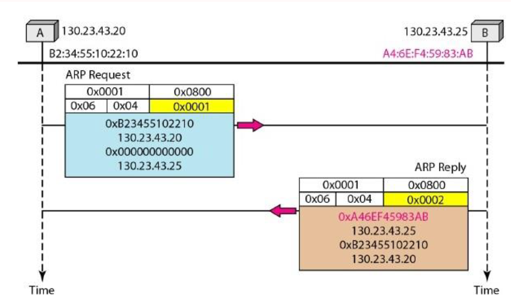
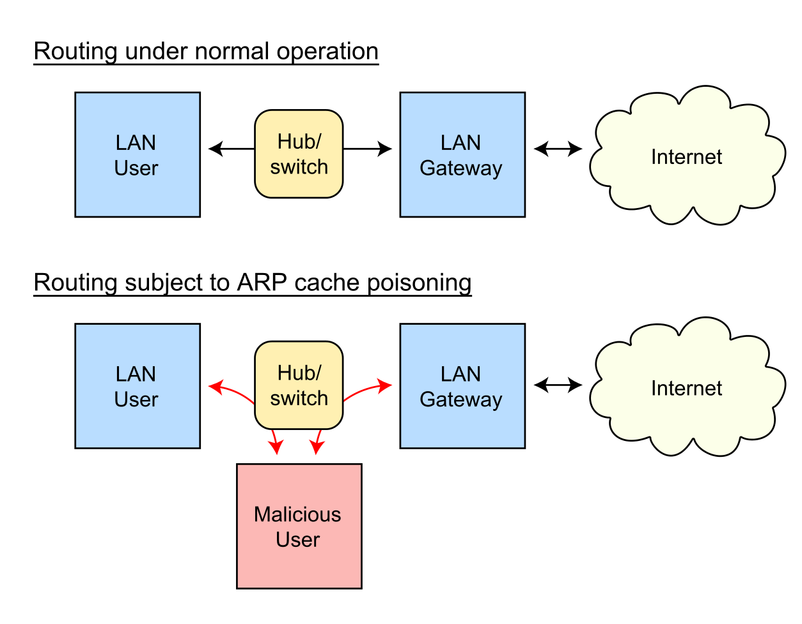
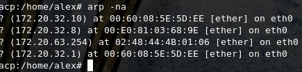

ਤਕਨੀਕੀ ਵੇਰਵਾ

ਪਤਾ

ਪਰਿਣਾਮ ਪ੍ਰੋਟੋਕੋਲ (ਏਆਰਪੀ)

**ਇੱਕ ਈਥਰਨੈੱਟ ਐਡਰੈੱਸ ਰੈਜ਼ੋਲੂਸ਼ਨ ਪ੍ਰੋਟੋਕੋਲ**

**- ਜਾਂ -**

**ਨੈਟਵਰਕ ਪ੍ਰੋਟੋਕੋਲ ਐਡਰੈੱਸ ਬਦਲਣਾ**

[[https://tools.ietf.org/html/rfc826]{.ul}](https://www.google.com/url?q=https%3A%2F%2Ftools.ietf.org%2Fhtml%2Frfc826&sa=D&sntz=1&usg=AFQjCNHSlGxJe18c1VJeIV6ePn4xPAj3rA)

> ਬਿਨਾਂ ਸ਼ੱਕ ਅੱਜ ਦੀ ਦੁਨੀਆ ਵਿਚ ਈਥਰਨੈੱਟ ਕੰਪਿ popularਟਰ ਨੈਟਵਰਕਿੰਗ ਤਕਨਾਲੋਜੀ
> ਵਿਚ ਸਭ ਤੋਂ ਵੱਧ ਪ੍ਰਸਿੱਧ ਟੈਕਨਾਲੋਜੀ ਦੀ ਵਰਤੋਂ ਕੀਤੀ ਜਾਂਦੀ ਹੈ. ਇਸਦੀ ਇਕ
> ਵਿਸ਼ੇਸ਼ ਧਿਆਨ ਦੇਣ ਵਾਲੀ ਵਿਸ਼ੇਸ਼ਤਾ ਇਹ ਹੈ ਕਿ ਇਹ ਉੱਚ ਪ੍ਰਦਰਸ਼ਨ ਦੀ ਟਿਕਾ .ਤਾ
> ਵਿਸ਼ੇਸ਼ਤਾ ਪ੍ਰਦਾਨ ਕਰਦਾ ਹੈ. ਇਹ ਸਹਿ-ਸੰਬੰਧਿਤ ਚੰਗੀ ਤਰ੍ਹਾਂ ਪ੍ਰਭਾਸ਼ਿਤ
> ਪ੍ਰੋਟੋਕੋਲ ਦਾ ਇੱਕ ਪਰਿਵਾਰ ਹੈ ਜਿਸਦਾ ਭੌਤਿਕ ਮੀਡੀਆ ਜਿਵੇਂ ਕਿ - ਕੋਐਸ਼ੀਅਲ ਕੇਬਲ,
> ਨੈਟਵਰਕ ਇੰਟਰਫੇਸ ਕਾਰਡ (ਐਨਆਈਸੀ) ਆਦਿ ਦੀ ਵਰਤੋਂ ਕਰਦਿਆਂ 10/100 ਐਮਬੀਪੀਐਸ ਆਦਿ
> ਰੇਟ ਤੇ ਡਾਟਾ ਸੰਚਾਰਿਤ ਕਰਦਾ ਹੈ.
>
> ਈਥਰਨੈੱਟ ਟੈਕਨੋਲੋਜੀ ਵਿਚ ਜਾਣਕਾਰੀ ਪੈਕਟ ਦੇ ਰੂਪ ਵਿਚ ਭੌਤਿਕ ਮੀਡੀਆ ਦੀ ਵਰਤੋਂ
> ਕਰਦਿਆਂ ਭੇਜੀ ਜਾਂਦੀ ਹੈ. ਪੈਕੇਟ ਦੇ ਆਕਾਰ \'ਤੇ ਨਿਰਭਰ ਕਰਦਿਆਂ, ਇਸ ਵਿਚਲੇ ਡੇਟਾ
> ਨੂੰ ਤੋੜਿਆ ਜਾ ਸਕਦਾ ਹੈ ਅਤੇ ਛੋਟੇ ਫਰੇਮਾਂ ਵਿਚ ਲਪੇਟਿਆ ਜਾ ਸਕਦਾ ਹੈ ਅਤੇ ਫਿਰ
> ਮੰਜ਼ਿਲ\' ਤੇ ਭੇਜੋ ਜਿੱਥੇ ਇਸ ਨੂੰ ਦੁਬਾਰਾ ਇਕੱਠਾ ਕੀਤਾ ਜਾ ਸਕਦਾ ਹੈ. ਇਹ ਫਰੇਮ
> ਭੇਜਣ ਵਾਲੇ ਦੀ ਐਨਆਈਸੀ ਦੀ ਵਰਤੋਂ ਕਰਦਿਆਂ ਤਾਰ ਤੇ ਲਿਖੇ ਗਏ ਹਨ. ਇਹ ਪੈਕੇਟ ਇੱਕ
> ਪ੍ਰਾਪਤਕਰਤਾ ਲਈ ਭੇਜਣ ਵਾਲੇ ਦੁਆਰਾ ਤਿਆਰ ਕੀਤੇ ਜਾਂਦੇ ਹਨ ਜਿਨ੍ਹਾਂ ਨੂੰ ਨੈਟਵਰਕ
> ਵਿੱਚ ਕਨੈਕਟ ਕਰਨ ਦੀ ਜ਼ਰੂਰਤ ਹੁੰਦੀ ਹੈ. ਪੈਕੇਟ ਆਪਣੀ ਮੰਜ਼ਿਲ ਤੇ ਪਹੁੰਚਣ ਲਈ
> ਰਾtersਟਰਾਂ ਜਾਂ ਸਵਿਚਾਂ ਰਾਹੀਂ ਯਾਤਰਾ ਕਰ ਸਕਦਾ ਹੈ. ਇੱਕ ਪ੍ਰੋਟੋਕੋਲ ਦੋ ਨੈਟਵਰਕ
> ਦੀ ਪਛਾਣ ਦੇ ਵਿਚਕਾਰ ਸੰਚਾਰ ਲਈ ਨਿਯਮਾਂ ਦੇ ਸਮੂਹ ਨੂੰ ਪ੍ਰਭਾਸ਼ਿਤ ਕਰਦਾ ਹੈ. ਨੋਟ
> ਕਰੋ ਕਿ ਭੇਜਣ ਵਾਲੇ ਅਤੇ ਪ੍ਰਾਪਤ ਕਰਨ ਵਾਲੇ ਦੇ ਵਿਚਕਾਰ ਦਾ ਹੋਰ ਨੈੱਟਵਰਕਿੰਗ
> ਡਿਵਾਈਸ ਇਨ੍ਹਾਂ ਪੈਕਟਾਂ ਨੂੰ ਪ੍ਰੋਸੈਸਿੰਗ ਲਈ ਨਹੀਂ ਚੁਣੇਗਾ, ਸਗੋਂ ਇਸ ਨੂੰ ਸੁੱਟ
> ਦਿੱਤਾ ਜਾਵੇਗਾ. ਇਸ ਲਈ, ਸਾਨੂੰ ਇੱਕ ਪ੍ਰੋਟੋਕੋਲ ਦੀ ਜ਼ਰੂਰਤ ਹੈ ਜਿੱਥੇ
> \<ਪ੍ਰੋਟੋਕੋਲ ਕਿਸਮ, ਪ੍ਰੋਟੋਕੋਲ ਪਤਾ\> ਦੇ ਅਧਾਰ ਤੇ ਇਸ ਨੂੰ ਸਿਰਫ ਭੇਜਣ ਵਾਲੇ ਤੋਂ
> ਪ੍ਰਾਪਤ ਕਰਨ ਵਾਲੇ ਤੱਕ ਰਸਤਾ ਪਾਰ ਕਰਨ ਦੀ ਜ਼ਰੂਰਤ ਹੈ.

**ਸਾਰ:**

> ਆਓ ਇਹ ਮੰਨ ਲਈਏ ਕਿ ਇਕੋ ਨੈਟਵਰਕ ਤੇ ਦੋ ਨੈੱਟਵਰਕਿੰਗ ਡਿਵਾਈਸਿਸ ਏ ਅਤੇ ਬੀ ਮੌਜੂਦ
> ਹਨ ਅਤੇ ਉਹਨਾਂ ਦੀਆਂ ਵਿਸ਼ੇਸ਼ਤਾਵਾਂ ਹੇਠਾਂ ਹਨ:
>
> ਡਿਵਾਈਸ ਏ:
>
> ਮੈਕ = ਐਮ (ਏ)
>
> ਆਈਪੀ = ਆਈ (ਏ)
>
> ਡਿਵਾਈਸ ਬੀ:
>
> ਮੈਕ = ਐਮ (ਬੀ)
>
> ਆਈ ਪੀ = ਆਈ (ਬੀ)
>
> ਹੁਣ ਏ ਬੀ ਨਾਲ ਸੰਪਰਕ ਕਰਨਾ ਚਾਹੁੰਦਾ ਹੈ ਅਤੇ ਸਿਰਫ ਬੀ ਦੀ ਆਈਪੀ ਜਾਇਦਾਦ ਨੂੰ
> ਜਾਣਦਾ ਹੈ. ਆਈ (ਬੀ) ਤੋਂ ਐਮ (ਬੀ) ਦੇ ਨਕਸ਼ੇ ਲਈ ਏ ਇਸਦੇ ਪ੍ਰੋਟੋਕੋਲ ਸਟੈਕ ਏਆਰਪੀ
> ਮੋਡੀ .ਲ ਤੋਂ ਸਲਾਹ ਲਵੇਗਾ. ਇਸ ਲਈ ਏ ਦਾ ਏਆਰਪੀ ਮੋਡੀ .ਲ ਨੈਟਵਰਕ ਤੇ ਇੱਕ ਪ੍ਰਸਾਰਣ
> ਪੈਕੇਟ ਭੇਜੇਗਾ ਜਿਸ ਤੇ ਬੀ ਡਿਵਾਈਸ ਇਸਦੇ ਮੈਕ ਵੇਰਵਿਆਂ ਨਾਲ ਜਵਾਬ ਦੇਵੇਗੀ. ਹੁਣ ਏ
> ਦੇ ਏਆਰਪੀ ਮੋਡੀulesਲ ਇਨ੍ਹਾਂ ਵੇਰਵਿਆਂ ਨੂੰ ਕੈਸ਼ ਕਰ ਰਹੇ ਹਨ ਜੋ ਤਾਰ ਨੂੰ ਭੇਜਣ
> ਲਈ ਈਥਰਨੈੱਟ ਪੈਕੇਟ ਬਣਾਉਣ ਲਈ ਵਰਤੇ ਜਾਣਗੇ.
>
> ਨੋਟ:
>
> ਐਡਰੈੱਸ ਰੈਜ਼ੋਲਿ .ਸ਼ਨ ਪ੍ਰੋਟੋਕੋਲ (ਏਆਰਪੀ) ਭੌਤਿਕ ਪਤੇ (48-ਬਿੱਟ ਮੈਕ ਐਡਰੈੱਸ)
> ਤੇ ਇੱਕ ਆਈਪੀਵੀ 4 ਐਡਰੈੱਸ (32-ਬਿੱਟ ਲਾਜ਼ੀਕਲ ਐਡਰੈਸ) ਨੂੰ ਮੈਪ ਕਰਨ ਦੇ ਉਦੇਸ਼
> ਨਾਲ ਟੀਸੀਪੀ / ਆਈਪੀ ਸੂਟ ਵਿੱਚ ਇੱਕ ਪ੍ਰਮੁੱਖ ਪ੍ਰੋਟੋਕੋਲ ਹੈ. ਨੈਟਵਰਕ ਡਿਵਾਈਸਿਸ
> ਨੂੰ ਲਾਜ਼ੀਕਲ ਨਾਮ ਅਤੇ ਹੇਠਲੇ ਪੱਧਰ ਜਾਂ ਪ੍ਰੋਟੋਕੋਲ ਨਿਰਧਾਰਤ ਕੀਤੇ ਗਏ ਹਨ ਤਾਂ ਜੋ
> ਮੈਕ ਐਡਰੈੱਸ ਤੇ ਲਾਜ਼ੀਕਲ ਨਾਵਾਂ ਨੂੰ ਹੱਲ ਕੀਤਾ ਜਾ ਸਕੇ. ਐਪਲੀਕੇਸ਼ਨ ਲੇਅਰ \'ਤੇ
> ਨੈਟਵਰਕ ਐਪਲੀਕੇਸ਼ਨਾਂ ਕਿਸੇ ਹੋਰ ਡਿਵਾਈਸ ਨਾਲ ਸੰਚਾਰ ਕਰਨ ਲਈ ਆਈਪੀਵੀ 4 ਐਡਰੈੱਸ ਦੀ
> ਵਰਤੋਂ ਕਰਦੀਆਂ ਹਨ. ਹਾਲਾਂਕਿ, ਡੇਟਾ ਲਿੰਕ ਲੇਅਰ ਤੇ, ਐਡਰੈਸਿੰਗ ਦੀ ਵਰਤੋਂ ਕੀਤੀ
> ਜਾਂਦੀ ਹੈ ਮੈਕ ਐਡਰੈੱਸ (ਇੱਕ 48-ਬਿੱਟ ਫਿਜ਼ੀਕਲ ਐਡਰੈਸ) ਹੈ ਜੋ ਨੈੱਟਵਰਕ ਕਾਰਡ
> ਵਿੱਚ ਪੱਕੇ ਤੌਰ ਤੇ ਸਾੜ ਦਿੱਤੀ ਜਾਂਦੀ ਹੈ. ਐਡਰੈਸ ਰੈਜ਼ੋਲਿ .ਸ਼ਨ ਪ੍ਰੋਟੋਕੋਲ
> (ਏਆਰਪੀ) ਦਾ ਉਦੇਸ਼ ਤੁਹਾਡੇ ਸਥਾਨਕ ਏਰੀਆ ਨੈਟਵਰਕ (LAN) ਵਿਚਲੇ ਕਿਸੇ ਜੰਤਰ ਦੇ ਮੈਕ
> ਐਡਰੈੱਸ ਨੂੰ ਲੱਭਣਾ ਹੈ, ਸੰਬੰਧਿਤ ਆਈਪੀਵੀ 4 ਐਡਰੈਸ ਲਈ, ਕਿਹੜਾ ਨੈਟਵਰਕ ਐਪਲੀਕੇਸ਼ਨ
> ਸੰਪਰਕ ਕਰਨ ਦੀ ਕੋਸ਼ਿਸ਼ ਕਰ ਰਿਹਾ ਹੈ.

**ਸਮੱਸਿਆ:**

> ਕਿਉਂਕਿ ਕੰਪਿ computerਟਰ ਨੈਟਵਰਕਿੰਗ ਹੋਂਦ ਵਿਚ ਆਈ ਹੈ ਇੱਥੇ ਬਹੁਤ ਸਾਰੇ ਤਰ੍ਹਾਂ
> ਦੇ ਨੈੱਟਵਰਕਿੰਗ ਉਪਕਰਣ ਹਨ ਜੋ ਵੱਖੋ ਵੱਖਰੇ ਇੰਟਰਫੇਸਾਂ ਨਾਲ ਬਣਾਏ ਗਏ ਹਨ ਅਤੇ
> ਵੱਖਰੇ ਵਿਕਰੇਤਾਵਾਂ ਦੁਆਰਾ ਪ੍ਰਦਾਨ ਕੀਤੇ ਗਏ ਹਨ. ਜਿਵੇਂ ਕਿ ਪਹਿਲਾਂ ਵਿਚਾਰਿਆ ਗਿਆ
> ਹੈ ਉਹਨਾਂ ਨੂੰ ਫਰੇਮ ਦੁਆਰਾ ਸੰਚਾਰ ਕਰਨ ਦੀ ਜ਼ਰੂਰਤ ਹੈ ਜੋ ਹੁਣ ਇਕ ਕਿਸਮ ਦੇ ਰੂਪ
> ਵਿੱਚ ਸ਼੍ਰੇਣੀਬੱਧ ਕੀਤੇ ਜਾ ਸਕਦੇ ਹਨ - ਇੱਕ ਪੈਕੇਟ ਨੂੰ ਦੂਜੇ ਨਾਲੋਂ ਵੱਖਰਾ. ਨੋਟ
> ਕਰੋ ਕਿ ਨੈਟਵਰਕ ਤੇ ਹੋਰ ਵੱਖੋ ਵੱਖਰੀਆਂ ਕਿਸਮਾਂ ਦੇ ਪ੍ਰੋਟੋਕੋਲ ਅਤੇ ਹਾਰਡਵੇਅਰ ਹਨ
> ਅਤੇ ਉਨ੍ਹਾਂ ਸਾਰਿਆਂ ਨੂੰ ਪੈਕਟਸ ਨੂੰ ਵਿਸ਼ੇਸ਼ ਰੇਟ ਤੇ ਸੰਚਾਰਿਤ ਕਰਨ ਲਈ ਕੇਬਲ ਦੀ
> ਜਰੂਰਤ ਹੁੰਦੀ ਹੈ. ਪ੍ਰੋਟੋਕੋਲ ਪਤਾ 48-ਬਿੱਟ ਐਡਰੈੱਸ ਹੋ ਸਕਦਾ ਹੈ ਜਾਂ ਨਹੀਂ ਹੋ
> ਸਕਦਾ - ਉਹ 8 ਬਿੱਟ ਤੋਂ 48 ਬਿੱਟ ਪਤਿਆਂ ਤੇ ਬਦਲ ਸਕਦੇ ਹਨ. 10 ਮੈਬਿਟ ਈਥਰਨੈੱਟ
> ਨੈਟਵਰਕ ਈਥਰਨੈੱਟ ਪੈਕੇਟ ਹੈਡਰ ਵਿੱਚ ਇੱਕ ਕਿਸਮ ਦੇ ਖੇਤਰ ਦੁਆਰਾ ਇਹ ਸਾਰੇ
> ਪ੍ਰੋਟੋਕੋਲ (ਅਤੇ ਹੋਰ) ਇੱਕ ਸਿੰਗਲ ਕੇਬਲ ਤੇ ਸਹਿ ਰਚਣ ਦੀ ਆਗਿਆ ਦਿੰਦਾ ਹੈ.
>
> ਇੱਕ \<ਪ੍ਰੋਟੋਕੋਲ, ਪਤਾ\> ਜੋੜਾ ਅਤੇ ਇੱਕ 48-ਬਿੱਟ ਈਥਰਨੈੱਟ ਐਡਰੈਸ ਦੇ ਵਿਚਕਾਰ
> ਪੱਤਰਾਂ ਨੂੰ ਆਰਜੀ ਤੌਰ ਤੇ ਵੰਡਣ ਲਈ ਇੱਕ ਪ੍ਰੋਟੋਕੋਲ ਦੀ ਲੋੜ ਹੁੰਦੀ ਹੈ. ਏਆਰਪੀ ਦੀ
> ਵਰਤੋਂ ਸਥਾਨਕ ਖੇਤਰ ਦੇ ਅੰਦਰ ਡਾਟਾ ਲਿੰਕ ਲੇਅਰ (ਓਐਸਆਈ ਦੀ ਪਰਤ 2) ਵਿੱਚ ਕੀਤੀ
> ਜਾਂਦੀ ਹੈ ਜਾਂ ਕਨੈਕਟ ਕੀਤੇ ਉਪਕਰਣਾਂ ਦੇ ਪੁਆਇੰਟ-ਟੂ-ਪੌਇੰਟ ਲਿੰਕ ਨੈਟਵਰਕ
> ਵਿੱਚ. ਈਥਰਨੈੱਟ ਸਹਿਯੋਗੀ ਨੈੱਟਵਰਕ ਡਿਵਾਈਸਾਂ ਵਿੱਚ ਮੈਕ ਐਡਰੈੱਸ ਫਿਕਸਡ 6-ਬਾਈਟ
> (48-ਬਿੱਟ) ਦੇ ਹੁੰਦੇ ਹਨ. IP ਐਡਰੈੱਸ ਕਿਸੇ ਵੀ ਇੰਟਰਫੇਸ ਲਈ ਇੱਕ ਸਥਿਰ ਰੂਪ ਨਹੀਂ
> ਹੁੰਦੇ. ਡਿਵਾਈਸਾਂ ਨੂੰ ਇੱਕ ਆਈ ਪੀ ਐਡਰੈੱਸ ਨਾਲ ਹੱਥੀਂ ਸੰਰਚਿਤ ਕੀਤਾ ਜਾ ਸਕਦਾ ਹੈ
> ਜਾਂ ਉਹ ਨੈਟਵਰਕ ਵਿੱਚ ਡਾਇਨੈਮਿਕ ਹੋਸਟ ਕਨਫਿਗਰੇਸ਼ਨ ਪ੍ਰੋਟੋਕੋਲ (DHCP) ਸਰਵਰ ਤੋਂ
> ਪ੍ਰਾਪਤ ਕਰ ਸਕਦੇ ਹਨ. ਨੋਟ ਕਰੋ ਜਦੋਂ ਵੀ ਮੰਜ਼ਿਲ ਦੇ ਆਈ ਪੀ ਪੈਕੇਟ ਦੀ ਜਾਣਕਾਰੀ
> ਉਪਲਬਧ ਨਹੀਂ ਹੁੰਦੀ ਹੈ ਤਾਂ ਨੈਟਵਰਕ / ਹੋਸਟ ਆਈਡ ਦੇ ਅਧਾਰ ਤੇ ਇਹ ਈਥਰਨੈੱਟ ਪੈਕੇਟ
> ਨੈਟਵਰਕ ਗੇਟਵੇ ਤੇ ਅੱਗੇ ਭੇਜੇ ਜਾਣਗੇ.

**ਪ੍ਰੇਰਣਾ:**

> ਇਸਦੀ ਭਰੋਸੇਯੋਗਤਾ / ਗਤੀ ਵਿਸ਼ੇਸ਼ਤਾਵਾਂ ਦੇ ਕਾਰਨ, ਈਥਰਨੈੱਟ ਵਰਤੋਂ ਵਿੱਚ ਸਭ ਤੋਂ
> ਵੱਧ ਪ੍ਰਸਿੱਧ ਨੈੱਟਵਰਕਿੰਗ ਪ੍ਰੋਟੋਕੋਲ ਬਣ ਗਿਆ. ਇਸ ਦੇ ਸਟੈਕ ਵਿਚ ਹੋਰ ਅਤੇ ਹੋਰ
> ਪ੍ਰੋਟੋਕੋਲ ਲਾਗੂ ਕੀਤੇ ਗਏ ਸਨ. ਫਿਰ ਵੀ ਹੋਰ ਵਿਕਰੇਤਾ ਪਤੇ ਦੇ ਰੈਜ਼ੋਲੇਸ਼ਨ
> ਪ੍ਰੋਟੋਕੋਲ ਦਾ ਆਪਣਾ ਸੰਸਕਰਣ ਲੈ ਸਕਦੇ ਹਨ. ਉਹ ਇਸ ਵਿਸ਼ੇਸ਼ਤਾ ਨੂੰ ਇਕ ਸਟੈਂਡਰਡ
> ਰੂਪ ਵਿਚ ਪ੍ਰਦਾਨ ਕਰਦੇ ਹਨ ਜਿਵੇਂ ਕਿ ਵਿਕਰੇਤਾ ਖਾਸ ਉਪਕਰਣ ਅਜੇ ਵੀ ਬਿਨਾਂ ਕਿਸੇ
> ਸੋਧ ਦੀ ਜ਼ਰੂਰਤ ਦੇ ਇਸ ਨੂੰ ਬਣਾ ਸਕਦੇ ਹਨ. ਇਸ ਲਈ ਸਾਡੇ ਕੋਲ ਇੱਕ ਵਿਭਿੰਨ ਡਿਵਾਈਸ
> ਸੈਟਅਪ ਨੈਟਵਰਕ ਹੋ ਸਕਦਾ ਹੈ ਪਰ ਫਿਰ ਵੀ ਉਹਨਾਂ ਵਿਚਕਾਰ ਫਰੇਮ ਭੇਜਣ ਜਾਂ ਪ੍ਰਾਪਤ
> ਕਰਨ ਦੇ ਯੋਗ ਹੋ ਸਕਦੇ ਹਾਂ.

**ਪਰਿਭਾਸ਼ਾ:**

> ਐਡਰੈੱਸ ਰੈਜ਼ੋਲਿ Protਸ਼ਨ ਪ੍ਰੋਟੋਕੋਲ (ਏਆਰਪੀ) ਟੀਸੀਪੀ / ਆਈਪੀ ਸੂਟ ਵਿਚ ਇਕ
> ਪ੍ਰਮੁੱਖ ਪ੍ਰੋਟੋਕੋਲ ਹੈ ਅਤੇ ਐਡਰੈਸ ਰੈਜ਼ੋਲਿ Protਸ਼ਨ ਪ੍ਰੋਟੋਕੋਲ (ਏਆਰਪੀ) ਦਾ
> ਉਦੇਸ਼ ਇਕ IPv4 ਐਡਰੈੱਸ (32-ਬਿੱਟ ਲਾਜ਼ੀਕਲ ਐਡਰੈਸ) ਨੂੰ ਭੌਤਿਕ ਪਤੇ (48 ਬਿੱਟ
> ਮੈਕ ਐਡਰੈੱਸ) ਦਾ ਮੈਪ ਕਰਨਾ ਹੈ. ). ਐਪਲੀਕੇਸ਼ਨ ਲੇਅਰ \'ਤੇ ਨੈਟਵਰਕ ਐਪਲੀਕੇਸ਼ਨਾਂ
> ਕਿਸੇ ਹੋਰ ਡਿਵਾਈਸ ਨਾਲ ਸੰਚਾਰ ਕਰਨ ਲਈ ਆਈਪੀਵੀ 4 ਐਡਰੈੱਸ ਦੀ ਵਰਤੋਂ ਕਰਦੀਆਂ ਹਨ.
> ਪਰ ਡੇਟਾ ਲਿੰਕ ਲੇਅਰ ਤੇ, ਐਡਰੈਸਿੰਗ ਮੈਕ ਐਡਰੈੱਸ (48-ਬਿੱਟ ਫਿਜ਼ੀਕਲ ਐਡਰੈਸ) ਹੈ,
> ਅਤੇ ਇਹ ਪਤਾ ਨੈਟਵਰਕ ਕਾਰਡ ਵਿੱਚ ਪੱਕੇ ਤੌਰ ਤੇ ਸਾੜ ਦਿੱਤਾ ਜਾਂਦਾ ਹੈ.
>
> ਐਡਰੈਸ ਰੈਜ਼ੋਲਿ .ਸ਼ਨ ਪ੍ਰੋਟੋਕੋਲ (ਏਆਰਪੀ) ਦਾ ਉਦੇਸ਼ ਤੁਹਾਡੇ ਸਥਾਨਕ ਏਰੀਆ ਨੈਟਵਰਕ
> (LAN) ਵਿਚਲੇ ਕਿਸੇ ਜੰਤਰ ਦੇ ਮੈਕ ਐਡਰੈੱਸ ਨੂੰ ਲੱਭਣਾ ਹੈ, ਸੰਬੰਧਿਤ ਆਈਪੀਵੀ 4
> ਐਡਰੈਸ ਲਈ, ਕਿਹੜਾ ਨੈਟਵਰਕ ਐਪਲੀਕੇਸ਼ਨ ਸੰਪਰਕ ਕਰਨ ਦੀ ਕੋਸ਼ਿਸ਼ ਕਰ ਰਿਹਾ ਹੈ.

**ਏਆਰਪੀ ਦਾ ਇਤਿਹਾਸ:**

> ਏਆਰਪੀ ਨੂੰ ਪਹਿਲਾਂ ਬੇਨਤੀ ਲਈ ਟਿੱਪਣੀਆਂ (ਆਰਐਫਸੀ) 826 ਵਿਚ ਪ੍ਰਸਤਾਵਿਤ ਕੀਤਾ ਗਿਆ
> ਸੀ ਅਤੇ ਚਰਚਾ ਕੀਤੀ ਗਈ ਸੀ, ਜੋ ਡੇਵਿਡ ਸੀ ਪਲੂਮਰ ਦੁਆਰਾ ਨਵੰਬਰ 1982 ਵਿਚ
> ਪ੍ਰਕਾਸ਼ਤ ਕੀਤੀ ਗਈ ਸੀ. ਐਡਰੈੱਸ ਰੈਜ਼ੋਲਿ .ਸ਼ਨ ਦੀ ਸਮੱਸਿਆ ਆਈਪੀ ਪ੍ਰੋਟੋਕੋਲ ਸੂਟ
> ਦੇ ਸ਼ੁਰੂਆਤੀ ਦਿਨਾਂ ਵਿੱਚ ਤੁਰੰਤ ਸਪੱਸ਼ਟ ਹੋ ਗਈ ਸੀ, ਕਿਉਂਕਿ ਈਥਰਨੈੱਟ ਜਲਦੀ ਹੀ
> ਪਸੰਦੀਦਾ ਲੈਨ ਟੈਕਨਾਲੌਜੀ ਬਣ ਗਿਆ ਅਤੇ ਈਥਰਨੈੱਟ ਕੇਬਲ ਨੂੰ 48-ਬਿੱਟ ਪਤੇ ਲੋੜੀਂਦੇ
> ਸਨ.
>
> ਇਸ ਪ੍ਰੋਟੋਕੋਲ ਦਾ ਵਰਣਨ ਇੰਟਰਨੈਟ ਆਰਐਫਸੀ ਦੇ ਮੁ ofਲੇ ਸਾਲਾਂ ਵਿਚ ਕੀਤਾ ਗਿਆ ਹੈ
> ਜੋ ਅਜੇ ਵੀ ਆਮ ਵਰਤੋਂ ਵਿਚ ਹੈ: ਆਰਐਫਸੀ 826, ਇਕ ਈਥਰਨੈੱਟ ਐਡਰੈੱਸ ਰੈਜ਼ੋਲਿ
> Protਸ਼ਨ ਪ੍ਰੋਟੋਕੋਲ, ਜੋ 1982 ਵਿਚ ਪ੍ਰਕਾਸ਼ਤ ਹੋਇਆ ਸੀ.
>
> ਨਾਮ ਸਪੱਸ਼ਟ ਕਰਦਾ ਹੈ ਕਿ ਏਆਰਪੀ ਅਸਲ ਵਿੱਚ ਈਥਰਨੈੱਟ ਲਈ ਵਿਕਸਤ ਕੀਤੀ ਗਈ ਸੀ. ਇਸ
> ਪ੍ਰਕਾਰ, ਇਹ ਸਭ ਤੋਂ ਮਸ਼ਹੂਰ ਪਰਤ ਦੋ ਲੈਨ ਪ੍ਰੋਟੋਕੋਲ ਅਤੇ ਸਭ ਤੋਂ ਮਸ਼ਹੂਰ ਪਰਤ
> ਤਿੰਨ ਇੰਟਰਨੈਟਵਰਕਿੰਗ ਪ੍ਰੋਟੋਕੋਲ ਦੇ ਵਿਚਕਾਰ ਗਠਜੋੜ ਨੂੰ ਦਰਸਾਉਂਦਾ ਹੈ. ਇਹ ਦੋ
> ਦਹਾਕਿਆਂ ਬਾਅਦ ਵੀ ਸੱਚ ਹੈ. ਹਾਲਾਂਕਿ, ਇਹ ਸ਼ੁਰੂਆਤ ਤੋਂ ਇਹ ਵੀ ਸਪੱਸ਼ਟ ਸੀ ਕਿ
> ਇਥਰਨੈੱਟ ਆਈਪੀ ਲਿਜਾਣ ਦਾ ਇੱਕ ਬਹੁਤ ਹੀ ਆਮ .ੰਗ ਸੀ, ਇਹ ਇਕੱਲਾ ਨਹੀਂ ਹੋਵੇਗਾ. ਇਸ
> ਲਈ, ਏਆਰਪੀ ਨੂੰ ਇਕ ਆਮ ਪ੍ਰੋਟੋਕੋਲ ਬਣਾਇਆ ਗਿਆ ਸੀ ਜੋ ਆਈਪੀ ਤੋਂ ਸਿਰਫ ਈਥਰਨੈੱਟ ਹੀ
> ਨਹੀਂ ਬਲਕਿ ਕਈ ਹੋਰ ਡਾਟਾ ਲਿੰਕ ਪਰਤ ਤਕਨਾਲੋਜੀਆਂ ਤਕ ਹੱਲ ਕਰਨ ਦੇ ਯੋਗ ਸੀ.

**ਸੰਖੇਪ:**

> ਐਡਰੈਸ ਰੈਜ਼ੋਲਿ .ਸ਼ਨ ਪ੍ਰੋਟੋਕੋਲ (ਏਆਰਪੀ) ਇੱਕ ਇੰਟਰਨੈਟਵਰਕ ਤੇ ਸੰਚਾਰਾਂ ਨੂੰ
> ਸ਼ਕਤੀਸ਼ਾਲੀ ਬਣਾਉਣ ਲਈ ਵਿਕਸਤ ਕੀਤਾ ਗਿਆ ਸੀ ਅਤੇ ਆਰਐਫਸੀ 826 ਦੁਆਰਾ ਦਰਸਾਇਆ ਗਿਆ
> ਹੈ. ਲੇਅਰ 3 ਗੈਜੇਟਸ ਨੂੰ ਏਆਰਪੀ ਦੀ ਲੋੜ ਹੈ ਆਈ ਪੀ ਨੈੱਟਵਰਕ ਐਡਰੈੱਸ ਨੂੰ ਮੈਕ ਦੇ
> ਹਾਰਡਵੇਅਰ ਐਡਰੈੱਸ ਨਾਲ ਮੈਪ ਕਰਨ ਲਈ, ਇਸ ਲਈ ਆਈਪੀ ਬੰਡਲ ਸਾਰੇ ਸਿਸਟਮ ਵਿੱਚ ਭੇਜੇ
> ਜਾ ਸਕਦੇ ਹਨ. ਇੱਕ ਡਿਵਾਈਸ ਕਿਸੇ ਦੂਜੇ ਡਿਵਾਈਸ ਤੇ ਡੇਟਾਗਰਾਮ ਭੇਜਣ ਤੋਂ ਪਹਿਲਾਂ,
> ਇਹ ਏਆਰਪੀ ਕੈਸ਼ ਵਿੱਚ ਵੇਖਦਾ ਹੈ ਕਿ ਇਹ ਪਤਾ ਲਗਾਉਣ ਲਈ ਕਿ ਟੀਚਾ ਗੈਜੇਟ ਲਈ ਕੋਈ
> ਮੈਕ ਐਡਰੈੱਸ ਅਤੇ ਸਬੰਧਤ ਆਈਪੀ ਐਡਰੈੱਸ ਹੈ ਜਾਂ ਨਹੀਂ. ਕੋਈ ਮੌਕਾ ਨਾ ਹੋਣ \'ਤੇ,
> ਸਰੋਤ ਗੈਜੇਟ ਸਿਸਟਮ ਦੇ ਹਰੇਕ ਗੈਜੇਟ ਨੂੰ ਸੰਚਾਰ ਸੁਨੇਹਾ ਭੇਜਦਾ ਹੈ. ਹਰ ਗੈਜੇਟ
> ਆਪਣੇ ਖੁਦ ਦੇ IP ਐਡਰੈਸ ਨੂੰ ਵੇਖਦਾ ਹੈ. ਕੋਆਰਡੀਨੇਟਿੰਗ ਆਈ ਪੀ ਐਡਰੈੱਸ ਦੇ ਨਾਲ
> ਸਿਰਫ ਗੈਜੇਟ ਦਾ ਜਵਾਬ ਗੈਂਜੇਟ ਲਈ ਮੈਕ ਐਡਰੈੱਸ ਵਾਲੇ ਬੰਡਲ ਦੇ ਨਾਲ ਭੇਜਣ ਵਾਲੇ
> ਗੈਜੇਟ ਨੂੰ ਜਵਾਬ ਦਿੰਦਾ ਹੈ (\"ਵਿਚਕਾਰਲੇ ਏਆਰਪੀ\" ਦੇ ਕਾਰਨ).
>
> ਬਿੰਦੂ ਤੇ, ਜਦੋਂ ਮੰਜ਼ਿਲ ਡਿਵਾਈਸ ਇੱਕ ਬਹੁਤ ਦੂਰ ਸਿਸਟਮ ਤੇ ਹੁੰਦੀ ਹੈ, ਇੱਕ ਹੋਰ
> ਲੇਅਰ 3 ਉਪਕਰਣ ਤੋਂ ਪਰੇ, ਵਿਧੀ ਇਸਦੇ ਅਪਵਾਦ ਦੇ ਬਰਾਬਰ ਹੈ ਕਿ ਭੇਜਣ ਵਾਲਾ ਡਿਵਾਈਸ
> ਮੂਲ ਗੇਟਵੇ ਦੇ ਮੈਕ ਐਡਰੈੱਸ ਲਈ ਏਆਰਪੀ ਮੰਗ ਭੇਜਦਾ ਹੈ. ਐਡਰੈੱਸ ਦੇ ਹੱਲ ਹੋਣ ਤੋਂ
> ਬਾਅਦ ਅਤੇ ਡਿਫਾਲਟ ਗੇਟਵੇ ਪੈਕਟ ਪ੍ਰਾਪਤ ਕਰਨ ਤੋਂ ਬਾਅਦ, ਡਿਫਾਲਟ ਗੇਟਵੇ ਇਸ ਨਾਲ
> ਜੁੜੇ ਸਿਸਟਮਾਂ ਉੱਤੇ ਮੰਜ਼ਿਲ ਦੇ IP ਐਡਰੈੱਸ ਨੂੰ ਪ੍ਰਸਾਰਿਤ ਕਰਦੇ ਹਨ. ਮੰਜ਼ਿਲ
> ਡਿਵਾਈਸ ਨੈਟਵਰਕ ਤੇ ਲੇਅਰ 3 ਡਿਵਾਈਸ ਏਆਰਪੀ ਦੀ ਵਰਤੋਂ ਮੰਜ਼ਿਲ ਡਿਵਾਈਸ ਦਾ ਐਮਏਸੀ
> ਐਡਰੈੱਸ ਪ੍ਰਾਪਤ ਕਰਨ ਲਈ ਕਰਦੀ ਹੈ ਅਤੇ ਪੈਕੇਟ ਦਿੰਦਾ ਹੈ.

**ਕਿਦਾ ਚਲਦਾ:**

> ਜਦੋਂ ਨਵਾਂ ਕੰਪਿ computerਟਰ ਲੈਨ ਨਾਲ ਜੁੜਦਾ ਹੈ, ਤਾਂ ਇਸ ਨੂੰ ਪਛਾਣ ਅਤੇ ਸੰਚਾਰ
> ਲਈ ਵਰਤਣ ਲਈ ਇਕ ਵਿਲੱਖਣ IP ਐਡਰੈੱਸ ਦਿੱਤਾ ਜਾਂਦਾ ਹੈ. ਜਦੋਂ ਕਿਸੇ ਖਾਸ ਲੈਨ \'ਤੇ
> ਹੋਸਟ ਮਸ਼ੀਨ ਲਈ ਨਿਰਧਾਰਤ ਕੀਤੀ ਜਾਣ ਵਾਲੀ ਪੈਕਟ ਕਿਸੇ ਗੇਟਵੇ ਤੇ ਆਉਂਦੀ ਹੈ, ਤਾਂ
> ਗੇਟਵੇ ਏਆਰਪੀ ਪ੍ਰੋਗਰਾਮ ਨੂੰ ਇੱਕ ਮੈਕ ਐਡਰੈੱਸ ਲੱਭਣ ਲਈ ਕਹਿੰਦਾ ਹੈ ਜੋ ਆਈਪੀ
> ਐਡਰੈਸ ਨਾਲ ਮੇਲ ਖਾਂਦਾ ਹੈ. ਏਆਰਪੀ ਕੈਚੇ ਕਹਿੰਦੇ ਇੱਕ ਟੇਬਲ ਹਰ ਆਈਪੀ ਐਡਰੈੱਸ ਅਤੇ
> ਇਸਦੇ ਸੰਬੰਧਿਤ ਮੈਕ ਐਡਰੈਸ ( [[ਆਰਐਫਸੀ
> 5227]{.ul}](https://www.google.com/url?q=https%3A%2F%2Ftools.ietf.org%2Fhtml%2Frfc5227%23section-1.3&sa=D&sntz=1&usg=AFQjCNGGQNaGP6atAzMmhiHh4AUWOs6BDQ)
> ) ਦਾ ਰਿਕਾਰਡ ਰੱਖਦਾ ਹੈ .
>
> ਇੱਕ ਆਈਪੀਵੀ 4 ਈਥਰਨੈੱਟ ਨੈਟਵਰਕ ਵਿੱਚ ਸਾਰੇ ਓਪਰੇਟਿੰਗ ਸਿਸਟਮ ਇੱਕ ਏਆਰਪੀ ਕੈਚੇ
> ਰੱਖਦੇ ਹਨ. ਜਦੋਂ ਵੀ ਕੋਈ ਹੋਸਟ ਲੈਕ ਵਿੱਚ ਕਿਸੇ ਹੋਰ ਹੋਸਟ ਨੂੰ ਇੱਕ ਪੈਕੇਟ ਭੇਜਣ
> ਲਈ ਇੱਕ ਮੈਕ ਐਡਰੈੱਸ ਦੀ ਬੇਨਤੀ ਕਰਦਾ ਹੈ, ਇਹ ਆਪਣੀ ਏਆਰਪੀ ਕੈਚੇ ਦੀ ਜਾਂਚ ਕਰਦਾ ਹੈ
> ਇਹ ਵੇਖਣ ਲਈ ਕਿ ਕੀ ਮੈਕ ਐਡਰੈਸ ਅਨੁਵਾਦ ਦਾ ਆਈਪੀ ਪਹਿਲਾਂ ਹੀ ਮੌਜੂਦ ਹੈ ਜਾਂ ਨਹੀਂ.
> ਜੇ ਇਹ ਹੁੰਦਾ ਹੈ, ਤਾਂ ਇੱਕ ਨਵੀਂ ਏਆਰਪੀ ਬੇਨਤੀ ਬੇਲੋੜੀ ਹੈ. ਜੇ ਅਨੁਵਾਦ ਪਹਿਲਾਂ
> ਹੀ ਮੌਜੂਦ ਨਹੀਂ ਹੈ, ਤਾਂ ਨੈਟਵਰਕ ਪਤਿਆਂ ਲਈ ਬੇਨਤੀ ਭੇਜੀ ਜਾਂਦੀ ਹੈ ਅਤੇ ਏਆਰਪੀ
> ਕੀਤੀ ਜਾਂਦੀ ਹੈ.
>
> ਏਆਰਪੀ ਲੈਨ ਉੱਤੇ ਮੌਜੂਦ ਸਾਰੀਆਂ ਮਸ਼ੀਨਾਂ ਲਈ ਇੱਕ ਬੇਨਤੀ ਪੈਕੇਟ ਦਾ ਪ੍ਰਸਾਰਨ ਕਰਦੀ
> ਹੈ ਅਤੇ ਪੁੱਛਦੀ ਹੈ ਕਿ ਕੀ ਕਿਸੇ ਵੀ ਮਸ਼ੀਨ ਨੂੰ ਪਤਾ ਹੈ ਕਿ ਉਹ ਉਸ ਖਾਸ IP ਐਡਰੈੱਸ
> ਦੀ ਵਰਤੋਂ ਕਰ ਰਹੀਆਂ ਹਨ. ਜਦੋਂ ਇੱਕ ਮਸ਼ੀਨ ਆਈਪੀ ਐਡਰੈੱਸ ਨੂੰ ਆਪਣਾ ਮੰਨਦੀ ਹੈ,
> ਤਾਂ ਇਹ ਜਵਾਬ ਭੇਜਦੀ ਹੈ ਤਾਂ ਜੋ ਏਆਰਪੀ ਭਵਿੱਖ ਦੇ ਸੰਦਰਭ ਲਈ ਕੈਚੇ ਨੂੰ ਅਪਡੇਟ ਕਰ
> ਸਕੇ ਅਤੇ ਸੰਚਾਰ ਦੇ ਨਾਲ ਅੱਗੇ ਵਧ ਸਕੇ.
>
> ਹੋਸਟ ਮਸ਼ੀਨਾਂ ਜਿਹੜੀਆਂ ਉਹਨਾਂ ਦਾ ਆਪਣਾ IP ਪਤਾ ਨਹੀਂ ਜਾਣਦੀਆਂ ਉਹ ਖੋਜ ਲਈ ਉਲਟਾ
> ਏਆਰਪੀ (ਆਰਏਆਰਪੀ) ਪ੍ਰੋਟੋਕੋਲ ਵਰਤ ਸਕਦੀਆਂ ਹਨ.
>
> ਇੱਕ ਏਆਰਪੀ ਕੈਚੇ ਦਾ ਆਕਾਰ ਸੀਮਿਤ ਹੁੰਦਾ ਹੈ ਅਤੇ ਸਮੇਂ ਸਮੇਂ ਤੇ ਖਾਲੀ ਥਾਂ ਖਾਲੀ
> ਕਰਨ ਲਈ ਸਾਰੀਆਂ ਐਂਟਰੀਆਂ ਨੂੰ ਸਾਫ ਕੀਤਾ ਜਾਂਦਾ ਹੈ; ਦਰਅਸਲ, ਪਤੇ ਸਿਰਫ ਕੁਝ
> ਮਿੰਟਾਂ ਲਈ ਕੈਚ ਵਿਚ ਰਹਿੰਦੇ ਹਨ. ਵਾਰ ਵਾਰ ਅਪਡੇਟ ਹੋਣ ਨਾਲ ਨੈਟਵਰਕ ਦੇ ਦੂਜੇ
> ਡਿਵਾਈਸਾਂ ਨੂੰ ਇਹ ਦੇਖਣ ਦੀ ਆਗਿਆ ਮਿਲਦੀ ਹੈ ਕਿ ਜਦੋਂ ਕੋਈ ਭੌਤਿਕ ਹੋਸਟ ਉਹਨਾਂ
> ਦੁਆਰਾ ਬੇਨਤੀ ਕੀਤਾ IP ਐਡਰੈੱਸ ਬਦਲਦਾ ਹੈ. ਸਫਾਈ ਪ੍ਰਕਿਰਿਆ ਵਿਚ, ਨਾ ਵਰਤੀਆਂ
> ਜਾਂਦੀਆਂ ਪ੍ਰਵੇਸ਼ਾਂ ਨੂੰ ਮਿਟਾ ਦਿੱਤਾ ਗਿਆ ਹੈ ਅਤੇ ਨਾਲ ਹੀ ਕੰਪਿ computersਟਰਾਂ
> ਨਾਲ ਗੱਲਬਾਤ ਕਰਨ ਦੀਆਂ ਕੋਈ ਵੀ ਅਸਫਲ ਕੋਸ਼ਿਸ਼ਾਂ ਜੋ ਇਸ ਸਮੇਂ ਚਾਲੂ ਨਹੀਂ ਹਨ

**ਸ਼ਰਤ:**

> ਮੈਪਿੰਗ ਦੇ ਦੋ ਪ੍ਰਕਾਰ ਹਨ:
>
> 1\. ਸਟੈਟਿਕ ਮੈਪਿੰਗ
>
> 2\. ਮਨਜ਼ੂਰ ਮੈਪਿੰਗ

**ਸਟੈਟਿਕ ਮੈਪਿੰਗ:**

> ਸਟੈਟਿਕ ਮੈਪਿੰਗ ਦਾ ਅਰਥ ਇੱਕ ਟੇਬਲ ਬਣਾਉਣਾ ਹੁੰਦਾ ਹੈ ਜੋ ਇੱਕ ਲਾਜ਼ੀਕਲ ਐਡਰੈੱਸ
> ਨੂੰ ਭੌਤਿਕ ਪਤੇ ਨਾਲ ਜੋੜਦਾ ਹੈ. ਇਹ ਟੇਬਲ ਨੈਟਵਰਕ ਦੀ ਹਰੇਕ ਮਸ਼ੀਨ ਵਿੱਚ ਰੱਖਿਆ
> ਗਿਆ ਹੈ
>
> ਹਰੇਕ ਮਸ਼ੀਨ ਜੋ ਜਾਣਦੀ ਹੈ, ਉਦਾਹਰਣ ਲਈ, ਕਿਸੇ ਹੋਰ ਮਸ਼ੀਨ ਦਾ IP ਪਤਾ ਪਰ ਇਸਦਾ
> ਸਰੀਰਕ ਪਤਾ ਨਹੀਂ ਇਸ ਨੂੰ ਸਾਰਣੀ ਵਿੱਚ ਵੇਖ ਸਕਦਾ ਹੈ. ਇਸ ਦੀਆਂ ਕੁਝ ਕਮੀਆਂ ਹਨ
> ਕਿਉਂਕਿ ਸਰੀਰਕ ਪਤੇ ਹੇਠ ਦਿੱਤੇ ਤਰੀਕਿਆਂ ਨਾਲ ਬਦਲ ਸਕਦੇ ਹਨ:
>
> Machine ਇਕ ਮਸ਼ੀਨ ਆਪਣੀ ਐਨਆਈਸੀ ਨੂੰ ਬਦਲ ਸਕਦੀ ਹੈ, ਨਤੀਜੇ ਵਜੋਂ ਇਕ ਨਵਾਂ ਸਰੀਰਕ
> ਪਤਾ.
>
> LAN ਕੁਝ LAN ਵਿੱਚ, ਜਿਵੇਂ ਕਿ ਲੋਕਲ ਟਾਕ, ਹਰ ਵਾਰ ਕੰਪਿ computerਟਰ ਚਾਲੂ ਹੋਣ
> ਤੇ ਸਰੀਰਕ ਪਤਾ ਬਦਲ ਜਾਂਦਾ ਹੈ.
>
> Mobile ਇਕ ਮੋਬਾਈਲ ਕੰਪਿ computerਟਰ ਇਕ ਭੌਤਿਕ ਨੈਟਵਰਕ ਤੋਂ ਦੂਜੇ ਸਰੀਰ ਵਿਚ ਜਾ
> ਸਕਦਾ ਹੈ, ਨਤੀਜੇ ਵਜੋਂ ਇਸਦੇ ਸਰੀਰਕ ਪਤੇ ਵਿਚ ਤਬਦੀਲੀ ਆਉਂਦੀ ਹੈ.
>
> ਇਨ੍ਹਾਂ ਤਬਦੀਲੀਆਂ ਨੂੰ ਲਾਗੂ ਕਰਨ ਲਈ, ਸਥਿਰ ਮੈਪਿੰਗ ਟੇਬਲ ਨੂੰ ਸਮੇਂ ਸਮੇਂ ਤੇ
> ਅਪਡੇਟ ਕੀਤਾ ਜਾਣਾ ਚਾਹੀਦਾ ਹੈ. ਇਹ ਓਵਰਹੈੱਡ ਨੈਟਵਰਕ ਦੀ ਕਾਰਗੁਜ਼ਾਰੀ ਨੂੰ ਪ੍ਰਭਾਵਤ
> ਕਰ ਸਕਦਾ ਹੈ.

**ਡਾਇਨਾਮਿਕ ਮੈਪਿੰਗ:**

> ਡਾਇਨਾਮਿਕ ਮੈਪਿੰਗ ਵਿੱਚ, ਹਰ ਵਾਰ ਜਦੋਂ ਕੋਈ ਮਸ਼ੀਨ ਕਿਸੇ ਹੋਰ ਮਸ਼ੀਨ ਦੇ ਲਾਜ਼ੀਕਲ
> ਐਡਰੈੱਸ ਨੂੰ ਜਾਣਦੀ ਹੈ, ਇਹ ਸਰੀਰਕ ਪਤੇ ਨੂੰ ਲੱਭਣ ਲਈ ਇੱਕ ਪ੍ਰੋਟੋਕੋਲ ਦੀ ਵਰਤੋਂ
> ਕਰ ਸਕਦੀ ਹੈ. ਗਤੀਸ਼ੀਲ ਮੈਪਿੰਗ ਕਰਨ ਲਈ ਦੋ ਪ੍ਰੋਟੋਕੋਲ ਤਿਆਰ ਕੀਤੇ ਗਏ ਹਨ: ਐਡਰੈਸ
> ਰੈਜ਼ੋਲੂਸ਼ਨ ਪ੍ਰੋਟੋਕੋਲ (ਏਆਰਪੀ) ਅਤੇ ਰਿਵਰਸ ਐਡਰੈੱਸ ਰੈਜ਼ੋਲੂਸ਼ਨ ਪ੍ਰੋਟੋਕੋਲ
> (ਆਰਏਆਰਪੀ). ਏਆਰਪੀ ਇੱਕ ਲਾਜ਼ੀਕਲ ਪਤੇ ਨੂੰ ਇੱਕ ਭੌਤਿਕ ਪਤੇ ਤੇ ਮੈਪ ਕਰਦੀ ਹੈ;
> RARP ਇੱਕ ਲਾਜ਼ੀਕਲ ਪਤੇ ਨੂੰ ਇੱਕ ਲਾਜ਼ੀਕਲ ਪਤੇ ਤੇ ਮੈਪ ਕਰਦਾ ਹੈ. ਕਿਉਂਕਿ
> ਆਰਏਆਰਪੀ ਨੂੰ ਇੱਕ ਹੋਰ ਪ੍ਰੋਟੋਕੋਲ ਨਾਲ ਤਬਦੀਲ ਕੀਤਾ ਗਿਆ ਹੈ ਅਤੇ ਇਸ ਲਈ ਨਜ਼ਰ
> ਅੰਦਾਜ਼ ਕੀਤਾ ਗਿਆ ਹੈ, ਇਸ ਲਈ ਅਸੀਂ ਇਸ ਦਸਤਾਵੇਜ਼ ਵਿੱਚ ਸਿਰਫ ਏਆਰਪੀ ਪ੍ਰੋਟੋਕੋਲ
> ਦੀ ਚਰਚਾ ਕਰਦੇ ਹਾਂ.

**ਏਆਰਪੀ ਕੈਚਿੰਗ:**

> ਇੰਟਰਨੈਟਵਰਕ ਰਾਹੀਂ ਭੇਜੇ ਗਏ ਹਰੇਕ ਡੈਟਾਗਰਾਮ ਲਈ ਨੈਟਵਰਕ ਤੇ ਆਈਪੀ ਐਡਰੈੱਸ ਕੰਟਰੋਲ
> (ਐਮਏਸੀ) ਐਡਰੈਸ ਨੂੰ ਮੈਪਿੰਗ ਕਰਨ ਦੇ ਕਾਰਨ, ਨੈੱਟਵਰਕ ਦੀ ਕਾਰਗੁਜ਼ਾਰੀ ਨਾਲ ਸਮਝੌਤਾ
> ਕੀਤਾ ਜਾ ਸਕਦਾ ਹੈ. ਪ੍ਰਸਾਰਣ ਨੂੰ ਘੱਟ ਤੋਂ ਘੱਟ ਕਰਨ ਅਤੇ ਨੈਟਵਰਕ ਸਰੋਤਾਂ ਦੀ
> ਫਜ਼ੂਲ ਵਰਤੋਂ ਨੂੰ ਸੀਮਤ ਕਰਨ ਲਈ, ਐਡਰੈੱਸ ਰੈਜ਼ੋਲੂਸ਼ਨ ਪ੍ਰੋਟੋਕੋਲ (ਏਆਰਪੀ)
> ਕੈਚਿੰਗ ਲਾਗੂ ਕੀਤੀ ਗਈ ਸੀ.
>
> ਏਆਰਪੀ ਕੈਚਿੰਗ ਇੱਕ ਅਵਧੀ ਦੇ ਲਈ ਨੈਟਵਰਕ ਪਤਿਆਂ ਅਤੇ ਸੰਬੰਧਿਤ ਡੇਟਾ-ਲਿੰਕ ਪਤੇ ਨੂੰ
> ਮੈਮੋਰੀ ਵਿੱਚ ਸੰਭਾਲਣ ਦਾ .ੰਗ ਹੈ ਜਿਵੇਂ ਪਤੇ ਸਿੱਖੇ ਜਾਂਦੇ ਹਨ.
>
> ਇਹ ਹਰ ਵਾਰ ਜਦੋਂ ਕੋਈ ਡੇਟਾਗ੍ਰਾਮ ਭੇਜਿਆ ਜਾਂਦਾ ਹੈ ਤਾਂ ਉਸੇ ਪਤੇ ਲਈ ਪ੍ਰਸਾਰਣ ਕਰਨ
> ਲਈ ਕੀਮਤੀ ਨੈਟਵਰਕ ਸਰੋਤਾਂ ਦੀ ਵਰਤੋਂ ਨੂੰ ਘੱਟ ਕਰਦਾ ਹੈ. ਕੈਚ ਐਂਟਰੀਆਂ ਨੂੰ
> ਬਰਕਰਾਰ ਰੱਖਣਾ ਚਾਹੀਦਾ ਹੈ ਕਿਉਂਕਿ ਜਾਣਕਾਰੀ ਪੁਰਾਣੀ ਹੋ ਸਕਦੀ ਹੈ, ਇਸ ਲਈ ਇਹ
> ਮਹੱਤਵਪੂਰਣ ਹੈ ਕਿ ਕੈਸ਼ ਐਂਟਰੀਆਂ ਦੀ ਮਿਆਦ ਸਮੇਂ-ਸਮੇਂ \'ਤੇ ਮਿਆਦ ਖਤਮ ਹੋ ਜਾਂਦੀ
> ਹੈ. ਇੱਕ ਨੈਟਵਰਕ ਤੇ ਹਰੇਕ ਡਿਵਾਈਸ ਇਸਦੇ ਟੇਬਲ ਅਪਡੇਟ ਕਰਦਾ ਹੈ ਜਿਵੇਂ ਪਤੇ
> ਪ੍ਰਸਾਰਿਤ ਹੁੰਦੇ ਹਨ.
>
> ਇੱਥੇ ਸਥਿਰ ਏਆਰਪੀ ਕੈਸ਼ ਐਂਟਰੀਆਂ ਅਤੇ ਗਤੀਸ਼ੀਲ ਏਆਰਪੀ ਕੈਸ਼ ਐਂਟਰੀਆਂ ਹਨ. ਸਥਿਰ
> ਐਂਟਰੀਆਂ ਨੂੰ ਹੱਥੀਂ ਕੌਂਫਿਗਰ ਕੀਤਾ ਜਾਂਦਾ ਹੈ ਅਤੇ ਸਥਾਈ ਅਧਾਰ ਤੇ ਕੈਚ ਟੇਬਲ ਵਿੱਚ
> ਰੱਖਿਆ ਜਾਂਦਾ ਹੈ. ਸਟੈਟਿਕ ਐਂਟਰੀਆਂ ਉਨ੍ਹਾਂ ਡਿਵਾਈਸਾਂ ਲਈ ਸਭ ਤੋਂ ਉੱਤਮ ਹੁੰਦੀਆਂ
> ਹਨ ਜਿਨ੍ਹਾਂ ਨੂੰ ਨਿਯਮਤ ਅਧਾਰ \'ਤੇ ਇਕੋ ਨੈਟਵਰਕ ਵਿਚ ਆਮ ਤੌਰ\' ਤੇ ਦੂਜੇ
> ਡਿਵਾਈਸਾਂ ਨਾਲ ਸੰਪਰਕ ਕਰਨਾ ਹੁੰਦਾ ਹੈ. ਗਤੀਸ਼ੀਲ ਐਂਟਰੀਆਂ ਸਿਸਕੋ ਸਾੱਫਟਵੇਅਰ
> ਦੁਆਰਾ ਜੋੜੀਆਂ ਜਾਂਦੀਆਂ ਹਨ, ਕੁਝ ਸਮੇਂ ਲਈ ਰੱਖੀਆਂ ਜਾਂਦੀਆਂ ਹਨ, ਅਤੇ ਫਿਰ ਹਟਾ
> ਦਿੱਤੀਆਂ ਜਾਂਦੀਆਂ ਹਨ.

**ਏਆਰਪੀ ਕੈਚੇ ਵਿੱਚ ਸਥਿਰ ਅਤੇ ਗਤੀਸ਼ੀਲ ਐਂਟਰੀਆਂ**

> ਸਟੈਟਿਕ ਰੂਟਿੰਗ ਲਈ ਪ੍ਰਬੰਧਕ ਨੂੰ ਹੱਥੀਂ IP ਐਡਰੈਸ, ਸਬਨੈੱਟ ਮਾਸਕ, ਗੇਟਵੇ, ਅਤੇ
> ਸੰਬੰਧਿਤ ਮੀਡੀਆ ਐਕਸੈਸ ਕੰਟਰੋਲ (ਮੈਕ) ਐਡਰੈੱਸ ਹਰੇਕ ਜੰਤਰ ਦੇ ਹਰੇਕ ਇੰਟਰਫੇਸ ਲਈ
> ਇੱਕ ਟੇਬਲ ਵਿੱਚ ਦਾਖਲ ਕਰਨ ਦੀ ਜ਼ਰੂਰਤ ਹੁੰਦੀ ਹੈ. ਸਥਿਰ ਰੂਟਿੰਗ ਵਧੇਰੇ ਨਿਯੰਤਰਣ
> ਨੂੰ ਸਮਰੱਥ ਕਰਦੀ ਹੈ ਪਰ ਸਾਰਣੀ ਨੂੰ ਬਣਾਈ ਰੱਖਣ ਲਈ ਵਧੇਰੇ ਕੰਮ ਦੀ ਲੋੜ ਹੁੰਦੀ ਹੈ.
> ਜਦੋਂ ਵੀ ਰੂਟ ਜੋੜਿਆ ਜਾਂ ਬਦਲਿਆ ਜਾਂਦਾ ਹੈ ਤਾਂ ਸਾਰਣੀ ਨੂੰ ਅਪਡੇਟ ਕੀਤਾ ਜਾਣਾ
> ਚਾਹੀਦਾ ਹੈ.
>
> ਡਾਇਨੈਮਿਕ ਰੂਟਿੰਗ ਪ੍ਰੋਟੋਕੋਲ ਦੀ ਵਰਤੋਂ ਕਰਦੀ ਹੈ ਜੋ ਇੱਕ ਨੈਟਵਰਕ ਵਿੱਚ ਡਿਵਾਈਸਾਂ
> ਨੂੰ ਇਕ ਦੂਜੇ ਨਾਲ ਰੂਟਿੰਗ ਟੇਬਲ ਜਾਣਕਾਰੀ ਦਾ ਆਦਾਨ ਪ੍ਰਦਾਨ ਕਰਨ ਦੇ ਯੋਗ
> ਬਣਾਉਂਦੀਆਂ ਹਨ. ਟੇਬਲ ਬਣਾਇਆ ਅਤੇ ਆਪਣੇ ਆਪ ਬਦਲਿਆ ਗਿਆ ਹੈ. ਕੋਈ ਪ੍ਰਬੰਧਕੀ ਕਾਰਜਾਂ
> ਦੀ ਜ਼ਰੂਰਤ ਨਹੀਂ ਜਦੋਂ ਤੱਕ ਕੋਈ ਸਮਾਂ ਸੀਮਾ ਸ਼ਾਮਲ ਨਹੀਂ ਕੀਤੀ ਜਾਂਦੀ, ਇਸ ਲਈ
> ਗਤੀਸ਼ੀਲ ਰੂਟਿੰਗ ਸਥਿਰ ਰੂਟਿੰਗ ਨਾਲੋਂ ਵਧੇਰੇ ਕੁਸ਼ਲ ਹੈ. ਡਿਫੌਲਟ ਸਮਾਂ ਸੀਮਾ 4
> ਘੰਟੇ ਹੈ. ਜੇ ਨੈਟਵਰਕ ਵਿੱਚ ਬਹੁਤ ਸਾਰੇ ਰਸਤੇ ਹਨ ਜੋ ਕੈਚ ਤੋਂ ਜੋੜ ਅਤੇ ਮਿਟਾਏ ਗਏ
> ਹਨ, ਤਾਂ ਸਮਾਂ ਸੀਮਾ ਵਿਵਸਥਤ ਕੀਤੀ ਜਾਣੀ ਚਾਹੀਦੀ ਹੈ.

**ਪਰਾਕਸੀ ਏਆਰਪੀ**

> ਪ੍ਰੌਕਸੀ ਐਡਰੈੱਸ ਰੈਜ਼ੋਲਿ Protਸ਼ਨ ਪ੍ਰੋਟੋਕੋਲ, ਜਿਵੇਂ ਕਿ ਆਰਐਫਸੀ 1027 ਵਿੱਚ
> ਪਰਿਭਾਸ਼ਿਤ ਕੀਤਾ ਗਿਆ ਹੈ, ਨੂੰ ਉਸੇ ਆਈਪੀ ਨੈਟਵਰਕ ਵਿੱਚ ਰਾ rouਟਰ ਦੁਆਰਾ ਜੁੜੇ
> ਫਿਜ਼ੀਕਲ ਨੈਟਵਰਕ ਹਿੱਸੇ ਵਿੱਚ ਵੱਖ ਕੀਤੇ ਜਾਂ ਉਪ-ਮੈਕ ਐਡਰੈੱਸ ਨੂੰ ਹੱਲ ਕਰਨ ਲਈ
> ਸਬਨਟਵਰਕ ਨਾਲ ਜੁੜੇ ਉਪਕਰਣਾਂ ਨੂੰ ਸਮਰੱਥ ਕਰਨ ਲਈ ਲਾਗੂ ਕੀਤਾ ਗਿਆ ਸੀ. ਜਦੋਂ ਉਪਕਰਣ
> ਇਕੋ ਡੇਟਾ ਲਿੰਕ ਲੇਅਰ ਨੈਟਵਰਕ ਵਿੱਚ ਨਹੀਂ ਹੁੰਦੇ ਬਲਕਿ ਉਸੇ ਆਈਪੀ ਨੈਟਵਰਕ ਵਿੱਚ
> ਹੁੰਦੇ ਹਨ, ਉਹ ਇੱਕ ਦੂਜੇ ਨੂੰ ਡੇਟਾ ਸੰਚਾਰਿਤ ਕਰਨ ਦੀ ਕੋਸ਼ਿਸ਼ ਕਰਦੇ ਹਨ ਜਿਵੇਂ ਕਿ
> ਉਹ ਸਥਾਨਕ ਨੈਟਵਰਕ ਤੇ ਹਨ.
>
> ਹਾਲਾਂਕਿ, ਰਾ rouਟਰ ਜੋ ਉਪਕਰਣਾਂ ਨੂੰ ਵੱਖ ਕਰਦਾ ਹੈ ਇੱਕ ਪ੍ਰਸਾਰਣ ਸੰਦੇਸ਼ ਨਹੀਂ
> ਭੇਜਦਾ ਕਿਉਂਕਿ ਰਾtersਟਰ ਹਾਰਡਵੇਅਰ-ਲੇਅਰ ਪ੍ਰਸਾਰਨ ਨੂੰ ਪਾਸ ਨਹੀਂ ਕਰਦੇ. ਇਸ ਲਈ,
> ਪਤੇ ਹੱਲ ਨਹੀਂ ਕੀਤੇ ਜਾ ਸਕਦੇ.
>
> ਪਰਾਕਸੀ ਏਆਰਪੀ ਨੂੰ ਡਿਫੌਲਟ ਰੂਪ ਵਿੱਚ ਸਮਰੱਥ ਬਣਾਇਆ ਜਾਂਦਾ ਹੈ ਤਾਂ ਜੋ ਸਥਾਨਕ
> ਪ੍ਰਣਾਲੀਆਂ ਦੇ ਵਿੱਚਕਾਰ \"ਪ੍ਰੌਕਸੀ ਰਾterਟਰ\" ਇਸਦੇ ਮੈਕ ਐਡਰੈਸ ਨਾਲ ਜਵਾਬ ਦਿੰਦਾ
> ਹੈ ਜਿਵੇਂ ਕਿ ਇਹ ਉਹ ਰਾterਟਰ ਸੀ ਜਿਸ ਨੂੰ ਪ੍ਰਸਾਰਣ ਨੂੰ ਸੰਬੋਧਿਤ ਕੀਤਾ ਗਿਆ ਹੈ.
> ਜਦੋਂ ਭੇਜਣ ਵਾਲੇ ਉਪਕਰਣ ਨੂੰ ਪ੍ਰੌਕਸੀ ਰਾterਟਰ ਦਾ MAC ਪਤਾ ਪ੍ਰਾਪਤ ਹੁੰਦਾ ਹੈ,
> ਤਾਂ ਇਹ ਪ੍ਰੌਕਸੀ ਰਾterਟਰ ਨੂੰ ਡੇਟਾਗ੍ਰਾਮ ਭੇਜਦਾ ਹੈ, ਜੋ ਬਦਲੇ ਵਿੱਚ ਡਾਟਾਗਰਾਮ
> ਨੂੰ ਮਨੋਨੀਤ ਉਪਕਰਣ ਤੇ ਭੇਜਦਾ ਹੈ.

**ਏਆਰਪੀ ਪਰੋਟੋਕੋਲ Uਾਂਚਾ:**

{width="5.875in" height="2.45in"}

> ਐਡਰੈਸ ਰੈਜ਼ੋਲੂਸ਼ਨ ਪ੍ਰੋਟੋਕੋਲ (ਏਆਰਪੀ) ਮੈਸੇਜ ਫਾਰਮੈਟ ਵਿੱਚ ਖੇਤਰ ਇਹ ਹਨ:
>
> · ਹਾਰਡਵੇਅਰ ਦੀ ਕਿਸਮ: ਏਆਰਪੀ ਮੈਸੇਜ ਵਿਚ ਹਾਰਡਵੇਅਰ ਟਾਈਪ ਫੀਲਡ ਐਡਰੈੱਸ ਰੈਜ਼ੋਲਿ
> .ਸ਼ਨ ਪ੍ਰੋਟੋਕੋਲ (ਏਆਰਪੀ) ਸੰਦੇਸ਼ ਭੇਜਣ ਵਾਲੇ ਸਥਾਨਕ ਨੈਟਵਰਕ ਲਈ ਵਰਤੇ ਗਏ
> ਹਾਰਡਵੇਅਰ ਦੀ ਕਿਸਮ ਨਿਰਧਾਰਤ ਕਰਦੀ ਹੈ. ਈਥਰਨੈੱਟ ਇਕ ਆਮ ਹਾਰਡਵੇਅਰ ਕਿਸਮ ਹੈ ਅਤੇ
> ਉਹ ਈਥਰਨੈੱਟ ਦੀ ਕੀਮਤ ਹੈ. ਇਸ ਖੇਤਰ ਦਾ ਆਕਾਰ 2 ਬਾਈਟ ਹੈ.
>
> · ਪ੍ਰੋਟੋਕੋਲ ਦੀ ਕਿਸਮ: ਹਰੇਕ ਪ੍ਰੋਟੋਕੋਲ ਨੂੰ ਇਸ ਖੇਤਰ ਵਿਚ ਵਰਤਿਆ ਜਾਂਦਾ ਇਕ
> ਨੰਬਰ ਨਿਰਧਾਰਤ ਕੀਤਾ ਜਾਂਦਾ ਹੈ. ਆਈਪੀਵੀ 4 2048 (ਹੈਕਸਾਡੈਸੀਮਲ ਵਿਚ 0x0800) ਹੈ.
>
> · ਹਾਰਡਵੇਅਰ ਐਡਰੈੱਸ ਦੀ ਲੰਬਾਈ: ਏਆਰਪੀ ਮੈਸੇਜ ਵਿੱਚ ਹਾਰਡਵੇਅਰ ਐਡਰੈਸ ਦੀ ਲੰਬਾਈ
> ਇੱਕ ਹਾਰਡਵੇਅਰ (ਐਮਏਸੀ) ਐਡਰੈੱਸ ਦੇ ਬਾਈਟਸ ਵਿੱਚ ਲੰਬਾਈ ਹੈ. ਈਥਰਨੈੱਟ ਮੈਕ ਐਡਰੈਸ
> 6 ਬਾਈਟ ਲੰਬੇ ਹਨ.
>
> · ਪ੍ਰੋਟੋਕੋਲ ਪਤਾ ਦੀ ਲੰਬਾਈ: ਲਾਜ਼ੀਕਲ ਐਡਰੈਸ (ਆਈਪੀਵੀ 4 ਐਡਰੈੱਸ) ਦੇ ਬਾਈਟਸ
> ਵਿੱਚ ਲੰਬਾਈ. ਆਈਪੀਵੀ 4 ਐਡਰੈਸ 4 ਬਾਈਟ ਲੰਬੇ ਹਨ.
>
> · ਓਪਕੋਡ: ਏਆਰਪੀ ਮੈਸੇਜ ਵਿੱਚ ਓਪਕੋਡ ਫੀਲਡ ਏਆਰਪੀ ਸੁਨੇਹੇ ਦੀ ਪ੍ਰਕਿਰਤੀ ਨੂੰ
> ਦਰਸਾਉਂਦੀ ਹੈ. ਏਆਰਪੀ ਬੇਨਤੀ ਲਈ 1 ਅਤੇ ਏਆਰਪੀ ਜਵਾਬ ਲਈ 2.
>
> Er ਭੇਜਣ ਵਾਲੇ ਦਾ ਹਾਰਡਵੇਅਰ ਪਤਾ: ਸੁਨੇਹਾ ਭੇਜਣ ਵਾਲੇ ਉਪਕਰਣ ਦਾ ਲੇਅਰ 2 (ਮੈਕ
> ਐਡਰੈੱਸ) ਪਤਾ.
>
> · ਭੇਜਣ ਵਾਲਾ ਪ੍ਰੋਟੋਕੋਲ ਪਤਾ: ਸੁਨੇਹਾ ਭੇਜਣ ਵਾਲੇ ਜੰਤਰ ਦਾ ਪ੍ਰੋਟੋਕੋਲ ਪਤਾ
> (IPv4 ਪਤਾ)
>
> · ਟਾਰਗਿਟ ਹਾਰਡਵੇਅਰ ਪਤਾ: ਲੇਅਰ 2 (MAC ਪਤਾ) ਤਿਆਰ ਕੀਤਾ ਪ੍ਰਾਪਤ ਕਰਨ ਦੇ.

**ਵਾਇਰਸ਼ਾਰਕ ਵਿੱਚ ਏਆਰਪੀ Uਾਂਚਾ:**

{width="9.266666666666667in"
height="5.166666666666667in"}

> ਮਨੋਰੰਜਨ:
>
> ਇੱਕ ਏਆਰਪੀ ਪੈਕੇਟ ਸਿੱਧੇ ਡੇਟਾ ਲਿੰਕ ਫਰੇਮ ਵਿੱਚ ਇੰਪਲੇਸਡ ਕੀਤਾ ਜਾਂਦਾ ਹੈ.
> ਉਦਾਹਰਣ ਦੇ ਲਈ, ਹੇਠ ਦਿੱਤੀ ਚਿੱਤਰ ਵਿੱਚ, ਇੱਕ ਏਆਰਪੀ ਪੈਕੇਟ ਨੂੰ ਈਥਰਨੈੱਟ ਫਰੇਮ
> ਵਿੱਚ ਇੰਕਪੁਲੇਸਡ ਕੀਤਾ ਗਿਆ ਹੈ. ਧਿਆਨ ਦਿਓ ਕਿ ਟਾਈਪ ਫੀਲਡ ਦਰਸਾਉਂਦਾ ਹੈ ਕਿ ਫਰੇਮ
> ਦੁਆਰਾ ਲਿਆ ਗਿਆ ਡੇਟਾ ਇੱਕ ਏਆਰਪੀ ਪੈਕੇਟ ਹੈ.

{width="11.0in" height="3.775in"}

**ਏਆਰਪੀ ਬੇਨਤੀ ਅਤੇ ਜਵਾਬ:**

> ਆਓ ਵੇਖੀਏ ਕਿ ਏ ਆਰ ਪੀ ਇੱਕ ਆਮ ਇੰਟਰਨੈਟ ਤੇ ਕਿਵੇਂ ਕੰਮ ਕਰਦਾ ਹੈ. ਪਹਿਲਾਂ ਅਸੀਂ
> ਇਸ ਵਿੱਚ ਸ਼ਾਮਲ ਕਦਮਾਂ ਦਾ ਵਰਣਨ ਕਰਦੇ ਹਾਂ. ਫਿਰ ਅਸੀਂ ਉਨ੍ਹਾਂ ਚਾਰ ਮਾਮਲਿਆਂ ਬਾਰੇ
> ਚਰਚਾ ਕਰਦੇ ਹਾਂ ਜਿਨ੍ਹਾਂ ਵਿੱਚ ਇੱਕ ਹੋਸਟ ਜਾਂ ਰਾterਟਰ ਨੂੰ ਏਆਰਪੀ ਦੀ ਵਰਤੋਂ ਕਰਨ
> ਦੀ ਜ਼ਰੂਰਤ ਹੁੰਦੀ ਹੈ:
>
> · ਭੇਜਣ ਵਾਲੇ ਨੂੰ ਟੀਚੇ ਦਾ IP ਪਤਾ ਪਤਾ ਹੁੰਦਾ ਹੈ.
>
> · ਆਈਪੀ ਏਆਰਪੀ ਨੂੰ ਅਰਪ ਬੇਨਤੀ ਸੁਨੇਹਾ ਬਣਾਉਣ ਲਈ ਕਹਿੰਦਾ ਹੈ, ਭੇਜਣ ਵਾਲਾ ਸਰੀਰਕ
> ਪਤਾ, ਭੇਜਣ ਵਾਲਾ ਆਈ ਪੀ ਐਡਰੈੱਸ, ਅਤੇ ਟੀਚੇ ਦਾ IP ਐਡਰੈੱਸ ਭਰਦਾ ਹੈ. ਟੀਚਾ ਭੌਤਿਕ
> ਪਤਾ ਖੇਤਰ 0s ਨਾਲ ਭਰਿਆ ਹੋਇਆ ਹੈ.
>
> ਸੁਨੇਹਾ ਡੇਟਾ ਲਿੰਕ ਪਰਤ ਤੇ ਭੇਜਿਆ ਜਾਂਦਾ ਹੈ ਜਿੱਥੇ ਇਹ ਇੱਕ ਫਰੇਮ ਵਿੱਚ ਸਰੋਤ ਪਤੇ
> ਅਤੇ ਭੌਤਿਕ ਪ੍ਰਸਾਰਣ ਪਤੇ ਵਜੋਂ ਮੰਜ਼ਿਲ ਦੇ ਪਤੇ ( [[ਆਰ.ਐੱਫ
> .5227]{.ul}](https://www.google.com/url?q=https%3A%2F%2Ftools.ietf.org%2Fhtml%2Frfc5227%23section-2.4&sa=D&sntz=1&usg=AFQjCNGOIIihwwC9SPzKWmd6tGEfJmatvQ)
> ) ਦੇ ਰੂਪ ਵਿੱਚ ਭੇਜਣ ਵਾਲੇ ਦੇ ਭੌਤਿਕ ਪਤੇ ਦੀ ਵਰਤੋਂ ਕਰਦੇ ਹੋਏ ਇੱਕ ਫਰੇਮ ਵਿੱਚ
> ਸ਼ਾਮਲ ਕੀਤਾ ਜਾਂਦਾ ਹੈ .

{width="11.225in" height="6.6in"}

> · ਹਰ ਮੇਜ਼ਬਾਨ ਜਾਂ ਰਾterਟਰ ਨੂੰ ਫਰੇਮ ਪ੍ਰਾਪਤ ਹੁੰਦਾ ਹੈ. ਕਿਉਂਕਿ ਫਰੇਮ ਵਿੱਚ
> ਇੱਕ ਪ੍ਰਸਾਰਣ ਮੰਜ਼ਿਲ ਦਾ ਪਤਾ ਹੁੰਦਾ ਹੈ, ਸਾਰੇ ਸਟੇਸ਼ਨ ਸੰਦੇਸ਼ ਨੂੰ ਹਟਾ ਦਿੰਦੇ
> ਹਨ ਅਤੇ ਇਸਨੂੰ ਏਆਰਪੀ ਵਿੱਚ ਭੇਜਦੇ ਹਨ. ਇਕ ਨਿਸ਼ਾਨਾ ਨੂੰ ਛੱਡ ਕੇ ਸਾਰੀਆਂ ਮਸ਼ੀਨਾਂ
> ਪੈਕੇਟ ਸੁੱਟਦੀਆਂ ਹਨ. ਟੀਚੇ ਵਾਲੀ ਮਸ਼ੀਨ ਆਈਪੀ ਐਡਰੈਸ ਨੂੰ ਪਛਾਣਦੀ ਹੈ.
>
> · ਟਾਰਗਿਟ ਮਸ਼ੀਨ ਇੱਕ ਏਆਰਪੀ ਜਵਾਬ ਸੰਦੇਸ਼ ਦੇ ਨਾਲ ਜਵਾਬ ਦਿੰਦੀ ਹੈ ਜਿਸ ਵਿੱਚ
> ਇਸਦਾ ਸਰੀਰਕ ਪਤਾ ਹੁੰਦਾ ਹੈ. ਸੁਨੇਹਾ ਇਕਸਾਰ ਹੈ.
>
> · ਭੇਜਣ ਵਾਲਾ ਜਵਾਬ ਸੁਨੇਹਾ ਪ੍ਰਾਪਤ ਕਰਦਾ ਹੈ. ਇਹ ਹੁਣ ਟਾਰਗਿਟ ਮਸ਼ੀਨ ਦਾ ਸਰੀਰਕ
> ਪਤਾ ਜਾਣਦਾ ਹੈ.
>
> Dat ਆਈਪੀ ਡੈਟਾਗ੍ਰਾਮ, ਜੋ ਟਾਰਗਿਟ ਮਸ਼ੀਨ ਲਈ ਡੇਟਾ ਲੈ ਜਾਂਦਾ ਹੈ, ਹੁਣ ਇਕ ਫਰੇਮ
> ਵਿਚ ਸ਼ਾਮਲ ਕੀਤਾ ਗਿਆ ਹੈ ਅਤੇ ਮੰਜ਼ਿਲ ਤੇ ਇਕਸਾਰ ਹੈ.

**ਏਆਰਪੀ ਵਿੱਚ 4 ਵੱਖ ਵੱਖ ਕੇਸ:**

{width="6.9in" height="5.125in"}

> ਏਆਰਪੀ ਅਟੈਕ ਅਤੇ ਬਚਾਅ

**ਏਆਰਪੀ ਪੋਜੀਸ਼ਨਿੰਗ**

> ਏਆਰਪੀ ਜ਼ਹਿਰ ਇਕ ਹਮਲਾ ਹੈ ਜਿੱਥੇ ਅਸੀਂ ਨੈਟਵਰਕ ਤੇ ਨਕਲੀ ਏਆਰਪੀ ਜਵਾਬ ਪੈਕਟ ਭੇਜਦੇ
> ਹਾਂ. ਇੱਥੇ ਦੋ ਸੰਭਾਵਿਤ ਹਮਲੇ ਹਨ ( [[ਆਰਐਫਸੀ
> 5227]{.ul}](https://www.google.com/url?q=https%3A%2F%2Ftools.ietf.org%2Fhtml%2Frfc5227%23section-5&sa=D&sntz=1&usg=AFQjCNF4XW82mDtC5zAxiTnsO0t6_f4fgQ)
> ):
>
> · **MITM (ਮੱਧ ਵਿਚ ਮਨੁੱਖ):** ਹਮਲਾਵਰ ਇਸ ਦੇ ਆਪਣੇ ਹੀ MAC ਐਡਰੈੱਸ ਅਤੇ ਇੱਕ
> ਜਾਇਜ਼ ਹੋਸਟ, ਸਰਵਰ ਜ ਰਾਊਟਰ ਦੇ IP ਐਡਰੈੱਸ ਨਾਲ ਇੱਕ ARP ਜਵਾਬ ਭੇਜ ਦੇਵੇਗਾ.
> ਜਦੋਂ ਪੀੜਤ ਏਆਰਪੀ ਦਾ ਜਵਾਬ ਪ੍ਰਾਪਤ ਕਰਦਾ ਹੈ ਤਾਂ ਇਹ ਇਸਦੇ ਏਆਰਪੀ ਟੇਬਲ ਨੂੰ
> ਅਪਡੇਟ ਕਰੇਗਾ. ਜਦੋਂ ਇਹ ਜਾਇਜ਼ ਉਪਕਰਣ ਤੱਕ ਪਹੁੰਚਣ ਦੀ ਕੋਸ਼ਿਸ਼ ਕਰਦਾ ਹੈ, ਤਾਂ ਆਈ
> ਪੀ ਪੈਕੇਟ ਹਮਲਾਵਰ ਦੇ ਕੋਲ ਖਤਮ ਹੋ ਜਾਣਗੇ.
>
> · **DOS (ਸੇਵਾ ਦੀ ਸਵੀਕ੍ਰਿਤੀ):** ਹਮਲਾਵਰ ਇੱਕ ਜਾਇਜ਼ ਸਰਵਰ ਦੇ MAC ਐਡਰੈੱਸ ਨਾਲ
> ਬਹੁਤ ਸਾਰੇ ARP ਜਵਾਬ ਭੇਜ ਦੇਵੇਗਾ. ਨੈਟਵਰਕ ਦੇ ਸਾਰੇ ਉਪਕਰਣ ਆਪਣੇ ਏਆਰਪੀ ਟੇਬਲ
> ਨੂੰ ਅਪਡੇਟ ਕਰਨਗੇ ਅਤੇ ਨੈਟਵਰਕ ਦੇ ਸਾਰੇ ਆਈ ਪੀ ਪੈਕਟ ਸਰਵਰ ਨੂੰ ਭੇਜੇ ਜਾਣਗੇ, ਇਸ
> ਨੂੰ ਟ੍ਰੈਫਿਕ ਨਾਲ ਓਵਰਲੋਡਿੰਗ ਕਰਨਗੇ.
>
> ਹਮਲਾ ਹੇਠ ਲਿਖੇ ਅਨੁਸਾਰ ਕੰਮ ਕਰਦਾ ਹੈ:
>
> 1\. ਹਮਲਾਵਰ ਦੀ ਨੈੱਟਵਰਕ ਤੱਕ ਪਹੁੰਚ ਹੋਣੀ ਚਾਹੀਦੀ ਹੈ. ਉਹ ਘੱਟੋ ਘੱਟ ਦੋ ਉਪਕਰਣਾਂ
> ਦੇ ਆਈਪੀ ਐਡਰੈਸ ਨਿਰਧਾਰਤ ਕਰਨ ਲਈ ਨੈਟਵਰਕ ਨੂੰ ਸਕੈਨ ਕਰਦੇ ਹਨ - ਦੱਸ ਦੇਈਏ ਕਿ ਇਹ
> ਵਰਕਸਟੇਸ਼ਨ ਅਤੇ ਰਾ aਟਰ ਹਨ.
>
> 2\. ਹਮਲਾਵਰ ਇੱਕ ਜਾਅਲੀ ਟੂਲ ਦੀ ਵਰਤੋਂ ਕਰਦਾ ਹੈ, ਜਿਵੇਂ ਕਿ ਅਰਪ ਸਪੂਫ ਜਾਂ
> ਡ੍ਰੈਫਟਨੇਟ, ਜਾਅਲੀ ਏਆਰਪੀ ਜਵਾਬ ਭੇਜਣ ਲਈ.
>
> 3\. ਜਾਅਲੀ ਪ੍ਰਤੀਕਿਰਿਆਵਾਂ ਇਸ਼ਤਿਹਾਰ ਦਿੰਦੀਆਂ ਹਨ ਕਿ ਦੋਵੇਂ ਆਈ ਪੀ ਪਤਿਆਂ ਲਈ
> ਸਹੀ ਮੈਕ ਐਡਰੈੱਸ, ਰਾterਟਰ ਅਤੇ ਵਰਕਸਟੇਸ਼ਨ ਨਾਲ ਸਬੰਧਤ, ਹਮਲਾਵਰ ਦਾ ਮੈਕ ਐਡਰੈੱਸ
> ਹੈ. ਇਹ ਹਮਲਾਵਰਾਂ ਦੀ ਮਸ਼ੀਨ ਨਾਲ ਜੁੜਨ ਲਈ ਰਾ foolਟਰ ਅਤੇ ਵਰਕਸਟੇਸ਼ਨ ਦੋਵਾਂ ਨੂੰ
> ਮੂਰਖ ਬਣਾਉਂਦੇ ਹਨ, ਇਕ ਦੂਜੇ ਦੀ ਬਜਾਏ.
>
> 4\. ਦੋਵੇਂ ਉਪਕਰਣ ਆਪਣੀਆਂ ਏਆਰਪੀ ਕੈਸ਼ ਐਂਟਰੀਆਂ ਨੂੰ ਅਪਡੇਟ ਕਰਦੇ ਹਨ ਅਤੇ ਉਸ
> ਬਿੰਦੂ ਤੋਂ, ਸਿੱਧੇ ਇਕ ਦੂਜੇ ਦੇ ਨਾਲ ਹਮਲਾ ਕਰਨ ਵਾਲੇ ਨਾਲ ਗੱਲਬਾਤ ਕਰਦੇ ਹਨ.
>
> ਹਮਲਾਵਰ ਹੁਣ ਸਾਰੇ ਸੰਚਾਰਾਂ ਦੇ ਵਿਚਕਾਰ ਗੁਪਤ ਰੂਪ ਵਿੱਚ ਹੈ.

{width="13.058333333333334in"
height="10.191666666666666in"}

> ਇੱਕ ਵਾਰ ਹਮਲਾਵਰ ਇੱਕ ਏਆਰਪੀ ਸਪੂਫਿੰਗ ਹਮਲੇ ਵਿੱਚ ਸਫਲ ਹੋ ਜਾਂਦਾ ਹੈ, ਉਹ ਕਰ ਸਕਦੇ
> ਹਨ:
>
> · **ਸੰਚਾਰ ਰਾਊਟਿੰਗ ਤੌਰ-ਹੈ ਜਾਰੀ ਰੱਖੋ** - ਹਮਲਾਵਰ, ਪੈਕੇਟ ਡਾਟਾ ਸੁੰਘ ਕੇ ਚੋਰੀ
> ਕਰ ਸਕਦਾ ਹੈ, ਜੇ ਇਸ ਨੂੰ HTTPS ਵਰਗੇ ਇੱਕ ਇੰਕ੍ਰਿਪਟਡ ਚੈਨਲ ਨੂੰ \'ਤੇ ਤਬਦੀਲ
> ਕੀਤਾ ਗਿਆ ਹੈ ਨੂੰ ਛੱਡ ਕੇ.
>
> · **ਕਰਨ ਸ਼ੈਸ਼ਨ ਨੂੰ ਅਗਵਾ** - ਜੇ ਹਮਲਾਵਰ ਇੱਕ ਸ਼ੈਸ਼ਨ ID ਨੂੰ ਪ੍ਰਾਪਤ ਕਰਦਾ
> ਹੈ, ਉਹ ਖਾਤੇ ਨੂੰ ਯੂਜ਼ਰ ਵੇਲੇ ਵਿੱਚ ਲਾਗਇਨ ਹੈ ਤੱਕ ਪਹੁੰਚ ਹਾਸਲ ਕਰ ਸਕਦਾ ਹੈ.
>
> · **ਆਫਟਰ ਸੰਚਾਰ** - ਉਦਾਹਰਨ ਲਈ, ਇੱਕ ਖਤਰਨਾਕ ਫਾਇਲ ਜ ਵਰਕਸਟੇਸ਼ਨ ਲਈ ਵੈਬਸਾਈਟ
> \'ਧੱਕਣ
>
> · **ਸੇਵਾ ਦੇ ਤੌਰ ਤੇ ਵੰਡਿਆ ਇਨਕਾਰ (DDoS) -** ਹਮਲਾਵਰ ਇੱਕ ਸਰਵਰ ਉਹ ਆਪਣੇ ਹੀ
> ਮਸ਼ੀਨ ਦੀ ਬਜਾਏ, DDoS ਨਾਲ ਹਮਲਾ ਕਰਨ ਲਈ ਚਾਹੁੰਦੇ ਦਾ MAC ਐਡਰੈੱਸ ਮੁਹੱਈਆ ਕਰ
> ਸਕਦਾ ਹੈ. ਜੇ ਉਹ ਵੱਡੀ ਗਿਣਤੀ ਵਿਚ ਆਈਪੀਜ਼ ਲਈ ਅਜਿਹਾ ਕਰਦੇ ਹਨ, ਤਾਂ ਟਾਰਗੇਟ ਸਰਵਰ
> ਟ੍ਰੈਫਿਕ ਨਾਲ ਬੰਬ ਸੁੱਟਿਆ ਜਾਵੇਗਾ.

**ਖੋਜ:**

> ਕਮਾਂਡ ਲਾਈਨ ਦੀ ਵਰਤੋਂ ਕਰਦਿਆਂ, ਇਹ ਪਤਾ ਲਗਾਉਣ ਦਾ ਅਸਾਨ ਤਰੀਕਾ ਕਿ ਇੱਕ ਖਾਸ
> ਉਪਕਰਣ ਦੇ ਏਆਰਪੀ ਕੈਚੇ ਨੂੰ ਜ਼ਹਿਰੀਲਾ ਕਰ ਦਿੱਤਾ ਗਿਆ ਹੈ. ਪ੍ਰਬੰਧਕ ਦੇ ਤੌਰ ਤੇ
> ਇੱਕ ਓਪਰੇਟਿੰਗ ਸਿਸਟਮ ਸ਼ੈੱਲ ਸ਼ੁਰੂ ਕਰੋ. ਵਿੰਡੋਜ਼ ਅਤੇ ਲੀਨਕਸ ਦੋਵਾਂ ਤੇ, ਏਆਰਪੀ
> ਟੇਬਲ ਪ੍ਰਦਰਸ਼ਿਤ ਕਰਨ ਲਈ ਹੇਠ ਲਿਖੀ ਕਮਾਂਡ ਵਰਤੋ

{width="5.825in" height="3.283333333333333in"}

{width="4.533333333333333in"
height="1.0833333333333333in"}

> ਜੇ ਟੇਬਲ ਵਿੱਚ ਦੋ ਵੱਖ-ਵੱਖ ਆਈ ਪੀ ਐਡਰੈੱਸ ਹੁੰਦੇ ਹਨ ਜਿਨ੍ਹਾਂ ਦਾ ਇੱਕੋ ਮੈਕ
> ਐਡਰੈੱਸ ਹੁੰਦਾ ਹੈ, ਤਾਂ ਇਹ ਦਰਸਾਉਂਦਾ ਹੈ ਕਿ ਏਆਰਪੀ ਹਮਲਾ ਹੋ ਰਿਹਾ ਹੈ.
