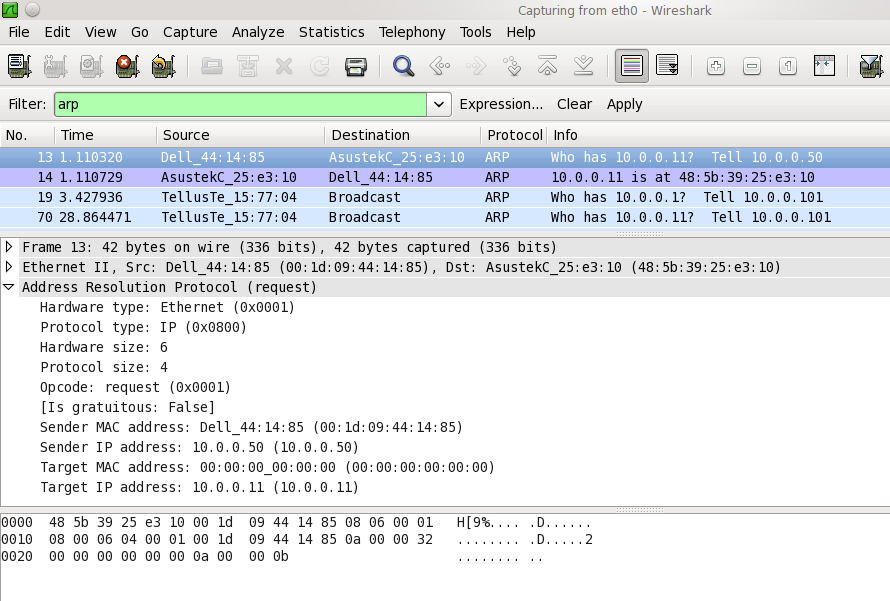
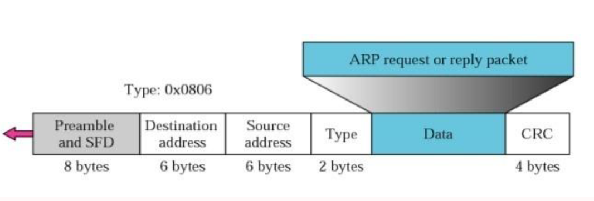
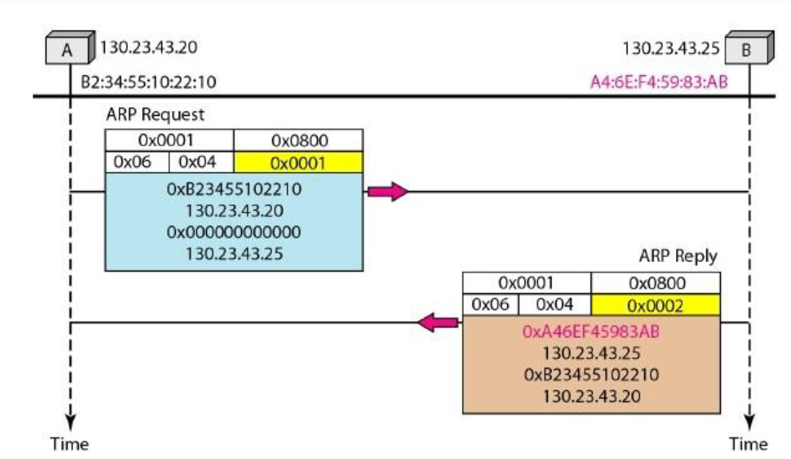
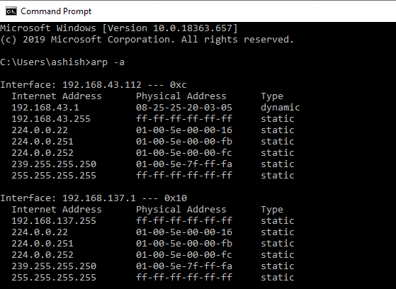
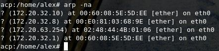

**An Ethernet Address Resolution Protocol**

**\-- or \--**

**Converting Network Protocol Addresses**

to 48.bit Ethernet Address

for Transmission on

Ethernet Hardware

<https://tools.ietf.org/html/rfc826>

Technical Description

ADDRESS

RESOULTION PROTOCOL (ARP)

> Undoubtedly in today's world Ethernet is the most popular technology
> used in computer networking technology. One of the noticeable features
> of it is that it provides high performance durability feature. It is a
> family of co-related well-defined protocols transmitting data at
> [1]{.smallcaps}0 / [10]{.smallcaps}0 Mbps etc rate using a physical
> media like -- coaxial cables, Network Interface Card (NIC) etc.
>
> Information in Ethernet technology is send using a physical media in
> form of packets. Depending on packet size, data in it might be broken
> and wrapped into smaller frames and then send to destination where it
> can be re-assembled again. These frames are written on the wire using
> NIC of the sender. These packets are generated by Sender for a
> Receiver who needs to be connected in network. The packet might travel
> via through routers or switches to reach its destination. A protocol
> defines set of rules for communication between two network identities.
> Note the other networking device in between the Sender and Receiver
> will not pick up these packets for processing rather dropped it. So,
> we need a protocol where based upon \<protocol type, protocol
> address\> it needs to traverse a path from sender to receiver only.

ABSTRACT:
=========

> Let us assume that there are two networking devices A and B exists on
> same network and have below properties:
>
> Device A:
>
> MAC = M(A)
>
> IP = I(A)
>
> Device B:
>
> MAC = M(B)
>
> IP = I(B)
>
> Now A wants to communicate to B and knows B's IP property only. A will
> consults its protocol stack ARP module to map I(B) to M(B). Hence A's
> ARP module will send a broadcast packet on network to which B device
> will respond with its MAC details. Now A's ARP modules caches these
> details to be used to create a Ethernet packet to be send over the
> wire.
>
> Notes:
>
> Address Resolution Protocol (ARP) is one of the major protocols in
> TCP/IP suite with purpose to map an IPv4 address ([32]{.smallcaps}-bit
> Logical Address) to the physical address (48-bit MAC Address). Network
> devices are assigned a logical name and lower level or protocols to
> resolve the logical names to MAC address. Network Applications at the
> Application Layer use IPv4 Address to communicate with another device.
> However, at Data link layer, the addressing is mode used is MAC
> address (a 48-bit Physical Address) which is burned into the network
> card permanently. The purpose of Address Resolution Protocol (ARP) is
> to find out the MAC address of a device in your Local Area Network
> (LAN), for the corresponding IPv4 address, which network application
> is trying to communicate.

THE PROBLEM:
============

> Since computer networking came to exists there are many types of
> networking devices with different interface as made and provided by
> different vendors. As discussed earlier they need to communicate via
> frames which now can classified as a type -- distinguishing one packet
> from other. Note that there are other different types of protocols and
> hardware on network and all of them need cables for transmission the
> packets at specific rate. Protocol address may or may not be a 48-bit
> address -- they can vary from 8 bits to 48 bits addresses. The
> [10]{.smallcaps}Mbit Ethernet network allows all of these protocols
> (and more) to coexist on a single cable by means of a type field in
> the Ethernet packet header.
>
> A protocol is needed to dynamically distribute the correspondences
> between a \<protocol, address\> pair and a 48-bit Ethernet address.
> ARP is used for same in Data Link Layer (Layer [2]{.smallcaps} of OSI)
> within local area or point-to-point link network of connected devices.
> MAC addresses in Ethernet supported network devices are of fixed
> 6-byte (48-bit). IP addresses are not a fixed config for any
> interface. Devices can be manually configured with an IP address or
> they can obtain one from Dynamic Host Configuration Protocol (DHCP)
> Server in the network. Note whenever destination IP packet information
> is not available then based on network / host ids these ethernet
> packets will be forwarded to the network gateway.

MOTIVATION:
===========

> Because of its reliability / speed features, Ethernet became the most
> popular networking protocol in use. More and More protocols were
> implemented into its stack. Still other vendors can have their own
> version of address resolution protocol. They provide this feature in a
> standard form such that vendor specific devices can still make of it
> without any need of modification. So we can have a heterogenous device
> setup network but still be able to let frame send or receive in
> between them.

DEFINITION:
===========

> Address Resolution Protocol (ARP) is one of the major protocol in the
> TCP/IP suit and the purpose of Address Resolution Protocol (ARP) is to
> map an IPv4 address ([32]{.smallcaps}-bit Logical Address) to the
> physical address (48 bit MAC Address). Network Applications at the
> Application Layer use IPv4 Address to communicate with another device.
> But at the Data link layer, the addressing is MAC address (48-bit
> Physical Address), and this address is burned into the network card
> permanently.
>
> The purpose of Address Resolution Protocol (ARP) is to find out the
> MAC address of a device in your Local Area Network (LAN), for the
> corresponding IPv4 address, which network application is trying to
> communicate.

HISTORY OF ARP:
===============

> ARP was first proposed and discussed in Request for Comments (RFC)
> 8[26]{.smallcaps}, published in November of
> [19]{.smallcaps}8[2]{.smallcaps} by David C. Plummer. The problem of
> address resolution was immediately evident in the early days of the IP
> protocol suite, because Ethernet quickly became the preferred LAN
> technology and Ethernet cables required 48-bit addresses.
>
> This protocol is described in one of the earliest of the Internet RFCs
> still in common use: RFC 8[26]{.smallcaps}, An Ethernet Address
> Resolution Protocol, published in [1982.]{.smallcaps}
>
> The name makes clear that ARP was originally developed for Ethernet.
> Thus, it represents a nexus between the most popular layer two LAN
> protocol and the most popular layer three internetworking
> protocol---this is true even two decades later. However, it was also
> obvious from the beginning that even if Ethernet was a very common way
> of transporting IP, it would not be the only one. Therefore, ARP was
> made a general protocol capable of resolving addresses from IP to not
> just Ethernet but numerous other data link layer technologies.

OVERVIEW: 
=========

> The Address Resolution Protocol (ARP) was developed to empower
> communications on an internetwork and is characterized by RFC
> 8[26]{.smallcaps}. Layer 3 gadgets need ARP to map IP network
> addresses to MAC hardware addresses so IP bundles can be sent across
> systems. Before a device sends a datagram to another device, it looks
> in its ARP cache to check whether there is a MAC address and relating
> IP address for the goal gadget. On the off chance that there is no
> access, the source gadget sends a communicate message to each gadget
> on the system. Every gadget looks at the IP address to its own. Just
> the gadget with the coordinating IP address answers to the sending
> gadget with a bundle containing the MAC address for the gadget (aside
> from on account of \"intermediary ARP\"). The source device includes
> the destination device MAC address to its ARP table for future
> reference, makes an information connect header and trailer that
> encapsulates the packet, and continues to move the information.
>
> At the point when the destination device lies on a far off system, one
> beyond another Layer 3 device, the procedure is the equivalent with
> the exception of that the sending device sends an ARP demand for the
> MAC address of the default gateway. After the address is resolved and
> the default gateway gets the packet, the default gateway broadcasts
> the destination IP address over the systems associated with it. The
> Layer 3 device on the destination device network utilizes ARP to
> obtain the MAC address of the destination device and delivers the
> packet.

HOW IT WORKS:
=============

> When a new computer joins a LAN, it is assigned a unique IP address to
> use for identification and communication. When an incoming packet
> destined for a host machine on a particular LAN arrives at a gateway,
> the gateway asks the ARP program to find a MAC address that matches
> the IP address. A table called the ARP cache maintains a record of
> each IP address and its corresponding MAC
> address([RFC[522]{.smallcaps}7](https://tools.ietf.org/html/rfc5227#section-1.3)).
>
> All operating systems in an IPv4 Ethernet network keep an ARP cache.
> Every time a host requests a MAC address in order to send a packet to
> another host in the LAN, it checks its ARP cache to see if the IP to
> MAC address translation already exists. If it does, then a new ARP
> request is unnecessary. If the translation does not already exist,
> then the request for network addresses is sent and ARP is performed.
>
> ARP broadcasts a request packet to all the machines on the LAN and
> asks if any of the machines know they are using that particular IP
> address. When a machine recognizes the IP address as its own, it sends
> a reply so ARP can update the cache for future reference and proceed
> with the communication.
>
> Host machines that don\'t know their own IP address can use the
> Reverse ARP (RARP) protocol for discovery.
>
> An ARP cache size is limited and is periodically cleansed of all
> entries to free up space; in fact, addresses tend to stay in the cache
> for only a few minutes. Frequent updates allow other devices in the
> network to see when a physical host changes their requested IP
> address. In the cleaning process, unused entries are deleted as well
> as any unsuccessful attempts to communicate with computers that are
> not currently powered on

TERMINOLOGY:
============

> THERE ARE TWO TYPES OF MAPPING:

1.  STATIC MAPPING

2.  DYNAMIC MAPPING

STATIC MAPPING:
---------------

> Static mapping means creating a table that associates a logical
> address with a physical address. This table is stored in each machine
> on the network
>
> Each machine that knows, for example, the IP address of another
> machine but not its physical address can look it up in the table. This
> has some limitations because physical addresses may change in the
> following ways:

-   A machine could change its NIC, resulting in a new physical address.

-   In some LANs, such as LocalTalk, the physical address changes every
    time the computer is turned on.

-   A mobile computer can move from one physical network to another,
    resulting in a change in its physical address.

> To implement these changes, a static mapping table must be updated
> periodically. This overhead could affect network performance.

DYNAMIC MAPPING:
----------------

> In dynamic mapping, each time a machine knows the logical address of
> another machine, it can use a protocol to find the physical address.
> Two protocols have been designed to perform dynamic mapping: Address
> Resolution Protocol (ARP) and Reverse Address Resolution Protocol
> (RARP). ARP maps a logical address to a physical address; RARP maps a
> physical address to a logical address. Since RARP is replaced with
> another protocol and therefore ignored, so we discuss only ARP
> protocol in this document.

ARP CACHING:
============

> Due to the mapping of IP addresses to media access control (MAC)
> addresses occurs at each hop (Layer 3 device) on the network for every
> datagram sent over an internetwork, performance of the network could
> be compromised. To minimize broadcasts and limit wasteful use of
> network resources, Address Resolution Protocol (ARP) caching was
> implemented.
>
> ARP caching is the method of storing network addresses and the
> associated data-link addresses in memory for a period of time as the
> addresses are learned.
>
> This minimizes the use of valuable network resources to broadcast for
> the same address each time a datagram is sent. The cache entries must
> be maintained because the information could become outdated, so it is
> critical that the cache entries are set to expire periodically. Every
> device on a network updates its tables as addresses are broadcast.
>
> There are static ARP cache entries and dynamic ARP cache entries.
> Static entries are manually configured and kept in the cache table on
> a permanent basis. Static entries are best for devices that have to
> communicate with other devices usually in the same network on a
> regular basis. Dynamic entries are added by Cisco software, kept for a
> period of time, and then removed.

Static and Dynamic Entries in the ARP Cache
-------------------------------------------

> Static routing requires an administrator to manually enter IP
> addresses, subnet masks, gateways, and corresponding media access
> control (MAC) addresses for each interface of each device into a
> table. Static routing enables more control but requires more work to
> maintain the table. The table must be updated each time routes are
> added or changed.
>
> Dynamic routing uses protocols that enable the devices in a network to
> exchange routing table information with each other. The table is built
> and changed automatically. No administrative tasks are needed unless a
> time limit is added, so dynamic routing is more efficient than static
> routing. The default time limit is 4 hours. If the network has a great
> many routes that are added and deleted from the cache, the time limit
> should be adjusted.

Proxy ARP
=========

> Proxy Address Resolution Protocol, as defined in RFC
> [1]{.smallcaps}0[27,]{.smallcaps} was implemented to enable devices
> that are separated into physical network segments connected by a
> router in the same IP network or subnetwork to resolve IP-to-MAC
> addresses. When devices are not in the same data link layer network
> but are in the same IP network, they try to transmit data to each
> other as if they were on the local network.
>
> However, the router that separates the devices will not send a
> broadcast message because routers do not pass hardware-layer
> broadcasts. Therefore, the addresses cannot be resolved.
>
> Proxy ARP is enabled by default so the \"proxy router\" that resides
> between the local networks responds with its MAC address as if it were
> the router to which the broadcast is addressed. When the sending
> device receives the MAC address of the proxy router, it sends the
> datagram to the proxy router, which in turns sends the datagram to the
> designated device.

ARP PROTOCOL STRUCTURE :
========================

{width="5.989583333333333in"
height="2.4479166666666665in"}

> The fields in the Address Resolution Protocol (ARP) Message Format
> are:

-   Hardware Type: Hardware Type field in ARP Message specifies the type
    of hardware used for the local network transmitting the Address
    Resolution Protocol (ARP) message. Ethernet is the common Hardware
    Type and he value for Ethernet is [1.]{.smallcaps} The size of this
    field is [2]{.smallcaps} bytes.

-   Protocol Type: Each protocol is assigned a number used in this
    field. IPv4 is [20]{.smallcaps}48 (0x0800 in Hexadecimal).

-   Hardware Address Length: Hardware Address Length in ARP Message is
    length in bytes of a hardware (MAC) address. Ethernet MAC addresses
    are 6 bytes long.

-   Protocol Address Length: Length in bytes of a logical address (IPv4
    Address). IPv4 addresses are 4 bytes long.

-   Opcode: Opcode field in ARP Message specifies the nature of the ARP
    message. [1]{.smallcaps} for ARP request and [2]{.smallcaps} for ARP
    reply.

-   Sender Hardware Address: Layer [2]{.smallcaps} (MAC Address) address
    of the device sending the message.

-   Sender Protocol Address: The protocol address (IPv4 address) of the
    device sending the message

-   Target Hardware Address: Layer [2]{.smallcaps} (MAC Address) of the
    intended receiver.

ARP STRUCTURE IN WIRESHARK:
===========================

> {width="6.491666666666666in"
> height="4.383333333333334in"}
>
> ENCAPSULATION:
>
> An ARP packet is encapsulated directly into a data link frame. For
> example, in the following figure, an ARP packet is encapsulated in an
> Ethernet frame. Note that the type field indicates that the data
> carried by the frame is an ARP packet.

{width="8.883333333333333in"
height="3.0166666666666666in"}

ARP REQUEST AND REPLY:
----------------------

> Let us see how ARP functions on a typical internet. First we describe
> the steps involved. Then we discuss the four cases in which a host or
> router needs to use ARP:

-   The sender knows the IP address of the target.

-   IP asks ARP to create an ARP request message, filling in the sender
    physical address, the sender IP address, and the target IP address.
    The target physical address field is filled with 0s.

> The message is passed to the data link layer where it is encapsulated
> in a frame using the physical address of the sender as the source
> address and the physical broadcast address as the destination
> address([RFC[522]{.smallcaps}7](https://tools.ietf.org/html/rfc5227#section-2.4)).
>
> {width="9.108333333333333in"
> height="5.283333333333333in"}

-   Every host or router receives the frame. Because the frame contains
    a broadcast destination address, all stations remove the message and
    pass it to ARP. All machines except the one targeted drop the
    packet. The target machine recognizes the IP address.

-   The target machine replies with an ARP reply message that contains
    its physical address. The message is unicast.

-   The sender receives the reply message. It now knows the physical
    address of the target machine.

-   The IP datagram, which carries data for the target machine, is now
    encapsulated in a frame and is unicast to the destination.

4 DIFFERENT CASES IN ARP :
==========================

> {width="6.458333333333333in"
> height="4.666666666666667in"}
>
> ARP ATTACKS & DEFENCES

ARP POISIONING
--------------

> ARP poisoning is an attack where we send fake ARP reply packets on the
> network. There are two possible
> attacks([RFC[522]{.smallcaps}7](https://tools.ietf.org/html/rfc5227#section-5)):

-   **MITM (Man in the middle):** the attacker will send an ARP reply
    with its own MAC address and the IP address of a legitimate host,
    server or router. When the victim receives the ARP reply it will
    update its ARP table. When it tries to reach the legitimate device,
    the IP packets will end up at the attacker.

-   **DOS (Denial of Service):** the attacker will send many ARP replies
    with the MAC address of a legitimate server. All devices in the
    network will update their ARP tables and all IP packets in the
    network will be sent to the server, overloading it with traffic.

> The attack works as follows:

1.  The attacker must have access to the network. They scan the network
    to determine the IP addresses of at least two devices---let's say
    these are a workstation and a router.

2.  The attacker uses a spoofing tool, such as Arp spoof or Driftnet, to
    send out forged ARP responses.

3.  The forged responses advertise that the correct MAC address for both
    IP addresses, belonging to the router and workstation, is the
    attacker's MAC address. This fools both router and workstation to
    connect to the attacker's machine, instead of to each other.

4.  The two devices update their ARP cache entries and from that point
    onwards, communicate with the attacker instead of directly with each
    other.

> The attacker is now secretly in the middle of all communications.
>
> {width="6.533333333333333in"
> height="4.991666666666666in"}
>
> Once the attacker succeeds in an ARP spoofing attack, they can:

-   **Continue routing the communications as-is**- the attacker can
    sniff the packets and steal data, except if it is transferred over
    an encrypted channel like HTTPS.

-   **Perform session hijacking**- if the attacker obtains a session ID,
    they can gain access to accounts the user is currently logged into.

-   **Alter communication**- for example pushing a malicious file or
    website to the workstation

-   **Distributed Denial of Service(DDoS)-** the attackers can provide
    the MAC address of a server they wish to attack with DDoS, instead
    of their own machine. If they do this for a large number of IPs, the
    target server will be bombarded with traffic.

DETECTION:
----------

> Simple way to detect that a specific device's ARP cache has been
> poisoned, using the command line. Start an operating system shell as
> an administrator. Use the following command to display the ARP table,
> on both Windows and Linux

{width="5.822916666666667in"
height="4.25in"}

> *Figure 1: Legitimate ARP table*
>
> {width="4.416666666666667in"
> height="1.0416666666666667in"}
>
> *Figure 2: Spoofed ARP Table*
>
> If the table contains two different IP addresses that have the same
> MAC address, this indicates an ARP attack is taking place.
