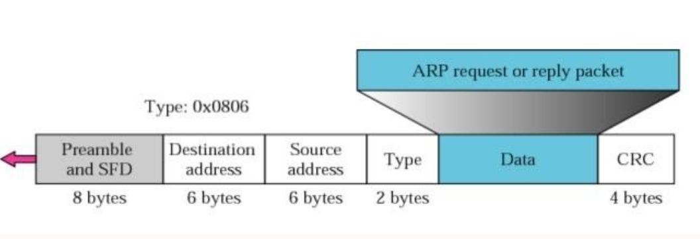
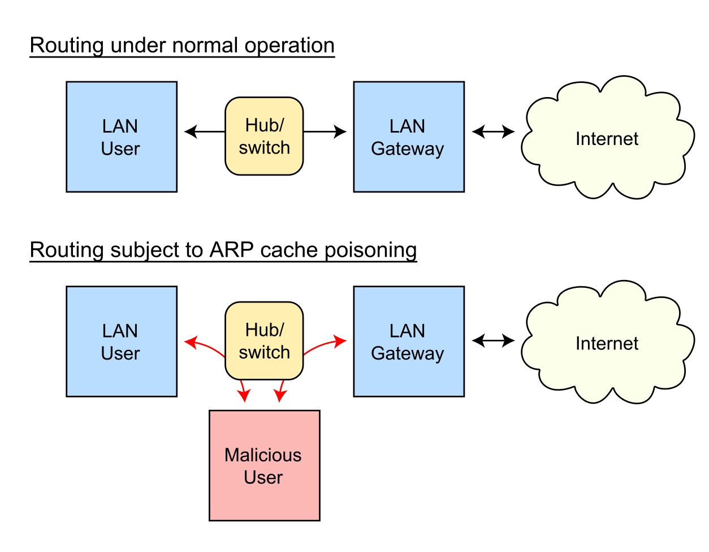
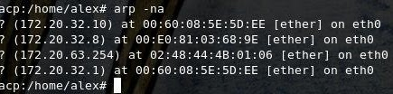

தொழில்நுட்ப விளக்கம்

முகவரி

RESOULTION PROTOCOL (ARP)

**ஈத்தர்நெட் முகவரி தீர்மான நெறிமுறை**

**\-- அல்லது \--**

**பிணைய நெறிமுறை முகவரிகளை மாற்றுகிறது**

[[https://tools.ietf.org/html/rfc826]{.ul}](https://www.google.com/url?q=https%3A%2F%2Ftools.ietf.org%2Fhtml%2Frfc826&sa=D&sntz=1&usg=AFQjCNHSlGxJe18c1VJeIV6ePn4xPAj3rA)

> இன்றைய உலகில் சந்தேகத்திற்கு இடமின்றி கணினி நெட்வொர்க்கிங்
> தொழில்நுட்பத்தில் பயன்படுத்தப்படும் மிகவும் பிரபலமான தொழில்நுட்பம்
> ஈத்தர்நெட் ஆகும். இதன் குறிப்பிடத்தக்க அம்சங்களில் ஒன்று, இது அதிக
> செயல்திறன் கொண்ட ஆயுள் அம்சத்தை வழங்குகிறது. கோஆக்சியல் கேபிள்கள்,
> நெட்வொர்க் இன்டர்ஃபேஸ் கார்டு (என்ஐசி) போன்ற இயற்பியல் ஊடகங்களைப்
> பயன்படுத்தி 10/100 எம்.பி.பி.எஸ் போன்ற விகிதத்தில் தரவை அனுப்பும்
> இணை-தொடர்புடைய நன்கு வரையறுக்கப்பட்ட நெறிமுறைகளின் குடும்பம் இது.
>
> ஈத்தர்நெட் தொழில்நுட்பத்தில் உள்ள தகவல்கள் ஒரு இயற்பியல் ஊடகத்தைப்
> பயன்படுத்தி பாக்கெட்டுகளின் வடிவத்தில் அனுப்பப்படுகின்றன. பாக்கெட்
> அளவைப் பொறுத்து, அதில் உள்ள தரவு உடைக்கப்பட்டு சிறிய பிரேம்களில்
> மூடப்பட்டிருக்கலாம், பின்னர் அதை மீண்டும் கூடியிருக்கக்கூடிய
> இடத்திற்கு அனுப்பலாம். இந்த பிரேம்கள் அனுப்புநரின் என்.ஐ.சி
> பயன்படுத்தி கம்பியில் எழுதப்பட்டுள்ளன. நெட்வொர்க்கில் இணைக்கப்பட
> வேண்டிய பெறுநருக்காக இந்த பாக்கெட்டுகள் அனுப்புநரால்
> உருவாக்கப்படுகின்றன. பாக்கெட் அதன் இலக்கை அடைய திசைவிகள் அல்லது
> சுவிட்சுகள் வழியாக பயணிக்கக்கூடும். ஒரு நெறிமுறை இரண்டு பிணைய
> அடையாளங்களுக்கிடையேயான தகவல்தொடர்புக்கான விதிகளின் தொகுப்பை
> வரையறுக்கிறது. அனுப்புநருக்கும் பெறுநருக்கும் இடையில் உள்ள பிற
> நெட்வொர்க்கிங் சாதனம் செயலாக்கத்திற்காக இந்த பாக்கெட்டுகளை எடுக்காது
> என்பதை நினைவில் கொள்க. எனவே, எங்களுக்கு ஒரு நெறிமுறை தேவை, அங்கு
> \<நெறிமுறை வகை, நெறிமுறை முகவரி\> அடிப்படையில் அது அனுப்புநரிடமிருந்து
> பெறுநருக்கு மட்டுமே ஒரு பாதையில் பயணிக்க வேண்டும்.

**சுருக்கம்:**

> ஒரே நெட்வொர்க்கில் A மற்றும் B இரண்டு நெட்வொர்க்கிங் சாதனங்கள் உள்ளன
> மற்றும் கீழே உள்ள பண்புகள் உள்ளன என்று வைத்துக் கொள்வோம்:
>
> சாதனம் A:
>
> MAC = M (A)
>
> ஐபி = நான் (ஏ)
>
> சாதனம் பி:
>
> MAC = M (B)
>
> ஐபி = நான் (பி)
>
> இப்போது A B உடன் தொடர்பு கொள்ள விரும்புகிறது மற்றும் B இன் ஐபி
> சொத்துக்கு மட்டுமே தெரியும். I (B) ஐ M (B) க்கு வரைபட ஒரு நெறிமுறை
> அடுக்கு ARP தொகுதியை ஆலோசிக்கும். எனவே A இன் ARP தொகுதி நெட்வொர்க்கில்
> ஒரு ஒளிபரப்பு பாக்கெட்டை அனுப்பும், அதற்கு B சாதனம் அதன் MAC
> விவரங்களுடன் பதிலளிக்கும். இப்போது A இன் ARP தொகுதிகள் இந்த விவரங்களை
> கம்பி வழியாக அனுப்ப ஈதர்நெட் பாக்கெட்டை உருவாக்க பயன்படுகிறது.
>
> குறிப்புகள்:
>
> முகவரி தீர்மான நெறிமுறை (ARP) என்பது TCP / IP தொகுப்பில் உள்ள ஒரு
> முக்கிய நெறிமுறைகளில் ஒன்றாகும், இது IPv4 முகவரியை (32-பிட் தருக்க
> முகவரி) ப address தீக முகவரிக்கு (48-பிட் MAC முகவரி) வரைபடமாக்கும்
> நோக்கத்துடன் உள்ளது. MAC முகவரிக்கு தருக்க பெயர்களைத் தீர்க்க
> நெட்வொர்க் சாதனங்களுக்கு ஒரு தருக்க பெயர் மற்றும் கீழ் நிலை அல்லது
> நெறிமுறைகள் ஒதுக்கப்படுகின்றன. பயன்பாட்டு அடுக்கில் உள்ள பிணைய
> பயன்பாடுகள் மற்றொரு சாதனத்துடன் தொடர்பு கொள்ள IPv4 முகவரியைப்
> பயன்படுத்துகின்றன. இருப்பினும், தரவு இணைப்பு அடுக்கில், முகவரி என்பது
> பயன்முறையாகும், இது MAC முகவரி (48-பிட் உடல் முகவரி) ஆகும், இது பிணைய
> அட்டையில் நிரந்தரமாக எரிகிறது. முகவரி தீர்மான நெறிமுறையின் (ARP)
> நோக்கம், உங்கள் உள்ளூர் பகுதி நெட்வொர்க்கில் (LAN) ஒரு சாதனத்தின் MAC
> முகவரியைக் கண்டுபிடிப்பது, அதனுடன் தொடர்புடைய IPv4 முகவரிக்கு, எந்த
> பிணைய பயன்பாடு தொடர்பு கொள்ள முயற்சிக்கிறது.

**பிரச்சினை:**

> கணினி நெட்வொர்க்கிங் இருந்ததால், வெவ்வேறு விற்பனையாளர்களால்
> உருவாக்கப்பட்ட மற்றும் வழங்கப்பட்ட வெவ்வேறு இடைமுகத்துடன் பல வகையான
> நெட்வொர்க்கிங் சாதனங்கள் உள்ளன. முன்பு விவாதித்தபடி, அவர்கள் இப்போது
> ஒரு வகையாக வகைப்படுத்தக்கூடிய பிரேம்கள் வழியாக தொடர்பு கொள்ள வேண்டும்
> - ஒரு பாக்கெட்டை மற்றொன்றிலிருந்து வேறுபடுத்துகிறது. நெட்வொர்க்கில்
> வேறு வகையான நெறிமுறைகள் மற்றும் வன்பொருள் உள்ளன என்பதையும், அவை
> அனைத்திற்கும் குறிப்பிட்ட விகிதத்தில் பாக்கெட்டுகளை அனுப்ப கேபிள்கள்
> தேவை என்பதையும் நினைவில் கொள்க. நெறிமுறை முகவரி 48 பிட் முகவரியாக
> இருக்கலாம் அல்லது இல்லாமல் இருக்கலாம் - அவை 8 பிட்கள் முதல் 48 பிட்கள்
> முகவரிகள் வரை மாறுபடும். 10 மெபிட் ஈதர்நெட் நெட்வொர்க் இந்த
> நெறிமுறைகள் அனைத்தையும் (மேலும் பல) ஈத்தர்நெட் பாக்கெட் தலைப்பில் ஒரு
> வகை புலம் மூலம் ஒற்றை கேபிளில் இணைந்து வாழ அனுமதிக்கிறது.
>
> \<நெறிமுறை, முகவரி\> ஜோடி மற்றும் 48-பிட் ஈதர்நெட் முகவரிக்கு இடையிலான
> கடிதங்களை மாறும் வகையில் விநியோகிக்க ஒரு நெறிமுறை தேவை. உள்ளூர்
> பகுதிக்குள் உள்ள தரவு இணைப்பு அடுக்கு (OSI இன் அடுக்கு 2) அல்லது
> இணைக்கப்பட்ட சாதனங்களின் புள்ளி-க்கு-புள்ளி இணைப்பு நெட்வொர்க்கில் ARP
> பயன்படுத்தப்படுகிறது. ஈத்தர்நெட் ஆதரவு நெட்வொர்க் சாதனங்களில் உள்ள MAC
> முகவரிகள் நிலையான 6-பைட் (48-பிட்) கொண்டவை. ஐபி முகவரிகள் எந்த
> இடைமுகத்திற்கும் ஒரு நிலையான உள்ளமைவு அல்ல. சாதனங்களை ஒரு ஐபி
> முகவரியுடன் கைமுறையாக உள்ளமைக்க முடியும் அல்லது அவை பிணையத்தில் உள்ள
> டைனமிக் ஹோஸ்ட் உள்ளமைவு நெறிமுறை (டிஹெச்சிபி) சேவையகத்திலிருந்து
> ஒன்றைப் பெறலாம். இலக்கு ஐபி பாக்கெட் தகவல் கிடைக்காத போதெல்லாம்
> நெட்வொர்க் / ஹோஸ்ட் ஐடிகளின் அடிப்படையில் இந்த ஈத்தர்நெட்
> பாக்கெட்டுகள் பிணைய நுழைவாயிலுக்கு அனுப்பப்படும்.

**முயற்சி:**

> அதன் நம்பகத்தன்மை / வேக அம்சங்கள் காரணமாக, ஈத்தர்நெட் பயன்பாட்டில்
> மிகவும் பிரபலமான நெட்வொர்க்கிங் நெறிமுறையாக மாறியது. மேலும் மேலும்
> நெறிமுறைகள் அதன் அடுக்கில் செயல்படுத்தப்பட்டன. இன்னும் பிற
> விற்பனையாளர்கள் முகவரி தீர்மான நெறிமுறையின் சொந்த பதிப்பைக்
> கொண்டிருக்கலாம். அவை இந்த அம்சத்தை ஒரு நிலையான வடிவத்தில்
> வழங்குகின்றன, அதாவது விற்பனையாளர் குறிப்பிட்ட சாதனங்கள் எந்த மாற்றமும்
> இல்லாமல் அதை உருவாக்க முடியும். எனவே நாம் ஒரு பன்முக சாதன அமைவு
> நெட்வொர்க்கைக் கொண்டிருக்கலாம், ஆனால் அவற்றுக்கு இடையில் சட்டத்தை
> அனுப்பவோ அல்லது பெறவோ முடியும்.

**வரையறை:**

> முகவரி தீர்மான நெறிமுறை (ARP) என்பது TCP / IP வழக்கில் உள்ள ஒரு
> முக்கிய நெறிமுறையாகும், மேலும் முகவரி தீர்மான நெறிமுறையின் (ARP)
> நோக்கம் IPv4 முகவரியை (32-பிட் தருக்க முகவரி) உடல் முகவரிக்கு (48 பிட்
> MAC முகவரி) வரைபடமாக்குவதாகும். ). பயன்பாட்டு அடுக்கில் உள்ள பிணைய
> பயன்பாடுகள் மற்றொரு சாதனத்துடன் தொடர்பு கொள்ள IPv4 முகவரியைப்
> பயன்படுத்துகின்றன. ஆனால் தரவு இணைப்பு அடுக்கில், முகவரி MAC முகவரி
> (48-பிட் உடல் முகவரி), இந்த முகவரி நெட்வொர்க் அட்டையில் நிரந்தரமாக
> எரிக்கப்படுகிறது.
>
> முகவரி தீர்மான நெறிமுறையின் (ARP) நோக்கம், உங்கள் உள்ளூர் பகுதி
> நெட்வொர்க்கில் (LAN) ஒரு சாதனத்தின் MAC முகவரியைக் கண்டுபிடிப்பது,
> அதனுடன் தொடர்புடைய IPv4 முகவரிக்கு, எந்த பிணைய பயன்பாடு தொடர்பு கொள்ள
> முயற்சிக்கிறது.

**ARP இன் வரலாறு:**

> ARP முதன்முதலில் 1982 ஆம் ஆண்டு நவம்பரில் டேவிட் சி. பிளம்மர்
> வெளியிட்ட கருத்துகளுக்கான கோரிக்கை (RFC) 826 இல் முன்மொழியப்பட்டது
> மற்றும் விவாதிக்கப்பட்டது. ஐபி நெறிமுறை தொகுப்பின் ஆரம்ப நாட்களில்
> முகவரித் தீர்மானத்தின் சிக்கல் உடனடியாகத் தெரிந்தது, ஏனெனில்
> ஈத்தர்நெட் விரைவாக விருப்பமான லேன் தொழில்நுட்பமாக மாறியது மற்றும்
> ஈத்தர்நெட் கேபிள்களுக்கு 48 பிட் முகவரிகள் தேவைப்பட்டன.
>
> இந்த நெறிமுறை இன்னும் பொதுவான பயன்பாட்டில் உள்ள இணைய RFC களின் ஆரம்ப
> காலங்களில் ஒன்றில் விவரிக்கப்பட்டுள்ளது: 1982 இல் வெளியிடப்பட்ட RFC
> 826, ஒரு ஈதர்நெட் முகவரி தீர்மான நெறிமுறை.
>
> ARP முதலில் ஈதர்நெட்டுக்காக உருவாக்கப்பட்டது என்பதை பெயர்
> தெளிவுபடுத்துகிறது. எனவே, இது மிகவும் பிரபலமான அடுக்கு இரண்டு லேன்
> நெறிமுறை மற்றும் மிகவும் பிரபலமான அடுக்கு மூன்று இணைய வேலை நெறிமுறை
> ஆகியவற்றுக்கு இடையேயான ஒரு உறவைக் குறிக்கிறது-இது இரண்டு
> தசாப்தங்களுக்குப் பிறகும் உண்மை. இருப்பினும், ஈத்தர்நெட் ஐபி கொண்டு
> செல்வதற்கான மிகவும் பொதுவான வழியாக இருந்தாலும், அது மட்டும் இருக்காது
> என்பதும் ஆரம்பத்தில் இருந்தே தெளிவாக இருந்தது. ஆகையால், ஐபி இலிருந்து
> ஈத்தர்நெட்டிற்கு மட்டுமல்லாமல் பல தரவு இணைப்பு அடுக்கு
> தொழில்நுட்பங்களுக்கும் முகவரிகளை தீர்க்கும் திறன் கொண்ட ஒரு பொதுவான
> நெறிமுறை ARP ஆனது.

**கண்ணோட்டம்:**

> முகவரி தீர்மான நெறிமுறை (ARP) ஒரு இணையப்பணியில் தகவல்தொடர்புகளை
> மேம்படுத்துவதற்காக உருவாக்கப்பட்டது மற்றும் RFC 826 ஆல்
> வகைப்படுத்தப்படுகிறது. ஐபி நெட்வொர்க் முகவரிகளை MAC வன்பொருள்
> முகவரிகளுக்கு வரைபட அடுக்கு 3 கேஜெட்டுகளுக்கு ARP தேவைப்படுகிறது, எனவே
> கணினிகளில் ஐபி மூட்டைகளை அனுப்ப முடியும். ஒரு சாதனம் மற்றொரு
> சாதனத்திற்கு டேட்டாகிராம் அனுப்புவதற்கு முன்பு, இலக்கு கேஜெட்டுக்கு
> ஒரு MAC முகவரி மற்றும் ஐபி முகவரி உள்ளதா என்பதை சரிபார்க்க அதன் ARP
> தற்காலிக சேமிப்பில் தெரிகிறது. அணுகல் இல்லாத சந்தர்ப்பத்தில், மூல
> கேஜெட் கணினியில் உள்ள ஒவ்வொரு கேஜெட்டிற்கும் ஒரு தொடர்பு செய்தியை
> அனுப்புகிறது. ஒவ்வொரு கேஜெட்டும் ஐபி முகவரியை அதன் சொந்தமாக
> பார்க்கிறது. ஒருங்கிணைக்கும் ஐபி முகவரியுடன் கூடிய கேஜெட் அனுப்பும்
> கேஜெட்டுக்கு கேஜெட்டுக்கான MAC முகவரியைக் கொண்ட ஒரு மூட்டைடன்
> பதிலளிக்கிறது (\"இடைநிலை ARP\" கணக்கைத் தவிர).
>
> இலக்கு சாதனம் தொலைதூர கணினியில் இருக்கும்போது, ​​மற்றொரு அடுக்கு 3
> சாதனத்திற்கு அப்பால், செயல்முறை சமமானதாகும், தவிர அனுப்பும் சாதனம்
> இயல்புநிலை நுழைவாயிலின் MAC முகவரிக்கு ARP கோரிக்கையை அனுப்புகிறது.
> முகவரி தீர்க்கப்பட்டு இயல்புநிலை நுழைவாயில் பாக்கெட்டைப் பெற்ற பிறகு,
> இயல்புநிலை நுழைவாயில் இலக்கு ஐபி முகவரியை அதனுடன் தொடர்புடைய
> கணினிகளில் ஒளிபரப்புகிறது. இலக்கு சாதன நெட்வொர்க்கில் உள்ள அடுக்கு 3
> சாதனம் இலக்கு சாதனத்தின் MAC முகவரியைப் பெற ARP ஐப் பயன்படுத்துகிறது
> மற்றும் பாக்கெட்டை வழங்குகிறது.

**எப்படி இது செயல்படுகிறது:**

> ஒரு புதிய கணினி LAN இல் சேரும்போது, ​​அடையாளம் மற்றும்
> தகவல்தொடர்புக்கு பயன்படுத்த ஒரு தனிப்பட்ட ஐபி முகவரி ஒதுக்கப்படுகிறது.
> ஒரு குறிப்பிட்ட லானில் ஒரு ஹோஸ்ட் மெஷினுக்கு விதிக்கப்பட்ட உள்வரும்
> பாக்கெட் ஒரு நுழைவாயிலுக்கு வரும்போது, ​​ஐபி முகவரியுடன்
> பொருந்தக்கூடிய ஒரு MAC முகவரியைக் கண்டுபிடிக்க கேட்வே ARP நிரலைக்
> கேட்கிறது. ARP கேச் எனப்படும் அட்டவணை ஒவ்வொரு ஐபி முகவரி மற்றும்
> அதனுடன் தொடர்புடைய MAC முகவரி (
> [[RFC5227]{.ul}](https://www.google.com/url?q=https%3A%2F%2Ftools.ietf.org%2Fhtml%2Frfc5227%23section-1.3&sa=D&sntz=1&usg=AFQjCNGGQNaGP6atAzMmhiHh4AUWOs6BDQ)
> ) ஆகியவற்றின் [[பதிவையும்
> பராமரிக்கிறது]{.ul}](https://www.google.com/url?q=https%3A%2F%2Ftools.ietf.org%2Fhtml%2Frfc5227%23section-1.3&sa=D&sntz=1&usg=AFQjCNGGQNaGP6atAzMmhiHh4AUWOs6BDQ)
> .
>
> IPv4 ஈதர்நெட் நெட்வொர்க்கில் உள்ள அனைத்து இயக்க முறைமைகளும் ARP
> தற்காலிக சேமிப்பை வைத்திருக்கின்றன. LAN இல் உள்ள மற்றொரு ஹோஸ்டுக்கு
> ஒரு பாக்கெட்டை அனுப்ப ஒவ்வொரு முறையும் ஒரு ஹோஸ்ட் ஒரு MAC முகவரியைக்
> கோருகையில், ஐபி முதல் மேக் முகவரி மொழிபெயர்ப்பு ஏற்கனவே இருக்கிறதா
> என்று அதன் ஏஆர்பி கேச் சரிபார்க்கிறது. அவ்வாறு செய்தால், புதிய ARP
> கோரிக்கை தேவையற்றது. மொழிபெயர்ப்பு ஏற்கனவே இல்லை என்றால், பிணைய
> முகவரிகளுக்கான கோரிக்கை அனுப்பப்பட்டு ARP செய்யப்படுகிறது.
>
> ARP ஒரு கோரிக்கை பாக்கெட்டை LAN இல் உள்ள அனைத்து கணினிகளுக்கும்
> ஒளிபரப்புகிறது மற்றும் எந்த குறிப்பிட்ட இயந்திரங்களும் அந்த
> குறிப்பிட்ட ஐபி முகவரியைப் பயன்படுத்துகின்றன என்று தெரியுமா என்று
> கேட்கிறது. ஒரு இயந்திரம் ஐபி முகவரியை அதன் சொந்தமாக
> அங்கீகரிக்கும்போது, ​​அது ஒரு பதிலை அனுப்புகிறது, எனவே ARP எதிர்கால
> குறிப்புகளுக்கான தற்காலிக சேமிப்பை புதுப்பித்து தகவல்தொடர்புடன்
> தொடரலாம்.
>
> சொந்த ஐபி முகவரி தெரியாத ஹோஸ்ட் இயந்திரங்கள் கண்டுபிடிப்புக்கு தலைகீழ்
> ARP (RARP) நெறிமுறையைப் பயன்படுத்தலாம்.
>
> ஒரு ARP கேச் அளவு குறைவாக உள்ளது மற்றும் இடத்தை விடுவிக்க எல்லா
> உள்ளீடுகளையும் அவ்வப்போது சுத்தப்படுத்துகிறது; உண்மையில், முகவரிகள்
> தற்காலிக சேமிப்பில் சில நிமிடங்கள் மட்டுமே இருக்கும். இயல்பான ஹோஸ்ட்
> அவர்கள் கோரிய ஐபி முகவரியை மாற்றும்போது அடிக்கடி புதுப்பிப்புகள்
> பிணையத்தில் உள்ள பிற சாதனங்களைக் காண அனுமதிக்கின்றன. துப்புரவு
> செயல்பாட்டில், பயன்படுத்தப்படாத உள்ளீடுகள் நீக்கப்பட்டன, அத்துடன்
> தற்போது இயங்காத கணினிகளுடன் தொடர்புகொள்வதற்கான தோல்வியுற்ற முயற்சிகள்

**சொல்:**

> மேப்பிங் இரண்டு வகைகள் உள்ளன:
>
> 1\. நிலையான மேப்பிங்
>
> 2\. டைனமிக் மேப்பிங்

**நிலையான மேப்பிங்:**

> நிலையான மேப்பிங் என்பது ஒரு தருக்க முகவரியை இயற்பியல் முகவரியுடன்
> தொடர்புபடுத்தும் அட்டவணையை உருவாக்குவதாகும். இந்த அட்டவணை பிணையத்தில்
> உள்ள ஒவ்வொரு இயந்திரத்திலும் சேமிக்கப்படுகிறது
>
> ஒவ்வொரு இயந்திரமும் தெரியும், எடுத்துக்காட்டாக, மற்றொரு இயந்திரத்தின்
> ஐபி முகவரி ஆனால் அதன் உடல் முகவரி அல்ல அதை அட்டவணையில் பார்க்க
> முடியும். இதற்கு சில வரம்புகள் உள்ளன, ஏனெனில் பின்வரும் வழிகளில் உடல்
> முகவரிகள் மாறக்கூடும்:
>
> · ஒரு இயந்திரம் ஒரு புதிய உடல் முகவரியை விளைவாக, அதன் என்ஐசி மாற்ற
> முடியும்.
>
> Local லோக்கல் டாக் போன்ற சில லான்களில், கணினி இயக்கப்படும் ஒவ்வொரு
> முறையும் உடல் முகவரி மாறுகிறது.
>
> Computer ஒரு மொபைல் கணினி ஒரு ப network தீக நெட்வொர்க்கிலிருந்து
> இன்னொரு இடத்திற்கு செல்ல முடியும், இதன் விளைவாக அதன் உடல் முகவரியில்
> மாற்றம் ஏற்படும்.
>
> இந்த மாற்றங்களைச் செயல்படுத்த, நிலையான மேப்பிங் அட்டவணை அவ்வப்போது
> புதுப்பிக்கப்பட வேண்டும். இந்த மேல்நிலை நெட்வொர்க் செயல்திறனை
> பாதிக்கலாம்.

**டைனமிக் மேப்பிங்:**

> டைனமிக் மேப்பிங்கில், ஒவ்வொரு முறையும் ஒரு இயந்திரம் மற்றொரு
> இயந்திரத்தின் தர்க்கரீதியான முகவரியை அறிந்தால், அது ஒரு நெறிமுறையைப்
> பயன்படுத்தி உடல் முகவரியைக் கண்டறியலாம். டைனமிக் மேப்பிங் செய்ய இரண்டு
> நெறிமுறைகள் வடிவமைக்கப்பட்டுள்ளன: முகவரி தீர்மானம் நெறிமுறை (ARP)
> மற்றும் தலைகீழ் முகவரி தீர்மான நெறிமுறை (RARP). ARP ஒரு தருக்க
> முகவரியை ஒரு உடல் முகவரிக்கு வரைபடமாக்குகிறது; RARP ஒரு உடல் முகவரியை
> ஒரு தருக்க முகவரிக்கு வரைபடமாக்குகிறது. RARP மற்றொரு நெறிமுறையுடன்
> மாற்றப்படுவதால் புறக்கணிக்கப்படுவதால், இந்த ஆவணத்தில் ARP நெறிமுறையை
> மட்டுமே நாங்கள் விவாதிக்கிறோம்.

**ஆர்ப் கேச்சிங்:**

> ஐபி முகவரிகளை மீடியா அணுகல் கட்டுப்பாட்டு (எம்ஏசி) முகவரிகளுக்கு
> மேப்பிங் செய்வதால், நெட்வொர்க்கில் அனுப்பப்படும் ஒவ்வொரு
> டேட்டாகிராமிற்கும் பிணையத்தில் உள்ள ஒவ்வொரு ஹாப் (லேயர் 3 சாதனம்) இல்
> நிகழ்கிறது, பிணையத்தின் செயல்திறன் சமரசம் செய்யப்படலாம்.
> ஒளிபரப்புகளைக் குறைக்கவும், பிணைய வளங்களின் வீணான பயன்பாட்டைக்
> கட்டுப்படுத்தவும், முகவரித் தீர்மான நெறிமுறை (ARP) தற்காலிக சேமிப்பு
> செயல்படுத்தப்பட்டது.
>
> ARP கேச்சிங் என்பது நெட்வொர்க் முகவரிகள் மற்றும் அதனுடன் தொடர்புடைய
> தரவு-இணைப்பு முகவரிகளை நினைவகத்தில் ஒரு குறிப்பிட்ட காலத்திற்கு
> சேமித்து வைக்கும் முறையாகும்.
>
> ஒவ்வொரு முறையும் டேட்டாகிராம் அனுப்பப்படும் போது ஒரே முகவரிக்கு
> ஒளிபரப்ப மதிப்புமிக்க பிணைய வளங்களைப் பயன்படுத்துவதை இது குறைக்கிறது.
> கேச் உள்ளீடுகளை பராமரிக்க வேண்டும், ஏனெனில் தகவல் காலாவதியானது, எனவே
> கேச் உள்ளீடுகள் அவ்வப்போது காலாவதியாகும் வகையில் அமைக்கப்பட்டிருப்பது
> மிகவும் முக்கியமானது. நெட்வொர்க்கில் உள்ள ஒவ்வொரு சாதனமும் முகவரிகள்
> ஒளிபரப்பப்படுவதால் அதன் அட்டவணையை புதுப்பிக்கிறது.
>
> நிலையான ARP கேச் உள்ளீடுகள் மற்றும் டைனமிக் ARP கேச் உள்ளீடுகள் உள்ளன.
> நிலையான உள்ளீடுகள் கைமுறையாக கட்டமைக்கப்பட்டு நிரந்தர அடிப்படையில்
> கேச் அட்டவணையில் வைக்கப்படுகின்றன. வழக்கமாக ஒரே நெட்வொர்க்கில்
> வழக்கமாக மற்ற சாதனங்களுடன் தொடர்பு கொள்ள வேண்டிய சாதனங்களுக்கு நிலையான
> உள்ளீடுகள் சிறந்தவை. டைனமிக் உள்ளீடுகள் சிஸ்கோ மென்பொருளால்
> சேர்க்கப்பட்டு, குறிப்பிட்ட காலத்திற்கு வைக்கப்பட்டு, பின்னர்
> அகற்றப்படும்.

**ARP தற்காலிக சேமிப்பில் நிலையான மற்றும் டைனமிக் உள்ளீடுகள்**

> நிலையான வழித்தடத்திற்கு ஒரு நிர்வாகி ஐபி முகவரிகள், சப்நெட்
> முகமூடிகள், நுழைவாயில்கள் மற்றும் ஒவ்வொரு சாதனத்தின் ஒவ்வொரு
> இடைமுகத்திற்கும் தொடர்புடைய ஊடக அணுகல் கட்டுப்பாடு (MAC) முகவரிகளை
> கைமுறையாக ஒரு அட்டவணையில் உள்ளிட வேண்டும். நிலையான ரூட்டிங் அதிக
> கட்டுப்பாட்டை செயல்படுத்துகிறது, ஆனால் அட்டவணையை பராமரிக்க அதிக வேலை
> தேவைப்படுகிறது. ஒவ்வொரு முறையும் வழிகள் சேர்க்கப்படும்போது அல்லது
> மாற்றப்படும்போது அட்டவணை புதுப்பிக்கப்பட வேண்டும்.
>
> டைனமிக் ரூட்டிங் ஒரு நெட்வொர்க்கில் உள்ள சாதனங்களை ஒருவருக்கொருவர்
> ரூட்டிங் அட்டவணை தகவல்களை பரிமாறிக்கொள்ள உதவும் நெறிமுறைகளைப்
> பயன்படுத்துகிறது. அட்டவணை தானாகவே கட்டமைக்கப்பட்டு மாற்றப்படுகிறது.
> நேர வரம்பு சேர்க்கப்படாவிட்டால் நிர்வாகப் பணிகள் எதுவும் தேவையில்லை,
> எனவே நிலையான ரூட்டிங் விட டைனமிக் ரூட்டிங் மிகவும் திறமையானது.
> இயல்புநிலை நேர வரம்பு 4 மணி நேரம். நெட்வொர்க்கில் தேக்ககத்திலிருந்து
> சேர்க்கப்பட்டு நீக்கப்பட்ட பல வழிகள் இருந்தால், கால வரம்பை சரிசெய்ய
> வேண்டும்.

**ப்ராக்ஸி ARP**

> RFC 1027 இல் வரையறுக்கப்பட்டுள்ளபடி, ப்ராக்ஸி முகவரி தீர்மான நெறிமுறை,
> ஐபி-க்கு-மேக் முகவரிகளைத் தீர்க்க அதே ஐபி நெட்வொர்க்கில் அல்லது
> சப்நெட்வொர்க்கில் ஒரு திசைவி மூலம் இணைக்கப்பட்ட இயற்பியல் நெட்வொர்க்
> பிரிவுகளாக பிரிக்கப்பட்ட சாதனங்களை செயல்படுத்த செயல்படுத்தப்பட்டது.
> சாதனங்கள் ஒரே தரவு இணைப்பு அடுக்கு நெட்வொர்க்கில் இல்லாத அதே ஐபி
> நெட்வொர்க்கில் இருக்கும்போது, ​​அவை உள்ளூர் பிணையத்தில் இருப்பதைப் போல
> ஒருவருக்கொருவர் தரவை அனுப்ப முயற்சிக்கின்றன.
>
> இருப்பினும், சாதனங்களை பிரிக்கும் திசைவி ஒரு ஒளிபரப்பு செய்தியை
> அனுப்பாது, ஏனெனில் திசைவிகள் வன்பொருள்-அடுக்கு ஒளிபரப்புகளை அனுப்பாது.
> எனவே, முகவரிகளை தீர்க்க முடியாது.
>
> ப்ராக்ஸி ஏஆர்பி இயல்பாகவே செயல்படுத்தப்படுகிறது, எனவே உள்ளூர்
> நெட்வொர்க்குகளுக்கு இடையில் வசிக்கும் \"ப்ராக்ஸி திசைவி\" அதன் MAC
> முகவரியுடன் பதிலளிக்கிறது, இது ஒளிபரப்பு உரையாற்றப்படும் திசைவி போல.
> அனுப்பும் சாதனம் ப்ராக்ஸி திசைவியின் MAC முகவரியைப் பெறும்போது, ​​அது
> தரவுத்தளத்தை ப்ராக்ஸி திசைவிக்கு அனுப்புகிறது, இது தரவுத்தளத்தை
> நியமிக்கப்பட்ட சாதனத்திற்கு அனுப்புகிறது.

**ARP புரோட்டோகால் கட்டமைப்பு:**

{width="5.875in" height="2.45in"}

> முகவரி தீர்மான நெறிமுறை (ARP) செய்தி வடிவமைப்பில் உள்ள புலங்கள்:
>
> · வன்பொருள் வகை: ARP செய்தியில் வன்பொருள் வகை புலம் முகவரி தீர்மான
> நெறிமுறை (ARP) செய்தியை அனுப்பும் உள்ளூர் பிணையத்திற்கு
> பயன்படுத்தப்படும் வன்பொருள் வகையை குறிப்பிடுகிறது. ஈத்தர்நெட் பொதுவான
> வன்பொருள் வகை மற்றும் அவர் ஈத்தர்நெட்டின் மதிப்பு 1. இந்த புலத்தின்
> அளவு 2 பைட்டுகள்.
>
> T நெறிமுறை வகை: ஒவ்வொரு நெறிமுறையும் இந்த புலத்தில் பயன்படுத்தப்படும்
> எண்ணை ஒதுக்குகிறது. IPv4 என்பது 2048 (ஹெக்ஸாடெசிமலில் 0x0800).
>
> · வன்பொருள் முகவரி நீளம்: வன்பொருள் முகவரி ARP செய்தியில் நீளம் என்பது
> வன்பொருள் (MAC) முகவரியின் பைட்டுகளின் நீளம். ஈத்தர்நெட் MAC முகவரிகள்
> 6 பைட்டுகள் நீளமானது.
>
> · நெறிமுறை முகவரி நீளம்: ஒரு தருக்க முகவரியின் பைட்டுகளின் நீளம் (IPv4
> முகவரி). IPv4 முகவரிகள் 4 பைட்டுகள் நீளமானது.
>
> · ஆப்கோட்: ARP செய்தியில் உள்ள ஒப்கோட் புலம் ARP செய்தியின் தன்மையைக்
> குறிப்பிடுகிறது. ARP கோரிக்கைக்கு 1 மற்றும் ARP பதிலுக்கு 2.
>
> Er அனுப்புநர் வன்பொருள் முகவரி: செய்தியை அனுப்பும் சாதனத்தின் அடுக்கு
> 2 (MAC முகவரி) முகவரி.
>
> Send அனுப்புநர் நெறிமுறை முகவரி: செய்தியை அனுப்பும் சாதனத்தின்
> நெறிமுறை முகவரி (IPv4 முகவரி)
>
> · இலக்கு ஹார்டுவேர் முகவரி: அடுக்கு 2 (MAC முகவரி) நோக்கம் பெறுநரின்.

**WIRESHARK இல் ARP கட்டமைப்பு:**

{width="9.266666666666667in"
height="5.166666666666667in"}

> விரிவாக்கம்:
>
> ஒரு ARP பாக்கெட் நேரடியாக தரவு இணைப்பு சட்டத்தில் இணைக்கப்பட்டுள்ளது.
> எடுத்துக்காட்டாக, பின்வரும் படத்தில், ஒரு ஈஆர்பெட் பாக்கெட் ஈதர்நெட்
> சட்டத்தில் இணைக்கப்பட்டுள்ளது. சட்டத்தால் செயல்படுத்தப்படும் தரவு ஒரு
> ARP பாக்கெட் என்பதை வகை புலம் குறிக்கிறது என்பதை நினைவில் கொள்க.

{width="11.0in" height="3.775in"}

**ARP கோரிக்கை மற்றும் பதிலளிக்கவும்:**

> ஒரு பொதுவான இணையத்தில் ARP எவ்வாறு செயல்படுகிறது என்பதைப் பார்ப்போம்.
> முதலில் சம்பந்தப்பட்ட படிகளை விவரிக்கிறோம். ஒரு ஹோஸ்ட் அல்லது திசைவி
> ARP ஐப் பயன்படுத்த வேண்டிய நான்கு நிகழ்வுகளைப் பற்றி நாங்கள்
> விவாதிக்கிறோம்:
>
> · அனுப்புநர் இலக்கின் ஐபி முகவரி தெரியும்.
>
> · ஐபி ARP கோரிக்கை செய்தியை உருவாக்க ARP ஐக் கேட்கிறது, அனுப்புநரின்
> உடல் முகவரி, அனுப்புநரின் ஐபி முகவரி மற்றும் இலக்கு ஐபி முகவரி
> ஆகியவற்றை நிரப்புகிறது. இலக்கு உடல் முகவரி புலம் 0 வி
> நிரப்பப்பட்டுள்ளது.
>
> செய்தி தரவு இணைப்பு அடுக்குக்கு அனுப்பப்படுகிறது, அங்கு அனுப்புநரின்
> உடல் முகவரியை மூல முகவரியாகவும், உடல் ஒளிபரப்பு முகவரியை இலக்கு
> முகவரியாகவும் (
> [[RFC5227]{.ul}](https://www.google.com/url?q=https%3A%2F%2Ftools.ietf.org%2Fhtml%2Frfc5227%23section-2.4&sa=D&sntz=1&usg=AFQjCNGOIIihwwC9SPzKWmd6tGEfJmatvQ)
> ) பயன்படுத்தி ஒரு சட்டகத்தில் இணைக்கப்பட்டுள்ளது .

{width="11.225in" height="6.6in"}

> Host ஒவ்வொரு ஹோஸ்ட் அல்லது திசைவி சட்டகத்தைப் பெறுகிறது. சட்டகத்தில்
> ஒளிபரப்பு இலக்கு முகவரி இருப்பதால், எல்லா நிலையங்களும் செய்தியை அகற்றி
> ARP க்கு அனுப்பும். ஒரு இலக்கு தவிர அனைத்து இயந்திரங்களும் பாக்கெட்டை
> கைவிடுகின்றன. இலக்கு இயந்திரம் ஐபி முகவரியை அங்கீகரிக்கிறது.
>
> Machine இலக்கு இயந்திரம் அதன் உடல் முகவரியைக் கொண்ட ARP பதில்
> செய்தியுடன் பதிலளிக்கிறது. செய்தி யூனிகாஸ்ட்.
>
> Send அனுப்புநர் பதில் செய்தியைப் பெறுகிறார். இலக்கு இயந்திரத்தின் உடல்
> முகவரி இப்போது தெரியும்.
>
> Machine இலக்கு இயந்திரத்திற்கான தரவைக் கொண்டு செல்லும் ஐபி டேடாகிராம்,
> இப்போது ஒரு சட்டகத்தில் இணைக்கப்பட்டுள்ளது மற்றும் இலக்குக்கு ஒரே
> மாதிரியாக உள்ளது.

**ARP இல் 4 வெவ்வேறு வழக்குகள்:**

{width="6.9in" height="5.125in"}

> ARP தாக்குதல்கள் மற்றும் பாதுகாப்புகள்

**ARP POISIONING**

> ARP விஷம் என்பது ஒரு தாக்குதலாகும், அங்கு நாங்கள் பிணையத்தில் போலி ARP
> பதில் பாக்கெட்டுகளை அனுப்புகிறோம். இரண்டு சாத்தியமான தாக்குதல்கள்
> உள்ளன (
> [[RFC5227]{.ul}](https://www.google.com/url?q=https%3A%2F%2Ftools.ietf.org%2Fhtml%2Frfc5227%23section-5&sa=D&sntz=1&usg=AFQjCNF4XW82mDtC5zAxiTnsO0t6_f4fgQ)
> ):
>
> · **அளவிலான MITM (மேன் மத்தியில்):** தாக்குபவர் அதன் சொந்த MAC முகவரி
> மற்றும் ஒரு நியாயமான ஹோஸ்ட், சர்வர் அல்லது ரவுட்டரின் ஐபி முகவரியைக்
> கொண்ட ஒரு ARP பயன்படுத்தப்படுகிறது பதில் அனுப்புவோம்.
> பாதிக்கப்பட்டவர் ARP பதிலைப் பெறும்போது, ​​அதன் ARP அட்டவணையைப்
> புதுப்பிக்கும். இது முறையான சாதனத்தை அடைய முயற்சிக்கும்போது, ​​ஐபி
> பாக்கெட்டுகள் தாக்குபவரிடம் முடிவடையும்.
>
> · **டாஸ் (சேவை மறுப்பு):** தாக்குபவர் ஒரு முறையான சர்வரின் மேக் முகவரி
> கொண்டுள்ள பல ARP பயன்படுத்தப்படுகிறது பதில்கள் அனுப்பும்.
> நெட்வொர்க்கில் உள்ள எல்லா சாதனங்களும் அவற்றின் ARP அட்டவணைகளை
> புதுப்பிக்கும் மற்றும் பிணையத்தில் உள்ள அனைத்து ஐபி பாக்கெட்டுகளும்
> சேவையகத்திற்கு அனுப்பப்படும், அதை போக்குவரத்துடன் ஓவர்லோட் செய்யும்.
>
> தாக்குதல் பின்வருமாறு செயல்படுகிறது:
>
> 1\. தாக்குபவர் பிணையத்தை அணுக வேண்டும். குறைந்தது இரண்டு சாதனங்களின்
> ஐபி முகவரிகளைத் தீர்மானிக்க அவை பிணையத்தை ஸ்கேன் செய்கின்றன these இவை
> பணிநிலையம் மற்றும் திசைவி என்று சொல்லலாம்.
>
> 2\. போலி ARP பதில்களை அனுப்ப, தாக்குபவர் Arp spoof அல்லது Driftnet
> போன்ற ஒரு ஏமாற்று கருவியைப் பயன்படுத்துகிறார்.
>
> 3\. ஐபி முகவரிகளுக்கு சரியான MAC முகவரி, திசைவி மற்றும்
> பணிநிலையத்திற்கு சொந்தமானது, தாக்குபவரின் MAC முகவரி என்று போலி
> பதில்கள் விளம்பரம் செய்கின்றன. இது ஒருவருக்கொருவர் பதிலாக,
> தாக்குபவரின் இயந்திரத்துடன் இணைக்க திசைவி மற்றும் பணிநிலையம்
> இரண்டையும் முட்டாளாக்குகிறது.
>
> 4\. இரண்டு சாதனங்களும் அவற்றின் ARP கேச் உள்ளீடுகளை புதுப்பித்து, அந்த
> நேரத்திலிருந்து, ஒருவருக்கொருவர் நேரடியாகப் பதிலாக தாக்குபவருடன்
> தொடர்பு கொள்ளுங்கள்.
>
> தாக்குபவர் இப்போது அனைத்து தகவல்தொடர்புகளுக்கும் நடுவில் ரகசியமாக
> இருக்கிறார்.

{width="13.058333333333334in"
height="10.191666666666666in"}

> ARP ஸ்பூஃபிங் தாக்குதலில் தாக்குதல் நடத்தியவர் வெற்றி பெற்றவுடன்,
> அவர்களால் முடியும்:
>
> · **தொடர்புகள் வழிப்படுத்தி ஆஸ்-இஸ் தொடர்க** - தாக்குபவர்
> பாக்கெட்டுகள் தரவு முகர மற்றும் திருடலாம் HTTPS மூலம் போன்ற ஒரு
> குறியாக்கம் சேனல் வழியாக மாற்றப்படவில்லை என்றால் தவிர.
>
> · **கடத்தி அமர்வு செய்யவும்** - தாக்குபவர் ஒரு அமர்வு ஐடி பெறுகிறது
> என்றால், அவர்கள் கணக்குகள் பயனர் தற்போது பதிவுசெய்யப்பட்ட பெறலாம்.
>
> · **ஆல்டர் தொடர்பு** - எடுத்துக்காட்டாக தீங்கிழைக்கும் கோப்பை அல்லது
> பணிநிலையம் வலைத்தளத்தின் தள்ளி
>
> · **சேவை மறுப்புத் (DDoS) -** தாக்குதல் நடத்தியவர்கள் அவர்கள் பதிலாக
> தங்கள் சொந்த இயந்திரத்தின், DDoS கொண்டு தாக்க விரும்புகிறேன்
> சர்வரின் MAC முகவரி வழங்க முடியும். அதிக எண்ணிக்கையிலான ஐபிக்களுக்கு
> அவர்கள் இதைச் செய்தால், இலக்கு சேவையகம் போக்குவரத்தில் குண்டு
> வீசப்படும்.

**கண்டறிதல்:**

> கட்டளை வரியைப் பயன்படுத்தி ஒரு குறிப்பிட்ட சாதனத்தின் ARP கேச் விஷம்
> அடைந்திருப்பதைக் கண்டறிய எளிய வழி. ஒரு நிர்வாகியாக ஒரு இயக்க முறைமை
> ஷெல்லைத் தொடங்கவும். விண்டோஸ் மற்றும் லினக்ஸ் இரண்டிலும் ARP
> அட்டவணையைக் காட்ட பின்வரும் கட்டளையைப் பயன்படுத்தவும்

{width="5.825in" height="3.283333333333333in"}

{width="4.533333333333333in"
height="1.0833333333333333in"}

> ஒரே MAC முகவரியைக் கொண்ட இரண்டு வெவ்வேறு ஐபி முகவரிகள் அட்டவணையில்
> இருந்தால், இது ARP தாக்குதல் நடைபெறுவதைக் குறிக்கிறது.
