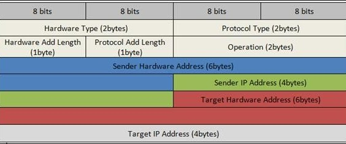

సాంకేతిక వివరణ

ADDRESS

రిసాల్షన్ ప్రోటోకాల్ (ARP)

**ఈథర్నెట్ అడ్రస్ రిజల్యూషన్ ప్రోటోకాల్**

**- లేదా -**

**నెట్‌వర్క్ ప్రోటోకాల్ చిరునామాలను మారుస్తోంది**

[[https://tools.ietf.org/html/rfc826]{.ul}](https://www.google.com/url?q=https%3A%2F%2Ftools.ietf.org%2Fhtml%2Frfc826&sa=D&sntz=1&usg=AFQjCNHSlGxJe18c1VJeIV6ePn4xPAj3rA)

> నేటి ప్రపంచంలో నిస్సందేహంగా కంప్యూటర్ నెట్‌వర్కింగ్ టెక్నాలజీలో
> ఉపయోగించే అత్యంత ప్రాచుర్యం పొందిన టెక్నాలజీ ఈథర్నెట్. దీని యొక్క
> గుర్తించదగిన లక్షణాలలో ఒకటి, ఇది అధిక పనితీరు మన్నిక లక్షణాన్ని
> అందిస్తుంది. ఇది ఏకాక్షక కేబుల్స్, నెట్‌వర్క్ ఇంటర్ఫేస్ కార్డ్
> (ఎన్‌ఐసి) వంటి భౌతిక మాధ్యమాన్ని ఉపయోగించి 10/100 ఎమ్‌బిపిఎస్ మొదలైన
> రేటుతో డేటాను ప్రసారం చేసే సహ-సంబంధిత బాగా నిర్వచించిన ప్రోటోకాల్‌ల
> కుటుంబం.
>
> ఈథర్నెట్ టెక్నాలజీలోని సమాచారం భౌతిక మాధ్యమాన్ని ఉపయోగించి ప్యాకెట్ల
> రూపంలో పంపబడుతుంది. ప్యాకెట్ పరిమాణాన్ని బట్టి, దానిలోని డేటా
> విచ్ఛిన్నమై చిన్న ఫ్రేమ్‌లలోకి చుట్టి, ఆపై దాన్ని తిరిగి సమీకరించగలిగే
> గమ్యస్థానానికి పంపవచ్చు. ఈ ఫ్రేమ్‌లు పంపినవారి ఎన్‌ఐసిని ఉపయోగించి
> వైర్‌పై వ్రాయబడతాయి. ఈ ప్యాకెట్లు నెట్‌వర్క్‌లో కనెక్ట్ కావాల్సిన
> స్వీకర్త కోసం పంపినవారు ఉత్పత్తి చేస్తారు. ప్యాకెట్ దాని గమ్యాన్ని
> చేరుకోవడానికి రౌటర్లు లేదా స్విచ్‌ల ద్వారా ప్రయాణించవచ్చు. ప్రోటోకాల్
> రెండు నెట్‌వర్క్ ఐడెంటిటీల మధ్య కమ్యూనికేషన్ కోసం నియమాల సమితిని
> నిర్వచిస్తుంది. పంపినవారు మరియు స్వీకర్త మధ్య ఉన్న ఇతర నెట్‌వర్కింగ్
> పరికరం ప్రాసెసింగ్ కోసం ఈ ప్యాకెట్లను తీసుకోదు. కాబట్టి, మనకు
> ప్రోటోకాల్ అవసరం, ఇక్కడ \<ప్రోటోకాల్ రకం, ప్రోటోకాల్ చిరునామా\>
> ఆధారంగా ఇది పంపినవారి నుండి రిసీవర్ వరకు మాత్రమే ప్రయాణించాల్సిన అవసరం
> ఉంది.

**నైరూప్య:**

> ఒకే నెట్‌వర్క్‌లో A మరియు B రెండు నెట్‌వర్కింగ్ పరికరాలు ఉన్నాయని
> మరియు దిగువ లక్షణాలను కలిగి ఉన్నాయని అనుకుందాం:
>
> పరికరం A:
>
> MAC = M (A)
>
> IP = I (A)
>
> పరికరం B:
>
> MAC = M (B)
>
> IP = I (B)
>
> ఇప్పుడు A B కి కమ్యూనికేట్ చేయాలనుకుంటుంది మరియు B యొక్క IP ఆస్తి
> మాత్రమే తెలుసు. I (B) ను M (B) కు మ్యాప్ చేయడానికి దాని ప్రోటోకాల్
> స్టాక్ ARP మాడ్యూల్‌ను సంప్రదిస్తుంది. అందువల్ల A యొక్క ARP మాడ్యూల్
> నెట్‌వర్క్‌లో ప్రసార ప్యాకెట్‌ను పంపుతుంది, దీనికి B పరికరం దాని MAC
> వివరాలతో స్పందిస్తుంది. ఇప్పుడు A యొక్క ARP గుణకాలు ఈ వివరాలను వైర్
> ద్వారా పంపాల్సిన ఈథర్నెట్ ప్యాకెట్‌ను సృష్టించడానికి ఉపయోగపడతాయి.
>
> గమనికలు:
>
> చిరునామా రిజల్యూషన్ ప్రోటోకాల్ (ARP) అనేది భౌతిక చిరునామాకు (48-బిట్
> MAC చిరునామా) IPv4 చిరునామాను (32-బిట్ లాజికల్ చిరునామా) మ్యాప్
> చేయాలనే ఉద్దేశ్యంతో TCP / IP సూట్‌లోని ప్రధాన ప్రోటోకాల్‌లలో ఒకటి. MAC
> చిరునామాకు తార్కిక పేర్లను పరిష్కరించడానికి నెట్‌వర్క్ పరికరాలకు
> తార్కిక పేరు మరియు దిగువ స్థాయి లేదా ప్రోటోకాల్‌లు కేటాయించబడతాయి.
> అప్లికేషన్ లేయర్‌లోని నెట్‌వర్క్ అనువర్తనాలు మరొక పరికరంతో కమ్యూనికేట్
> చేయడానికి IPv4 చిరునామాను ఉపయోగిస్తాయి. ఏదేమైనా, డేటా లింక్ లేయర్
> వద్ద, అడ్రెసింగ్ మోడ్ MAC చిరునామా (48-బిట్ ఫిజికల్ అడ్రస్), ఇది
> నెట్‌వర్క్ కార్డ్‌లో శాశ్వతంగా కాలిపోతుంది. అడ్రస్ రిజల్యూషన్
> ప్రోటోకాల్ (ARP) యొక్క ఉద్దేశ్యం ఏమిటంటే, మీ లోకల్ ఏరియా నెట్‌వర్క్
> (LAN) లోని పరికరం యొక్క MAC చిరునామాను, సంబంధిత IPv4 చిరునామా కోసం, ఏ
> నెట్‌వర్క్ అప్లికేషన్ కమ్యూనికేట్ చేయడానికి ప్రయత్నిస్తుందో
> తెలుసుకోవడం.

**సమస్య:**

> కంప్యూటర్ నెట్‌వర్కింగ్ ఉనికిలోకి వచ్చినప్పటి నుండి, వేర్వేరు
> విక్రేతలచే తయారు చేయబడిన మరియు అందించినట్లుగా విభిన్న ఇంటర్‌ఫేస్‌తో
> అనేక రకాల నెట్‌వర్కింగ్ పరికరాలు ఉన్నాయి. ఇంతకుముందు చర్చించినట్లు
> వారు ఫ్రేమ్‌ల ద్వారా కమ్యూనికేట్ చేయాలి, ఇప్పుడు వాటిని ఒక రకంగా
> వర్గీకరించవచ్చు - ఒక ప్యాకెట్‌ను మరొకటి నుండి వేరు
> చేస్తుంది. నెట్‌వర్క్‌లో ఇతర రకాల ప్రోటోకాల్‌లు మరియు హార్డ్‌వేర్‌లు
> ఉన్నాయని గమనించండి మరియు అన్నింటికీ ప్యాకెట్లను నిర్దిష్ట రేటుకు
> ప్రసారం చేయడానికి కేబుల్స్ అవసరం. ప్రోటోకాల్ చిరునామా 48-బిట్ చిరునామా
> కావచ్చు లేదా కాకపోవచ్చు - అవి 8 బిట్స్ నుండి 48 బిట్స్ చిరునామాలకు
> మారవచ్చు. 10Mbit ఈథర్నెట్ నెట్‌వర్క్ ఈ ప్రోటోకాల్‌లన్నింటినీ (మరియు
> మరిన్ని) ఈథర్నెట్ ప్యాకెట్ హెడర్‌లోని టైప్ ఫీల్డ్ ద్వారా ఒకే కేబుల్‌పై
> సహజీవనం చేయడానికి అనుమతిస్తుంది.
>
> \<ప్రోటోకాల్, చిరునామా\> జత మరియు 48-బిట్ ఈథర్నెట్ చిరునామా మధ్య
> అనురూపాలను డైనమిక్‌గా పంపిణీ చేయడానికి ప్రోటోకాల్ అవసరం. ARP స్థానిక
> ప్రాంతంలోని డేటా లింక్ లేయర్ (OSI యొక్క లేయర్ 2) లేదా కనెక్ట్ చేయబడిన
> పరికరాల పాయింట్-టు-పాయింట్ లింక్ నెట్‌వర్క్‌లో
> ఉపయోగించబడుతుంది. ఈథర్నెట్ మద్దతు ఉన్న నెట్‌వర్క్ పరికరాల్లోని MAC
> చిరునామాలు స్థిర 6-బైట్ (48-బిట్). IP చిరునామాలు ఏదైనా ఇంటర్ఫేస్ కోసం
> స్థిర కాన్ఫిగర్ కాదు. పరికరాలను IP చిరునామాతో మాన్యువల్‌గా కాన్ఫిగర్
> చేయవచ్చు లేదా అవి నెట్‌వర్క్‌లోని డైనమిక్ హోస్ట్ కాన్ఫిగరేషన్
> ప్రోటోకాల్ (DHCP) సర్వర్ నుండి ఒకదాన్ని పొందవచ్చు. గమ్యం IP ప్యాకెట్
> సమాచారం అందుబాటులో లేనప్పుడు గమనించండి అప్పుడు నెట్‌వర్క్ / హోస్ట్
> ఐడిల ఆధారంగా ఈ ఈథర్నెట్ ప్యాకెట్లు నెట్‌వర్క్ గేట్‌వేకి ఫార్వార్డ్
> చేయబడతాయి.

**ప్రేరణ:**

> దాని విశ్వసనీయత / వేగం లక్షణాల కారణంగా, ఈథర్నెట్ వాడుకలో అత్యంత
> ప్రాచుర్యం పొందిన నెట్‌వర్కింగ్ ప్రోటోకాల్ అయింది. మరింత ఎక్కువ
> ప్రోటోకాల్‌లు దాని స్టాక్‌లోకి అమలు చేయబడ్డాయి. ఇప్పటికీ ఇతర విక్రేతలు
> చిరునామా రిజల్యూషన్ ప్రోటోకాల్ యొక్క స్వంత వెర్షన్‌ను కలిగి
> ఉంటారు. వారు ఈ లక్షణాన్ని ప్రామాణిక రూపంలో అందిస్తారు, అంటే విక్రేత
> నిర్దిష్ట పరికరాలు ఎటువంటి మార్పు అవసరం లేకుండా దీన్ని తయారు
> చేయగలవు. కాబట్టి మేము భిన్నమైన పరికర సెటప్ నెట్‌వర్క్‌ను కలిగి
> ఉండవచ్చు, కాని వాటి మధ్య ఫ్రేమ్ పంపడానికి లేదా స్వీకరించడానికి వీలు
> కల్పిస్తుంది.

**నిర్వచనం:**

> అడ్రస్ రిజల్యూషన్ ప్రోటోకాల్ (ARP) అనేది TCP / IP సూట్‌లోని ప్రధాన
> ప్రోటోకాల్‌లో ఒకటి మరియు అడ్రస్ రిజల్యూషన్ ప్రోటోకాల్ (ARP) యొక్క
> ఉద్దేశ్యం IPv4 చిరునామాను (32-బిట్ లాజికల్ అడ్రస్) భౌతిక చిరునామాకు
> (48 బిట్ MAC చిరునామా) మ్యాప్ చేయడం. ). అప్లికేషన్ లేయర్‌లోని
> నెట్‌వర్క్ అనువర్తనాలు మరొక పరికరంతో కమ్యూనికేట్ చేయడానికి IPv4
> చిరునామాను ఉపయోగిస్తాయి. డేటా లింక్ లేయర్ వద్ద, చిరునామా MAC చిరునామా
> (48-బిట్ ఫిజికల్ అడ్రస్), మరియు ఈ చిరునామా నెట్‌వర్క్ కార్డ్‌లో
> శాశ్వతంగా కాలిపోతుంది.
>
> అడ్రస్ రిజల్యూషన్ ప్రోటోకాల్ (ARP) యొక్క ఉద్దేశ్యం ఏమిటంటే, మీ లోకల్
> ఏరియా నెట్‌వర్క్ (LAN) లోని పరికరం యొక్క MAC చిరునామాను, సంబంధిత IPv4
> చిరునామా కోసం, ఏ నెట్‌వర్క్ అప్లికేషన్ కమ్యూనికేట్ చేయడానికి
> ప్రయత్నిస్తుందో తెలుసుకోవడం.

**ARP చరిత్ర:**

> ARP ను మొట్టమొదట 1982 నవంబర్‌లో డేవిడ్ సి. ప్లమ్మర్ ప్రచురించిన
> రిక్వెస్ట్ ఫర్ కామెంట్స్ (RFC) 826 లో ప్రతిపాదించారు మరియు చర్చించారు.
> చిరునామా తీర్మానం యొక్క సమస్య IP ప్రోటోకాల్ సూట్ యొక్క ప్రారంభ రోజులలో
> వెంటనే స్పష్టమైంది, ఎందుకంటే ఈథర్నెట్ త్వరగా ఇష్టపడే LAN టెక్నాలజీగా
> మారింది మరియు ఈథర్నెట్ కేబుల్స్కు 48-బిట్ చిరునామాలు అవసరం.
>
> ఈ ప్రోటోకాల్ ఇప్పటికీ సాధారణ వాడుకలో ఉన్న ఇంటర్నెట్ RFC లలో ఒకటిగా
> వివరించబడింది: RFC 826, యాన్ ఈథర్నెట్ అడ్రస్ రిజల్యూషన్ ప్రోటోకాల్,
> 1982 లో ప్రచురించబడింది.
>
> ARP మొదట ఈథర్నెట్ కోసం అభివృద్ధి చేయబడిందని పేరు స్పష్టం చేస్తుంది.
> అందువల్ల, ఇది అత్యంత ప్రాచుర్యం పొందిన లేయర్ రెండు LAN ప్రోటోకాల్
> మరియు అత్యంత ప్రాచుర్యం పొందిన లేయర్ మూడు ఇంటర్నెట్ వర్కింగ్
> ప్రోటోకాల్ మధ్య సంబంధాన్ని సూచిస్తుంది-ఇది రెండు దశాబ్దాల తరువాత కూడా
> నిజం. ఏదేమైనా, ఈథర్నెట్ ఐపిని రవాణా చేయడానికి చాలా సాధారణమైన మార్గం
> అయినప్పటికీ, అది ఒక్కటే కాదని మొదటి నుండి స్పష్టంగా ఉంది. అందువల్ల,
> ARP ను ఈథర్నెట్ మాత్రమే కాకుండా అనేక ఇతర డేటా లింక్ లేయర్ టెక్నాలజీలకు
> IP నుండి చిరునామాలను పరిష్కరించగల సాధారణ ప్రోటోకాల్‌గా
> రూపొందించబడింది.

**అవలోకనం:**

> అడ్రస్ రిజల్యూషన్ ప్రోటోకాల్ (ARP) ఇంటర్నెట్ వర్క్‌లో కమ్యూనికేషన్లను
> శక్తివంతం చేయడానికి అభివృద్ధి చేయబడింది మరియు ఇది RFC 826 చేత
> వర్గీకరించబడుతుంది. ఐపి నెట్‌వర్క్ చిరునామాలను MAC హార్డ్‌వేర్
> చిరునామాలకు మ్యాప్ చేయడానికి లేయర్ 3 గాడ్జెట్‌లకు ARP అవసరం కాబట్టి IP
> బండిల్స్ సిస్టమ్స్‌లో పంపబడతాయి. ఒక పరికరం మరొక పరికరానికి
> డేటాగ్రామ్‌ను పంపే ముందు, గోల్ గాడ్జెట్ కోసం MAC చిరునామా మరియు
> సంబంధిత IP చిరునామా ఉందా అని తనిఖీ చేయడానికి దాని ARP కాష్‌లో
> కనిపిస్తుంది. ప్రాప్యత లేని అవకాశంలో, సోర్స్ గాడ్జెట్ సిస్టమ్‌లోని
> ప్రతి గాడ్జెట్‌కు కమ్యూనికేషన్ సందేశాన్ని పంపుతుంది. ప్రతి గాడ్జెట్ IP
> చిరునామాను దాని స్వంతంగా చూస్తుంది. సమన్వయ IP చిరునామాతో ఉన్న గాడ్జెట్
> పంపే గాడ్జెట్‌కు గాడ్జెట్ కోసం MAC చిరునామాను కలిగి ఉన్న బండిల్‌తో
> సమాధానమిస్తుంది (\"మధ్యవర్తిత్వ ARP\" కారణంగా).
>
> గమ్యం పరికరం సుదూర వ్యవస్థలో ఉన్నప్పుడు, మరొక లేయర్ 3 పరికరానికి
> మించి, పంపే పరికరం డిఫాల్ట్ గేట్‌వే యొక్క MAC చిరునామా కోసం ARP
> డిమాండ్‌ను పంపుతుంది తప్ప, ఈ విధానం సమానం. చిరునామా పరిష్కరించబడిన
> తరువాత మరియు డిఫాల్ట్ గేట్‌వే ప్యాకెట్‌ను పొందిన తరువాత, డిఫాల్ట్
> గేట్‌వే గమ్యం IP చిరునామాను దానితో అనుబంధించబడిన సిస్టమ్‌లపై ప్రసారం
> చేస్తుంది. గమ్యం పరికర నెట్‌వర్క్‌లోని లేయర్ 3 పరికరం గమ్యం పరికరం
> యొక్క MAC చిరునామాను పొందటానికి ARP ని ఉపయోగించుకుంటుంది మరియు
> ప్యాకెట్‌ను అందిస్తుంది.

**అది ఎలా పని చేస్తుంది:**

> క్రొత్త కంప్యూటర్ LAN లో చేరినప్పుడు, గుర్తింపు మరియు కమ్యూనికేషన్
> కోసం ఉపయోగించడానికి ప్రత్యేకమైన IP చిరునామా కేటాయించబడుతుంది. ఒక
> నిర్దిష్ట LAN లో హోస్ట్ మెషీన్ కోసం ఉద్దేశించిన ఇన్‌కమింగ్ ప్యాకెట్
> గేట్‌వే వద్దకు వచ్చినప్పుడు, గేట్వే ARP ప్రోగ్రామ్‌ను IP చిరునామాకు
> సరిపోయే MAC చిరునామాను కనుగొనమని అడుగుతుంది. ARP కాష్ అని పిలువబడే
> పట్టిక ప్రతి IP చిరునామా మరియు దాని సంబంధిత MAC చిరునామా (
> [[RFC5227]{.ul}](https://www.google.com/url?q=https%3A%2F%2Ftools.ietf.org%2Fhtml%2Frfc5227%23section-1.3&sa=D&sntz=1&usg=AFQjCNGGQNaGP6atAzMmhiHh4AUWOs6BDQ)
> ) యొక్క రికార్డును నిర్వహిస్తుంది .
>
> IPv4 ఈథర్నెట్ నెట్‌వర్క్‌లోని అన్ని ఆపరేటింగ్ సిస్టమ్‌లు ARP కాష్‌ను
> ఉంచుతాయి. LAN లోని మరొక హోస్ట్‌కు ఒక ప్యాకెట్‌ను పంపడానికి హోస్ట్ ఒక
> MAC చిరునామాను అభ్యర్థించిన ప్రతిసారీ, IP నుండి MAC చిరునామా అనువాదం
> ఇప్పటికే ఉందో లేదో తెలుసుకోవడానికి దాని ARP కాష్‌ను తనిఖీ చేస్తుంది.
> అలా చేస్తే, కొత్త ARP అభ్యర్థన అనవసరం. అనువాదం ఇప్పటికే లేకపోతే,
> అప్పుడు నెట్‌వర్క్ చిరునామాల కోసం అభ్యర్థన పంపబడుతుంది మరియు ARP
> జరుగుతుంది.
>
> ARP LAN లోని అన్ని యంత్రాలకు ఒక అభ్యర్థన ప్యాకెట్‌ను ప్రసారం చేస్తుంది
> మరియు యంత్రాలలో ఏదైనా వారు నిర్దిష్ట IP చిరునామాను ఉపయోగిస్తున్నారని
> తెలుసా అని అడుగుతుంది. ఒక యంత్రం IP చిరునామాను దాని స్వంతంగా
> గుర్తించినప్పుడు, అది ఒక జవాబును పంపుతుంది, తద్వారా ARP భవిష్యత్ సూచనల
> కోసం కాష్‌ను నవీకరించవచ్చు మరియు కమ్యూనికేషన్‌తో కొనసాగవచ్చు.
>
> వారి స్వంత IP చిరునామా తెలియని హోస్ట్ యంత్రాలు ఆవిష్కరణ కోసం రివర్స్
> ARP (RARP) ప్రోటోకాల్‌ను ఉపయోగించవచ్చు.
>
> ARP కాష్ పరిమాణం పరిమితం మరియు స్థలాన్ని ఖాళీ చేయడానికి అన్ని
> ఎంట్రీలను క్రమానుగతంగా శుభ్రపరుస్తుంది; వాస్తవానికి, చిరునామాలు
> కాష్‌లో కొద్ది నిమిషాలు మాత్రమే ఉంటాయి. భౌతిక హోస్ట్ వారు అభ్యర్థించిన
> IP చిరునామాను మార్చినప్పుడు తరచుగా నవీకరణలు నెట్‌వర్క్‌లోని ఇతర
> పరికరాలను చూడటానికి అనుమతిస్తాయి. శుభ్రపరిచే ప్రక్రియలో, ఉపయోగించని
> ఎంట్రీలు తొలగించబడతాయి అలాగే ప్రస్తుతం శక్తినివ్వని కంప్యూటర్‌లతో
> కమ్యూనికేట్ చేయడానికి విజయవంతం కాని ప్రయత్నాలు

**టెర్మినాలజీ:**

> మ్యాపింగ్ యొక్క రెండు రకాలు ఉన్నాయి:
>
> 1\. స్టాటిక్ మ్యాపింగ్
>
> 2\. డైనమిక్ మ్యాపింగ్

**స్టాటిక్ మ్యాపింగ్:**

> స్టాటిక్ మ్యాపింగ్ అంటే భౌతిక చిరునామాతో తార్కిక చిరునామాను అనుబంధించే
> పట్టికను సృష్టించడం. ఈ పట్టిక నెట్‌వర్క్‌లోని ప్రతి యంత్రంలో నిల్వ
> చేయబడుతుంది
>
> తెలిసిన ప్రతి యంత్రం, ఉదాహరణకు, మరొక యంత్రం యొక్క IP చిరునామా కాని
> దాని భౌతిక చిరునామా పట్టికలో చూడగలదు. దీనికి కొన్ని పరిమితులు ఉన్నాయి
> ఎందుకంటే భౌతిక చిరునామాలు ఈ క్రింది మార్గాల్లో మారవచ్చు:
>
> · ఒక యంత్రం ఒక కొత్త భౌతిక చిరునామా, ఫలితంగా దాని NIC మారిపోవచ్చు.
>
> T లోకల్ టాక్ వంటి కొన్ని LAN లలో, కంప్యూటర్ ఆన్ చేసిన ప్రతిసారీ భౌతిక
> చిరునామా మారుతుంది.
>
> Computer మొబైల్ కంప్యూటర్ ఒక భౌతిక నెట్‌వర్క్ నుండి మరొకదానికి
> మారవచ్చు, దాని భౌతిక చిరునామాలో మార్పు వస్తుంది.
>
> ఈ మార్పులను అమలు చేయడానికి, స్టాటిక్ మ్యాపింగ్ పట్టిక క్రమానుగతంగా
> నవీకరించబడాలి. ఈ ఓవర్ హెడ్ నెట్‌వర్క్ పనితీరును ప్రభావితం చేస్తుంది.

**డైనమిక్ మ్యాపింగ్:**

> డైనమిక్ మ్యాపింగ్‌లో, ప్రతిసారీ ఒక యంత్రం మరొక యంత్రం యొక్క తార్కిక
> చిరునామాను తెలుసుకున్నప్పుడు, అది భౌతిక చిరునామాను కనుగొనడానికి
> ప్రోటోకాల్‌ను ఉపయోగించవచ్చు. డైనమిక్ మ్యాపింగ్ చేయడానికి రెండు
> ప్రోటోకాల్‌లు రూపొందించబడ్డాయి: అడ్రస్ రిజల్యూషన్ ప్రోటోకాల్ (ARP)
> మరియు రివర్స్ అడ్రస్ రిజల్యూషన్ ప్రోటోకాల్ (RARP). ARP ఒక తార్కిక
> చిరునామాను భౌతిక చిరునామాకు మ్యాప్ చేస్తుంది; RARP భౌతిక చిరునామాను
> తార్కిక చిరునామాకు మ్యాప్ చేస్తుంది. RARP మరొక ప్రోటోకాల్‌తో భర్తీ
> చేయబడినందున మరియు విస్మరించబడినందున, కాబట్టి మేము ఈ పత్రంలో ARP
> ప్రోటోకాల్‌ను మాత్రమే చర్చిస్తాము.

**ఆర్ప్ క్యాచింగ్:**

> ఇంటర్నెట్ వర్క్ ద్వారా పంపిన ప్రతి డేటాగ్రామ్ కోసం నెట్‌వర్క్‌లోని
> ప్రతి హాప్ (లేయర్ 3 పరికరం) వద్ద మీడియా యాక్సెస్ కంట్రోల్ (MAC)
> చిరునామాలకు IP చిరునామాల మ్యాపింగ్ కారణంగా, నెట్‌వర్క్ పనితీరు
> రాజీపడవచ్చు. ప్రసారాలను తగ్గించడానికి మరియు నెట్‌వర్క్ వనరుల వ్యర్థ
> వినియోగాన్ని పరిమితం చేయడానికి, చిరునామా రిజల్యూషన్ ప్రోటోకాల్ (ARP)
> కాషింగ్ అమలు చేయబడింది.
>
> ARP కాషింగ్ అనేది నెట్‌వర్క్ చిరునామాలను మరియు అనుబంధిత డేటా-లింక్
> చిరునామాలను కొంతకాలం మెమరీలో నిల్వ చేసే పద్ధతి.
>
> డేటాగ్రామ్ పంపిన ప్రతిసారీ ఒకే చిరునామా కోసం ప్రసారం చేయడానికి విలువైన
> నెట్‌వర్క్ వనరులను ఉపయోగించడాన్ని ఇది తగ్గిస్తుంది. కాష్ ఎంట్రీలు
> తప్పనిసరిగా నిర్వహించబడాలి ఎందుకంటే సమాచారం పాతది కావచ్చు, కాబట్టి
> కాష్ ఎంట్రీలు క్రమానుగతంగా గడువు ముగియడం చాలా క్లిష్టమైనది. చిరునామాలు
> ప్రసారం చేయబడినందున నెట్‌వర్క్‌లోని ప్రతి పరికరం దాని పట్టికలను
> నవీకరిస్తుంది.
>
> స్టాటిక్ ARP కాష్ ఎంట్రీలు మరియు డైనమిక్ ARP కాష్ ఎంట్రీలు ఉన్నాయి.
> స్టాటిక్ ఎంట్రీలు మాన్యువల్‌గా కాన్ఫిగర్ చేయబడతాయి మరియు కాష్
> టేబుల్‌లో శాశ్వత ప్రాతిపదికన ఉంచబడతాయి. సాధారణంగా ఒకే నెట్‌వర్క్‌లో
> రోజూ ఇతర పరికరాలతో కమ్యూనికేట్ చేయాల్సిన పరికరాలకు స్టాటిక్ ఎంట్రీలు
> ఉత్తమమైనవి. డైనమిక్ ఎంట్రీలు సిస్కో సాఫ్ట్‌వేర్ చేత జోడించబడతాయి,
> కొంతకాలం ఉంచబడతాయి మరియు తరువాత తీసివేయబడతాయి.

**ARP కాష్‌లో స్టాటిక్ మరియు డైనమిక్ ఎంట్రీలు**

> స్టాటిక్ రౌటింగ్‌కు ప్రతి పరికరం యొక్క ప్రతి ఇంటర్‌ఫేస్ కోసం ఒక
> పట్టికలోకి IP చిరునామాలు, సబ్‌నెట్ మాస్క్‌లు, గేట్‌వేలు మరియు సంబంధిత
> మీడియా యాక్సెస్ కంట్రోల్ (MAC) చిరునామాలను మాన్యువల్‌గా నమోదు
> చేయడానికి నిర్వాహకుడు అవసరం. స్టాటిక్ రౌటింగ్ మరింత నియంత్రణను
> అనుమతిస్తుంది కాని పట్టికను నిర్వహించడానికి ఎక్కువ పని అవసరం. మార్గాలు
> జోడించబడిన లేదా మార్చబడిన ప్రతిసారీ పట్టిక నవీకరించబడాలి.
>
> డైనమిక్ రౌటింగ్ ప్రోటోకాల్‌లను ఉపయోగిస్తుంది, ఇవి నెట్‌వర్క్‌లోని
> పరికరాలను ఒకదానితో ఒకటి రౌటింగ్ టేబుల్ సమాచారాన్ని మార్పిడి
> చేసుకోవడానికి వీలు కల్పిస్తాయి. పట్టిక నిర్మించబడింది మరియు
> స్వయంచాలకంగా మార్చబడుతుంది. సమయ పరిమితిని జోడించకపోతే పరిపాలనా పనులు
> అవసరం లేదు, కాబట్టి స్టాటిక్ రూటింగ్ కంటే డైనమిక్ రౌటింగ్ సమర్థవంతంగా
> ఉంటుంది. డిఫాల్ట్ కాలపరిమితి 4 గంటలు. కాష్ నుండి జతచేయబడిన మరియు
> తొలగించబడిన చాలా ఎక్కువ మార్గాలు నెట్‌వర్క్‌లో ఉంటే, సమయ పరిమితిని
> సర్దుబాటు చేయాలి.

**ప్రాక్సీ ARP**

> ప్రాక్సీ అడ్రస్ రిజల్యూషన్ ప్రోటోకాల్, RFC 1027 లో నిర్వచించినట్లుగా,
> IP-to-MAC చిరునామాలను పరిష్కరించడానికి అదే IP నెట్‌వర్క్ లేదా
> సబ్‌నెట్‌వర్క్‌లోని రౌటర్ ద్వారా కనెక్ట్ చేయబడిన భౌతిక నెట్‌వర్క్
> విభాగాలుగా విభజించబడిన పరికరాలను ప్రారంభించడానికి అమలు చేయబడింది.
> పరికరాలు ఒకే డేటా లింక్ లేయర్ నెట్‌వర్క్‌లో లేనప్పటికీ ఒకే ఐపి
> నెట్‌వర్క్‌లో ఉన్నప్పుడు, అవి స్థానిక నెట్‌వర్క్‌లో ఉన్నట్లుగా
> ఒకదానికొకటి డేటాను ప్రసారం చేయడానికి ప్రయత్నిస్తాయి.
>
> అయినప్పటికీ, పరికరాలను వేరుచేసే రౌటర్ ప్రసార సందేశాన్ని పంపదు ఎందుకంటే
> రౌటర్లు హార్డ్‌వేర్-లేయర్ ప్రసారాలను పాస్ చేయవు. కాబట్టి, చిరునామాలు
> పరిష్కరించబడవు.
>
> ప్రాక్సీ ARP అప్రమేయంగా ప్రారంభించబడుతుంది కాబట్టి స్థానిక
> నెట్‌వర్క్‌ల మధ్య నివసించే \"ప్రాక్సీ రౌటర్\" దాని MAC చిరునామాతో
> స్పందిస్తుంది, ఇది ప్రసారాన్ని ఉద్దేశించిన రౌటర్ లాగా ఉంటుంది. పంపే
> పరికరం ప్రాక్సీ రౌటర్ యొక్క MAC చిరునామాను అందుకున్నప్పుడు, ఇది
> డేటాగ్రామ్‌ను ప్రాక్సీ రౌటర్‌కు పంపుతుంది, ఇది డేటాగ్రామ్‌ను
> నియమించబడిన పరికరానికి పంపుతుంది.

**ARP ప్రోటోకాల్ నిర్మాణం:**

{width="5.875in" height="2.45in"}

> చిరునామా రిజల్యూషన్ ప్రోటోకాల్ (ARP) సందేశ ఆకృతిలో ఉన్న ఫీల్డ్‌లు:
>
> · హార్డ్‌వేర్ రకం: ARP సందేశంలోని హార్డ్‌వేర్ రకం ఫీల్డ్ అడ్రస్
> రిజల్యూషన్ ప్రోటోకాల్ (ARP) సందేశాన్ని ప్రసారం చేసే స్థానిక నెట్‌వర్క్
> కోసం ఉపయోగించే హార్డ్‌వేర్ రకాన్ని నిర్దేశిస్తుంది. ఈథర్నెట్ సాధారణ
> హార్డ్‌వేర్ రకం మరియు ఈథర్నెట్ కోసం అతని విలువ 1. ఈ ఫీల్డ్ యొక్క
> పరిమాణం 2 బైట్లు.
>
> · ప్రోటోకాల్ రకం: ప్రతి ప్రోటోకాల్ ఈ ఫీల్డ్‌లో ఉపయోగించిన సంఖ్యను
> కేటాయించింది. IPv4 2048 (హెక్సాడెసిమల్‌లో 0x0800).
>
> · హార్డ్‌వేర్ చిరునామా పొడవు: ARP సందేశంలో హార్డ్‌వేర్ చిరునామా పొడవు
> హార్డ్‌వేర్ (MAC) చిరునామా యొక్క బైట్లలో పొడవు. ఈథర్నెట్ MAC
> చిరునామాలు 6 బైట్ల పొడవు.
>
> · ప్రోటోకాల్ చిరునామా పొడవు: తార్కిక చిరునామా యొక్క బైట్లలో పొడవు
> (IPv4 చిరునామా). IPv4 చిరునామాలు 4 బైట్ల పొడవు.
>
> · ఆప్కోడ్: ARP సందేశంలోని ఆప్కోడ్ ఫీల్డ్ ARP సందేశం యొక్క స్వభావాన్ని
> నిర్దేశిస్తుంది. ARP అభ్యర్థన కోసం 1 మరియు ARP ప్రత్యుత్తరం కోసం 2.
>
> Er పంపినవారి హార్డ్‌వేర్ చిరునామా: సందేశం పంపే పరికరం యొక్క లేయర్ 2
> (MAC చిరునామా) చిరునామా.
>
> · పంపినవారి ప్రోటోకాల్ చిరునామా: సందేశం పంపే పరికరం యొక్క ప్రోటోకాల్
> చిరునామా (IPv4 చిరునామా)
>
> · టార్గెట్ హార్డ్వేర్ చిరునామా: లేయర్ 2 (MAC అడ్రస్) ఉద్దేశించిన
> రిసీవర్.

**వైర్‌షార్క్‌లో ఆర్ప్ స్ట్రక్చర్:**

{width="9.266666666666667in"
height="5.166666666666667in"}

> **సంపుటీకరణ:**
>
> ARP ప్యాకెట్ నేరుగా డేటా లింక్ ఫ్రేమ్‌లోకి జతచేయబడుతుంది. ఉదాహరణకు,
> కింది చిత్రంలో, ARP ప్యాకెట్ ఈథర్నెట్ ఫ్రేమ్‌లో కప్పబడి ఉంటుంది.
> ఫ్రేమ్ చేత తీసుకోబడిన డేటా ARP ప్యాకెట్ అని టైప్ ఫీల్డ్ సూచిస్తుందని
> గమనించండి.

{width="11.0in" height="3.775in"}

**ARP అభ్యర్థన మరియు ప్రత్యుత్తరం:**

> సాధారణ ఇంటర్నెట్‌లో ARP ఎలా పనిచేస్తుందో చూద్దాం. మొదట మేము పాల్గొన్న
> దశలను వివరిస్తాము. హోస్ట్ లేదా రౌటర్ ARP ని ఉపయోగించాల్సిన నాలుగు
> కేసులను మేము చర్చిస్తాము:
>
> Send పంపినవారికి లక్ష్యం యొక్క IP చిరునామా తెలుసు.
>
> · IP ARP అభ్యర్థన సందేశాన్ని సృష్టించమని ARP ని అడుగుతుంది, పంపినవారి
> భౌతిక చిరునామా, పంపినవారి IP చిరునామా మరియు లక్ష్య IP చిరునామాను
> నింపండి. లక్ష్య భౌతిక చిరునామా ఫీల్డ్ 0 సెలతో నిండి ఉంటుంది.
>
> సందేశం డేటా లింక్ లేయర్‌కు పంపబడుతుంది, అక్కడ పంపినవారి భౌతిక
> చిరునామాను మూల చిరునామాగా మరియు భౌతిక ప్రసార చిరునామాను గమ్యం చిరునామా
> (
> [[RFC5227]{.ul}](https://www.google.com/url?q=https%3A%2F%2Ftools.ietf.org%2Fhtml%2Frfc5227%23section-2.4&sa=D&sntz=1&usg=AFQjCNGOIIihwwC9SPzKWmd6tGEfJmatvQ)
> ) ఉపయోగించి [[ఫ్రేమ్‌లో కప్పబడి
> ఉంటుంది]{.ul}](https://www.google.com/url?q=https%3A%2F%2Ftools.ietf.org%2Fhtml%2Frfc5227%23section-2.4&sa=D&sntz=1&usg=AFQjCNGOIIihwwC9SPzKWmd6tGEfJmatvQ)
> .

{width="11.225in" height="6.6in"}

> Host ప్రతి హోస్ట్ లేదా రౌటర్ ఫ్రేమ్‌ను అందుకుంటుంది. ఫ్రేమ్ ప్రసార
> గమ్య చిరునామాను కలిగి ఉన్నందున, అన్ని స్టేషన్లు సందేశాన్ని తీసివేసి
> ARP కి పంపుతాయి. లక్ష్యంగా ఉన్న మినహా అన్ని యంత్రాలు ప్యాకెట్‌ను
> వదులుతాయి. లక్ష్య యంత్రం IP చిరునామాను గుర్తిస్తుంది.
>
> Machine లక్ష్య యంత్రం దాని భౌతిక చిరునామాను కలిగి ఉన్న ARP ప్రత్యుత్తర
> సందేశంతో ప్రత్యుత్తరం ఇస్తుంది. సందేశం యూనికాస్ట్.
>
> Send పంపినవారు ప్రత్యుత్తర సందేశాన్ని అందుకుంటారు. ఇది ఇప్పుడు లక్ష్య
> యంత్రం యొక్క భౌతిక చిరునామా తెలుసు.
>
> Machine టార్గెట్ మెషీన్ కోసం డేటాను కలిగి ఉన్న ఐపి డేటాగ్రామ్ ఇప్పుడు
> ఒక ఫ్రేమ్‌లో కప్పబడి ఉంది మరియు గమ్యానికి యునికాస్ట్.

**ARP లో 4 విభిన్న కేసులు:**

{width="6.9in" height="5.125in"}

> ARP అటాక్స్ & డిఫెన్సెస్

**ARP POISIONING**

> ARP పాయిజనింగ్ అనేది మేము నెట్‌వర్క్‌లో నకిలీ ARP ప్రత్యుత్తర
> ప్యాకెట్లను పంపే దాడి. రెండు దాడులు ఉన్నాయి (
> [[RFC5227]{.ul}](https://www.google.com/url?q=https%3A%2F%2Ftools.ietf.org%2Fhtml%2Frfc5227%23section-5&sa=D&sntz=1&usg=AFQjCNF4XW82mDtC5zAxiTnsO0t6_f4fgQ)
> ):
>
> · **MITM (మధ్యలో మాన్):** దాడి దాని సొంత MAC చిరునామా మరియు
> చట్టబద్ధమైన హోస్ట్, సర్వర్ లేదా రౌటర్ యొక్క IP చిరునామాతో ఒక ARP
> ప్రత్యుత్తరం పంపుతుంది. బాధితుడు ARP ప్రత్యుత్తరం అందుకున్నప్పుడు అది
> దాని ARP పట్టికను నవీకరిస్తుంది. ఇది చట్టబద్ధమైన పరికరాన్ని
> చేరుకోవడానికి ప్రయత్నించినప్పుడు, IP ప్యాకెట్లు దాడి చేసేవారి వద్ద
> ముగుస్తాయి.
>
> OS **DOS (సేవ యొక్క తిరస్కరణ):** దాడి చేసేవాడు చట్టబద్ధమైన సర్వర్
> యొక్క MAC చిరునామాతో అనేక ARP ప్రత్యుత్తరాలను పంపుతాడు.
> నెట్‌వర్క్‌లోని అన్ని పరికరాలు వారి ARP పట్టికలను అప్‌డేట్ చేస్తాయి
> మరియు నెట్‌వర్క్‌లోని అన్ని IP ప్యాకెట్‌లు సర్వర్‌కు పంపబడతాయి,
> ట్రాఫిక్‌తో ఓవర్‌లోడ్ అవుతాయి.
>
> దాడి క్రింది విధంగా పనిచేస్తుంది:
>
> 1\. దాడి చేసేవారికి నెట్‌వర్క్‌కి ప్రాప్యత ఉండాలి. వారు కనీసం రెండు
> పరికరాల IP చిరునామాలను నిర్ణయించడానికి నెట్‌వర్క్‌ను స్కాన్ చేస్తారు
> these ఇవి వర్క్‌స్టేషన్ మరియు రౌటర్ అని చెప్పండి.
>
> 2\. నకిలీ ARP ప్రతిస్పందనలను పంపడానికి దాడి చేసేవాడు ఆర్ప్ స్పూఫ్ లేదా
> డ్రిఫ్ట్నెట్ వంటి స్పూఫింగ్ సాధనాన్ని ఉపయోగిస్తాడు.
>
> 3\. నకిలీ ప్రతిస్పందనలు రౌటర్ మరియు వర్క్‌స్టేషన్‌కు చెందిన ఐపి
> చిరునామాలకు సరైన MAC చిరునామా దాడి చేసేవారి MAC చిరునామా అని ప్రచారం
> చేస్తుంది. ఇది ఒకదానికొకటి కాకుండా, దాడి చేసేవారి యంత్రానికి కనెక్ట్
> చేయడానికి రౌటర్ మరియు వర్క్‌స్టేషన్ రెండింటినీ అవివేకిని చేస్తుంది.
>
> 4\. రెండు పరికరాలు వారి ARP కాష్ ఎంట్రీలను నవీకరిస్తాయి మరియు ఆ సమయం
> నుండి, నేరుగా ఒకరితో ఒకరు కాకుండా దాడి చేసే వారితో కమ్యూనికేట్ చేయండి.
>
> దాడి చేసిన వ్యక్తి ఇప్పుడు అన్ని సమాచారాల మధ్య రహస్యంగా ఉన్నాడు.

{width="13.058333333333334in"
height="10.191666666666666in"}

> దాడి చేసిన వ్యక్తి ARP స్పూఫింగ్ దాడిలో విజయం సాధించిన తర్వాత, వారు
> వీటిని చేయవచ్చు:
>
> · **సమాచార రూటింగ్ గా కొనసాగించు** - దాడి, ప్యాకెట్లను డేటా వాసన చూడు
> మరియు దొంగిలిస్తారు HTTPS అది వంటి ఒక ఎన్క్రిప్టెడ్ ఛానలు పైగా బదిలీ
> ఉంటే తప్ప.
>
> · **సెషన్ హైజాకింగ్ జరుపుము** - దాడి చేసేవారు ఒక సెషన్ ID
> సాధించినప్పుడు, వారు ఖాతాల యూజర్ ప్రస్తుతం లోకి లాగిన్ పొందటం
> చేయవచ్చు.
>
> · **మారు కమ్యూనికేషన్** - ఉదాహరణకు ఒక హానికరమైన ఫైల్ లేదా
> వర్క్స్టేషన్ వెబ్సైట్ మోపడం
>
> · **డిస్ట్రిబ్యూటెడ్ డెనియల్ ఆఫ్ సర్వీస్ (DDoS) -** దాడి చేసేవారు తమ
> సొంత యంత్రానికి బదులుగా DDoS తో దాడి చేయాలనుకునే సర్వర్ యొక్క MAC
> చిరునామాను అందించగలరు. వారు పెద్ద సంఖ్యలో ఐపిల కోసం ఇలా చేస్తే,
> టార్గెట్ సర్వర్ ట్రాఫిక్‌తో బాంబు దాడి చేయబడుతుంది.

**డిటెక్షన్:**

> కమాండ్ లైన్ ఉపయోగించి, నిర్దిష్ట పరికరం యొక్క ARP కాష్ విషపూరితమైనదని
> గుర్తించడానికి సులభమైన మార్గం. నిర్వాహకుడిగా ఆపరేటింగ్ సిస్టమ్ షెల్
> ప్రారంభించండి. విండోస్ మరియు లైనక్స్ రెండింటిలోనూ ARP పట్టికను
> ప్రదర్శించడానికి క్రింది ఆదేశాన్ని ఉపయోగించండి

{width="5.825in" height="3.283333333333333in"}

{width="4.533333333333333in"
height="1.0833333333333333in"}

> ఒకే MAC చిరునామాను కలిగి ఉన్న రెండు వేర్వేరు IP చిరునామాలను పట్టికలో
> కలిగి ఉంటే, ఇది ARP దాడి జరుగుతున్నట్లు సూచిస్తుంది.
